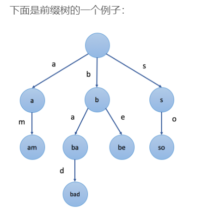

# Trie 树

> - [探索前缀树](https://leetcode-cn.com/explore/learn/card/trie/)

Trie 树、字典树、前缀树，久仰带名，一直不知道是干啥的，学一下。

## 前缀树简介

前缀树是 N 叉树的一种特殊形式。通常前缀树是用来存储字符串的，每个结点代表一个字符串（前缀）。每个节点会有多个子结点，通往不同子结点的路径上有不同的字符。子结点代表的字符串是由结点本身的原始字符串以及通往该子结点路径上所有的字符组成的。以下是一个前缀树的例子：



需要注意的是，**根结点表示空串。**

前缀树的一个重要特性是，结点所有的后代都与该结点相关的字符串有共同的前缀。

## 如何表示前缀树

前缀树是 N 叉树，特别之处在于字符和子结点之间的对应关系。

最简单的就是数组 `vector<TrieNode*> children(26, nullptr)`，访问快，但是大多数情况下不会使用所有的字母，浪费空间。

节省空间就可以使用 `unordered_map<char, TrieNode*> children`，比数组稍微慢一点，只存需要的子结点。

有时还需要其他的值，比如用一个 bool 标记当前子结点对应的字符串是否是一个单词。

## 前缀树的插入操作

跟二叉搜索树的插入类似，要根据插入的目标值决定路径。

要插入一个字符串 s，从根结点开始，根据 s[0] 选择一个子结点或添加新的子结点。知道遍历到字符串末尾。

```python
# initial
cur = root
for c in s:
    if cur.children.count(c) == 0:
        cur.children[c - 'a'] = new TrieNode
    cur = cur.children[c - 'a']
# cur->string = s 
```

## 前缀树的查找

查找就是跟插入流程一样，如果找不到对应的子结点就失败。

分为搜索前缀和单词。

## 前缀树的应用

主要用于存储字符串和检索关键字，特别是前缀相关的关键字。

- 自动补全：在前缀树中存储 ngram，根据词频进行搜索推荐。
- 拼写检查：添加与搜索单词，前缀树中找到相同前缀的单词很容易，但怎么找到相似的单词呢？
- 加速 dfs。
- 存储其他类型