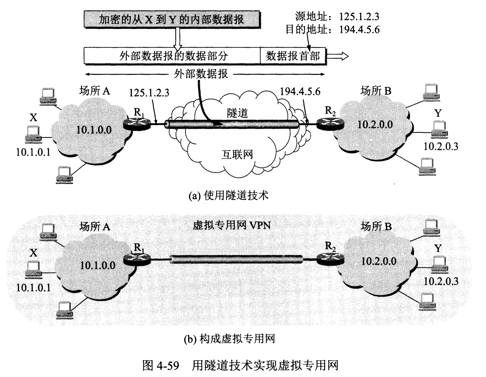

# 计算机网络协议

总结一下计网里常用的协议。

## 应用层

### DNS (Domain Name System)

端口号为 53，大多数情况下使用 UDP。以下情况使用 TCP 传输：

- 返回的相应超过 512 字节。
- 区域传送，主域名服务器向辅助域名服务器传送变化的那部分数据。

递归、迭代查询。

### FTP (File Transfer Protocol)

TCP 连接，两个连接：

- 控制连接：服务器打开端口号 21 等待客户端的连接。客户端主动建立连接后，使用这个连接将客户端命令传送给客户端，并传回服务器应答。
- 数据连接：用于传送文件数据。

根据数据连接是否是服务器端主动建立，分为两种模式：

- 主动模式：服务器主动建立数据连接，服务器端口号为 20，客户端端口号大于 1024 的随机。
- 被动模式：客户端主动建立数据连接，客户端端口号由自己指定，服务端端口号随机。

类似协议：

- SFTP (Secure File Transfer Protocol)，是 SSH 的一部分，必须由 sshd 守护进程完成相应的连接操作。
- SCP (Secure Copy)，用来远程文件复制，复制过程是加密的，和 ssh 使用相同的认证方式。

### DHCP (Dynamic Host Configuration Protocol)

提供了即插即用的连网方式，自动配置 IP 地址、子网掩码、网关地址。DHCP 工作过程如下：

1. 客户端发送 Discover 报文，该报文的目的地址为 255.255.255.255:67，源地址为 0.0.0.0:68，被放入 UDP 中，该报文被广播到同一个子网的所有主机上。如果客户端和 DHCP 服务器不在同一个子网，就需要使用中继代理。
2. DHCP 服务器收到 Discover 报文之后，发送 Offer 报文给客户端，该报文包含了客户端所需要的信息。因为客户端可能收到多个 DHCP 服务器提供的信息，因此客户端需要进行选择。
3. 如果客户端选择了某个 DHCP 服务器提供的信息，那么就发送 Request 报文给该 DHCP 服务器。
4. DHCP 服务器发送 Ack 报文，表示客户端此时可以使用提供给它的信息。

### SMTP (Simple Mail Transfer Protocol)

一个电子邮件系统由三部分组成：用户代理、邮件服务器以及邮件协议。邮件协议包含发生协议和读取协议，发送协议常用 SMTP，读取协议常用 POP3 和 IMAP。

- SMTP 只能发送 ASCII 码，通过 MIME 可以发送非 ASCII 字符文本，传输编码有 base64 等。25 端口
- POP3 的特点是只要用户从服务器上读取了邮件，就把该邮件删除。但最新版本的 POP3 可以不删除邮件。110 端口
- IMAP 协议中客户端和服务器上的邮件保持同步，如果不手动删除邮件，那么服务器上的邮件也不会被删除。IMAP 这种做法可以让用户随时随地去访问服务器上的邮件。143 端口

## 网络层

网络层是整个互联网的核心，向上只提供简单灵活的、无连接的、尽最大努力交付的数据报服务。

使用 IP 协议把异构的物理网络连接起来，使得在网络层看起来是一个统一的网络。

### ARP (Address Resolution Protocol)

网络层实现主机之间的通信，而链路层实现具体链路之间的通信。在通信过程中，IP 数据报的源地址和目的地址始终不变，而 MAC 地址随着链路的改变而改变。

ARP 协议实现由 IP 地址得到 MAC 地址。

每个主机都有一个 ARP 高速缓存，里面有本局域网上的各主机和路由器的 IP 地址到 MAC 地址的映射表。

如果主机 A 知道主机 B 的 IP 地址，但 ARP 高速缓存中没有该 IP 地址到 MAC 地址的映射，此时主机 A 通过广播的方式发送 ARP 请求分组，主机 B 收到该请求后会发送 ARP 响应分组给主机 A 告知其 MAC 地址，随后主机 A 向其高速缓存中写入主机 B 的IP 地址到 MAC 地址的映射。

### ICMP (Internet Control Message Protocol)

ICMP 是为了更有效地转发 IP 数据报和提高交付成功的机会。它封装在 IP 数据报中，但不属于高层协议。

ICMP 分为差错报告报文和询问报文：

| 类型值   | 报文类型                    |
| -------- | --------------------------- |
| 3        | 终点不可达                  |
| 11       | 超时                        |
| 12       | 参数问题                    |
| 5        | 改变路由 Redirect           |
| 8 或 0   | 回送 Echo 请求或回答        |
| 13 或 14 | 时间戳 TImestamp 请求或回答 |

- ping 使用了 ICMP 的回送请求和回答报文，是应用层直接应用 ICMP。
- traceroute 从源主机向目的主机发送一连串的 IP 数据报，封装的是无法交付的 UDP 用户数据报。第一个数据报的 TTL 为 1，到达第一个路由器时 TTL 减 1 为 0，被丢弃，向主机发送 ICMP 超时报文；接着发送第二个数据报，TTL 为 2，在第 2 个路由器处被丢弃，并发送 ICMP 超市报文。最后一个数据报到达目的主机时，数据报的 TTL 为 1。主机不转发数据报，也不把 TTL 值减 1。而封装的 UDP 报文无法交付，目的主机向源主机发送 ICMP 终点不可达差错报文。

### VPN (Virtual Private Network)

以下三个 IP 地址块被分配为机构内网地址块：

- `10.0.0.0 ~ 10.255.255.255`
- `172.16.0.0 ~ 172.31.255.255`
- `192.168.0.0 ~ 192.168.255.255`

VPN 使用公用的互联网作为本机构各专用网之间的通信载体。专用指机构内的主机只与本机构内的其他主机通信；虚拟是指好像是，而其实并不是，它有经过公用的互联网。

下图中，场所 A 和 B 的通信经过互联网，如果 A 中的主机 X 要和 B 中的主机 Y 通信，IP 数据报的源地址是 `10.1.0.1`，目的地址是 `10.2.0.3`。数据报先发送到与互联网相连的路由器 R1，R1 对内部数据进行加密，然后重新加上数据报的首部，源地址是路由器 R1 的全球地址 `125.1.2.3`，目的地址是路由器 R2 的全球地址 `194.4.5.6`。路由器 R2 收到数据报后将数据部分进行解密，恢复原来的数据报，此时目的地址为 `10.2.0.3`，交付给 Y。

### NAT (Network Address Translation)

专用网内部的主机使用本机 IP 地址又想和互联网上的主机通信时，可以使用 NAT 来将本地 IP 转换为全球 IP。

NAT 转换表把传输层的端口号也用上，使得多个专用网内部的主机共用一个全球 IP 地址。

### 路由选择协议

路由表中内容：

- 网络 ID、子网掩码、下一跳地址等。
- 根据应用和执行的不同，还可能有：花费、过滤列表等。

路由选择协议：

- 自治系统内部的路由选择：RIP 和 OSPF
- 自治系统间的路由选择：BGP
  
### RIP (Routing Information Protocol)

RIP 是基于距离向量的路径选择协议。距离是指跳数，直接相连的路由器跳数为 1.跳数超过 15 表示不可达。

RIP 按固定的时间间隔仅和相邻路由器交换自己的路由表，经过若干次交换后，所有路由器最终会知道到达本自治系统中任何一个网络的最短距离和下一跳路由器地址。

距离向量算法：

1. 将地址为 X 的相邻路由器发来的 RIP 报文，先修改报文中的所有项目，把下一跳字段地址改为 X，并把所有的距离字段加 1；
2. 对修改后的 RIP 报文中的每一个项目，进行以下步骤：
   1. 若原来的路由表中没有目的网络 N，则把该项添加到路由表中；
   2. 否则，若下一跳路由器地址是 X，则把收到的项目替换原来路由表中的项目；否则，若收到的项目中的距离 d 小于路由表中的距离，则进行更新；
   3. 若 3 分钟还没有收到相邻路由器的更新路由表，则将相邻路由器标为不可达，即距离置为 16。

RIP 实现简单，开销小，但是能使用的最大距离为 15，限制了网络的规模。网络出现故障时，要经过比较长的时间才能将消息传送到所有路由器。

### OSPF (Open Sortest Path First)

OSPF 使用的时 Dijkstra 算法，具有以下特点：

- 向本自治系统中的所有路由器发送消息，即洪泛法；
- 发送的信息就是与相邻路由器的链路状态，包括与哪些路由器相连以及链路的度量，度量费用、距离、时延、带宽等；
- 只有当链路状态发送变化时，路由器才会发送信息。

OSPF 的收敛过程很快。

### BGP (Border Gateway Protocol)

自治系统之间的路由选择很困难，主要原因如下：

- 互联网规模很大；
- 各个 AS 内部使用不同的路径选择协议，无法准确定义路径的度量；
- AS 之间的路由选择必须考虑有关的策略。

BGP 只能选择一条比较好的路由。

每个 AS 必须配置 BGP 发言人，通过两个相邻 BGP 发言人之间建立 TCP 连接来交换路由信息。