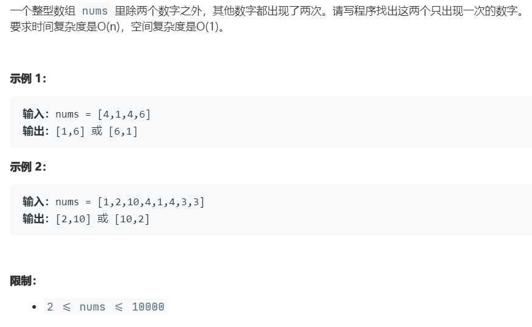

# 56.1.数组中数字出现的次数 (Medium)

## 题目描述



## 思路 & 代码

要找两个只出现了一次的数字。一个的话很好找，异或就行。两个就不太懂了。。。肯定不能一次遍历就找到。

首先一次遍历，全体异或，得到要求两个值的异或和。然后我们取一个掩码 `1 << x`，只要异或和的 x 位为 1 即可。

```c++
class Solution {
public:
    vector<int> singleNumbers(vector<int>& nums) {
        int res = 0 ;
        for(auto& num : nums) {
            res ^= num;
        }
        int mask = res & (-res);
        int a = 0, b = 0;
        for(auto& num : nums) {
            if(mask & num) {
                a ^= num;
            }else {
                b ^= num;
            }
        }
        return {a, b};
    }
};
```