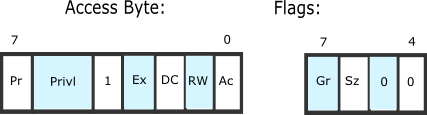

# EXER3: 分析 bootloader 进入保护模式的过程

BIOS 将通过读取硬盘主引导扇区到内存，并转跳到对应内存中的位置执行 bootloader。从练习 2 中我们知道从 `$cs=0 $ip=7c00` 开始即为 bootloader 的开始。通过 bootasm.S 中的注释和 gdb 调试就很容易分析从实模式进入保护模式的过程。

分析 bootasm.s 代码，具体有以下几个步骤：

1. 禁用中断， flag 置零，段寄存器置零：

   ```assembly
   .code16
        cli                         # Disable interrupts
        cld                         # String operations increment

        xorw %ax, %ax               # Segment number zero
        movw %ax, %ds               # -> Data Segment
        movw %ax, %es               # -> Extra Segment
        movw %ax, %ss               # -> Stack Segment
   ```

2. 开启 A20：

   > Q1: 为何开启 A20，以及如何开启 A20?

   为了与早期的 pc 兼容，物理地址线 20 在实模式下置于低位，将访问地址控制在 1M 内。在保护模式下，需要开启 A20，否则只能访问奇数地址的内存（第 20 位为 0）。

   ```assembly
   seta20.1:
        inb $0x64, %al                                  # 从 0x64 端口读一个字节存入 al 寄存器，0x64 为状态寄存器。
        testb $0x2, %al                                 # 与运算
        jnz seta20.1                                    # 判断状态寄存器的第二位是否为 1，即输入缓冲区中有无数据。等待输入缓冲区为空。

        movb $0xd1, %al
        outb %al, $0x64                                 # 向 0x64 端口发送 0xd1，即 write 8042 output port (P2)

    seta20.2:
        inb $0x64, %al                                  # 同上，等待输入缓冲区空。
        testb $0x2, %al
        jnz seta20.2

        movb $0xdf, %al
        outb %al, $0x60                                 # 将 0xdf(11011111) 写到 0x60 端口，以置 A20 为 1。
   ```

3. 初始化 GDT 表：

   > 实模式下的寻址方式：
   > cs<<4 + ip
   > 保护模式下的寻址方式：
   > base(index(cs)) + eip

   [段描述符的格式](https://wiki.osdev.org/Global_Descriptor_Table)如下：

   

   1. 段基地址(base)：规定线性空间中段的起始地址，32 位长。
   2. 段界限(limit)：规定段的大小，20 位长，可以以字节或 4K 字节为单位。
   3. 段属性：描述各种性质，在格式中的 Flags 和 Access Byte 部分，具体结构如下：

      

      - Pr: 段存在位，对于所有可用段必置 1。
      - Privi: 2 位，控制权限 0~3。
      - 1: 此位为 1 表示为数据段或代码段，为 0 则表示是一个系统段
      - Ex: 可执行位，即数据段为 0，代码段为 1。
      - DC: Direction/Conforming 位
        - 对于数据段，0 表示向上扩展，对应可访问地址位 (base~base+limit)，1 表示向下扩展，对应可访问地址为 (base+limit~MAX_ADDR)
        - 对于代码段，0 表示只能被同权限执行，1 表示一致性代码段，即可以从低特权级转移到该段执行。
      - RW: 可读/可写位，对于数据段，永远可读，此位表示是否可写；对代码段，永远不可写，此位表示是否可读。
      - Ac: 设置为 0 即可，访问段时，CPU 设为 1。
      - Gr: 粒度值，0 表示 limit 单位为 byte，1 表示 limit 单位为 4KB （一页）。
      - Sz: size 位，0 表示为 16 位，1 表示 32 位。
      - Sz: 右一位: 在 x86_64 中指明为 64 位描述符，此时的 Sz 值应为 0。

   GDT (Global Descriptor Table)，全局描述符表是一个保存多个段描述符的“数组”，其起始地址保存在全局描述符表寄存器 GDTR 中。GDTR 长 48 位，其中高 32 位为基地址，低 16 位为段界限。GDTR 中的段界限以字节为单位。对于含有 N 个描述符的描述符表的段界限通常可设为 8\*N-1。

   段选择子，即用于定位段描述符表中表项的索引。结构如下：

   ```
    |   1    |    0     | 字节
    | 7654321076543 2 10| 比特
    | ------------ |-|--| 占位
    |    INDEX     |T|R | 含义
    |              |I|P |
    |              | |L |
   ```

   - index: 在 GDT 或 LDT 中的索引号，可见一个 GDT 表中最多 $2^{13}$ 个表项。
   - TI: 0 表示 GDT，1 表示 LDT。
   - RPL: 请求特权级。

   > Q2: 如何初始化 GDT 表?

   ```assembly
   # asm.h
   #define SEG_NULLASM                                             \
       .word 0, 0;                                                 \
       .byte 0, 0, 0, 0

   #define SEG_ASM(type,base,lim)                                  \
       .word (((lim) >> 12) & 0xffff), ((base) & 0xffff);          \
       .byte (((base) >> 16) & 0xff), (0x90 | (type)),             \
           (0xC0 | (((lim) >> 28) & 0xf)), (((base) >> 24) & 0xff)

   # bootstrap.S
   # Bootstrap GDT
   .p2align 2                                          # force 4 byte alignment
   gdt:
       SEG_NULLASM                                     # null seg GDT表的第一项不能被使用，因此置 0
       SEG_ASM(STA_X|STA_R, 0x0, 0xffffffff)           # code seg for bootloader and kernel
       SEG_ASM(STA_W, 0x0, 0xffffffff)                 # data seg for bootloader and kernel

   gdtdesc:
       .word 0x17                                      # sizeof(gdt) - 1
       .long gdt                                       # address gdt

   lgdt gdtdesc                                        # 加载 GDT 表
   ```

   以上定义了一个含有三个表项的 GDT，通过 ldgt 命令加载，传入 gdt 表段界限（8\*N-1）和 gdt 的地址。由此初始化了 GDT 表。

4. 使能，进入保护模式

   > Q3: 如何使能和进入保护模式?

   初始化 GDT 表后，通过将控制寄存器 cr0 最低为置 1 来标志进入保护模式：

   ```assembly
   movl %cr0, %eax
   orl $CR0_PE_ON, %eax
   movl %eax, %cr0

   ljmp $PROT_MODE_CSEG, $protcseg
   ```

   置位后进行一个跳转，此处已经是 32 位的寻址模式，`$PROT_MODE_CSEG` 为代码段的选择子。在此前的 GDT 表中已看到其基地址为 0 ，在此之后就执行 32 位的代码。

   进入保护模式：

   ```assembly
   .code32                                             # Assemble for 32-bit mode
   protcseg:
       # Set up the protected-mode data segment registers
       movw $PROT_MODE_DSEG, %ax                       # Our data segment selector
       movw %ax, %ds                                   # -> DS: Data Segment
       movw %ax, %es                                   # -> ES: Extra Segment
       movw %ax, %fs                                   # -> FS
       movw %ax, %gs                                   # -> GS
       movw %ax, %ss                                   # -> SS: Stack Segment

       # Set up the stack pointer and call into C. The stack region is from 0--start(0x7c00)
       movl $0x0, %ebp
       movl $start, %esp
       call bootmain

       # If bootmain returns (it shouldn't), loop.
   spin:
       jmp spin
   ```

   在进入保护模式后，程序在重新对段寄存器进行了初始化后，设置栈的指针并转入 C 函数 bootmain 执行（ebp = 0,esp = 0x7c00）。为了防止 bootmain 返回，还写了一个循环。。。
