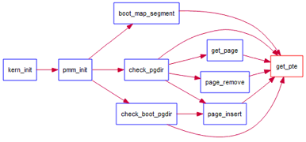

# EXER2: 实现寻找虚拟地址对应的页表项

给定一个虚拟地址，找出这个虚拟地址在二级页表中对应的项，如果此二级页表项不存在，则分配一个包含此项的二级页表。

首先看给出的 get_pte 的调用图：



在 preview.md 中已经分析了 boot_map_segment 函数，它通过调用 get_pte 实现地址映射。下面就按照 get_pte 函数的注释一行行实现：

```C
//get_pte - 通过 la 获取页表项，如果不存在，就创建一个
// parameter:
//  pgdir:  PDT基址，代表二级页表 pde_t表示页目录表项 pte_t表示页表项
//  la:     要映射的地址
//  create: 是否分配一个 Page
// return vaule: 页表项的虚地址
pte_t *
get_pte(pde_t *pgdir, uintptr_t la, bool create) {
    /* LAB2 EXERCISE 2: YOUR CODE
     *
     * Some Useful MACROs and DEFINEs, you can use them in below implementation.
     * MACROs or Functions:
     *   PDX(la) = la 中的页目录表索引，即高 10 位
     *   KADDR(pa) : 物理地址对应的内核虚地址
     *   set_page_ref(page,1) : 设置页被引用一次
     *   page2pa(page): 获取 page 对应的物理地址
     *   struct Page * alloc_page() : 分配一个页
     *   memset(void *s, char c, size_t n) : 设置内存
     *
     * DEFINEs:
     *   PTE_P           0x001                   // 物理页存在
     *   PTE_W           0x002                   // 物理页可写
     *   PTE_U           0x004                   // 用户态可读物理页内容
     */
#if 0
    pde_t *pdep = NULL;   // (1) find page directory entry
    if (0) {              // (2) check if entry is not present
                          // (3) check if creating is needed, then alloc page for page table
                          // CAUTION: this page is used for page table, not for common data page
                          // (4) set page reference
        uintptr_t pa = 0; // (5) get linear address of page
                          // (6) clear page content using memset
                          // (7) set page directory entry's permission
    }
    return NULL;          // (8) return page table entry
#endif
    pde_t *pdep = &pgdir[PDX(la)];                          // 获取页目录项
    if (!(*pdep & PTE_P)) {                                 // 判断页表项是否存在
        struct Page *page;
        if (!create || (page = alloc_page()) == NULL) {     // 不需要分配或分配失败
            return NULL;
        }
        set_page_ref(page, 1);                              // 设置引用次数为 1
        uintptr_t pa = page2pa(page);                       // 得到该页的物理地址
        memset(KADDR(pa), 0, PGSIZE);                       // 初始化，清零
        *pdep = pa & ~0x0FFF | PTE_P | PTE_W | PTE_U;       // 设置页目录表项，可读，可写，存在
    }
    // KADDR(PDE_ADDR(*pdep)) 由页目录项地址得到关联的页表物理地址，再转成虚拟地址
    // PTX(la) 页表项的索引地址，即中 10 位
    // 最后返回的是虚拟地址la对应的页表项入口地址
    return &((pte_t *)KADDR(PDE_ADDR(*pdep)))[PTX(la)];
}
```

get_pte 返回的页表项在 boot_map_segment 中设置 `*ptep = pa | PTE_P | perm;`。由此完成了二级页表的建立。

## Q1: 请描述页目录项（Page Directory Entry）和页表项（Page Table Entry）中每个组成部分的含义以及对 ucore 而言的潜在用处.

页目录表项内容 = (页表起始地址 & ~0x0FFF) | PTE_U | PTE_W | PTE_P

页表项内容 = (pa & ~0x0FFF) | PTE_P | PTE_W

页目录项 PDE 和页表项 PTE 的组成部分，根据 intel manual 和 mmu.h 有以下表格：

| Bits  | Name  | Content                                                    |
| ----- | ----- | ---------------------------------------------------------- |
| 0     | P     | 页是否在内存中                                             |
| 1     | W     | 页是否可写                                                 |
| 2     | U     | 0 表示页表中任何页面只能内核态访问，否则用户态可能可以访问 |
| 3     | PWT   | 1 表示缓存 Write Through，否则 Write Back                  |
| 4     | PCD   | 1 表示不缓存，否则缓存                                     |
| 5     | A     | 在上次清零之后，该页是否被读写过                           |
| 6     | D     | 在上次清零之后，该页是否被写过                             |
| 7     | PS    | 页大小，1 为 4MB，0 为 4KB；ucore 强制设为 0               |
| 7-8   | MBZ   | 必须为 0                                                   |
| 9-11  | AVAIL | 提供给用户程序使用                                         |
| 12-31 | INDEX | 页基址                                                     |

## Q2: 如果 ucore 执行过程中访问内存，出现了页访问异常，请问硬件要做哪些事情？

在 lab3 的参考资料中提到了关于 Page Fault 异常处理，结合 lab1 中涉及的触发中断的流程：

CPU 把产生异常的线性地址存储在 CR2 中，在当前内核栈保存当前被打断的程序现场，即依次压入当前被打断程序使用的 EFLAGS，CS，EIP，errorCode。页访问异常 page fault 的中断号是 14，以此查询 IDT 表找到中断服务入口，加载到 CS 和 EIP 寄存器中。

之后就是软件执行，需要保存硬件没有保存的寄存器，将中断号压栈，再把 DS、ES 和其他通用寄存器都压栈。最后在 trap.c 的 trap 函数开始了中断服务例程的处理流程，大致调用关系为：trap--> trap_dispatch-->pgfault_handler-->do_pgfault。最后执行 do_pgfault，在 lab3 会要实现这个函数。
