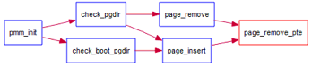

# EXER3: 释放某虚地址所在的页并取消对应二级页表项的映射

当释放一个包含某虚地址的物理内存页时，需要让对应此物理内存页的管理数据结构 Page 做相关的清除处理，使得此物理内存页成为空闲；另外还需把表示虚地址与物理地址对应关系的二级页表项清除。

page_remove_pte 的调用关系如下：



根据 page_remove_pte 的注释实现：

```C
//page_remove_pte - free an Page sturct which is related linear address la
//                - and clean(invalidate) pte which is related linear address la
//note: PT is changed, so the TLB need to be invalidate
static inline void
page_remove_pte(pde_t *pgdir, uintptr_t la, pte_t *ptep) {
    /* LAB2 EXERCISE 3: YOUR CODE
     *
     * Some Useful MACROs and DEFINEs, you can use them in below implementation.
     * MACROs or Functions:
     *   struct Page *page pte2page(*ptep): 由页表项获取对应的页
     *   free_page : free a page
     *   page_ref_dec(page) : 页引用次数减一
     *   tlb_invalidate(pde_t *pgdir, uintptr_t la) : Invalidate a TLB entry, but only if the page tables being
     *                        edited are the ones currently in use by the processor.
     * DEFINEs:
     *   PTE_P           0x001                   // page table/directory entry flags bit : Present
     */
#if 0
    if (0) {                      //(1) check if this page table entry is present
        struct Page *page = NULL; //(2) find corresponding page to pte
                                  //(3) decrease page reference
                                  //(4) and free this page when page reference reachs 0
                                  //(5) clear second page table entry
                                  //(6) flush tlb
    }
#endif
    if (*ptep & PTE_P) {                        // 检查页表项是否存在
        struct Page *page = pte2page(*ptep);    // 找到 pte 相关联的页表
        if (page_ref_dec(page) == 0) {          // 若自减为1，则释放页
            free_page(page);
        }
        *ptep = 0;                              // 将页表项清0
        tlb_invalidate(pgdir, la);              // 刷新TLB
    }
}
```

## Q1: 数据结构 Page 的全局变量（其实是一个数组）的每一项与页表中的页目录项和页表项有无对应关系?

Page 数组用于管理物理内存，其中的每一项对应一个物理页。页目录表项和页表项的高 20 位就是页对齐的物理地址。

pte2page 定义了由页表项获取对应 page 的宏。

## Q2: 如果希望虚拟地址与物理地址相等，则需要如何修改 lab2，完成此事？

1. 把链接脚本 kernel.ld 中的 0xC0100000 改为 0x100000
2. 将宏 KERNBASE 定义为 0
3. 修改 entry.S，只需要将 0~4M 映射到 0~4M，同时在后面也不需要取消 0~4M 的映射。
4. pmm_init 中注释掉 check 函数。

```
修改前
-------------------- BEGIN --------------------
PDE(0e0) c0000000-f8000000 38000000 urw
  |-- PTE(38000) c0000000-f8000000 38000000 -rw
PDE(001) fac00000-fb000000 00400000 -rw
  |-- PTE(000e0) faf00000-fafe0000 000e0000 urw
  |-- PTE(00001) fafeb000-fafec000 00001000 -rw

修改后
-------------------- BEGIN --------------------
PDE(0e0) 00000000-38000000 38000000 urw
  |-- PTE(38000) 00000000-38000000 38000000 -rw
PDE(001) fac00000-fb000000 00400000 -rw
  |-- PTE(000e0) fac00000-face0000 000e0000 urw
  |-- PTE(00001) fafeb000-fafec000 00001000 -rw
--------------------- END ---------------------
```
