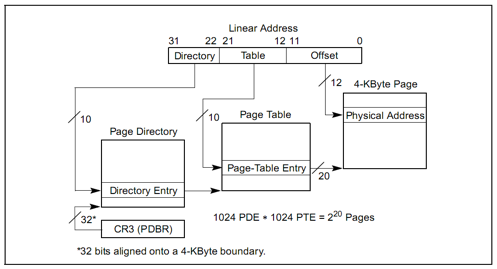

# PREVIEW

lab2 的练习 1 上来就是写分配内存算法，但开始并不知道 ucore 是怎样对内存操作的，还是需要根据参考资料学习一下先导知识。

本次实验包含三个部分：

1. 首先了解如何发现系统中的物理内存；
2. 然后了解如何建立对物理内存的初步管理，即了解连续物理内存管理；
3. 最后了解页表相关的操作，即如何建立页表来实现虚拟内存到物理内存之间的映射，对段页式内存管理机制有一个比较全面的了解。

## 实验流程概述

1. bootloader 探测物理内存分布和大小
2. kern 入口为 kern_entry，为执行 kern_init 设置堆栈
3. kern_init 调用 pmm_init 完成物理内存的管理

## 探测系统物理内存布局

一般来说，获取内存大小的方法由 BIOS 中断调用和直接探测两种，BIOS 中断调用方法是一般只能在实模式下完成，而直接探测方法必须在保护模式下完成。通过 BIOS 中断获取内存布局有三种方式，都是基于 INT 15h 中断，参数分别为 88h e801h e820h。在本实验中，我们通过 e820h 中断获取内存信息。中断必须在实模式下使用，所以我们在 bootloader 进入保护模式之前调用这个 BIOS 中断，并且把 e820 映射结构保存在物理地址 0x8000 处。

BIOS 通过系统内存映射地址描述符 (Address Ranger Descriptor) 格式来表示系统物理内存布局：

```
Offset  Size    Description
00h     8bytes  base address
08h     8bytes  length in bytes
10h     4bytes  type of address range
大小为 20 字节
```

其中内存的类型有以下几个：

```
Values for System Memory Map address type:
01h     memory, available to OS
02h     reserved, not available (e.g. system ROM, memory-mapped device)
03h     ACPI Reclaim Memory (usable by OS after reading ACPI tables)
04h     ACPI NVS Memory (OS is required to save this memory between NVS sessions)
other   not defined yet -- treat as Reserved

ACPI Advanced Configuration and Power Interface 高级配置和电源接口
初步了解可参考知乎专栏 https://zhuanlan.zhihu.com/p/25893464
```

下面学习 `int 15h` 的参数和返回值：

```
参数：
eax     e820h
edx     534D4150h ('SMAP')，签名
ebx     如果是第一次调用或内存区域扫描完毕，则为0；如果不是，则存放上次调用之后的计数值
ecx     保存地址范围描述符的内存大小，应该大于等于20字节；
es:di   指向保存地址范围描述符结构的缓冲区，BIOS 把信息写入这个结构的起始地址。

返回值：
CF      若INT 15中断执行成功，则不置位，否则置位
eax     534D4150h ('SMAP')
es:di   指向保存地址范围描述符的缓冲区，此时缓冲区内的数据已由 BIOS 填写完毕
ebx     下一个地址范围描述符的计数地址
ecx     返回 BIO S往 ES:DI 处写的地址范围描述符的字节大小
ah      失败时保存出错代码
```

可见，通过 `int 15h` 中断向 es:di 中一段地址循环地填入地址描述符信息，从而探测所有的内存块，将所有的描述符保存到一个缓冲区，其定义如下：

```C
struct e820map {
    int nr_map; // 统计描述符的数目
    struct {
        uint64_t addr;
        uint64_t size;
        uint32_t type;
    } __attribute__((packed)) map[E820MAX];
};
```

ucore 中的内存探测是在 bootasm.S 中实现的：

```assembly
probe_memory:
    movl $0, 0x8000     # 位于0x8000处的 struct e820map 的成员变量 nr_map 置零
    xorl %ebx, %ebx
    movw $0x8004, %di   # 表示设置调用 INT 15h BIOS 中断后，BIOS 返回的映射地址描述符的起始地址
start_probe:
    movl $0xE820, %eax  # INT 15 的中断调用参数
    movl $20, %ecx      # 设置地址范围描述符的大小为 20 字节，其大小等于 struct e820map 的成员变量 map 的大小
    movl $SMAP, %edx
    int $0x15           # 调用 int 15h 中断，要求 BIOS 返回一个用地址范围描述符表示的内存段信息
    jnc cont            # 如果 eflags 的 CF 位为0，则表示还有内存段需要探测
    movw $12345, 0x8000 # 探测有问题，结束探测
    jmp finish_probe
cont:
    addw $20, %di       # 设置下一个 BIOS 返回的映射地址描述符的起始地址
    incl 0x8000         # 递增 struct e820map 的成员变量 nr_map
    cmpl $0, %ebx       # 如果 INT 0x15 返回的 ebx 为零，表示探测结束，否则继续探测
    jnz start_probe
finish_probe:
```

以上的汇编代码执行后就在 0x8000 处按照 struct e820map 的定义填充了物理内存信息。在 page_init 中读入这个结构体实现对物理内存的管理。

## 以页为单位管理物理内存

在获得可用物理内存范围后，系统以物理页作为最小单位管理物理内存，每个物理页用一个 Page 结构管理。

```C
struct Page {
    int ref;                        // page frame's reference counter
    uint32_t flags;                 // array of flags that describe the status of the page frame
    unsigned int property;          // the num of free block, used in first fit pm manager
    list_entry_t page_link;         // free list link
};
```

各个参数：

1. ref: 该页被页表的引用次数。在某页表中有一个页表项设置了一个虚拟页到这个 Page 管理的物理页的映射关系，就会把 Page 的 ref 加一；反之，若页表项取消，即映射关系解除，就会把 Page 的 ref 减一；
2. flags: 物理页的状态标记：

   ```C
   #define PG_reserved                 0
   #define PG_property                 1
   ```

   目前用了两个 bit。bit 0 表示此页是否被保留给 kernel，置 1 时即被保留，无法动态分配与释放。bit 1 表示此页是否 free。

3. property: 记录地址连续的空闲页的个数。用到此成员变量的页即为一块空闲空间中最小地址的物理页 Head Page。这个变量名起得很迷，对于不同算法有不同的含义。
4. page_link: 把多个连续空闲内存块链接在一起的双向链表指针，也只是有 Head Page 才用到。以此成员变量来链接比它地址小和大的其他连续空闲内存块。

初始情况下，所有空闲的物理页都是连续的，就形成了一个大的连续空闲内存块。但随着物理页的分配和释放，大的连续空闲内存块就会分裂为不连续的多个小连续空闲内存块。为了管理这些内存块，定义一个 `free_area_t` 数据结构，包含了一个 list_entry 结构的双向链表指针和记录当前空闲页个数的无符号整型变量 `nr_free`：

```C
struct list_entry {
    struct list_entry *prev, *next;
};

typedef struct list_entry list_entry_t;

/* free_area_t - maintains a doubly linked list to record free (unused) pages */
typedef struct {
    list_entry_t free_list;         // the list header
    unsigned int nr_free;           // # of free pages in this free list
} free_area_t;
```

ucore 以两个数据结构管理以页为单位的物理内存空间。以下为物理内存管理初始化的代码：

```C
// ./kern/mm/pmm.c
/* pmm_init - initialize the physical memory management */
static void
page_init(void) {
    struct e820map *memmap = (struct e820map *)(0x8000 + KERNBASE);
    uint64_t maxpa = 0;

    cprintf("e820map:\n");
    int i;
    // 遍历输出通过 INT 15h 探测到的物理内存空间
    for (i = 0; i < memmap->nr_map; i ++) {
        uint64_t begin = memmap->map[i].addr, end = begin + memmap->map[i].size;
        cprintf("  memory: %08llx, [%08llx, %08llx], type = %d.\n",
                memmap->map[i].size, begin, end - 1, memmap->map[i].type);
        if (memmap->map[i].type == E820_ARM) {
            if (maxpa < end && begin < KMEMSIZE) {
                maxpa = end;
            }
        }
    }
    if (maxpa > KMEMSIZE) {
        maxpa = KMEMSIZE;
    }

    extern char end[]; // end 即为 bss 段的结束，也就是存放 Page 结构体开始的地址

    npage = maxpa / PGSIZE; // 物理页的个数
    pages = (struct Page *)ROUNDUP((void *)end, PGSIZE); // 向上取整到整个页

    // 先将所有的物理页标记为保留
    for (i = 0; i < npage; i ++) {
        SetPageReserved(pages + i);
    }
    // 将 pages + sizeof(struct Page) * npage 以上的地址为空闲的可分配地址
    uintptr_t freemem = PADDR((uintptr_t)pages + sizeof(struct Page) * npage);
    // 将虚拟地址转换为物理地址
    for (i = 0; i < memmap->nr_map; i ++) {
        uint64_t begin = memmap->map[i].addr, end = begin + memmap->map[i].size;
        if (memmap->map[i].type == E820_ARM) {
            if (begin < freemem) {
                begin = freemem;
            }
            if (end > KMEMSIZE) {
                end = KMEMSIZE;
            }
            if (begin < end) {
                begin = ROUNDUP(begin, PGSIZE);
                end = ROUNDDOWN(end, PGSIZE);
                if (begin < end) {
                    // 默认指向了 ./kern/mm/default_pmm.c 中的 default_init_memmap
                    // 将 ref 和 flags 都置零，后设置 base 指向的 head page 的 flags.PG_property 和 property
                    // 最后将空闲的内存块添加到 free_area 指向的双向链表中
                    init_memmap(pa2page(begin), (end - begin) / PGSIZE);
                }
            }
        }
    }
}
```

## 物理内存页分配算法

根据以上的基础知识，我们就可以实现 first-fit 算法，完成练习 1，具体过程见 exer1.md。

## 实现分页机制

### 段页式管理的基本概念

逻辑地址---Segmentation-->线性地址---Paging-->物理地址。

线性地址分为 Directory、Table、Offset 三部分，通过二级页表实现，一级页表的起始地址存放在 cr3 寄存器。




### 系统执行中地址映射的三个阶段

lab1 中只是简单的段映射，虚拟地址和物理地址都是从 0x100000 开始， vir addr = linear addr = phy addr。

lab2 中在 ./tools/kernel.ld 中定义了起始虚拟地址 0xC0100000，入口由 kern_init 改为 kern_entry，对应的物理地址同样是 0x100000 开始。

```C
ENTRY(kern_entry)

SECTIONS {
    /* Load the kernel at this address: "." means the current address */
    . = 0xC0100000;

    .text : {
        *(.text .stub .text.* .gnu.linkonce.t.*)
    }

```

可见 lab1 和 lab2 在地址映射机制上的不同，而 lab2 在不同阶段的地址映射机制也不尽相同。

1. 第一阶段（开启保护模式，创建启动段表）是 bootloader 阶段，即从 bootasm.S 的 start 函数到执行 ucore 的 kern_entry 之前：

   vir addr = linear addr = phy addr

2. 第二阶段（创建初始页目录表，开启分页模式）从 kern_entry 函数开始，到 pmm_init 函数被执行之前。

   在 ./kern/init/entry.S 中设置好了页目录表和页表项，将 0~4M 的线性地址一一映射到物理地址

   ```assembly
   __boot_pgdir:
   .globl __boot_pgdir
       # map va 0 ~ 4M to pa 0 ~ 4M (temporary)
       .long REALLOC(__boot_pt1) + (PTE_P | PTE_U | PTE_W)
       .space (KERNBASE >> PGSHIFT >> 10 << 2) - (. - __boot_pgdir) # pad to PDE of KERNBASE
       # map va KERNBASE + (0 ~ 4M) to pa 0 ~ 4M
       .long REALLOC(__boot_pt1) + (PTE_P | PTE_U | PTE_W)
       .space PGSIZE - (. - __boot_pgdir) # pad to PGSIZE

   # 1024 × 4KB
   .set i, 0
   __boot_pt1:
   .rept 1024
       .long i * PGSIZE + (PTE_P | PTE_W)
       .set i, i + 1
   .endr
   ```

   首先将页目录表的起始地址填入 cr3，然后将 cr0 的 CR0_PG 置位，计算机进入了分页模式。

   此时的地址映射机制为：

   - 0~4MB: vir addr = linear addr = phy addr
   - KERNBASE(0xC0000000) + 0~4MB: vir addr = linear addr = phy addr + KERNBASE(0xC0000000)

   这仅比第一阶段增加了内核基址的偏移，作为范围仅是 0~4M。此时的 EIP 还在 0~4M 的低虚拟地址运行，接下来需要一个跳转来使内核跳转到高虚拟地址：

   ```assembly
   # update eip
   # now, eip = 0x1.....
   leal next, %eax
   # set eip = KERNBASE + 0x1.....
   jmp *%eax
   ```

   跳转完成后，将 boot_pgdir 的第一个页目录表项清零来取消之前的映射关系。

   ```assembly
   # unmap va 0 ~ 4M, it's temporary mapping
   xorl %eax, %eax
   movl %eax, __boot_pgdir
   ```

   最后，第二阶段的虚拟地址 0~4M 的地址映射机制被设置为：vir addr = linear addr = phy addr + KERNBASE。第二阶段主要就是把 EIP 迁移到高虚拟地址，到但是只映射了 0~4M。

3. 第三阶段（完善段表和页表）pmm_init 函数补充页目录表项，从 0~4M 扩充到 0~KMEMSIZE。然后更新了段映射机制，使用了新的段表，包括内核态和用户态的代码段和数据段描述符以及 TSS 段描述符。

   这时就形成了我们期望的虚拟地址、线性地址以及物理地址的映射关系：vir addr = linear addr = phy addr + 0xC000000

### 建立虚拟页和物理页帧的地址映射关系

pmm_init 是内存管理的总体控制函数，主要工作包括：

8. init_pmm_manager: 初始化物理内存页管理器框架，即将 default_pmm.c 中定义的 default_pmm_manager 赋值给 pmm_manager。初始化之后的 pmm 就可以分配释放物理内存。同时应用了内存分配算法。
9. page_init: 初始化管理空闲内存的双向链表 free_list。
10. check_alloc_page: 调用 pmm_manager->check 检查物理内存页分配算法
11. boot_map_segment: 建立二级页表，使能分页机制
12. gdt_init: 设置新的全局段描述符表
13. check_boot_pgdir: 检查页表
14. 通过自映射机制完成页表的打印输出

建立二级页表

整个页目录表和页表所占空间大小取决于二级页表要管理和映射的物理页数，在 ucore 中定义了内存大小为 `KMEMSIZE = 0x38000000`，即 896MB。计算一下，物理页大小为 4KB，则我们需要以 0x38000 个物理页管理这些内存。

完成了前两个阶段的地址映射后，为了把 0~KMEMSIZE 的物理地址一一映射到页目录项和页表项的内容，其大致流程如下：

8. 指向页目录表项的指针已存储在 boot_pgdir 变量中。
9. 映射 0~4MB 的首个页表已填充好。
10. 调用 boot_map_segment 函数进一步建立映射关系，具体过程以页为单位进行设置，即 linear addr = phy addr + KERNBASE

```C
//boot_map_segment - setup&enable the paging mechanism
// parameters
//  la:   linear address of this memory need to map (after x86 segment map) 32位 线性地址
//  size: memory size
//  pa:   physical address of this memory 32位 物理地址
//  perm: permission of this memory
static void
boot_map_segment(pde_t *pgdir, uintptr_t la, size_t size, uintptr_t pa, uint32_t perm) {
    assert(PGOFF(la) == PGOFF(pa));
    size_t n = ROUNDUP(size + PGOFF(la), PGSIZE) / PGSIZE;
    la = ROUNDDOWN(la, PGSIZE);
    pa = ROUNDDOWN(pa, PGSIZE);
    for (; n > 0; n --, la += PGSIZE, pa += PGSIZE) {
        pte_t *ptep = get_pte(pgdir, la, 1);
        assert(ptep != NULL);
        *ptep = pa | PTE_P | perm;
    }
}
```

页目录表项内容 = (页表起始地址 & ~0x0FFF) | PTE_U | PTE_W | PTE_P
页表项内容 = (pa & ~0x0FFF) | PTE_P | PTE_W

boot_map_segment 完成映射的函数就是 get_pte，这也是练习 2 要修改的函数。根据注释可以实现即可。

8.  建立好一一映射的二级页表结构后，分页机制已初始化完毕。然后执行 gdt_init 函数后，新的段页式映射已经建立好了。

最终的内核虚拟地址空间如下：

```C
/* *
 * Virtual memory map:                                          Permissions
 *                                                              kernel/user
 *
 *     4G ------------------> +---------------------------------+
 *                            |                                 |
 *                            |         Empty Memory (*)        |
 *                            |                                 |
 *                            +---------------------------------+ 0xFB000000
 *                            |   Cur. Page Table (Kern, RW)    | RW/-- PTSIZE
 *     VPT -----------------> +---------------------------------+ 0xFAC00000
 *                            |        Invalid Memory (*)       | --/--
 *     KERNTOP -------------> +---------------------------------+ 0xF8000000
 *                            |                                 |
 *                            |    Remapped Physical Memory     | RW/-- KMEMSIZE
 *                            |                                 |
 *     KERNBASE ------------> +---------------------------------+ 0xC0000000
 *                            |                                 |
 *                            |                                 |
 *                            |                                 |
 *                            ~~~~~~~~~~~~~~~~~~~~~~~~~~~~~~~~~~~
 * (*) Note: The kernel ensures that "Invalid Memory" is *never* mapped.
 *     "Empty Memory" is normally unmapped, but user programs may map pages
 *     there if desired.
 *
 * */
```

## 自映射机制

boot_map_segment 函数建立了一一映射关系的页目录表项和页表项，映射关系为：

vir addr (KERNBASE~KERNBASE+KMEMSIZE) = phy addr (0~KMEMSIZE)

如果我们这时需要按虚拟地址的地址顺序显示整个页目录表和页表的内容，则要查找页目录表的页目录表项内容，根据页目录表项内容找到页表的物理地址，再转换成对应的虚地址，然后访问页表的虚地址，搜索整个页表的每个页目录项。

把页目录表和页表放在一个连续的 4MB 虚拟地址空间中，并设置页目录表自身的虚地址<==>物理地址映射关系。这样在已知页目录表起始虚地址的情况下，通过连续扫描这特定的 4MB 虚拟地址空间，就很容易访问每个页目录表项和页表项内容。

首先定义了一个常量 `VPT = 0xFAC00000`，其低 12 位和中 10 位为 0。在 pmm.c 中有以下代码：

```C
pte_t * const vpt = (pte_t *)VPT;
// vpd 的高 10 位和中 10 位相等，都是十进制的 1003，即 vpd = 0xFAFEB000
// 确保 vpd 的值就是目录页表项的起始虚地址，且 vpt 就是页目录表中第一个页目录表指向的页表的起始虚地址。
pde_t * const vpd = (pde_t *)PGADDR(PDX(VPT), PDX(VPT), 0);


// recursively insert boot_pgdir in itself
// to form a virtual page table at virtual address VPT
boot_pgdir[PDX(VPT)] = PADDR(boot_pgdir) | PTE_P | PTE_W;
// boot_pgdir[1003]存储了 boot_pgdir 的物理地址，二级页表则再次以 boot_pgdir 页表查找，对应的物理地址恰好是 boot_pgdir 的物理地址。
```

## 建立段页式管理中的需要考虑的关键问题

1. 如何在建立页表的过程中维护全局段描述符表（GDT）和页表的关系，确保 ucore 能够在各个时间段上都能正常寻址？

   在建立页表的时候，此时还是链接时由 bootloader 生成的 GDT.在建立页表完成后，需要更新全局 GDT.这才真正开启了分页机制。

2. 对于哪些物理内存空间需要建立页映射关系？

   可用的物理空间，起始地址是 bss 段的起始地址。

3. 具体的页映射关系是什么？

   ```C
   // +--------10------+-------10-------+---------12----------+
   // | Page Directory |   Page Table   | Offset within Page  |
   // |      Index     |     Index      |                     |
   // +----------------+----------------+---------------------+
   //  \--- PDX(la) --/ \--- PTX(la) --/ \---- PGOFF(la) ----/
   //  \----------- PPN(la) -----------/
   //
   // The PDX, PTX, PGOFF, and PPN macros decompose linear addresses as shown.
   // To construct a linear address la from PDX(la), PTX(la), and PGOFF(la),
   // use PGADDR(PDX(la), PTX(la), PGOFF(la)).
   ```

4. 页目录表的起始地址设置在哪里？

5. 页表的起始地址设置在哪里，需要多大空间？

   页表的理论连续虚拟空间为 0xFAC00000 ~ 0xFB000000，大小为 4MB。有 1M 个 PTE，即可以映射 4GB 的地址空间。由于 ucore 的 KERNTOP 为 `vpt + 0xF8000000/0x1000*4 = 0xFAC00000 + 0xF8000*4 = 0xFAFE0000`

6. 如何设置页目录表项的内容？

   boot_pgdir[PDX(la)] = pa & ~0x0FFF | PTE_U | PTE_W | PTE_P;

7. 如何设置页表项的内容？

   通过 get_pte 函数。
