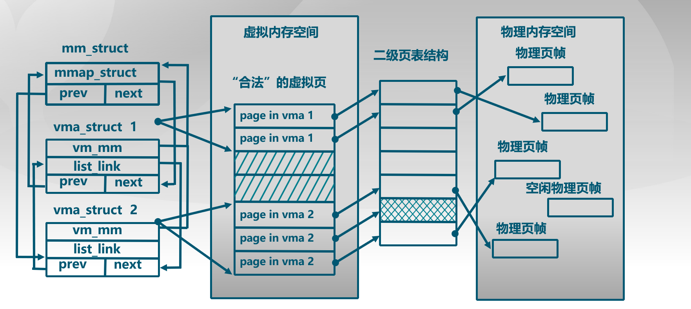

# PREVIEW

本次实验是在实验二的基础上，借助于页表机制和实验一中涉及的中断异常处理机制，完成 Page Fault 异常处理和 FIFO 页替换算法的实现，结合磁盘提供的缓存空间，从而能够支持虚存管理，提供一个比实际物理内存空间“更大”的虚拟内存空间给系统使用。

## 虚拟内存管理基本原理

虚拟内存，简单说就是程序员或 CPU 看到的内存。

1. 虚拟内存单元不一定有实际的物理地址；
2. 如果虚拟内存单元有实际的物理内存单元，那二者的内存地址一般是不相等的；
3. 通过操作系统实现的某种内存映射可建立虚拟内存和物理内存的对应关系，使得程序员或 CPU 访问的虚拟内存地址会自动转换为一个物理内存地址。

内存地址虚拟化让我们可以通过设置页表项来限定软件运行时的访问空间，确保软件运行不越界，完成内存访问保护的功能。

通过内存地址虚拟化，可以使得软件在没有访问某虚拟内存地址时不分配具体的物理内存，而只有在实际访问某虚拟内存地址时，操作系统再动态地分配物理内存，建立虚拟内存到物理内存的页映射关系，这种技术称为按需分页（demand paging）。

把不经常访问的数据所占的内存空间临时写到硬盘上，这样可以腾出更多的空闲内存空间给经常访问的数据；当 CPU 访问到不经常访问的数据时，再把这些数据从硬盘读入到内存中，这种技术称为页换入换出（page swap in/out）。

## 实验流程概述

1. 初始化过程，在 kern_init 中首先是调用 pmm_init 完成物理内存管理初始化，在 lab2 中实现了这部分内容。接着是执行中断和异常相关的初始化工作，即调用 pic_init 和 idt_init 函数，这与 lab1 的中断异常初始化相同。
2. idt_init 函数返回后，进入 lab3 引入的 vmm_init、ide_init 和 swap_init。vmm_init 函数描述不在物理内存中的“合法”物理页，在 ucore 访问这些页时，do_pgfault 函数会申请一个空闲物理页，并建立好虚实映射关系。这需要我们在练习 1 中实现。
3. ide_init 和 swap_init 函数时实现页换入换出硬盘的初始化工作，swap_manager 作为页面替换的主要功能模块，包含了页面置换算法的实现。练习 2 要求实现这两个函数。

ucore 实现上述技术时，需要解决三个关键问题：

1. 当程序运行中访问内存产生 page fault 异常时，如何判定这个引起异常的虚拟地址内存访问是越界、写只读页的“非法地址”访问还是由于数据被临时换出到磁盘上或还没有分配内存的“合法地址”访问?
2. 何时进行请求调页/页换入换出处理?
3. 如何在现有 ucore 的基础上实现页替换算法？

## 关键数据结构和相关函数分析

在 lab2 中有关内存的数据结构和相关操作都是直接针对实际存在的资源——物理内存空间的管理，没有从一般应用程序对内存的“需求”考虑。ucore 通过 page_fault 异常处理来间接完成应用程序对虚拟内存的“需求”与物理内存空间的“供给”的衔接。

page_fault 函数不知道哪些是“合法”的虚拟也，是因为 ucore 缺少一定的数据结构来描述不在物理内存中的“合法”虚拟页。为此 ucore 通过建立 mm_struct 和 vma_struct 数据结构，描述 ucore 模拟应用程序运行所需的合法内存空间。当访问内存产生 page_fault 异常时，可获得访问内存的方式（读或写）以及具体的虚拟内存地址，ucore 查询此地址，看是否属于 vma_struct 数据结构中描述的合法地址范围中，如果在，则可根据具体情况进行请求调页/页换入换出处理；如果不在，则报错。



关键数据结构：

```C
struct mm_struct;

// 一段连续的虚拟内存空间，start <= addr < end
struct vma_struct {
    struct mm_struct *vm_mm; // 指向更高层次的结构体 mm_struct
    uintptr_t vm_start;      // 起始地址
    uintptr_t vm_end;        // 结束地址，不包括这一地址，且 start 和 end 都应是页对齐的
    uint32_t vm_flags;       // 标志 只读|可读写|可执行 / 1|2|4
    list_entry_t list_link;  // 按地址顺序将内存地址空间链接到一起的双向链表
};

// the control struct for a set of vma using the same PDT
// 同一页表下的 vma 集合的控制结构
struct mm_struct {
    list_entry_t mmap_list;        // 按 vma 地址顺序链接的双向链表头指针
    struct vma_struct *mmap_cache; // 当前使用的内存地址空间，局部性原理
    pde_t *pgdir;                  // 对应的页目录表
    int map_count;                 // vma 结构体的数目
    void *sm_priv;                 // 指向用来链接记录页访问情况的链表头，建立了 mm_struct 和 swap_manager 之间的联系
};
```

涉及的函数操作：

```C
// 根据参数创建 vma 结构
struct vma_struct *vma_create(uintptr_t vm_start, uintptr_t vm_end, uint32_t vm_flags);
// 按照地址顺序将 vma 插入到双向链表
void insert_vma_struct(struct mm_struct *mm, struct vma_struct *vma);
// 根据参数 addr 和 mm，查找虚拟地址所在的 vma 结构
struct vma_struct *find_vma(struct mm_struct *mm, uintptr_t addr);

// kmalloc 分配一块空间并初始化
struct mm_struct *mm_create(void);
void mm_destroy(struct mm_struct *mm);
```

## Page Fault 异常处理

产生页访问异常的主要原因有：

1. 目标页帧不存在（页表项全为 0，即该线性地址与物理地址尚未建立映射或者已经撤销)；
2. 相应的物理页帧不在内存中（页表项非空，但 Present 标志位=0，比如在 swap 分区或磁盘文件上)；
3. 不满足访问权限(此时页表项 P 标志=1，但低权限的程序试图访问高权限的地址空间，或者有程序试图写只读页面)。

页访问异常产生后的流程在前面已经提到过：

CPU 会把产生异常的线性地址存储在 CR2 中，并且把 error_code 保存在中断栈中。error_code 有 32 位，位 0 为 1 表示对应物理页不存在，位 1 为 1 表示写异常（如写了只读页），位 2 为 1 表示访问权限异常（如用户态程序访问内核空间的数据）。

CPU 在内核中保存当前被打断的程序现场，即以此压入当前被打断程序的 eflags、cs、eip、error_code。page_fault 中断号为 14，则将其对应的中断服务历程的地址加载到 cs 和 eip 中执行。而后交给 ucore 保存未被硬件保存的寄存器，对应的数据结构即 lab1 中的 trapframe。自此，被打断的程序执行线程 context 被保存在内核栈中。

函数调用流程为：trao-->trap_dispatch-->pgfault_handler-->do_pgfault

do_pgfault 函数从 CR2 寄存器中获取页访问异常的物理地址，并根据 error_code 判断错误类型。当在某个 vma 地址范围内并权限正确，而没有建立对应虚实映射关系，就需要分配一个空闲的内存页，并修改页表完成虚地址到物理地址的映射，刷新 TLB，调用 iret 返回产生异常的指令处重新执行执行。否则是以此非法访问。

由此，可以完成练习 1 部分的 do_pgfault 函数。

## 页面置换机制

操作系统给用户态的应用程序提供了一个虚拟的“大容量”内存空间，而实际的物理空间又没有那么大。如果应用程序访问的是“常用”的数据和代码，那么操作系统已经放置在内存中了，不会出现什么问题。但当应用程序访问它认为应该在内存中的的数据或代码时，如果这些数据或代码不在内存中，会产生页访问异常。这时，操作系统必须能够应对这种页访问异常，即尽快把应用程序当前需要的数据或代码放到内存中来，然后重新执行应用程序产生异常的访存指令。如果在把硬盘中对应的数据或代码调入内存前，操作系统发现物理内存已经没有空闲空间了，这时操作系统必须把它认为“不常用”的页换出到磁盘上去，以腾出内存空闲空间给应用程序所需的数据或代码。

操作系统迟早会碰到没有内存空闲空间而必须要置换出内存中某个“不常用”页的情况。如何判断内存中的页哪些“常用”，哪些“不常用”，把“常用”的页保持在内存中，在物理内存空闲空间不够的情况下，把“不常用”的页置换到硬盘上就是页替换算法着重考虑的问题。一个好的页替换算法会导致页访问异常次数少，也就意味着访问硬盘的次数少，从而使得应用程序执行的效率高。

本次实验涉及到的页替换算法：

1. 先进先出（First In First Out）：该算法总是淘汰最先进入内存的页，即选择在内存中驻留时间最久的页予以淘汰。只需把一个应用程序在执行过程中已调入内存的页按先后次序链接成一个队列，队列头指向内存中驻留时间最久的页，队列尾指向最近被调入内存的页。这样需要淘汰页时，从队列头很容易查找找到需要淘汰的页。FIFO 算法只是在应用程序按线性顺序访问地址空间时效果才好，否则效率不高。因为那些常被访问的页，往往在内存中也停留得最久，最终它们不得不被置换出去。FIFO 的另一个缺点时，它有一种异常现象（Belady 现象），即在增加放置页的页帧的情况下，反而使页访问异常次数增多。
2. 时钟（Clock）页替换算法：是 LRU 算法的一种近似实现。时钟页替换算法把各个页面组织成环形链表的形式，类似于一个钟的表面。然后把一个指针指向最老的那个页面，即最先进来的那个页面。另外，时钟算法需要在 PTE 中设置一个访问位来表示此页表项对应的页是否被访问过（即 A 位）。页被访问时，MMU 硬件将此位置 1。当操作系统需要淘汰页时，对当前指针指向的页所对应的页表项进行查询，访问位为 0 则淘汰该页，如果该页被写过，则还要把它换到硬盘上；访问位为 1，则将该页表项此位置 0，继续访问下一页。本质与 FIFO 类似，不同之处在于跳过了访问位为 1 的页。
3. 改进的时钟页替换算法（Enhanced Clock）：在时钟置换算法中，淘汰一个页面时只考虑了页面是否被访问过，但在实际情况中，还应考虑被淘汰的页面是否被修改过。因为淘汰修改过的页面还需要写回硬盘，使得其置换代价大于未修改过的页面，所以优先淘汰没有修改的页，减少磁盘操作次数。改进的时钟置换算法除了考虑页面的访问情况，还需考虑页面的修改情况。即该算法不但希望淘汰的页面是最近未使用的页，而且还希望被淘汰的页是在主存驻留期间其页面未被修改过的。这需要每一页的对应页表项内容增加一位引用位和一位修改位。当该页被访问时，MMU 硬件将访问位置 1，页被写时，修改位置 1。则淘汰的优先级为 (0,0)>(0,1)>(1,0)>(1,1)。该算法可进一步减少磁盘的 I/O 操作次数，但为了查找一个适合淘汰的页面，可能需要多次扫描。

页面置换机制中的其他问题：

1. 哪些页可以被换出？

   只有映射到用户空间且被用户程序直接访问的页面才能被交换，而被内核直接使用的内核空间的页面不能被换出。在 lab3 阶段的 ucore 中，还没有设计用户态执行的程序，因此仅通过执行 check_swap 函数在内核中分配一些页，模拟对这些页的访问，然后通过 do_pgfault 来调用 swap_map_swappable 函数来查询这些页的访问情况并间接调用相关函数，换出“不常用”的页到磁盘上。

2. 虚存中的页与硬盘上的扇区之间的映射关系

   一个 PTE 用来描述一般意义上的物理页时，显然它应该维护各种权限和映射关系，以及有 PTE_P 标记；但当它用来描述一个被置换出去的物理页时，它被用来维护该物理页与 swap 磁盘上扇区的映射关系，并且该 PTE 不应该由 MMU 将它解释成物理页映射（即没有 PTE_P 标记），与此同时对应的权限则交由 mm_struct 来维护，当对位于该页的内存地址进行访问的时候，必然导致 page_fault，然后 ucore 能够根据 PTE 描述的 swap 项将相关的物理页重新建立起来，并根据虚存所描述的权限重新设置好的 PTE 使得内存访问能够继续正常运行。

   如果一个页（4KB）被置换到了硬盘某 8 扇区（0.5KB/扇区），该 PTE 的最低位应为 0，表示虚实地址映射关系不存在，接下来的 7 位保留，包括原来高 20 位页帧号的高 24 位数据，恰好可以用来表示此页在硬盘上的起始扇区的位置（从第几个扇区开始）。为了在页表项中区别 0 和 swap 分区的映射，将 swap 分区的一个 page 空出来，也就是说高 24 位不为 0，而最低为为 0 的 PTE 表示了一个放在硬盘上的页的起始扇区号。

3. 执行换入换出的时机

   check_mm_struct 变量这个数据结构表示了目前 ucore 认为合法的所有虚拟内存空间集合，其中的每一个 vma 表示了一段地址连续的合法虚拟空间。当 ucore 或应用程序访问地址所在的页不在内存中时，就会产生 page_fault 异常，引起调用 do_pgfault 函数，此函数会判断产生访问异常的地址属于 check_mm_struct 某个 vma 表示的合法虚拟地址空间，且保存在硬盘 swap 文件中（即对应的 PTE 的高 24 位不为 0，最低位为 0），则是页换入的时机，调用 swap_init 函数完成页面换入。

   ucore 的换出策略有两种，积极换出策略是指操作系统周期性地（或在系统不忙的时候）主动把某些认为“不常用”的页换出到硬盘上，从而确保系统中总有一定数量的空闲页存在，这样当需要空闲页时，基本上能够及时满足需求；消极换出策略是指只是当试图得到空闲页时，发现当前没有空闲的物理页可供分配，这时才开始查找“不常用”页面，并把一个或多个这样的页换出到硬盘上。

   ucore 的 alloc_pages 函数获取空闲页时，此函数如果发现无法从物理内存页分配器获得空闲页，就会进一步调用 swap_out 函数换出某页，实现消极的换出策略。

4. 页替换算法的数据结构设计

   全局变量 pages 表示了内存中物理页使用情况，每一项表示了计算机系统中一个物理页的使用情况。为了表示物理页可被换出或已被换出的情况，对 Page 数据结构进行扩展：

   ```C
   struct Page {
       int ref;                        // page frame's reference counter
       uint32_t flags;                 // array of flags that describe the status of the page frame
       unsigned int property;          // the num of free block, used in first fit pm manager
       list_entry_t page_link;         // free list link
       list_entry_t pra_page_link;     // used for pra (page replace algorithm)
       uintptr_t pra_vaddr;            // used for pra (page replace algorithm)
   };
   ```

   pra_page_link 用来构造按页的第一次访问时间排序的链表，链表头 pra_list_head 定义在 swap_fifo.c，构造的时机是在 page_fault 发生后，进行 do_pgfault 函数时。pra_vaddr 可以用来记录此物理页对应的虚拟页起始地址。

   当一个物理页被换出时，首先需确保它已经分配了一个位于磁盘上的 swap page（由连续的 8 个扇区组成）。在 swap_check 函数中建立了每个虚拟页唯一对应的 swap page，其对应关系设定为：虚拟页对应的 PTE 的索引值 = swap page 的扇区起始位置\*8。

   页替换算法的类框架 swap_manager：

   ```C
   struct swap_manager
   {
       const char *name;
       /* Global initialization for the swap manager */
       int (*init)            (void);
       /* Initialize the priv data inside mm_struct */
       int (*init_mm)         (struct mm_struct *mm);
       /* Called when tick interrupt occured */
       int (*tick_event)      (struct mm_struct *mm);
       /* Called when map a swappable page into the mm_struct */
       int (*map_swappable)   (struct mm_struct *mm, uintptr_t addr, struct Page *page, int swap_in);
       /* When a page is marked as shared, this routine is called to
       * delete the addr entry from the swap manager */
       int (*set_unswappable) (struct mm_struct *mm, uintptr_t addr);
       /* Try to swap out a page, return then victim */
       int (*swap_out_victim) (struct mm_struct *mm, struct Page **ptr_page, int in_tick);
       /* check the page relpacement algorithm */
       int (*check_swap)(void);
    };
   ```

   关键的函数是 map_swappable 和 swap_out_victim，前者用于记录页访问情况相关属性，后者用于挑选需要换出的页。显然后者依赖于前者。
