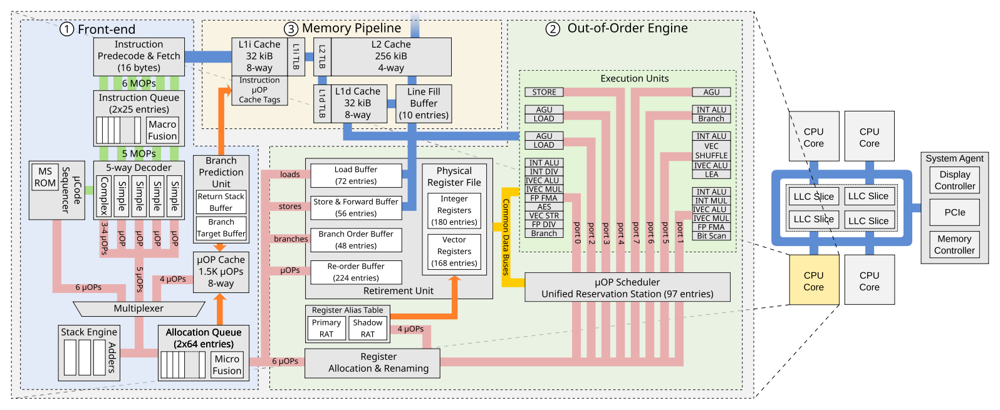
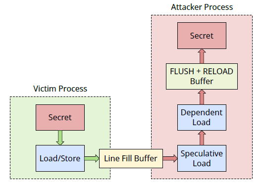

## RIDL: Rogue In-Flight Data Load

### Abstract & Introduction

#### 研究什么问题

RIDL 是一种新型的推测执行攻击，可以跨越地址空间和权限边界泄露任意数据。

不同于 Spectre、Meltdown 和 Foreshadow，RIDL 利用 Intel CPU 中的 微优化 (micro-optimization) 泄露 CPU 内部的 in-flight 数据，如 line fill buffers。

甚至可以通过没有 page fault 的线性执行来实施 RIDL 攻击，可以通过任意的非特权代码包括浏览器中的 js 攻击。

可以攻击进程、虚拟机、内核、SGX 以及 CPU 内部组件。

RIDL 绕过了现有的软件和硬件上的防御措施。

#### 前人的工作

Meltdown 和 Spectre 的披露使得基于推测执行的内存泄露攻击快速发展。而现有的攻击都受到严格的地址限制。

Spectre 及其变体允许攻击者控制的代码仅在加载的虚拟地址空间内泄露。

Meltdown 和 Foreshadow 要求目标物理地址映射到到已加载的地址空间。

这些攻击的局限性也正是缓解措施的切入点。针对这些限制设计出软件的缓解措施。

而 RIDL 完全消除了此类地址限制，现有攻击的目标是特定地址，而 RIDL 类似于被动嗅探器，它会监听流经 CPU 组件的 in-flight 数据，如 line fill buffers。RIDL 难以通过软件缓解措施解决。

Spectre 攻击者通过操纵分支预测单元的状态滥用错误预测分支借助侧信道来泄露可访问地址空间中的任意数据。攻击者需要诱导受害组件推测地执行特定 gadgets，而软件缓解措施就可以通过停止访问不可信指针或索引的方法避免不可信的推测执行。

Meltdown 放松了地址限制，非特权的攻击者还可以访问那些被 supervisor 标志位禁止访问的特权地址空间。原因就是乱序执行在执行特权级检查之前就访问了特权数据，这种攻击只适用于用户和内核在同一个地址空间的设计。软件缓解措施如 KPTI 把内核隔离在其自己的地址空间而不依赖 supervisor 标志位来隔离。

> Foreshadow 的论文还没读，具体不太了解

Foreshadow 进一步放宽了地址限制，攻击者甚至可以访问映射为无效的物理地址，如在页表中标记为 non-present。跟 Meltdown 类似，还是通过 cache 访问目标物理地址，然后数据在乱序执行中会在检测到无效页面的 page fault 之前泄露。Foreshadow 要求攻击者可以控制某些无效页表项的物理地址才有可能，软件缓解措施如 PTE inversion，OS 掩盖所有无效页表项的物理地址。

#### 本文的贡献

借助 RIDL 证明了现有的缓解措施不太行。RIDL 可以泄露受害者进程的 in-flight 数据即使它（在 Spectre 缓解措施的保护下）没有进行推测，而且也不需要控制地址转换结构（页表）。

**放宽需求意味着 RIDL 能够从无错误和无分支的非特权执行中首次实施强大的跨地址空间推测执行攻击。**

通过监听 CPU 中的 in-flight 数据，攻击者运行任意非特权代码（包括浏览器中的 js 代码）就可以跨任意安全边界泄露信息。

针对 Intel 微架构的逆向工程表明，RIDL 源于 微优化(micro-optimization)，这些优化使得 CPU 使用外部 CPU 内的运行数据为推测性负载提供服务。本文重点放在 line fill buffers。报告了 RIDL 实际利用中的挑战，对特定 in-flight 数据的泄露。同时也提供了很多实用的利用方法，跨越常见的安全边界（js沙箱、进程、内核、VM、SGX 等）泄露数据。

RIDL 适用于现有的所有 Intel 系统，同时它还绕过了现有的缓解措施，甚至包括 L1 刷新。

本文贡献

- 提出 RIDL，它使非特权攻击者能够首次跨安全边界构造地址无关的内存泄露原语。
- 研究了 RIDL 主要变体的根本原因是滥用 line fill buffers，提出首个分析 LFB 行为和相关微优化的逆向工程方法。
- 给出了真实的漏洞利用实例，表明 RIDL 可以实现跨任意安全边界泄露数据。
- 将 RIDL 放在最新的攻击和缓解措施背景下，分析表明，软件措施难以缓解 RIDL。

### Background

**Cache**

层级存储，Flush+Reload、Prime+Probe

**Intel Skylake microarchitecture**



Intel Skylake 架构 CPU 主要是三个部分：

- in-order front-end 把指令解码为 μ-ops

  - Speculative Execution

    为了预测分支目标，处理器里有 分支预测单元(Branch Prediction Unit)，预测错误之后处理器会回到之前的状态去执行正确的分支。推测有几种情况：条件分支、间接寻址、call/ret 指令和事务。Intel 处理器使用 分支排序缓冲区(Branch Order Buffer) 跟踪所有 in-flight 的分支以及该分支时处于退役状态还是推测状态。BOB 还用于通过事务同步扩展实现内存事务。使用 xbegin 指令标记事务的开始，会在 BOB 中添加一个条目作为检查点，处理器遇到 xend、xabort 或者错误时事务结束。xend 提交事务，否则会回滚。

- out-of-order execution engine

  - in-order register allocation & renaming，重命名寄存器以消除 WAR 和 WAW 冒险。

    通过 物理寄存器文件(Physical Register File) 中的自由可用物理寄存器分配指针并在 寄存器别名表(Register Alias Table) 中维护相应的映射，来重命名源和目标寄存器。重命名 μ-ops 之后再 重排缓冲区(Re-Order Buffer) 中为它分配一个条目以保留原始顺序，然后将 μ-ops 发送给 预留站(reservation station)。

  - out-of-order execution of instruction or μ-ops

    为了消除 RAW 冒险，预留站让所有操作数不可用的 μ-ops 停顿，一旦所有操作数可用，调度程序就分发 μ-ops 到相应的执行单元，调度结果可能是乱序的。μ-ops 执行后，预留站保存结果，更新依赖于它的其他 μ-ops，并将相应的 重排缓冲区(Re-Order Buffer) 条目标记为已完成。

  - in-order retirement

    退役单元(The Retirement Unit) 通过提交存储/分支操作的体系结构状态并释放所有已分配的物理寄存器来按原始程序顺序退役已完成的 μ-ops。如果分支预测错误，退役单元会退役有问题的分支指令，刷新重排缓冲区，重置预留站，然后从正确的分支重新执行。退役单元还会检测错误指令，并在违规的 μ-ops 达到非推测状态时生成精确的异常。

- memory pipline

**In-flight Data**

所谓 in-flight data 应该就只是 CPU 运行时内部流通的数据。现代 CPU 内部有很多潜在的 in-flight 数据源，如 重排缓冲区、执行端口、加载和存储缓冲区(Load and Store Buffers)、Line Fill Buffers。本文重点讨论 存储缓冲区(Store Buffers) 和 Line Fill Buffers。

Store Buffers 用于追踪挂起的存储和类似 store-to-load 转发优化中设计的 in-flight 数据。一些现代处理器会强制严格的内存排序，对同一物理地址的 load 和 store 不能乱序执行。然而，由于地址转换过程比较慢，物理地址或许当前不可用，处理器会执行内存消歧来预测 load 和 store 是否引用相同的物理地址。由此，处理器可以推测性地乱序执行 unambiguous 的 load 和 store 指令。作为一个 微优化(micro-optimization)，如果 load 和 store 指令是 ambiguous，处理器可以推测性地执行 store-to-load 转发，将数据从 store buffer 转发到 load buffer。

> 这里的 ambiguous 应该就只是 load 和 store 指令引用相同物理地址的情况。
>
> [memory disambiguation](https://en.wikipedia.org/wiki/Memory_disambiguation)

Line Fill Buffers 是 CPU 用来跟踪未完成的内存请求的内部缓冲区，还可以执行很多优化，如合并多个 in-flight store。当 LFB 中有数据可用，作为一个微优化，CPU 可以推测性地加载此数据（对 Store Buffer 也会执行类似的优化）。在这两种情况下，实施积极地推测执行的 CPU 可能在不了解所涉及的虚拟或物理地址的情况下进行推测。本文中特别关注 Line Fill Buffers，它比较适合现实世界的 RIDL。

到此就了解了，CPU 内部不仅在分支跳转处存在推测执行，出于性能的考虑在其内部还存在各种各样的预测执行，而这些 CPU 内部的推测执行也可以用来实施攻击。

### 威胁模型

攻击者想要通过滥用推测执行来泄露机密信息，受害者为 Intel 系统，且已经部署了当下最先进的推测执行缓解措施。假设攻击者只能运行非特权代码（如 js 沙箱、用户进行、VM 或 SGX enclave），但是要跨任意权限等级和地址空间泄露信息。

### 攻击概览



RIDL 攻击原理如图。首先受害者代码在一个安全域中运行，load 或 store secret。运行时 CPU 就会使用一些内部缓冲区，如 Line Fill Buffers。然后，攻击者执行 load 指令，处理器就会推测性地使用 LFBs 中的 in-flight 数据而不是真正有效的数据，没有地址的限制。最后，推测性地加载数据作为 Flush+Reload 缓冲区的索引，攻击者就可以提取秘密值。（也可以用其他的隐蔽信道

一个 RIDL 泄露 in-flight 数据的代码样例如下：

```c
// Flush flush&reload buffer entries
for(k = 0; k < 256; k++)
    flush(buffer + k * 1024);

// Speculatively load the secret
char value = *(new_page);
// Calculate the corresponding entry
char *entry_ptr = buffer + (1024 * value);
// Load that entry into the cache
*(entry_ptr);

// Time the reload of each buffer entry 
// to see which entry is now cached
for(k = 0; k < 256; k++) {
    t0 = cycles();
    *(buffer + 1024 * k);
    dt = cycles() - t0;
    
    if(dt < 100)
        ++results[k];
}
```

可以看到，这段代码就是普通的顺序执行的代码，没有无效的访问。过程其实就是 Flush+Reload 的过程，CPU 会推测性地从内存加载一个值，并希望它是来自我们新分配的页面，但实际上它是来自属于其他安全域的 LFB 中的 in-flight 数据。

当处理器最终检测到错误的推测加载时，就会丢弃所有对寄存器和内存的修改，从第 6 行用正确的数据重新执行。而推测执行的痕迹仍存在于微体系结构层面，所以使用简单的  Flush+Reload 就可以获取泄露的数据。第 8-10 行使用泄露的 in-flight 数据作为索引，以推测方式访问缓冲区。对应的数据就会出现在 cache，使用 Flush+Reload 方法找到用时最短的两次（因为程序还会以正确的数据执行一次）。

上面的代码对加载的地址按需分页，因此只有在处理 page-in 事件并引入新映射的页面之后，CPU 才会重新开始执行。还可以通过其他方式推测地执行使用 in-flight 数据的代码。其实访问的地址并不重要，极端情况，甚至可以换成 NULL 指针，之后再抑制错误（如用 TSX）。通常，任何运行时异常似乎都足以引起 RIDL 泄露，这可能是因为发生异常时处理器更积极地实施推测加载。这种行为似乎跟 Meltdown 和 Foreshadow 一致。

虽然 in-flight 数据背后的概念很直观，但是成功实施攻击却比较难。以前的工作建立在完善的文档（分支预测、页表、cache）基础上，而 CPU 内部的缓存如 Line Fill Buffers 很大程度是未知的。不同的微体系结构有不同行为的不同缓存。另外，根据公开的文档，尚不清楚是否还存在更多的缓冲区。为了使攻击成功，就要对处理器进行逆向工程，来更好地了解这些缓冲区和它们与处理器的交互。

### Line Fill Buffer

> 下面的部分就是对 Line Fill Buffer 的分析，以及如何利用它实施 RIDL 攻击。

LFB 在 Intel 处理器中扮演多个角色：

- 非阻塞缓存(Non-blocking cache)，cache miss 对性能的影响在于它们会阻塞数据缓存直到数据可用。LFB 通过实现多个 未命中状态保持寄存器(Miss Status Holding Registers) 来跟踪未完成请求的物理地址，直到数据可用。
- 加载挤压(Load squashing)，为了进一步优化性能，LFB 将多个 load miss 挤压到同一物理地址。如果已经有了具有相同物理地址的未完成请求，处理器就会将相同的 LFB 条目分配给相同地址的 load/store。
- 合并写(Write combining)，对弱顺序的内存，处理器会将 store 保持在 LGB 的同一个 cache line 来执行写结合。处理器把结果写回内存之前会把多个 store 合并到一个 LFB 条目。
- 非临时请求(Non-temporal requests)，现代处理器支持非临时性内存通信，如果开发者认为缓存数据时有害的。在这种情况下，处理器将执行非临时加载，并仅通过 LFB 存储。

**利用 LFB 泄露数据**

第一个实验，执行前面提到的攻击实例，受害者运行在同一个或其他线程中，重复将 secret 存储到一个固定地址。使用 lfb_hit 性能计数器，比较 LFB hit 次数和攻击迭代次数。结果表明，泄露的来源那正是 LFB。

第二个实验，受害者线程先将一个已知值 A 写入一个固定的内存地址，然后再循环读，使用 mfence 指令序列化访存操作。分别将此地址标记为写回、写入、写结合和不可缓存，以及使用 cflush 刷新掉它。结果表明再次表明泄露源就是 LFB。

第三个实验，受害者进程在循环中将四个不同值写入四个顺序的 cache line 中，也是用 mfence，还是用 cflush。通过启用禁用推测存储旁路来排除 store-to-load 转发泄露的可能。最后还是证明了本实验的 RIDL 变体是从 LFB 泄露数据。

执行 RIDL 攻击，需要理解 load、store、L1d cache 和 LFB 之间的交互。如果数据是不断读取的，也就是所有的 load 都会 L1d cache hit，之后的 load 也不会与 LFB 有任何交互。而如果执行 cflush，未来的 load 就会 cache miss 然后在 LFB 中分配一个条目等待数据。也就是 load 中 L1d 无法提取的数据会从 LFB 获取，store 会通过 LFB 将数据写入 L1d 或内存。

**同步**

攻击者需要与受害者同步才能保证正确的数据在正确的时间出现在 LFB 中，这里用三种方法：

- 序列化，Intel CPU 提供了内存屏障，如 lfence、sfence 和 mfence。它们使访存操作全局可见。处理器通过耗尽 load 和 store 缓冲区来等待 load 和 store 指令退役。mfence 指令就形成了一个同步点，允许在缓冲区完全耗尽之前观察最后几个加载和存储。
- 争用，另一个同步的方法是在 LFB 中创建争用，最终强制逐出条目。这样可以让我们对泄露的条目有所控制，而且不依赖于 SMT。受害者和攻击者在同一个线程中，如沙盒中，几乎所有情况都能泄露。
- 逐出，可以通过从特定的 cache set 中逐出 cache line 来控制从受害者那里泄露的值。用实验证明，受害者将一个值写入多个页面内的同一 cache line。一段时间后，写操作最终会从 L1d cache 中逐出以前的 cache line，而这些 cache line 是脏数据，就要通过 LFB 写回内存。

### RIDL 实例

> 下面就是利用上文所述技术实施 RIDL 攻击。

上文的技术允许攻击者以受控方式泄露 CPU 的 in-flight 数据，而 LFB 这些缓冲区独立于地址空间和特权级，所以可以实现跨安全边界攻击，进程、内核、VM、SGX、甚至 JS 沙箱。即使在最新的平台且开启了缓解措施。

唯一地要求就是存在处理器管理的 in-flight 机密数据。与之前 Meltdown 不同的是攻击者使用的目的地址是有效的，并不一定需要 TSX 事务或无效的 page fault。将威胁面扩展到沙箱。

为了验证 RIDL 正常工作，先是实现了一个隐蔽信道 POC。使用 Intel TSX，配合 Flush+Reload。

将上面讨论的技术应用到 RIDL 中还是面临一些挑战：

- 获取 in-flight 数据，需要想办法从 LFB 中获取想要的有限数据。对于非特权用户，有一些比较明显的机制：与内核交互(syscalls)、与特权进程交互(调用一个 setuid 二进制)、以及其他的可能性，如操纵页面缓存。
- 定位，LFB 活动频繁，从 LFB 中获取所需的数据就成了挑战。主要用跟受害者同步以及通过多次重复攻击同时滤除噪音来对其泄露数据。

> 接下来就是介绍一系列 RIDL 实例

- 跨进程，重复泄露，对齐数据。假设直到要泄露的数据中的一部分 bytes，通过 mask-sub-rotate 的操作使不一致的数据超出 Flush+Reload 的探索数组范围。像泄露 /etc/shadow，特征就是第一行是 root: 开头，一直运行 passwd 它就会读 shadow，然后一直 attack，匹配。
- 跨虚拟机，两个虚拟机在同一个物理核上执行，一个虚拟机上的用户进程可以读取另一个虚拟机上的 in-flight 数据，适用于 KVM 和 Hper-V。攻击者通过反复尝试 SSH 身份验证来从受害虚拟机中泄露 shadow。
- 内核攻击，为了验证特权级不会影响 RIDL 攻击，攻击者通过用户程序访问 /proc 文件，并从该文件读取 0 个字节。这样就不会有数据复制到用户空间，而仍然可以执行攻击。kernel 的存在使得攻击并不需要 SMT，可以通过执行一个 syscall，然后在内核将控制权返回给用户空间后立即执行攻击，以泄露内核指针和其他存储在堆栈中的接近胸痛调用结束的数据。
- 泄露内核任意内存，RIDL 可以通过常规和推测性内存访问泄露机密。copy\_from\_user 允许内核对用户提供的指针进行推测性访问。需要禁用 超级用户模式访问(Supervisor Mode Access Prevention, SMAP)。
- 页表泄露，MMU 页表遍历时会使用 LFB 读，可以据此发起其他攻击，如 Rowhammer。
- SGX