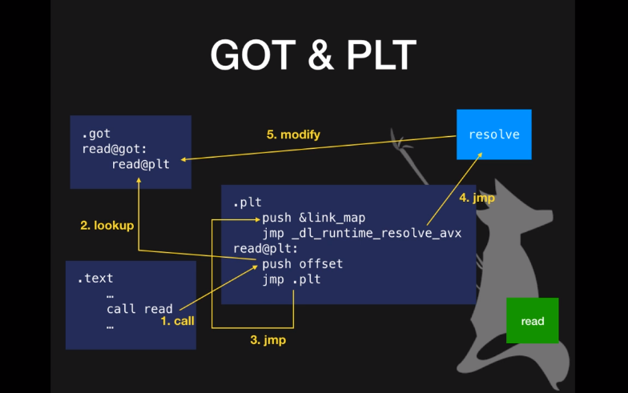

# Pwn Introduction

pwn 的基础就是栈漏洞的利用

## Security Options

### Lazy Binding

动态链接的 elf 在第一次调用时才会寻找函数真正的位置绑定

### GOT & PLT

Global Offset Table，外部函数地址表

Procedure Link Table，过程连接表

- 开始 GOT 表是 PLT，第一次调用的时候找到函数地址后修改 GOT

[PLT & GOT 以及延迟绑定机制](https://bbs.pediy.com/thread-257545.htm)

[循序渐进 GOT 表覆写技术](https://www.freebuf.com/vuls/241503.html)

### RELRO

RELocation Read Only

|               | linkmap writable | GOT writable |
| ------------- | ---------------- | ------------ |
| No RELRO      | Y                | Y            |
| Partial RELRO | N                | Y            |
| Full RELRO    | N                | N            |

### Canary

-  在 ebp 之前塞一个 random，ret 之前检查是否相同，不同的话会终端

### NX

No eXecute

即 DEP Data Execution Prevention

### PIE

 Position Independent Executable

- 开启后 data 段以及 code 段位置随机化

### ASLR

Address Space Layout Randomization

- 内存位置随机化，stack, heap, library
- 系统设定，不是程序设定

## Tools

### nc / ncat

`ncat -vc ./$binary -kl ip addr`

`nc ip addr`

### objdump

`objdump -M intel -d $binary`

### gdb

`gdb $binary`

`b main/*$addr`

`r` run

`c` continue

`ni` next instruction

`si` step instruction

`j *$addr`

`x/$ngx $addr`

### checksec

`checksec $binary`

现在的显示格式很不友好。。。

### gdb-vmmap

程序的内存分布和 rwx

### pwntools

pwntools 天下第一

### readlef

分析 libc

`readelf -a $libc`

### ROPgadget

`ROPgadget –binary $binary`

### one_gadget

`one_gadget $libc`

### radare2

[r2 docs](https://frozenkp.github.io/reverse/radare2/)

