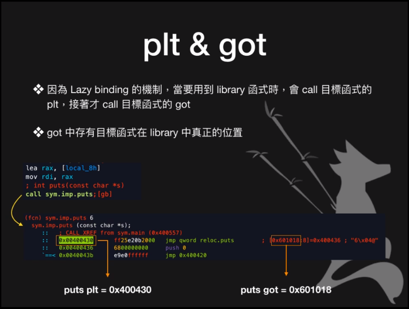
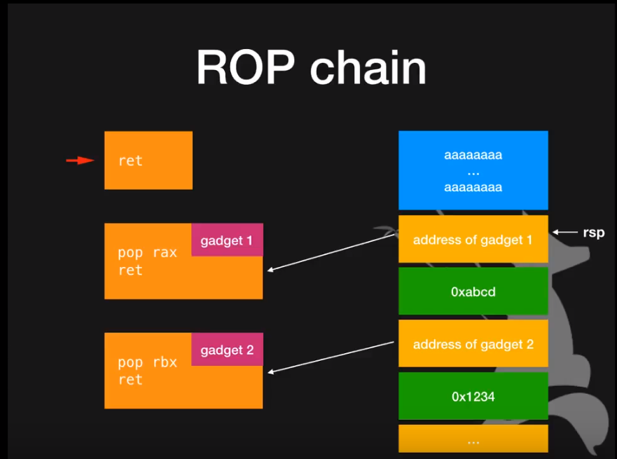

# Pwn 从入门到放弃

## Buffer Overflow

没有控制输入长度，导致内存空间被覆盖

`gcc start.c -fno-stack-protector -o start` 关闭 canary

 canary 绕过

- local variable 
- stack migration
- ret2 series

### ret2code

```c
#include <stdio.h>
#include <stdlib.h>

void shell(){
    system("/bin/sh");
}

int main(){
    char buffer[8];
    gets(buffer);
    return 0;
}
```

通过栈溢出覆盖返回地址跳转执行 `shell()`

如果用 gcc 编译会在 main 函数前面加一些奇怪的指令序列。。。直接覆盖程序会崩溃（因为 gcc 编译的 function prologue 和 epilogue 发生了变化，stackoverflow 会破坏 esp 的值 [What is the purpose of these instructions before the main preamble?](https://reverseengineering.stackexchange.com/questions/15173/what-is-the-purpose-of-these-instructions-before-the-main-preamble)

使用 `clang -m32 ret2code.c -o ret2code` 编译即可，对应的汇编就是最熟悉的样子：

```assembly
push ebp
mov ebp, esp
sub esp, 0x18
lea eax, dword [s]
mov dword [var_4h], 0
mov dword [esp], eax
call sym.imp.gets
xor ecx, ecx
mov dword [var_10h], eax
mov eax, ecx
add esp, 0x18
pop ebp
ret
```

使用 gdb 查看 buffer 所在位置及 EBP 的值，作差之后 +4 得到返回地址的地址，然后填入目的地址即可。

### ret2shellcode

需要关闭 NX，填入的数据可执行，然后跳转执行

## libc

### lazy binding

函数第一次调用时才会绑定



第一次执行 puts——puts plt 程序之内——puts got 跳到 lib 获取函数地址

### GOT hijacking

GOT 存的是函数在 lib 中的地址，修改 GOT 就可以条转到指定的位置

### ret2libc

类似与 hijack，读取函数的 got 之后就可以计算 aslr 后的 libc 基址

### one_gadget

在 libc 中可以 getshell 的位置

## ROP

 Return Oriented Programming

利用 gadget 控制执行流程

> gadget 是 ret 结尾的序列

### ROPgadget

`ROPgadget --binary $binary | grep inst`

### ROP chain



构造 ROP 链控制寄存器的值

### `execve("/bin/sh")`

syscall

- rax = 0x3b
- rdi = \$(‘/bin/sh’)
- rsi = 0
- rdx = 0

