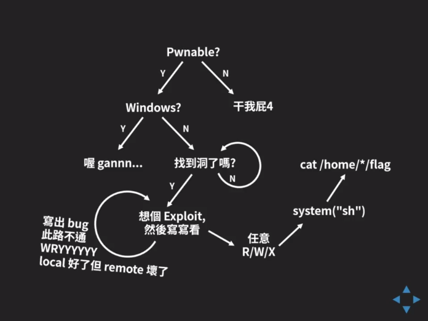

# Week 3



- [pwnable kr](http://pwnable.kr)
- [pwnable tw](http://pwnable.tw)

## Buffer Overflow

- 程序未检查输入大小
- Stack overflow
- Shellcode
  - code 和 data 放在同一段，就能从 code 跳转到特别构造的 data 执行
  - data execution prevetion
- IDA disassemble & decompile
- objdump disassemble
- **NO AT&T** `mov src, dst` vs **INTEL** `mov dst, src`
  - `call *-0xf8(%ebx, %edi, 4)`
  - `call DWORD PTR [ebx+edi*4-0xf8]`
- readelf 查看 elf 文件头
  - `readelf -a <file> | grep STACK`
- netcat
  - `nc -vc <cmd> -kl ip port`
- strace 追踪 systemcall
  - `strace -e trace=<systemcall> cmd`
- gdb
  - `b symbol/*addr`
  - `layout asm`
  - `ni` 单步步过 `si` 单步步入
  - `c` continue to next breakpoint
  - `fin` finish to return
  - `x/(w|b|g|h|i)(x)`
  - `attack pid`
- hook & patch
  - 去掉 `alarm`
  - LD_PRELOAD
  - LD_SHOW_AUXV
- [qira](http://qira.me) can debug in the past
- pwntools
- nasm 编译 shellcode

### Shellcode

- 利用 `strcpy` 复制的 shellcode 不能有 `\0`，会截止
- 可以用 call + pop 的方式拿到 shellcode addr
- 长度不足可以用 read

- alphanumeric shellcode 只能用字母数字组合的 shellcode

```python
# 所有可用的 opcode
from pwn import *
for x in string.letters + string.digits:
    print x, disasm(x+'ABCDEFG').split('\n')[0][6:]
```

感觉现在就写 shellcode 有点费劲，还是先用 pwntools 给的吧