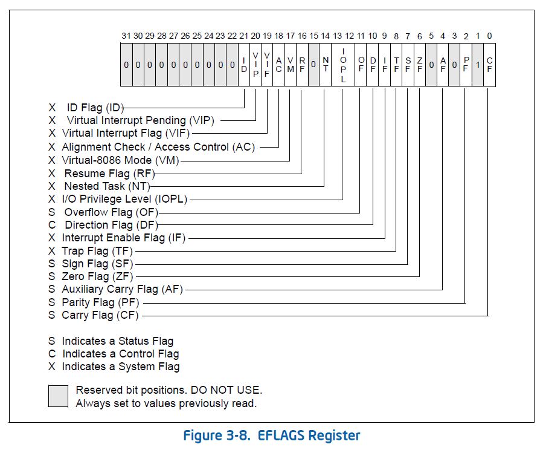

# 第 2 章：动态分析技术

## 2.1 OllyDbg

### 标志寄存器

书里提到了寄存器面板可以查看标志寄存器，以下是标志寄存器 EFLAGS 的结构：

OllyDbg 中显示的：

- C(0): 进位标志位
- P(2): 奇偶校验位
- A(4): 辅助进位标志位
- Z(6): 零标志位
- S(7): 符号标志位
- T(8): 单步调试标志位
- D(10): 方向标志位
- O(11): 溢出标志位



### 常用断点

- INT 3

    机器码 0xCC，用于设置 `F2` 断点。

    优点是可以设置无数个断点，缺点是改变了原程序机器码，易被检测。

    一般的检测手段就是取得检测函数的首地址是否为 0xCC。

```c++
FARPROC Uaddr;
BYTE Mark = 0;
(FARPROC &)Uaddr = GetProcAddress(LoadLibrary("user32.dll"), "MessageBoxA");
Mark = *((BYTE*)Uaddr); // 取 MessageBoxA 函数的首字节
if(Mark == 0xCC)        // 如果字节为 CC，则被下断点
    return true;
```

- 硬件断点

    硬件断点和 DRx 调试寄存器有关。

    - DR0-DR3：调试地址寄存器，用于保存需要监视的地址。
    - DR4-DR5：保留，未公开具体作用。
    - DR6：调试寄存器组状态寄存器。
    - DR7：调试寄存器组控制寄存器。

    硬件断点的优点是速度快，不易检测，缺点是最多只能使用 4 个。

- 内存断点

    设置内存访问和写入断点，原理是对所设的地址赋予不可访问/不可写属性，产生异常时 OllyDbg 要比较地址，如果是断点地址，就交给用户。每次异常都要判断，所以内存断点会降低执行速度，因此 OllyDbg 限制只能下 1 个内存断点。

    硬件访问/写入断点是在触发硬件断点的下一条指令处下断，内存断点是在触发断点的指令处下断。遇到代码校验且硬件断点失灵的情况下，可以使用内存断点。

- 内存访问一次性断点

    在内存界面使用 `F2` 快捷键设置一次性访问断点。

- 消息断点

    Windows 本身是消息驱动的。当某个特定窗口函数接收到某个特定消息时，消息断点将使程序中断。消息断点只有在窗口被创建之后才能被设置并拦截消息。

    消息有 4 个参数，分别是 1 个窗口句柄（hwnd），1 个消息编号（msg）和 2 个 32 位长（long）参数。Windows 通过句柄来标识所代表的对象。

- 条件断点

    OllyDbg 的条件断点可以按寄存器、存储器、消息等设断。条件断点是一个带有条件表达式的普通 INT 3 断点。`Shift+F2`

    - 寄存器条件中断，如：`bp 401476 eax==0400000`。
    - 存储器条件中断，如：`bp CreateFileA, [STRING [esp+4]]=="c:\\abc.txt"`。

- 条件记录断点

    条件记录断点除了具有条件断点的作用，还能记录断点处函数表达式或参数的值，也可以设置断点的次数，每次符合暂停条件时，计数器的值都将减 1。

    `Shift+F4` 打开条件记录窗口，可以配置条件、说明、表达式。

### 插件

- 命令行插件 CmdBar

    常用命令：

    - ? 表达式：计算表达式的值
    - D(DB,DW,DD) 表达式：查看内存数据
    - BP 表达式,[条件式]：设置断点
    - Hw 表达式：设置硬件写断点

- OllyScript


### Run trace

Run 跟踪可以把被调试程序执行过的指令保存下来，将地址、寄存器的内容、消息等记录到 Run trace 缓冲区。

打开 Run trace 后，OllyDbg 会记录执行过程中的所有暂停。使用 + 或 - 浏览程序的执行路线。

当反汇编窗口中显示被调试程序领空时，右键选择 Run trace -> 添加所有函数过程的入口 选项，检查每个可识别的函数被调用的次数。

### Hit trace

Hit trace 能够让调试者辨别哪一部分代码被执行了，哪一部分没有。实现方式即在选中区域的每一条命令处设置一个 INT 3 断点，中断发生时去除。使用 Hit trace 时不能使用断点，否则可能崩溃。

当遇到一段跳转分支比较多的代码，需要了解程序的执行线路时，可以使用 Hit trace。

### 调试符号

调试符号是被调试程序的二进制信息与源程序信息之间的桥梁，是在编译器将源文件编译为可执行程序的过程中为支持调试而摘录的调试信息。调试信息包括变量、类型、函数名、源代码行等。

进行源码级调试的首要条件是生成的文件中包含调试信息。调试信息包括程序里每个变量的类型和在可执行文件里的地址映射及源代码的行号。

### 加载程序

两种方式加载目标程序调试：

- 通过 CreateProcess 创建进程
- DebugActiveProcess 函数将调试器捆绑到一个正在运行上的进程上。如果是隐藏进程，获取 pid 后通过 -p 参数附加。

    如果附加不成功，可以巧妙利用 OllyDbg 的即时调试器功能调试。例如，运行 A.exe（它会调用 B.exe），此时用 OllyDbg 附加 B.exe，OllyDbg 无响应。
    
    解决方法是：设置为即时调试器，将 B.exe 的入口改成 INT 3 指令，同时记下原指令；运行 A.exe，调用 B.exe 运行到 INT 3 指令时会出现异常，OllyDbg 会作为即时调试器启动并加载 B.exe；将 INT 3 指令恢复，继续调试。

## x64dbg

x64dbg 是开源的调试器，界面与 Ollydbg 类似，容易上手。


## WinDbg

### 调试符号

