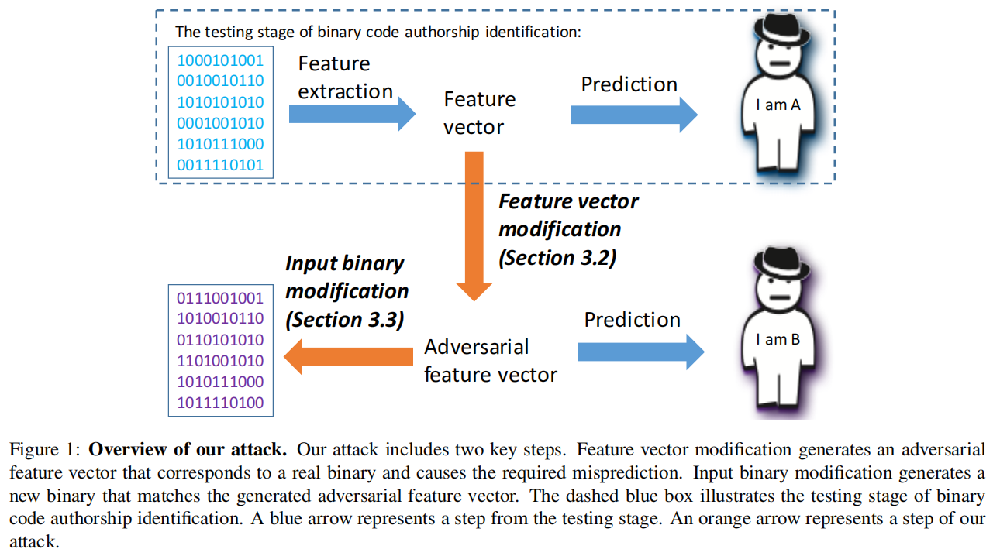

# 对抗作者身份识别的二进制

> [Adversarial Binaries for Authorship Identification](https://arxiv.org/abs/1809.08316)

## 文章概要

现有的基于监督学习的二进制代码作者身份识别技术可以确定二进制程序的作者。本文从攻击者的角度看待这一问题，即目标是修改二进制文件，使作者归因分类器做出错误分类，同时保留源文件功能功能。本文提出了针对现有的二进制代码作者识别技术的攻击框架，成功实现对目前最先进的作者归因分类器的攻击。技术可用于分类器的对抗性训练，以设计出更安全的二进制分析系统。

## 引言

现有的基于机器学习的二进制程序作者识别技术已取得显著进展。本文从攻击者角度研究作者身份识别问题，目的是欺骗机器学习分类器做出错误预测。实验表明，经对抗性机器学习修改的二进制代码会使二进制代码作者身份识别分类器产生错误结果。

将对抗性机器学习应用到作者身份识别领域，主要是利用测试时攻击 (test time attack) ，即修改测试样本以导致错误预测。二进制作者身份识别领域的难点主要是保证二进制文件的结构有效性和原始功能。

本文提出了一个自动攻击二进制代码作者识别的框架，其作用是三方面的：

1. 实验表明，二进制程序的自动攻击是可实现的。输入一个二进制程序，输出一个与输入二进制文件功能相同的有效二进制文件，且可导致错误预测。
2. 该技术可用于对抗性再训练，将对抗性样本示例合并到训练集中，重新训练出带有损失函数的分类器。
3. 通过对现有的二进制代码作者身份识别的攻击，总结设计更安全的二进制分析机器学习系统的经验教训。

着重两种攻击：非针对性攻击，即导致对任何不正确作者的错误预测；针对性攻击，即导致对特定作者的错误预测。攻击手法应为对二进制文件的局部修改，同时多样化。

两点假设：攻击者对目标作者身份识别工具非常了解；执行测试时攻击，只能通过提供修改过的二进制文件来影响分类器结果。攻击设计应基于目标分类器的使用的特征集、特征提取工具以及机器学习算法。

主要的攻击手段：

- **特征向量修改**，生成一个与输入二进制文件相对应，且可导致错误预测的特征向量。
  - 多种修改策略，CW 攻击以及投影梯度下降。
  - 需要考虑二进制文件特征间相关性，执行特征相关分析，线性相关性分析足以实现攻击。
  - 修改特征的难易度，局部特征更容易修改，且容易保持结构有效性。
  - 特征分组，组内特征可使用相同的修改策略。一次修改一组特征直到可导致错误预测。尽量少地修改特征。
- **输入二进制修改**，在保证原功能的情况下，修改二进制文件以匹配特征向量。
  - 根据特征向量的修改结果删除或注入特征。
  - 删除特征可以使用语义等价替换。
  - 注入特征要确保用于特征提取的二进制代码分析工具可以识别注入的代码或数据。
  - 二进制修改策略由一系列原语组成

使用 Caliskan-Islam 等人提出的技术训练的分类器来评估攻击。研究表明，非针对性攻击成功率高达 96%，而针对性攻击成功率较低。当前的二进制作者识别技术都基于易修改的特征，因此易受攻击。

### 攻击框架

- 特征相关性分析
- 特征向量修改，随机修改、CW 攻击和投影梯度下降
- 二进制修改策略，针对 ndisasm 和 radare2 的修改原语。

