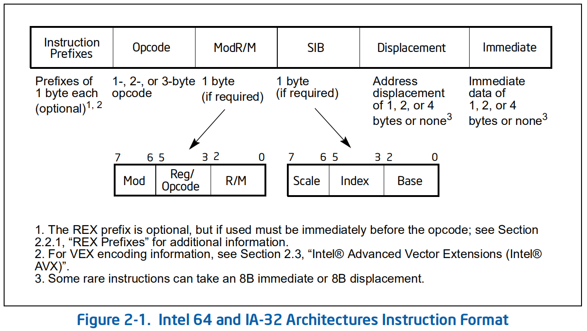
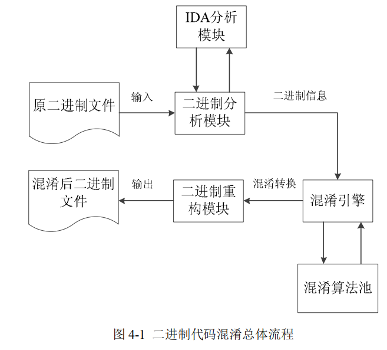

# 二进制代码混淆

> [基于二进制代码混淆的软件保护研究-电子科技大学-吴适](https://kns.cnki.net/KCMS/detail/detail.aspx?dbcode=CMFD&dbname=CMFD201401&filename=1013331373.nh&v=MjMwNjg3RGgxVDNxVHJXTTFGckNVUjdxZlpPZHFGQ25tVzc3TFZGMjZIYkM3SDlMTHJKRWJQSVI4ZVgxTHV4WVM=)

## 文章概要

本文以二进制程序软件保护为目的，重点对二进制代码混淆算法进行研究，分析了二进制代码混淆算法实现的关键技术。

## 相关技术

### 二进制分析技术

- PE 文件格式，DOS 头部、PE 头、区块表、区块等。
- 静态分析
	- 反汇编
    	- 线性扫描，简单地扫描整个代码节并反汇编指令，无法处理代码中嵌入的数据。
	    - 递归遍历，从程序入口点开始，沿着程序的控制流反汇编，无法识别出所有控制转移指令的目标，导致反汇编不完整。
- 动态分析，操作复杂，人工，反调试。
- 混合分析
- 其他分析技术，程序切片、控制流分析、数据流分析。

### 针对二进制程序的攻击方法

- 逆向工程，`机器码--反汇编-->汇编代码---反编译->高级语言`
- 软件篡改
  	- 静态防篡改，加壳、代码混淆。
  	- 动态防篡改，程序完整性判断。
- 代码注入，缓冲区溢出。

### 代码混淆

#### 代码混淆的概念

Collberg 最先给出代码混淆的概念。

原程序 $P$ 经过一个转换 $T$ 后称为目标程序 $P’$，在转换过程中，原程序 $P$ 和目标程序 $P'$ 语义上是等价的，满足以下条件的转换称程序 $P$ 到目标程序 $P'$ 的转换是混淆转换：

1. 原程序 $P$ 出现错误无法终止时或因为错误而终止时，目标程序 $P'$ 可以终止也可以不终止；
2. 否则，目标程序 $P'$ 必须终止，且 $P'$ 的输出结果必须和原程序 $P$ 的结果相同。

#### 代码混淆的分类

Collberg, Chenxi Wang 和 Wroblewski 提出了不同的分类方式。

##### Collberg 的分类方法

- 布局混淆，或称为词法结构混淆，是指在不影响指令功能的情况下改变或删除中间代码或源代码中的有用信息。
    - 删除注释、删除调试信息。
    - 替换变量名等。
  
- 控制流混淆，不改变整体功能性的情况下，改变或隐藏原程序的控制流。
    1. 控制流聚合，将逻辑上相关的计算分开或者将不相关的计算合并；
    2. 控制排序，基于表达式、基本块或方法的局部性原理，随机化它们在原程序中的位置；
    3. 计算混淆，通过增加、删除控制流抽象达到隐藏实际控制流的目的。
    - 不透明谓词，是指在一个程序中的某一点 $p$ 的变量 $V$ 或预测 $P$，其计算结果在混淆前是可知的，在混淆后难以确定。
    - 常见的控制流混淆
        - 插入不透明谓词：混淆前，在原程序中的某一点 $p$ 是一个绝对跳转，混淆后，$p$ 点处转换为一个条件跳转，但该条件跳转运行时始终进入某个固定分支。
        - 控制流平展：混淆前，根据程序中基本块的跳转指令，能够构建层次清晰的控制流图，经过控制流平展混淆后，所有基本块在控制流图中都处于同一层次，基本块之间的转移通过使用一个统一的函数来控制。
  
- 数据混淆，变换软件代码中的数据或数据格式。

    - 存储和编码变换、聚集变换、

- 预防性混淆，针对特定的自动化反混淆技术。研究反混淆器和反编译器等。

##### Chenxi Wang 的分类方法

- 过程内转换，通过静态分支到动态分支的转换。
- 过程间转换，是针对程序调用的结构。通过函数指针将函数调用转为间接调用、建立函数指针的别名以及引入过程间的数据依赖别名。

##### Wroblewski 的分类方法

前两人的混淆主要是基于对面向对象语言混淆的研究。Wroblewski 第一次针对机器码混淆做了研究，提出了基于底层编程的分类方法。

- 插入混淆，最简单的是插入新指令，隐藏可见的实际控制路径。
    - 插入的指令不改变上下文
    - 改变混淆程序中上下文的操作必须是可逆的
- 程序片段重排，打乱原有执行顺序。

#### 评估

- 强度，描述混淆增加的复杂度。$T_{pot}(P) = \frac{E(P')}{E(P)} - 1$
- 弹性，抵抗反混淆技术的能力。单向转换和可逆转换。
- 消耗，混淆转换对混淆程序的执行时间和空间上的影响。

## 代码混淆算法研究

### 元素转换分类法

将混淆转换看成代码和数据之间的互相转换。

- C2C，混淆前后的代码片段语义等价。
    - 控制转移的等价替换，基于异常的控制混淆等。
- C2D，混淆使原代码片段的语义隐藏在数据中。
    - 自修改代码混淆，基于分支函数的控制转移混淆等。
- D2C，将简单的数据形式转换为通过复杂计算获得数据结果。
    - 静态数据转换为过程数据。
- D2D，增加数据数量、数据类型、对存储方式转换。
    - 改变存储方式、生存周期、创建别名。

针对反汇编工具，使其将代码识别为数据，或将数据识别为代码。

### 基于代码-数据欺骗的混淆算法

C2D，在静态分析工具中隐藏目标基本块及到目标基本块的控制流。

#### 算法思想

1. 反汇编器的递归遍历算法，当反汇编器遇到条件跳转指令时，跳转指令中的目标地址和跳转指令紧接在的地址都会被解释成指令。
2. 绝对跳转指令后面的地址为 A，使用递归遍历算法时，若没有其他指令跳转到 A，则 A 不会被解释成指令；使用顺序扫描算法时，A 地址处存在无法被解释的指令，则会跳过对 A 的反汇编。

控制流隐藏通常利用不透明谓词来实现，一条路径永远不会被执行，称为垃圾代码。而垃圾代码对程序毫无意义，可以利用垃圾代码隐藏关键代码。

#### 算法描述

基本块 A 末尾通过 jmp 跳转到基本块 B，A 与 B 之间隔了一个基本块 X。调整基本块的位置，使 A 与 B 相邻，调整后 A 中的跳转指令的偏移为 0。

算法步骤如下：

1. 引入基本块 C 和基本块 D，起始地址分别为 c 和 d；

2. 修改基本块 A 的跳转指令，引入不透明谓词，如下：

   ```assembly
   pushfd			9C
   push ebx		53
   push eax		50
   shr ebx, 8		C1EB08
   shl ebx, 26		c1E31A
   push x			68 x
   pop eax			58
   cmp ebx, 1		83FB01
   jne z			0F85 z
   ```

   z 地址处指令是 `jmp eax`，x 是 `jmp eax` 指令到基本块 C 处的偏移。指令 `jne z` 后面紧跟着基本块 D。可见，基本块 A 始终跳转到基本块 C。

3. 基本块 D 作为垃圾代码存在，其中有一条指令 `mov eax, y`，y 是 32 位立即数， y 中存放着一条 2 字节的指令 `jmp rel8` 的十六进制编码，rel8 是该指令到基本块 B 的偏移，因此该 mov 指令与基本块 B 起始地址的偏移不应大于 8 bit。

4. 基本块 C 主要是为了获得上面 `jmp rel8` 指令的地址，关键指令如下：

   ```assembly
   xor ebx, ebx	33DB
   push m			68 m
   push r			68 r
   ret				C3
   ```

   m 是 `jmp rel8` 指令的地址，r 是步骤 2 中 `pop eax` 指令的地址。基本块 C 获得地址 m 后将控制转移到 `pop eax` 中，再次利用基本块 A 中的最后几条指令，使 `jmp eax` 跳转到 `jmp rel8`，最后跳向基本块 B。进入 B 之前相应的调用以下指令恢复上下文：

   ```assembly
   pop eax			58
   pop ebx			5B
   popfd
   ```

5. 在基本块 B 前面添加一些随机数据使得反汇编器使用顺序扫描时失效。

混淆后执行流程为：基本块 A $\rightarrow$ `jmp eax` $\rightarrow$ 基本块 C $\rightarrow$ `jmp eax` $\rightarrow$ `jmp rel8` $\rightarrow$ 基本块 B。

### 基于操作码变换的混淆算法

C2C，通过对指令的操作码进行混淆，转换成其他指令，使得反汇编后目标代码的语义发生变化。

#### 算法思想



1. 指令前缀：可选项，指令前缀一共有 4 组，每组前缀在一条指令中只出现 0 到 1 次，即指令前缀占 0 到 4 字节。
2. 操作码：占 1 到 3 字节。
3. 说明操作数，mod 域说明操作数寻址类型；red/opcode 表示寄存器或补充操作码。
4. SIB：使用 `base + index * scale + displacement` 的寻址方式。
5. 相对偏移，占 1、2 或 4 字节。
6. 立即数，表示一个操作数 1、2 或 4 字节。

操作码相关的部分包括指令前缀、操作码和 ModR/M 的 3 bit 额外操作码。

令 rrr 表示寄存器，oo 表示 2bit 的Mod，当 oo 为 00、01 或 10 时，mmm 表示 3bit 的寻址模式，当 oo 为 11 时 mmm 表示寄存器。如 `add reg, reg` 指令的二进制编码方式时 `00000011oorrrmmm`，`sub reg, reg` 二进制编码为 `00101011oorrrmmm`。编码只相差两位，可以通过异或运算转换。

下面总结 x86 中可以进行类似转换的指令：

- 单操作数：

  ```assembly
  push reg		01010rrr
  push reg		01011rrr
  inc reg			01000rrr
  dec reg			01001rrr
  push mem		11111111oo110mmm
  pop mem			10001111oo000mmm
  inc mem			11111111oo000mmm
  dec mem			11111111oo001mmm
  ```

- 双操作数，`mov, add, sub, xor, cmp` 等。下面列举寄存器到寄存器的指令：

  ```assembly
  mov reg, reg 	10001011oorrrmmm
  add reg, reg 	00000011oorrrmmm
  sub reg, reg 	00101011oorrrmmm
  cmp reg, reg 	00111011oorrrmmm
  xor reg, reg 	00110011oorrrmmm
  ```

- 控制转移指令，条件转移和无条件转移：

  ```assembly
  call rel32		11101000
  jmp rel32		11101001
  ```

可见，几种常见的指令都存在异或操作后可转换为其他指令。即在基本块中对指令进行替换，程序运行时再变换回原指令。静态分析的难度增加。

对待混淆基本块统计可替换的指令，将可相互转换的指令再分类，构造转换集合。

## 混淆算法实现

三个功能：二进制程序分析、混淆引擎、二进制程序重构。

