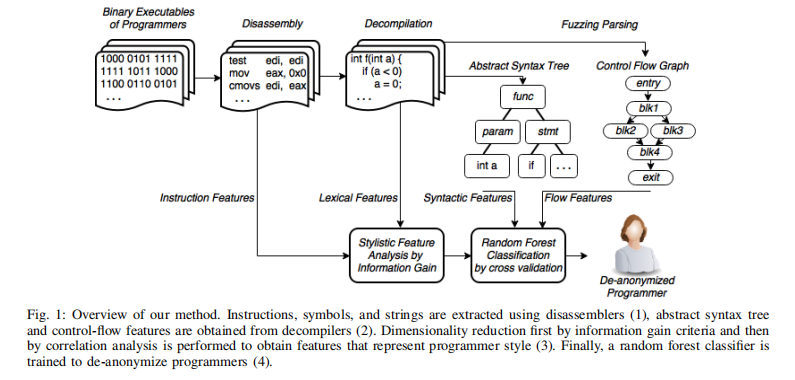

# 二进制去匿名化

> [When Coding Style Survives Compilation:De-anonymizing Programmers from Executable Binaries](https://www2.seas.gwu.edu/~aylin/papers/caliskan_when.pdf)

## 文章概要

本文从机器学习的角度解决程序员去匿名化问题，提出了一种针对可执行二进制文件的作者归属方法，对基本的混淆以及一系列的编译器优化设置具有鲁棒性。

### 引言

本文的研究表明程序员的编程风格在编译过程中得以保留，且可以从二进制可执行文件中提取。这种程序员的去匿名化技术获取会对程序员的隐私带来威胁，此外，还可应用于软件取证等领域。

本文的方法相比于 Rosenblum 等人的方法有了显著提升。191 名程序员的去匿名准确率达到了 92%，600 名程序员的去匿名准确率达到了 83%。

- 首次表明二进制文件的自动反编译结果提供了有利于去匿名化的特征。具体而言，反编译源码的抽象语法树同样可以用于二进制文件的归因技术。

- 并行地使用多个反汇编与反编译工具，通过生成不同的程序员编码风格表示，提高了去匿名的准确率。

- 提出了一种鲁棒性的机器学习框架，使用随机森林分类，使得我们有效地结合多种特征，而不过度拟合。

### 问题描述

程序员去匿名化即确定一个可执行二进制文件的作者。这种技术的用途可以是双重的，用于维权或者威胁程序员隐私。去匿名化的前提是要尽可能获取那些候选程序员编写的二进制程序样本。将已知作者的样本转换为特征向量，利用机器学习技术训练出分类器，以找出最可能的程序作者。这是一个多元分类的机器学习问题。

二进制的文体指纹，即通过反汇编、反编译工具得到源代码后生成抽象语法树等文本特征集，以用于去匿名化。

通过线性条件随机场 CRF 确定二进制程序的生成工具链准确率在 90% 以上，因此我们可以假设已知目标二进制文件的工具链来源，以便使用相同的工具链训练分类器。

恶意代码的归属问题，由于难以获取带标签的恶意软件，因此这一领域的工作主要是进行聚类，而广泛使用的混淆技术使得研究人员专注于动态分析而不是静态特征。

## 实现

最终目标是自动识别二进制的作者，使用监督学习，即从已知作者的二进制程序样本训练一个分类器。数据表示是机器学习成功的关键，需要设计可反映二进制文件中程序员风格相关属性的特征集。可以通过反汇编工具获取低级特征，通过反汇编工具获取高级语法特征。

- 反汇编提取特征
  - 提取汇编指令等低级特征，这些特征已在 Rosenblum 的文章中被证明对作者归属有效。新增引用字符串、符号信息以及控制流图等特征。
  - 使用 Netwide Disassembler(ndisasm)，可以解码指令，不知道可执行文件格式。
  - 使用开源的 radare2 获取比 ndisasm 更详细的指令，基于 capstone 反汇编框架，能识别二进制可执行文件格式，可以处理重定位和符号信息。生成控制流图等。
  - 将汇编指令中的十六进制数替换为统一的数字，以免过度拟合。
- 反编译
  - 使用 Hex-Rays 反编译工具。
  - 将程序转换为高级语言代码，可以重建控制结构。
  - 词汇特征，程序中的整数类型、库函数名以及符号信息可用时的内部函数名。
  - joern 工具基于反编译的 C 伪代码构建抽象语法树，源代码层面的研究证明这些语法特征对作者身份归属有效。
- 降维
  - 特征提取过程提供了大量特征，这就需要执行特征选择以减少计算负担以及过度拟合。
  - 使用 weka 的信息增量特征选择，评估给定特征的分布熵与条件分布 Shannon 熵。
  - 基于相关的特征选择，通过考虑特征的个体预测能力以及冗余程度评估。
  - 最后提取了 53 个特征，使得 100 个程序员的分类精度达到 96%。
- 分类
  - 随机森林，本质上是避免过度拟合的多元分类器。
  - 每个样本通过决策树分类，每个节点做出二元决策，到达叶子时将结果聚合。
  - 500 棵树，精度和时间之间的权衡。
- 评估
  - 受控的数据集 Google Code Jam
    - 以往的工作都基于 GCJ 的语料库。
    - 通过标识功能属性消除了识别编程任务而不是程序作者的混淆效应。
    - 训练集使用相同的编译器及设置，之后测试不同优化选项的影响。
    - 将提取并筛选后的特征集推广到其他程序员中，同样有效。
    - 100 个程序员，每个人 9 个程序，采用 9 倍交叉验证的随机森林准确率高达 95%。
    - 每个程序员 1 个程序的准确率为 65%，3 个程序就达到了 91%。鲁棒性
    - 对于候选人多，样本少的情况，可以保证 top-n 的高准确率。
  - 真实世界场景下的测试
    - 测试优化选项的影响，证明优化编译的二进制文件仍然可以去匿名化。
    - 测试删除符号信息的影响，精度下降但是仍不足以阻拦去匿名化。
    - 对于二进制混淆如 LLVM 等工具，等价指令替换，虚假控制流，平坦化。分析者可以对已有的非混淆样本进行同样的混淆操作，以获得混淆样本供分类器训练。可以得到 88% 的准确性。
    - 通过自动从 github 收集源文件，从 90 个不同作者生成 1075 个二进制程序，准确率 65%。
    - 设置分类置信阈值以判断匿名测试文件是否属于测试集中的程序员。可用于软件取证，找出编写恶意代码的程序员。
