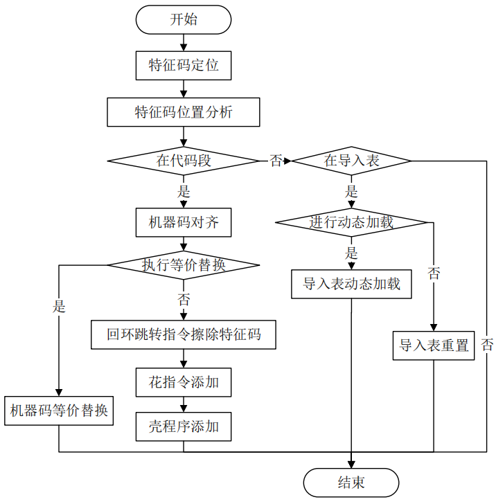

# Windows PE 恶意代码自动化免杀

> [Windows PE 恶意代码自动化免杀方法的研究与实现-电子科技大学-张晗](https://kns.cnki.net/KCMS/detail/detail.aspx?dbcode=CMFD&dbname=CMFD201802&filename=1018707851.nh&v=MTUzNTh6SlZGMjZGclM0R2RuSnJwRWJQSVI4ZVgxTHV4WVM3RGgxVDNxVHJXTTFGckNVUjdxZlpPZHNGeXprVjc=)

## 文章概要

实现了一个 Windows PE 恶意代码自动化免杀系统，能够提供通过集成恶意代码中特征码的定位方式以及各种恶意代码修改方式进行的一站式自动化定位修改功能。

## 关键技术介绍

### 查杀技术

特征码提取、主动防御、启发式查杀、云查杀。

- 特征码：文件特征码和内存特征码；单一特征码、多重特征码和复合特征码。
- 主动防御：资源访问控制层，对系统文件修改和注册表修改等进行拦截；资源扫描层，对敏感资源的读写操作进行监控；进程活动行为判定层，收集从控制层和扫描层传来的进行操作和信息。
- 启发式查杀：主动分析目标程序操作，在虚拟环境中执行目标程序。

### 免杀技术

本文关键技术：提取特征码、机器码处理、导入表处理。

查杀中应用最广泛的是特征码，因此主要通过修改特征码免杀：

- 特征码定位
  - 逐块定位：从区段头部填充无效数据，通过查杀结果推断特征码位置。
  - 逐块暴露：向指定区间空白的文件中逐渐填充数据，当区间存在特征码时，使用无效数据填充。
  - 混合定位：使用逐块暴露或二分法找出一个包含特征码的较小区间，然后通过逐位探测找出特征码具体位置及长度。
- 特征码修改
  - 内联钩子回环跳转，采用跳转指令将特征机器指令进行移动，将特征机器指令移动到一个新的区域，在原位置添加一条跳转指令。执行完再跳转回原位置，保证程序流程不发生变化。
  - 机器指令等价替换，保证原有程序逻辑不发生改变。
  - 花指令免杀，花指令是一段没有逻辑功能的机器指令，执行前后程序上下文不会发生改变。添加花指令后影响特征码偏移。
  - 加壳免杀，加密或压缩后的目标恶意程序的文件结构发生了巨大变化，原有特征码位置发生移动。

### PE 文件概述

DOS 文件头、PE 文件头、区段表与区段数据。涉及 PE 文件头修改需要保证程序可以正常运行。

### 反汇编

反汇编的主要任务就是解析机器码，通过指令集规范获取对应的汇编指令，以文本形式展现。

- 线性扫描：逐条扫描反汇编，从代码段开始扫描。
- 递归下降：反汇编执行流的下一条指令，顺序执行、条件跳转、无条件条件以及函数调用。不能解决间接代码路径问题，如通过寄存器实现跳转。

## 系统设计和实现

### 设计目标

- 提取特征码的关键技术，定位的准确性，代码段特征码的可用性，机器码对齐扩展为可用机器指令。
- 机器码处理的关键技术，内联钩子进行回环跳转，等价指令替换，花指令修改偏移。
- 导入表处理的关键技术，特征码位于导入表，导入表字符串乱序重置，导入表动态加载。

### 免杀流程图

### 关键技术实现

- 基础功能
  - 功能选择
  - 文件操作
  - 反汇编
    - capstone 反汇编，cs_insn 结构体，保存机器指令信息。
    - 解析 IDA 导出的指令文件。
    - 汇编引擎，用于等价机器指令替换
  - 区段信息获取，PE 结构分析
    - PE 头：DOS 头部、NT 头、区段表
    - 通过区段表获取代码段
    - 重定位表获取
    - 判断是否有足够空间用于机器指令擦除和花指令添加。
    - 找到第一个有足够空间的代码区段。
  - 区段添加，修改区段表，设置 RVA，区段对齐
  - RVA 与 FOA 的转换。
  - 恶意代码识别技术，使用 ClamAV 扫描。
- 提取特征码
  - 逐块暴露与恶意代码识别的特征码定位技术
  - 区段识别技术，代码段识别，重定位表区段识别。
  - 特征码对齐到机器指令首部。跳转指令要 5 字节，扩充到 5 字节以上。
- 机器码处理
  - 回环跳转擦除
    - 不支持跳转指令的擦除。
    - 查找本区段是否有足够空间防止机器指令，空间不足则添加新区段。
    - 跳转偏移计算，在原区段，简单的减法；在其他区段，还要计算区段偏移。如果特征机器指令的移动使区段代码长度增大，要调整区段表信息。
    - 检测需要重定位的指令，修改重定位表。
  - 等价机器指令替换
    - 较长机器指令替换为多个较短机器指令组合
      - `mov reg1, reg2` 替换为 `push reg2; pop reg1`
      - `xor reg, reg` 与 `sub reg, reg` 等价
      - `or reg, reg` 与 `test reg, reg`
    - nop 指令替换，用 pop push 替换，或用 jmp 跳过不执行指令。
  - 花指令添加，读取花指令内容，在代码段中查找足够空间填充花指令，空间不足则添加新区段。花指令结尾跳转到原入口，将入口设置为花指令起始地址。
- 导入表处理
  - 导入表重置
    - 解析导入表结构 数据目录表 -> 导入表 -> IAT
    - 随机重置
  - 导入表动态加载
    - 获取动态加载的代码和数据
    - 添加新区段存放动态加载指令和数据。
    - 将入口地址改为动态加载指令的起始地址
    - 核心是加载代码指令，读取动态加载的数据，填充到加载到内存中的导入表相应地址。
- 加壳，提供一个简单的加载器壳，然后将源程序覆盖到壳程序的区段。
