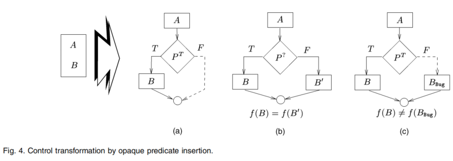
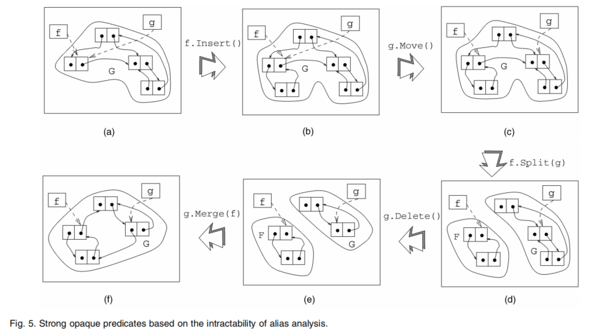

# 软件保护工具：水印、防篡改和混淆

> [Watermarking, Tamper-Proofing, and Obfuscation – Tools for Software Protection](https://ieeexplore.ieee.org/abstract/document/1027797)

## 文章概要

文章介绍了三种针对软件知识产权的攻击和相应的保护技术。使用混淆防御逆向工程，使用水印对抗软件盗版，使用防篡改技术抵抗未授权的修改。

### 背景：恶意客户端和恶意主机

现有的大多数计算机安全研究都致力于保护主机及其数据免受恶意客户端程序的攻击。在这些研究中，安全专家的工作是设计和管理计算机系统使其在大多数时候满足严格的安全要求。这种良性主机（benign-host）的世界观是 java 安全模型的基础，旨在保护主机免受潜在的恶意下载或已安装应用的攻击。为达到保护的目的，主机通常会限制允许应用程序执行的操作。在 java 安全模型中，主机使用字节码验证确保不可信客户端的类型安全。恶意主机对良性软件的攻击通常侵犯其知识产权，威胁客户端的完整性。

#### 恶意主机攻击

即 MATE (Man At The End) 攻击。

软件盗版，即非法复制并转卖应用程序，是困扰软件供应商的一大难题。早期的复制保护使得用户无法备份合法购买的软件或在丢失硬件设备（加密狗）后无法激活软件。我们的目标是使盗版更困难。在内部特权、价格歧视、合作大于版权的环境中，软件盗版被社会接受。

针对应用程序的逆向工程同样是软件知识产权的一大威胁。

对软件中加密密钥或其他信息的提取和篡改会给知识产权所有者带来重大损失。

#### 恶意主机攻击的防御手段

保护应用程序比保护主机难得多，保护主机免受恶意程序攻击，需要的只是限制允许客户端执行的操作。主机可以使用任何技术从客户端中提取敏感数据，或者以其他方式违反其完整性。唯一的限制就是主机分析客户端代码所需的计算资源。

对客户端代码的完全保护是无法实现的，但是可以实现一定程度的保护。软件水印、防篡改和混淆已成为软件保护的可行技术手段。混淆将程序转换为难以分析的等效程序。防篡改技术在检测到修改时使程序故障。软件水印在软件中插入版权标志以声明知识产权。软件指纹与水印类似，作用倾向于跟踪和起诉侵权者。

硬件辅助的软件保护已有大量实际研究和实现，如安全狗等。这些技术大多数都用于商业，本文不考虑基于硬件的软件保护技术。

我们从软件所有者的角度分析安全问题，因此假设所有主机都可能是恶意的。

### 混淆

代码混淆是目前抵抗逆向工程的最佳选择。

给定一个混淆变换集合 $\mathcal{T} = \{\mathcal{T_1}, \cdots, \mathcal{T_n}\}$ 和一个由源代码对象 $\mathcal{S} = \{\mathcal{S_1}, \cdots, \mathcal{S_k} \}$ 编译而成的程序 $\mathcal{P}$，找到一个新程序 $\mathcal{P'} = \{\cdots ,\mathcal{S'_j} = \mathcal{T_i(S_j)},\cdots \}$ 满足：

- $\mathcal{P'}$ 有与 $\mathcal{P}$ 相同的可观测行为，即转换是语义等价的。
- 最大限度地提高 $\mathcal{P'}$ 的模糊度，即理解和逆向分析 $\mathcal{P'}$ 耗时要严格地多余原程序 $\mathcal{P}$。
- 最大化每个变换 $\mathcal{T_i(S_j)}$ 的弹性，即构造自动化去混淆工具的难度和耗时都很大。
- 最大化每个变换 $\mathcal{T_i(S_j)}$ 的隐蔽性，即变换前后的统计性质相似。
- 最小化变换引入的时间和空间代价。

对程序进行逆向分析所需的时间上限是对其进行黑盒研究（研究程序输入输出关系）的时间加上应用已发现关系所需的时间。代码混淆的最终目的是构造 $\mathcal{P'}$，使得分析人员对其的白盒研究不会产生有用的信息。使得逆向分析 $\mathcal{P'}$ 的时间接近于时间上限。

#### 词法变换

Java 的字节码容易被反汇编，大多数的 Java 代码混淆工具只修改程序的词法结构。一般只是打乱标识符，这对逆向分析有一定影响，但是并不能避免得出正确的分析结果。

#### 控制变换

控制变换大多基于不透明谓词。如果谓词 $P$ 的结果在混淆时已知，而难以被去混淆器推断，那么 $P$ 是不透明谓词。$P^F(P^T)$  表示结果恒为 False(True) 的不透明谓词，$P^?$ 表示不确定结果的不透明谓词。根据不透明谓词构造混淆变换可以分解程序的控制流。

控制变换的弹性依赖于使用的不透明谓词的弹性。不透明谓词的开销和隐蔽性同样重要。大多数的去混淆器是静态分析，因此不透明谓词的构造应该建立在静态分析无法处理的问题上。特别是静态分析难以实现对指针结构和并行代码的精确分析。

下图给出了基于别名分析的困难性构造不透明谓词的例子。基本思想就是构造复杂的动态结构，下图的 a, b, c 可以构造 `if(f == g)` 的不确定谓词，经过划分操作后，可以构造 `if(f == g)` 的恒假谓词，经过合并后构造 `if(f == g)` 的不确定谓词。构造快速、精确的别名分析器是困难的。

#### 数据变换

对数据结构的变换，如变量的拆分，改变编码，存储方式。

#### 其他对抗逆向工程的技术

混淆定义为减缓或阻止逆向分析的操作。

- 对抗反汇编，例如将跳转位置的最后一个字节重用为下一指令的操作码。
- 反调试，针对特定调试器编写反调试代码。

### 水印

水印用于在产品中嵌入版权信息以保护知识产权。指纹跟水印类似，只不过在每个产品中嵌入的信息不同，检测软件盗版的同时还能追踪侵权者。

将结构 $W$ 嵌入到程序 $P$ 中使得：

- $W$ 可以从 $P$ 中定位并提取，即嵌入能抵抗去水印攻击。
- $W$ 很大，即嵌入具有较高的数据速率。
- 将 $W$ 嵌入到 $P$ 中不会对 $P$ 的性能产生不利影响，即嵌入的开销低。
- 将 $W$ 嵌入到 $P$ 不会改变 $P$ 的任何统计特性，即嵌入的隐蔽性。
- $W$ 有数学性质使得我们认为其在 $P$ 中的存在是人为的。

我们可能希望水印包含内部结构支持检测篡改，或者具有不可能偶然发生的特性，如大素数积。

水印的隐蔽性，静态和动态，静态分析没有差异以及程序执行没有差异。

