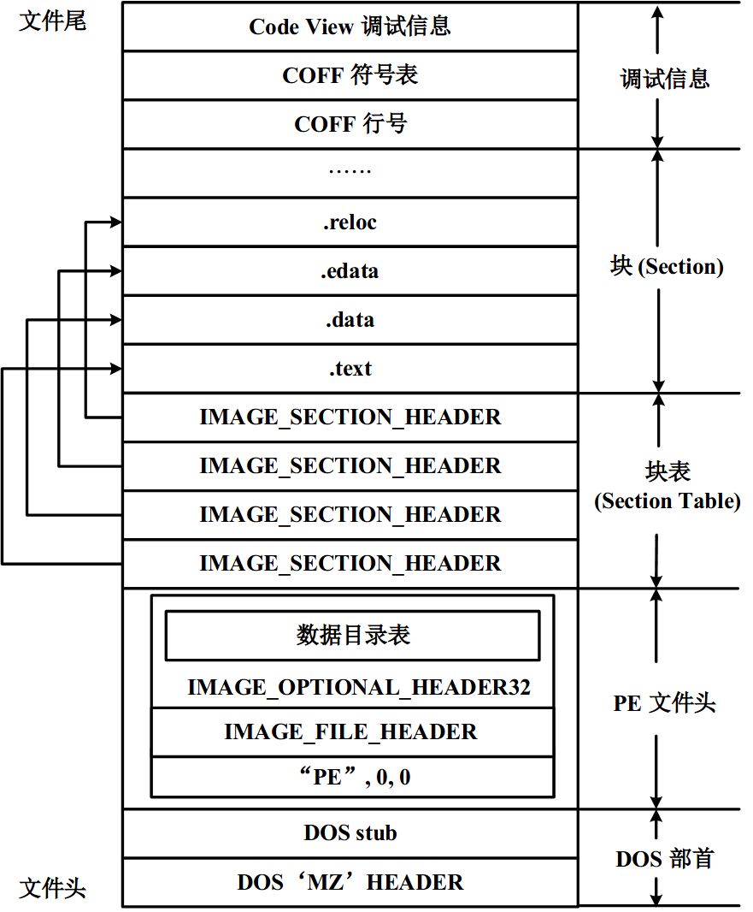
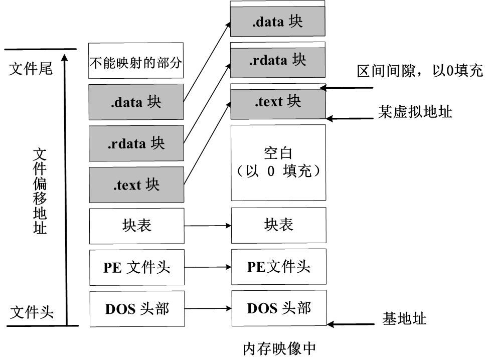

# PE 文件格式

## PE 简介

PE 是 Portable Executable File Format 的缩写，意为可移植的可执行文件。PE 格式是目前 Windows 平台上的主流的可执行文件格式，常见的 EXE、DLL 都是 PE 文件。PE 文件总体上由几个部分组成，以此为 MS-DOS 头部、PE 文件头、区块表、数据块。下图展示了 PE 文件的框架结构。



PE 文件内容被分割为不同的区块，区块中包含代码或数据，每个块都其在内存中的属性，如是否只读、是否可执行等。PE 文件通常需要加载到内存中才能执行，所以也称映像文件。Windows 加载器（即 PE 装载器）遍历 PE 文件并决定文件的哪一部分被映射到内存地址中。数据在磁盘和内存中的结构布局是一致的，但数据之间的相对位置可能会改变。下图展示了 PE 文件磁盘与内存映像结构的关系。



### 基本概念

- 基地址（ImageBase）即 PE 文件装入内存时的初始地址。默认情况下，EXE 文件的基地址是 400000h，而 DLL 文件是 10000000h。可以通过编译选项修改基地址。
- 相对虚拟地址（Relative Virtual Address，RVA）是映像文件虚拟内存中相对于基地址的偏移。
- 文件偏移地址（File Offset Address，FOA）是 PE 文件在磁盘文件中相对于文件开头的偏移。

前面提到，PE 文件的数据在磁盘和内存中的结构布局一致，即数据相对于其所在区块的相对偏移是固定的，由此可以实现 RVA 与 FOA 之间的转换，即 `RVA - 区块RVA = FOA - 区块FOA`。

## MS-DOS 头部

每个 PE 文件都是从一个 MS-DOS 头部开始的，包括 MZ header 和 DOS stub 两部分。

MZ header 对应的结构体 IMAGE_DOS_HEADER 定义如下：

```c++
typedef struct _IMAGE_DOS_HEADER {
    WORD e_magic;					// "MZ"
    WORD e_cblp;
    WORD e_cp;
    WORD e_crlc;
    WORD e_cparhdr;
    WORD e_minalloc;
    WORD e_maxalloc;
    WORD e_ss;
    WORD e_sp;
    WORD e_csum;
    WORD e_ip;						// DOS 代码入口 ip
    WORD e_cs;						// DOS 代码入口 cs
    WORD e_lfarlc;
    WORD e_ovno;
    WORD e_res[4];
    WORD e_oemid;
    WORD e_oeminfo;
    WORD e_res2[10];
    LONG e_lfanew;					// 指向 PE 文件头 "PE\0\0"
} IMAGE_DOS_HEADER, *PIMAGE_DOS_HEADER;
```

其中有两个重要成员：e_magic 单字，表示 DOS 签名，其值应为 5A4Dh，对应 ASCII 值为 ”MZ“。e_lfanew 字段占 4 字节，其值为真正的 PE 文件头 IMAGE_NT_HEADER 相对于文件起始处的偏移地址。PE 加载器通过此字段跳转到 PE 文件头解析。

MZ header 结构体后紧接着是 DOS stub，这其实是一个 DOS 环境下的可执行文件，用于处理系统兼容性问题。在 DOS 环境下输出 ”This program cannot be run in DOS mode“ 的错误提示并退出程序，表明该程序不能在 DOS 环境下运行。

## PE 文件头

紧跟在 DOS 头部后的是 PE 文件头，俗称 NT 头。PE 文件头对应的结构体 IMAGE_NT_HEADERS 结构体定义如下：

```c++
typedef struct _IMAGE_NT_HEADERS {
      DWORD Signature;								// +00h	PE 标识
      IMAGE_FILE_HEADER FileHeader;					// +04h	PE 标准头
      IMAGE_OPTIONAL_HEADER32 OptionalHeader;		// +18h	PE 可选头
    } IMAGE_NT_HEADERS32,*PIMAGE_NT_HEADERS32;
```

### PE Signature

PE 文件头的第一个成员是 Signature，它是一个 4 字节大小的 ASCII 码字符串 ”PE\0\0”，用以指明当前文件是一个 PE 格式的映像文件。其位置就是 IMAGE_DOS_HEADER 的 e_lfanew 字段。

### IMAGE_FILE_HEADER

IMAGE_FILE_HEADER 结构体即标准文件头，保存了 PE 文件的基本信息。其定义如下：

```c++
typedef struct _IMAGE_FILE_HEADER {
    WORD Machine;									// +04h	目标 CPU 类型
    WORD NumberOfSections;							// +06h	区块数目
    DWORD TimeDateStamp;							// +08h	时间戳
    DWORD PointerToSymbolTable;						// +0Ch	符号表偏移地址
    DWORD NumberOfSymbols;							// +10h	符号表符号数目
    WORD SizeOfOptionalHeader;						// +12h	可选头的大小
    WORD Characteristics;							// +14h	文件属性
} IMAGE_FILE_HEADER, *PIMAGE_FILE_HEADER;
```

依次解释每个字段：

- Machine ：PE 文件的目标 CPU 类型，一般有 `I386 : 14Ch; IA64 : 200h` 等。

- NumberOfSections ：文件中存在的区块数量。

- TimeDateStamp ：表示文件的创建时间，是自 1970 年 1 月 1 日 00:00 到文件创建经过的秒数。

- PointerToSymbolTable：符号表的文件偏移地址。

- NumberOfSymbols：如果有符号表，则表示符号表中的符号数量。

- SizeOfOptionalHeader：表示可选头的大小。32 位下默认为 00E0h，64 位下默认为 00F0h。

- Characteristics：标志文件属性，以按位或的方式组合。定义的文件属性标志及含义如下：

  ```c++
  #define IMAGE_FILE_RELOCS_STRIPPED 0x0001     	// 文件不存在重定位信息
  #define IMAGE_FILE_EXECUTABLE_IMAGE 0x0002    	// 文件可执行
  #define IMAGE_FILE_LINE_NUMS_STRIPPED 0x0004  	// 不存在行信息
  #define IMAGE_FILE_LOCAL_SYMS_STRIPPED 0x0008 	// 不存在符号信息
  #define IMAGE_FILE_AGGRESIVE_WS_TRIM 0x0010
  #define IMAGE_FILE_LARGE_ADDRESS_AWARE 0x0020 	// 应用可处理超过 2GB 地址
  #define IMAGE_FILE_BYTES_REVERSED_LO 0x0080   	// 处理机的低位字节相反
  #define IMAGE_FILE_32BIT_MACHINE 0x0100       	// 目标平台为 32 位
  #define IMAGE_FILE_DEBUG_STRIPPED 0x0200      	// 不存在调试信息
  #define IMAGE_FILE_REMOVABLE_RUN_FROM_SWAP 0x0400
  #define IMAGE_FILE_NET_RUN_FROM_SWAP 0x0800
  #define IMAGE_FILE_SYSTEM 0x1000            	// 系统文件
  #define IMAGE_FILE_DLL 0x2000               	// DLL 文件
  #define IMAGE_FILE_UP_SYSTEM_ONLY 0x4000    	// 只能运行在单处理器
  #define IMAGE_FILE_BYTES_REVERSED_HI 0x8000 	// 处理机的高位字节相反
  ```

### IMAGE_OPTIONAL_HEADER

IMAGE_OPTIONAL_HEADER 结构体称为可选文件头，虽是可选结构，但标准头结构不足以定义 PE 文件属性，因此可选头中定义了更多的数据。其定义如下：

```c++
typedef struct _IMAGE_OPTIONAL_HEADER {
    WORD Magic;										// +18h	标志字
    BYTE MajorLinkerVersion;						// +1Ah 链接器主版本号
    BYTE MinorLinkerVersion;						// +1Bh 链接器次版本号
    DWORD SizeOfCode;								// +1Ch 所有含有代码的区块大小
    DWORD SizeOfInitializedData;					// +20h 所有初始化数据区块的大小
    DWORD SizeOfUninitializedData;					// +24h 所有未初始化数据区块的大小
    DWORD AddressOfEntryPoint;						// +28h 程序执行入口 RVA
    DWORD BaseOfCode;								// +2Ch 代码区块起始 RVA
    DWORD BaseOfData;								// +30h 数据区块起始 RVA
    DWORD ImageBase;								// +34h 程序默认载入基地址
    DWORD SectionAlignment;							// +38h	内存中区块的对齐值
    DWORD FileAlignment;							// +3Ch 文件中区块的对齐值
    WORD MajorOperatingSystemVersion;				// +40h 操作系统主版本号
    WORD MinorOperatingSystemVersion;				// +42h 操作系统次版本号
    WORD MajorImageVersion;							// +44h 用户自定义主版本号
    WORD MinorImageVersion;							// +46h 用户自定义次版本号
    WORD MajorSubsystemVersion;						// +48h 所需子系统主版本号
    WORD MinorSubsystemVersion;						// +4Ah 所需子系统次版本号
    DWORD Win32VersionValue;						// +4Ch 保留，置 0
    DWORD SizeOfImage;								// +50h 内存中映像文件大小
    DWORD SizeOfHeaders;							// +54h MS-DOS头部、PE文件头、区块表总大小
    DWORD CheckSum;									// +58h 映像文件校验和
    WORD Subsystem;									// +5Ch	文件子系统
    WORD DllCharacteristics;						// +5Eh 映像文件的 DLL 属性
    DWORD SizeOfStackReserve;						// +60h 初始化时栈的大小
    DWORD SizeOfStackCommit;						// +64h 初始化时实际提交栈的大小
    DWORD SizeOfHeapReserve;						// +68h 初始化时保留堆的大小
    DWORD SizeOfHeapCommit;							// +6Ch 初始化时实际提交堆的大小
    DWORD LoaderFlags;								// +70h 调试相关，默认为 0
    DWORD NumberOfRvaAndSizes;						// +74h 数据目录表的项数
    IMAGE_DATA_DIRECTORY DataDirectory[IMAGE_NUMBEROF_DIRECTORY_ENTRIES];// +78h 数据目录表
} IMAGE_OPTIONAL_HEADER32, *PIMAGE_OPTIONAL_HEADER32;
```

下面解释几个重要字段：

- Magic：标志字，指明文件类型。0107h 表示 ROM 映像，010Bh 表示 PE32，020Bh 表示 PE32+，即 64 位。

- AddressOfEntryPoint：程序执行入口的相对偏移地址。对于可执行文件，这是启动地址；对于设备驱动，这是初始化函数的地址；对于 DLL 文件，入口点函数可选，不存在入口点则该字段置 0。

- ImageBase：文件在内存中的首选载入地址，其值必须为 64 KB 的整数倍。EXE 默认值是 400000h，DLL 默认值是 10000000h。当一个程序用到多个 DLL 文件时，PE 加载器会调整 DLL 的载入地址，使所有 DLL 文件能够正确载入。

- SectionAlignment：载入内存时的区块对齐大小，默认值与系统页大小相等。此值必须不小于 FileAlignment 成员的值。

- FileAlignment：磁盘上 PE 文件内的区块对齐大小，值必须是 512-64K 范围内的 2 的幂。

- SizeOfImage：映像文件在虚拟内存中所占的大小，值必须为 SectionAlignment 的整数倍。

- SizeOfHeader：MS-DOS 头部、PE 文件头和区块表的总大小按照 FileAlignment 对齐后的值。也是第一个区块的文件偏移地址。

- NumbersOfRvaAndSizes：数据目录表的项数，通常是 16 个。

- DataDirectory[16]：数据目录表，由 IMAGE_DATA_DIRECTORY 结构体组成的数组，保存了导入表、导出表、资源块等数据。结构体定义如下：

  ```c++
  typedef struct _IMAGE_DATA_DIRECTORY {
      DWORD VirtualAddress;						// 数据目录的 RVA
      DWORD Size;									// 数据目录长度
  } IMAGE_DATA_DIRECTORY, *PIMAGE_DATA_DIRECTORY;
  ```

  数组各项如下：

  ```c++
  #define IMAGE_DIRECTORY_ENTRY_EXPORT 0			// 导出表
  #define IMAGE_DIRECTORY_ENTRY_IMPORT 1			// 导入表
  #define IMAGE_DIRECTORY_ENTRY_RESOURCE 2		// 资源表
  #define IMAGE_DIRECTORY_ENTRY_EXCEPTION 3		// 异常表
  #define IMAGE_DIRECTORY_ENTRY_SECURITY 4		// 安全表
  #define IMAGE_DIRECTORY_ENTRY_BASERELOC 5		// 基址重定位表
  #define IMAGE_DIRECTORY_ENTRY_DEBUG 6			// 调试信息
  #define IMAGE_DIRECTORY_ENTRY_ARCHITECTURE 7	// 指定架构信息
  #define IMAGE_DIRECTORY_ENTRY_GLOBALPTR 8		// 全局指针
  #define IMAGE_DIRECTORY_ENTRY_TLS 9				// 线程私有存储表
  #define IMAGE_DIRECTORY_ENTRY_LOAD_CONFIG 10	// 加载配置表
  #define IMAGE_DIRECTORY_ENTRY_BOUND_IMPORT 11	// 绑定导入表
  #define IMAGE_DIRECTORY_ENTRY_IAT 12			// 导入地址表
  #define IMAGE_DIRECTORY_ENTRY_DELAY_IMPORT 13	// 延迟导入描述符
  #define IMAGE_DIRECTORY_ENTRY_COM_DESCRIPTOR 14	// COM 描述
  ```

## PE 数据主体

PE 数据主体包括区块表和所有的区块。

### 区块表

紧跟在可选文件头之后的是区块表，是 IMAGE_SECTION_HEADER 结构体的数组，每项包含了对应区块的信息，数组的项数由标准文件头中的 NumberOfSections 字段指定。IMAGE_SECTION_HEADER 结构体定义如下：

```c++
typedef struct _IMAGE_SECTION_HEADER {
    BYTE Name[IMAGE_SIZEOF_SHORT_NAME];				// 区块名
    union {
        DWORD PhysicalAddress;						// 物理地址
        DWORD VirtualSize;							// 虚拟内存中的区块大小
    } Misc;
    DWORD VirtualAddress;							// 区块的 RVA
    DWORD SizeOfRawData;							// 磁盘文件中区块大小
    DWORD PointerToRawData;							// 区块的 FOA
    DWORD PointerToRelocations;						// 重定位表的偏移
    DWORD PointerToLinenumbers;						// 行号表的偏移
    WORD NumberOfRelocations;						// 重定位表项数目
    WORD NumberOfLinenumbers;						// 行号表项数目
    DWORD Characteristics;							// 区块属性
} IMAGE_SECTION_HEADER, *PIMAGE_SECTION_HEADER;
```

主要的字段解释：

- Name：区块名最长 8 位 ASCII 字符串。

- PhysicalAddress：指出实际被使用的区块大小。

- VirtualAddress：内存中区块的 RVA。

- Characteristics：区块属性，以按位或的方式组合，常用标志位的含义如下：

  ```c++
  #define IMAGE_SCN_CNT_CODE                0x00000020  // 包含代码
  #define IMAGE_SCN_CNT_INITIALIZED_DATA    0x00000040  // 包含已初始化数据
  #define IMAGE_SCN_CNT_UNINITIALIZED_DATA  0x00000080  // 包含未初始化数据
  #define IMAGE_SCN_LNK_NRELOC_OVFL         0x01000000  // 包含扩展的重定位项
  #define IMAGE_SCN_MEM_DISCARDABLE         0x02000000  // 区块可被丢弃 .reloc 在载入后丢弃
  #define IMAGE_SCN_MEM_SHARED              0x10000000  // 区块可共享给不同进程
  #define IMAGE_SCN_MEM_EXECUTE             0x20000000  // 区块可作为代码执行
  #define IMAGE_SCN_MEM_READ                0x40000000  // 区块可读
  #define IMAGE_SCN_MEM_WRITE               0x80000000  // 区块可写
  ```

### 区块

在区块表后面就是各个区块，PE 文件一般至少有两个区块，即代码块和数据块。下面介绍以下常见的区块用途：

| 区块名 | 描述                                                         |
| ------ | ------------------------------------------------------------ |
| .text  | 默认的代码区块，保存可执行代码。                             |
| .data  | 默认的读/写数据区块。用于保存已初始化的全局变量、静态变量。  |
| .rdata | 默认的只读数据区块。                                         |
| .idata | 保存导入表信息。包含 IAT，INT，导入函数名以及导入 DLL 名等。 |
| .edata | 保存导出表信息。                                             |
| .rsrc  | 保存资源表信息。                                             |
| .bss   | 保存未初始化数据。                                           |
| .tls   | 保存线程局部存储信息。                                       |
| .reloc | 保存重定位表信息。一般只是 DLL 需要。                        |

