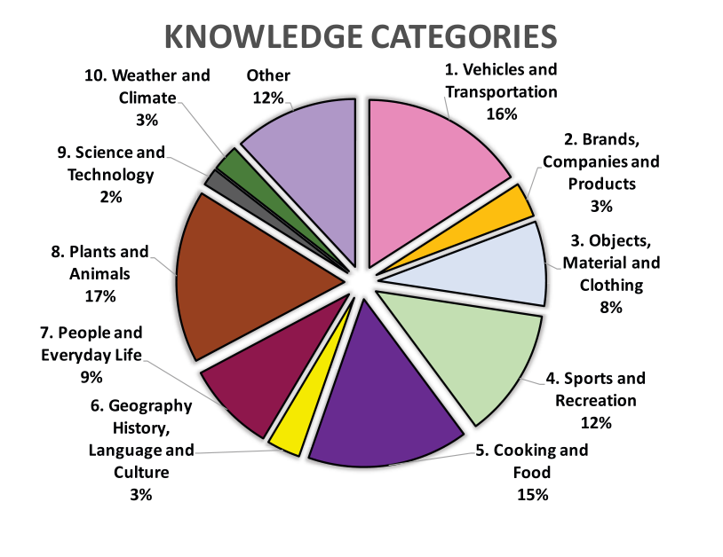
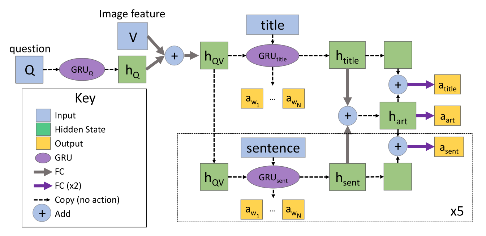

### 深度学习 作业1

**OK-VQA: A Visual Question Answering Benchmark Requiring External Knowledge 阅读报告**

#### 本文研究问题

理想形式的视觉问答（VQA）是在视觉和语言的联合空间中学习推理，并进行场景理解。这不仅需要视觉识别，还要求包含逻辑推理和知识整合。然而现有的数据集往往主要针对识别，大多数问题与简单地计数、颜色以及其他视觉检测任务相关，并没有涉及逻辑推理或者联系外部知识。理想情况下，回答较难问题所需的知识远不止问题本身和图像包含的内容。

文章给出了一个[例子](#figure_1)，给出一张泰迪熊的照片，问此照片与哪位美国总统有关，仅从图像分析无法回答问题，但如果把图像内容链接到外部资源，如维基百科，就有足够的信息回答问题。

#### 本文主要贡献

- 针对现有的 VQA 数据集存在的问题，设计了一个需要外部知识来回答问题的新数据集 OK-VQA。
- 在 OK-VQA 数据集上对一些最先进的 VQA 模型进行测试，结果表明这些模型的性能急剧下降，效果较差。
- 提出了 ArticleNet 模型，用于处理非结构化数据辅助回答问题。

#### 本文工作

现有的一些工作已经开始研究在 VQA 中引入外部知识的方法，将知识库和检索方法合并到 VQA 数据集中。本文的工作在此基础上又前进一步，设计了一个需要使用非结构化知识进行推理的 VQA 数据集，称为外部知识 VQA（Outside Knowledge VQA, OK-VQA），此数据集的所有问题都需要外部资源来回答。在 OK-VQA 数据集上，可以评估在仅通过图像无法获得答案的情况下模型的推理能力。OK-VQA 数据集是多样的、困难的，且是目前为止最大的针对自然场景中基于知识的 VQA 数据集。

##### OK-VQA 数据集

作者认为现有的 VQA 数据集中不需要太多知识就能回答大多数问题，因为这些问题并未测试模型从图像外部获取信息的能力。为了证明这点，作者在 MTurk 上为 VQA 数据集中的 10000 个问题做了一个“年龄标注”，也就是对于每个问题，让 MTurk 工人标注回答这个问题需要多大年龄，以此近似度量问题的难度。分析表明，10 岁以下的人可以回答超过 78% 的问题，这表明现有的 VQA 数据集的大多数问题只需要很少的背景知识。

既然现有的 VQA 数据集无法测试从图像外部知识来源获取信息的能力，就需要构造一个新的数据集。使用 COCO 数据集的随机图像，第一轮标记中，要求 MTurk 工人根据图像给出一个问题，最好能欺骗智能机器人，要求问题与图像内容有关而又需要一些外部知识来回答。第二轮标记中，要求 5 个不同的工人在每个问题-图像对上标记答案。之后手动过滤，只保留需要外部知识的问题。从 86,700 个问题中筛选出 34,921 个问题。然后又进一步考虑数据集的潜在偏差，比如在提问是否存在的问题中很大部分答案偏向于“是”。因此进一步过滤，删除相同答案出现超过 5 次以上的问题，以及标注者之间未达成共识的问题，最终留下了 14,055 个问题。

##### 数据集统计属性

知识需要分类，所以在 MTurk 上把数据集中每个问题由 5 个不同工人标注为指定的十个知识类别，如果没有多数类别，则标注为其他。这样就得到了互斥的类别标签和[问题分布](#figure_3)。与其他的 VQA 数据集比较，比同样基于外部知识 KB-VQA 和 FVQA 包含了更多的问题，而与标准数据集 VQAv2 相比问题较少，主要是因为 OK-VQA 数据集收集的更耗时且昂贵，因此做了权衡没有追求更多数量。

同时对数据集中的问题做了统计。OK-VQA 总计 14,055 个问题，有 12,591 个不重复的问题，保证了问题的多样性。并对数据集中的图像使用 Places2 分析场景，结果表明数据集中的图像涵盖了 COCO 数据集 365 个场景中的 360 个场景（只有 5 类在 COCO 中很少出现的场景没有包含），保证图像的覆盖广度和合理分布。

##### 基准测试

在 OK-VQA 数据集上评估了 MUTAN、BAN、MLP 和仅使用问题特征的 MLP Q-Only 几种模型。同时提供了一个简单的基于知识的 baseline，称为 [ArticleNet](#articlenet)，它从维基百科检索问题-图像对相关的文章，然后训练网络在检索到的文章中找答案。检索分三步：首先从问题-图像对收集关键词，组成可能的查询；然后使用维基百科的 API 检索，获取每个关键词排名最高的文章；最后根据关键词出现的频率在文章中提取与问题最相关的句子作为检索的答案。检索到句子后，对它们进行过滤和编码，供 VQA 模型使用。训练 ArticleNet 来预测答案在文章和句子中是否出现以及何处出现。最后测试了 OK-VQA 数据集上各个 VQA 模型单独得分和与 ArticleNet 结合后的结果。

[结果](#table_2)表明，因为这些模型都没有结合图像外部信息，因此相比标准 VQA 数据集上的模型效果急剧下降。而尽管原始 ArticleNet 的性能很差，但是它为 VQA 模型提供了补充信息，与 MUTAN 和 BAN 等模型结合使用后性能有所提高。同时视觉特征消融实验的结果表明，OK-VQA 数据集确实是基于视觉识别的，但是单纯地添加视觉特征（从 ResNet50 到 ResNet152）并不能较大改善结果。对 MUTAN 进行规模消融实验，得出 VQA 得分与数据集规模成正相关。

读完这篇文章，我能觉得本文提出的这个新的数据集相当于给 VQA 这个领域带来新的挑战。我认为本文引入 KO-VQA 数据集的理由很充分，一个好的 VQA 系统确实需要不仅从给定的问题和图像本身获取信息，还要能整合外部信息。引入 ArticleNet 来辅助现有的 VQA 系统工作，优点是可以单独训练 ArticleNet，不需要和 VQA 模型一起训练。但是文章里 ArticleNet 的数据来源只是维基百科，后续应该可以通过扩充数据来源检索现实世界中更多符合条件的数据来辅助 VQA 系统作答。

