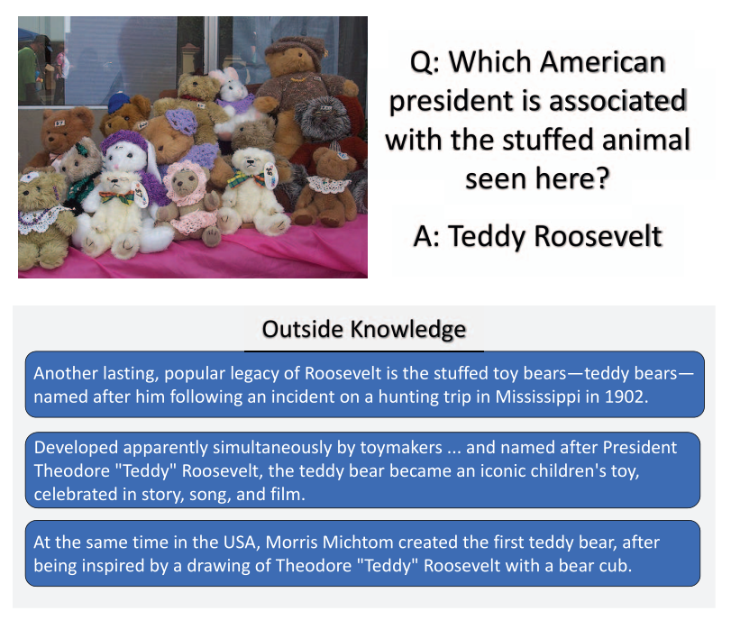
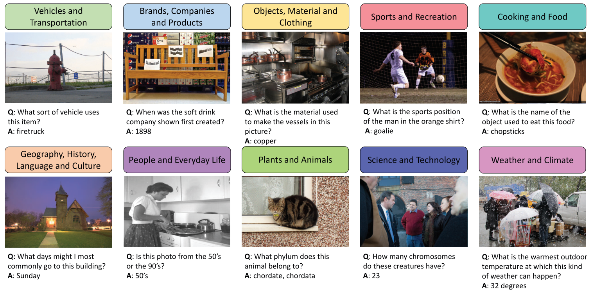
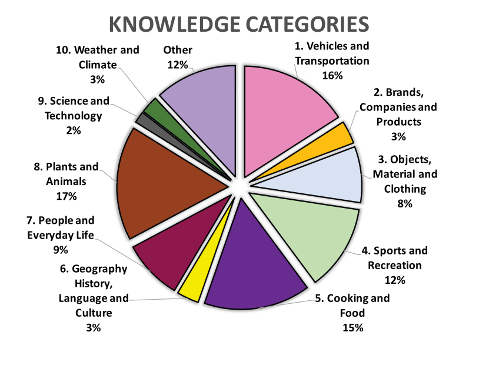
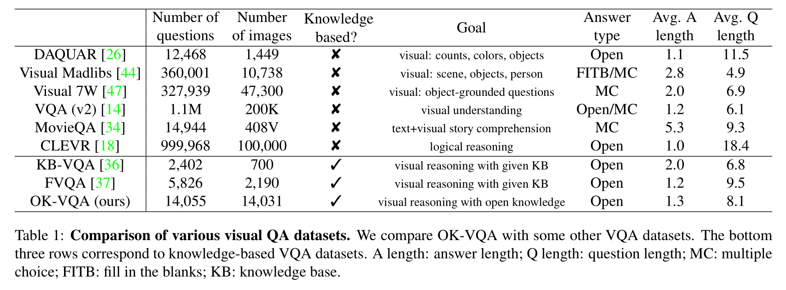
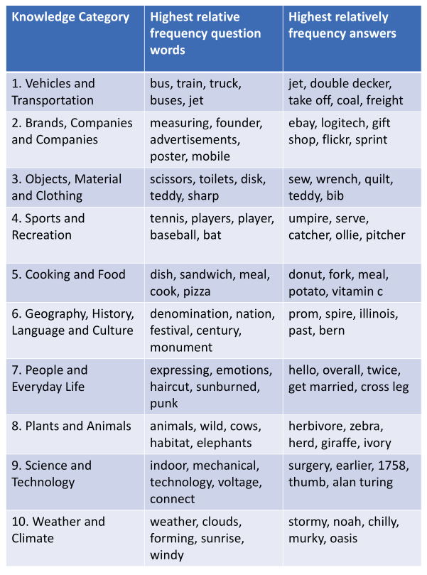
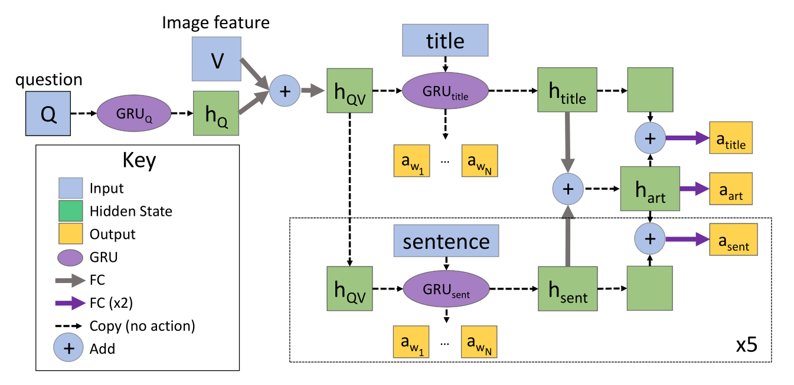
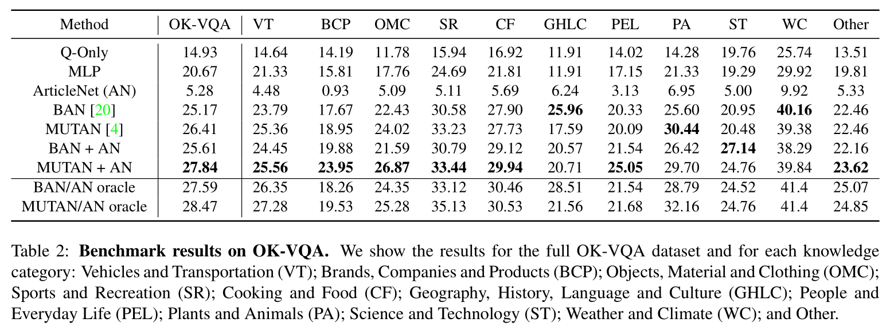
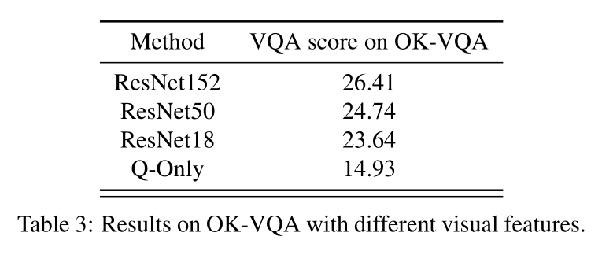
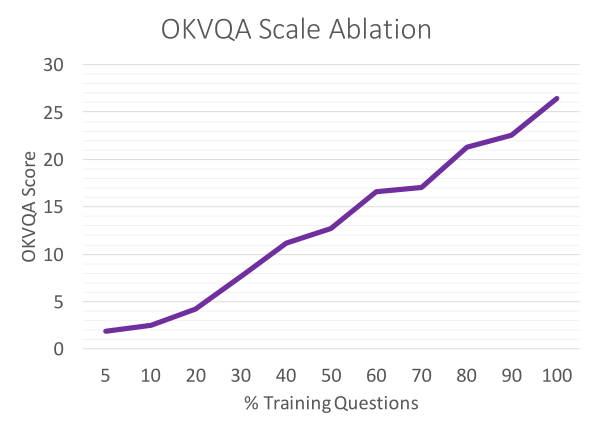
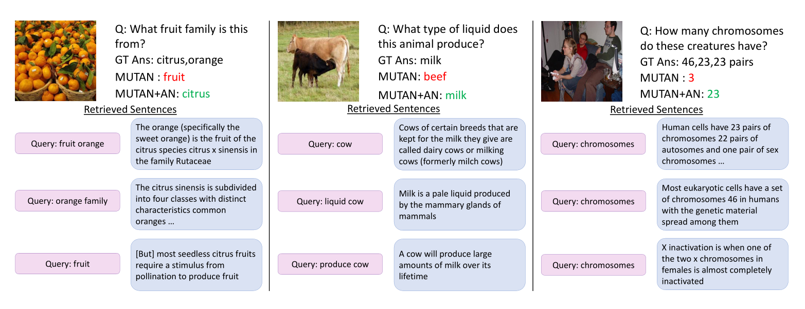

### 
深度学习 作业1

> - We will provide some research topics and corresponding paper lists,
>   each student need to choose one paper and submit a reading report no
>   more than 2 pages.
> - You can choose a paper in the lists provided, or any other topic that you
>   are interested in (need to submit the detailed information of the paper
>   you choose, e.g., BibTex format).
> - You should briefly explain the problem the paper is working on, their
>   major contributions and the proposed solutions.
> - Your own understanding of the contributions and the unsolved problems
>   of the paper are welcomed in the report.
>
> 选择一篇论文，提交不超过两页的阅读报告。
>
> 简要说明文章研究的问题，其主要贡献和提出的解决方案。
>
> 你自己对贡献和未解决问题的理解。

选择的文章是列表中给出的 `OK-VQA: A Visual Question Answering Benchmark Requiring External Knowledge`

## 摘要

理想形式的视觉问题解答（VQA）使我们可以在视觉和语言的联合空间中研究推理，并可以作为场景理解的AI任务的代理。 但是，迄今为止，大多数VQA基准测试都集中在诸如简单计数，视觉属性和对象检测之类的问题上，这些问题不需要图像中的任何推理或知识即可。 在本文中，我们解决了基于知识的视觉问题解答的任务，并提供了一个称为OK-VQA的基准，该基准中的图像内容不足以回答问题，因此鼓励了依赖于外部知识资源的方法。我们的新数据集包括14,000多个需要外部知识回答的问题。 我们表明，在这种新设置下，最新的VQA模型的性能急剧下降。 我们的分析表明，与以前的基于知识的VQA数据集相比，基于知识的VQA任务是多种多样，困难且庞大的。 我们希望该数据集能够使研究人员为该领域的研究开辟新的途径。

## 引言

近年来，视觉问题解答（VQA）领域取得了惊人的进步，在标准VQA数据集上取得了创纪录的数字[20、4、11、17]。 正如最初的设想，VQA不仅是视觉和语言研究的沃土，而且还是评估AI模型以实现开放式场景理解任务的代理。 以其理想的形式，VQA不仅需要视觉识别，还需要逻辑推理并结合有关世界的知识。 但是，当前的VQA数据集（例如[3，47]）主要关注识别，并且大多数问题都与简单的计数，颜色和其他视觉检测任务有关，因此不需要太多的逻辑推理或与外部知识的关联。 理想情况下，最困难和最有趣的问题需要了解的知识远不止问题所包含的内容或图像中包含的信息。

考虑图1中的问题，该问题询问泰迪熊和美国总统之间的关系。此处图像中的信息并不完整，无法回答问题。 我们需要将图像内容链接到外部知识资源，例如来自Wikipedia的图片底部的句子。 给定问题，图像和Wikipedia句子，现在有足够的信息来回答问题：Teddy Roosevelt！

> 图1：我们提出了一个新颖的可视化问题回答数据集，其中问题需要外部知识资源来回答。 在此示例中，图像的视觉内容不足以回答问题。 一系列有关泰迪熊的事实使泰迪熊与美国总统之间具有联系，这可以回答这个问题。

最近的研究已经开始研究如何将基于知识的方法纳入VQA [29，30，36，37]。 这些方法已经研究了将知识库和检索方法合并到VQA数据集中，并为每个问题提供了一组相关的事实。 在这项工作中，我们前进了一步，设计了一个VQA数据集，该数据集要求VQA使用非结构化知识执行推理。

为了使研究朝着这个令人兴奋的方向发展，我们引入了一个名为“外部知识VQA”（OK-VQA）的新颖数据集，其中仅包含需要外部资源来回答这些问题的问题。 在我们的数据集上，我们可以开始评估在仅通过查看图像就无法获得答案的情况下模型的推理能力。 回答OK-VQA问题是一项具有挑战性的任务，因为除了理解问题和图像之外，该模型还需要：（1）了解回答问题所需的知识，（2）确定要检索的查询内容 来自外部知识源的必要知识，以及（3）结合其原始表示形式的知识来回答问题。

OK-VQA数据集包含14,000多个问题，涵盖了各种知识类别，例如科学技术，历史和体育。 我们提供数据集的类别明细以及其他相关统计信息，以检查其属性。 我们还分析了最新模型，并显示了在新数据集上它们的性能下降。 此外，我们提供了一组基于简单知识检索的基线方法的结果。 我们的数据集是多样的，困难的，并且是迄今为止最大的VQA数据集，主要关注自然图像中基于知识的VQA。

我们的贡献是：（a）介绍OK-VQA数据集，其中仅包含需要外部资源回答的问题；  （b）我们在新的数据集上对一些最新的VQA模型进行了基准测试，结果表明这些模型的性能急剧下降；  （c）我们提出了一组利用非结构化知识的基准。

## 相关工作

**视觉问答（VQA）。** 在过去的几年中，视觉问题解答（VQA）一直是计算机视觉社区中最受欢迎的主题之一。VQA的早期方法是将递归网络与CNN结合起来以整合文本和视觉数据[27，1]。基于注意力的模型[11、25、39、40、41、47]通过突出显示与问题相关的图像区域，可以更好地指导模型回答问题。 模块化网络[2、15、19]利用了深度神经网络中语言的组成特性。 这些方法也已经扩展到视频领域[16、28、35]。 最近，[13，9]解决了交互式环境中的问题回答问题。 但是，这些方法都不是为利用外部知识而设计的，因此它们无法处理图像不能代表完整知识来回答问题的情况。

[38，36，37，23，30，29]解决了使用外部知识来回答问题的问题。这些方法仅处理由主题关系对象或视觉概念关系属性三元组表示的知识，并且依靠监督来进行事实的检索。 相反，在我们的数据集中回答问题需要处理非结构化的知识资源。

**VQA数据集。** 在过去的几年中，已经提出了一些用于视觉问题回答的数据集[26、3、12、44、31、47、34、21、18、37]。  DAQUAR数据集[26]包括一组室内场景的基于模板的问题和自然问题。  [3]提出了VQA数据集，该数据集比DAQUAR大两个数量级，并且包含更多种类的图像和较少受约束的答案。  FM-IQA [12]是另一个包含多语言问题和答案的数据集。  Visual Madlibs [44]，构造用于自然语言描述的空白模板。COCO-QA [31]是通过将图像描述转换为问题而自动构建的。  Visual 7W [47]的想法是为问题-答案对提供对象级别的基础，而不是图像和QA对之间的图像级别的关联。Visual Genome [21]为图像区域，属性，关系等提供密集注释，并为每个图像提供自由格式和基于区域的QA对。  MovieQA [34]是基于电影的QA数据集，其中QA基于视频剪辑，字幕，脚本等中的信息。CLEVR[18]是主要针对视觉推理能力的合成VQA数据集。 与所有这些数据集相反，我们关注的问题是相关图像中的信息无法回答，并且需要外部知识来回答。

与我们的数据集最相似的是FVQA [37]。 虽然这项工作还解决了创建需要外部知识的VQA数据集的难题，但他们的方法是通过从固定的知识库中选择一个事实（例如“狗是哺乳动物”等知识三元组）来注释问题。 为了测试方法将知识库整合到VQA系统中的能力，我们的数据集测试了方法从网络，数据库或其他未用于创建问题的知识源中检索相关事实的能力。另一个问题是三元组不足以代表常识。

**建立知识库和基于知识的推理。** 使用视觉数据或视觉推理任务已经创建了多个知识库[46、8、10、32、49、48]。这些知识库是回答我们数据集中问题的潜在有用资源。 在NLP社区中，基于知识的问题解答受到了更多关注（例如[5、43、42、6、33、22、7]）。

## OK-VQA 数据集

在本节中，我们解释了如何收集可更好地衡量需要外部知识的VQA系统性能的数据集。诸如[3，14]之类的常见VQA数据集不需要太多知识就能回答绝大多数问题。 该数据集主要包含诸如“那里有多少个苹果？”，“这是什么动物？”和“碗是什么颜色？”之类的问题。 尽管这些对于开放式视觉识别来说是完全合理的任务，但它们并未测试我们算法推理场景或从图像外部获取信息的能力。 因此，为了将视觉识别与从图像外部来源提取信息相结合的目标，我们将无法评估基于知识的系统，因为大多数问题都不需要外部知识。

为了具体说明这一点，我们检查了VQA数据集中为10,000个问题提供的“年龄注释” [1]。 对于每个问题和图像对，一个MTurk工作人员被问及要回答这个问题需要多大的年龄。 尽管这不是一个完美的度量标准，但它可以合理地近似于问题的难度以及一个人必须知道多少知识才能回答问题。 分析表明，年龄在10岁以下的人可以回答超过78％的问题。 这表明回答这些问题中的绝大多数实际上只需要很少的背景知识。

鉴于当前的VQA数据集无法准确测试我们要寻找的内容，因此我们收集了一个新的数据集。 我们使用来自COCO数据集[24]的随机图像，对训练和测试分割使用原始的80k-40k训练和验证分割。 与其他数据集相比，这些图像的视觉复杂性使其非常适合标记基于知识的问题。

在第一轮贴标中，我们要求MTurk工人根据图像写一个问题。 与[3]相似，我们提示用户提出问题来愚弄“智能机器人”。 我们还在说明中要求该问题应与图像内容有关。 另外，我们提示用户不要问图像中有什么或图像中有多少，并指定该问题需要一些外部知识。 在第二轮标记中，我们要求5个不同的MTurk工作人员在每个问题图像对上标记一个答案。

尽管此提示产生了许多高质量的问题，但也产生了许多低质量的问题，例如，提出基本问题（例如计数），不需要查看图像或无意义的问题。为了确保数据集询问了这些困难的知识需求问题，MTurk提供的问题被手动过滤以仅获取需要知识的问题。 从总共86,700个问题中，我们筛选出34,921个问题。

要考虑的另一个因素是数据集中的潜在偏差。 正如包括[14]在内的许多著作中所讨论的那样，VQAv1数据集存在很多偏差。 著名的是，以“是否存在...”开头的问题对“是”的偏见非常强烈。 同样，在我们未经过滤的数据集中，有很多问题偏向某些答案。 例如，在很多有降雪的图像中，问题会问“这是什么季节？” 尽管还有其他图像（例如落叶树种有多色叶子的图像）有不同的答案，但对于“冬天”存在明显的偏见。 为了缓解这个问题，为了进行培训和测试，我们删除了问题，以使答案分布均匀； 具体来说，我们删除了该答案是否有5个以上作为最常见答案的问题。 这样可以消除很多答案偏差。 通过限制VQA算法看到具有特定答案的问题的次数，它还具有使数据集更难的作用，从而使外部信息更加重要。 我们还删除了在注释者之间未达成共识的问题。 执行此过滤后，我们在训练中减少了9,009个问题，在测试中减少了5,046个问题，总共减少了14,055个问题。

图2显示了从我们的数据集中收集的一些问题，图像和答案。 补充材料中将提供更多内容。 您可以看到这些问题至少需要一项背景知识才能回答。 例如，在左下角的问题中，系统需要识别出该图像是基督教教堂的，并知道这些教堂在星期日举行宗教仪式。 后者的知识应从外部知识资源中获取，而不能仅从图像和问题中推断出来。

> 图2：数据集示例。 已经显示了一些示例问题及其相应的图像和答案。 我们为每个知识类别显示一个示例问题。

## 数据集统计

在本节中，我们将探索数据集的统计属性，并将其与其他视觉问题回答数据集进行比较，以表明我们的数据集是多样的，困难的，并且就我们所知，最大的VQA数据集专门针对基于知识的 自然场景上的VQA。

**知识类别。** 要求VQA的知识是一个好的开始，但是人类对世界的了解有很多不同类型。有一个常识性知识：水很湿，客厅里有沙发。 有地理知识：艾菲尔铁塔在巴黎，科学知识：人类有23条染色体，历史知识：乔治华盛顿是美国第一任总统。 为了更好地理解我们的数据集所需的知识种类，我们要求五名MTurk工作人员将每个问题都注释为属于我们指定的十个知识类别之一：车辆和运输； 品牌，公司和产品； 物品，材料和衣物； 体育与休闲； 烹饪和食物； 地理，历史，语言和文化； 人与日常生活，动植物 科学和技术; 以及天气和气候。 如果没有一个类别有多个工人，则将其归类为“其他”，这也确保了最终类别标签是互斥的，我们在图3中显示了各个类别中问题的分布。

> 图3：按知识类别分类的问题。 我们展示了属于我们10个知识类别的问题所占的百分比。

**与其他VQA数据集的比较。** 在表1中，我们查看了许多其他视觉问题回答数据集，并以多种不同方式将它们与我们的数据集进行了比较。在顶部，我们看了一些数据集，它们没有明确尝试包括一个知识组件，包括无处不在的VQAv2数据集[14]，其第一个版本是调查视觉问题解答的首批数据集之一。 与这些数据集相比，我们拥有与DAQUAR [26]和MovieQA [34]相当数量的问题，并且比基于知识的数据集KB-VQA [36]和FVQA [37]更多的问题。与自动生成图像，问题和答案的CLEVR [18]相比，与更少的问题相比，与更大规模的人类注释视觉数据集（例如VQAv2 [14]和Visual Madlibs [44]）相比，我们的问题更少。 由于我们手动过滤了数据集以避免其他数据集的陷阱并确保我们的问题是基于知识的，并且因为我们过滤了常见答案以强调答案的长尾巴，所以我们的数据集收集起来更加耗时且昂贵。 在这种情况下，我们会权衡大小以获取知识和难度。

> 表1：各种视觉质量检查数据集的比较。 我们将OK-VQA与其他一些VQA数据集进行了比较。 底部的三行对应于基于知识的VQA数据集。 长度：答案长度；  Q长度：问题长度；  MC：选择题；  FITB：填空；  KB：知识库。

从平均问题长度和平均答案长度可以看出，我们的问题和答案与KB-VQA [36]和FVQA [37]大致相当，并且比其他VQA数据集更长，但DAQUAR和CLEVR除外（部分是 并分别从模板完全自动化）。 这是有道理的，因为我们希望基于知识的问题会更长，因为基于知识的问题通常不会像其他数据集中的常见问题那么短，例如“图像中有多少个对象？” 或“沙发是什么颜色？”。

**问题统计。** 我们还通过查看问题的数量以及每个知识类别中最常出现的问题，为我们的数据集收集了统计数据。  OK-VQA在总共14,055个问题中有12,591个独特问题，以及7,178个独特问题词。 这表明我们在数据集中得到了各种不同的问题和答案。我们还查看了数据集中的各种图像。 如前所述，我们的图像来自COCO图像数据集，因此我们的数据集包含相同的图像基本分布。 但是，我们仅使用COCO图像的一个子集，因此我们想看看是否仍能获得广泛的图像分布。 为此，我们在图像上运行了Places2 [45]分类器，并查看了每个图像的前1个场景类别，并将其与COCO总体进行了比较。 在365个场景中，我们的数据集包含除5类之外的所有类：狩猎小屋，大厦，电影院，废墟和火山。 这些类很少出现在整个COCO数据集中（分别为10、22、28、37和25次），因此总的来说，我们仍然捕获了很多场景变化。

最后，我们在图4中显示每个类别中最“独特”的疑问词和答案，以更好地了解我们在每个类别中都有哪些类型的问题。我们通过查看类别中出现的次数相对于数据集中总数的出现次数来计算这些知识类别，以查看哪些疑问词和答案在其类别中具有最高的相对频率。 在查看疑问词时，我们会看到特定于类别的单词，例如“车辆和运输工具”中的“巴士”，“烹饪和食物”中的“三明治”以及“天气和气候”中的“云”。 我们还看到答案也与每个类别都极为相关，例如动植物中的草食动物以及运动与休闲中的裁判。 在补充材料中，我们还显示了最常见的疑问词和答案。

> 图4：对于每个类别，我们显示在我们的知识类别中具有最高相对频率的疑问词和答案（即类别中的频率除以总体频率）。

## Benchmarking

在本节中，我们评估当前最新的VQA方法，并提供一些基准的结果，包括基于知识的基准。

MUTAN [4]：多峰Tucker融合（MUTAN）模型[4]，这是一种基于最新的基于张量的VQA方法。 具体来说，我们使用MUTAN的关注版本，并选择参数以匹配[4]的单个最佳性能模型。

BAN [20]：用于VQA的双线性注意力网络。 一种最新的VQA方法，该方法在图像的问题特征和自下而上检测特征之间使用共同注意机制。 我们修改了一些超参数以提高数据集的性能（请参阅补充材料）。

MLP：MLP具有3个具有ReLU激活的隐藏层，并且隐藏大小2048在每个完全连接的层之后经过跳过GRU之后将图像和问题特征连接起来。 像MUTAN一样，它使用ResNet-152的fc7功能。

Q-Only：与MLP相同的模型，但仅具有问题功能。

ArticleNet（AN）：我们考虑了一个简单的基于知识的基线，我们将其称为ArticleNet。 这个想法是从Wikipedia中为每个问题图像对检索一些文章，然后训练网络以在检索到的文章中找到答案

检索文章包括三个步骤。 首先，我们为每个问题图像对收集可能的搜索查询。通过组合问题中的单词和由预训练图像和场景分类器识别的单词，我们为每个问题提出了所有可能的查询。 其次，我们使用Wikipedia搜索API来获取每个查询的检索次数最多的文章。 第三，对于每个查询和文章，我们通过根据句子中那些查询词的频率选择与查询最相关的文章中的句子，来提取与查询最相关的每个文章的一小部分。

一旦检索到句子，下一步就是对它们进行过滤和编码，以供在VQA中使用。 具体来说，我们训练ArticleNet来预测基本真理答案在文章和每个句子中是否出现以及在何处出现。 该体系结构如图5所示。要找到问题的答案，我们在检索到的句子中选择得分最高的单词。 更具体地说，我们采用awi.asent的最大值，其中awi是作为答案的单词的分数，而asent是包括答案的句子的分数。

有关ArticleNet的更详细说明，请参见补充材料。

> 图5：ArticleNet架构。  ArticleNet接受问题Q和视觉特征V。 虚线框中的所有模块均具有权重。  GRU的输出用于将每个单词分类为答案或不知道。 最终的GRU隐藏状态htitle和hsent被放置在完全连接的层中，以预测答案是否在句子asent或标题标题中，然后将它们组合在一起，并用于对答案是否在文章中进行分类。

MUTAN + AN：我们用ArticleNet（AN）的最上面的句子隐藏状态（图5中不存在）来扩充MUTAN。 在VQA培训和测试过程中，我们采用最高预测的句子（忽略重复的句子），并将其输入到端到端存储网络的内存中[33]。存储器网络的输出与第一MUTAN融合层的输出串联在一起。

BAN + AN：同样，我们将ArticleNet隐藏状态合并到BAN中，并通过另一个内存网络将其合并到VQA管道中。 在最终分类网络之前，我们将存储网络的输出与BAN隐藏状态连接起来。 有关详细信息，请参见补充材料。

MUTAN / AN oracle：作为上限检查，并查看潜在的VQA模型可以从使用ArticleNet检索的知识中受益，我们还提供了关于甲骨文的结果，该甲骨文只采用了原始的ArticleNet和MUTAN预测，从而获得了最佳答案 （与基本事实相比）。

BAN / AN oracle：与MUTAN / AN甲骨文类似，但我们从原始的ArticleNet和BAN中获取最佳答案，再次为每个问题取最佳答案。

**基准结果。** 我们使用通用的VQA评估指标[3]报告结果，但是使用每个答案注释两次，因为我们有5个答案注释，而在[3]中只有10个。 我们也使用Porter词干对答案进行词干合并，这些答案除了[37]中的复数和共轭之外，其余都是相同的。 我们还将显示每个知识类别的细分。 结果记录在表2中。

> 表2：OK-VQA的基准测试结果。 我们将显示完整的OK-VQA数据集和每个知识类别的结果：车辆和运输（VT）； 品牌，公司和产品（BCP）； 物品，材料和衣物（OMC）； 体育与娱乐（SR）； 烹饪和食品（CF）； 地理，历史，语言和文化（GHLC）； 人与日常生活（PEL）； 动植物（PA）； 科学与技术； 天气和气候（WC）； 和别的。

第一个观察结果是，没有一种方法能接近标准VQA数据集上的数字，例如VQA [14]（其中2018年竞赛的最佳开放式结果为72.41）。 此外，最先进的模型，例如MUTAN [4]和BAN [20]，是专门为VQA设计的，用于学习图像和问题之间的高级关联，但在我们的数据集上却得到了更差的数字。 这表明OK-VQA不能仅仅通过提出一个聪明的模型来解决，而是实际上需要结合图像外部信息的方法。

有趣的是，尽管原始ArticleNet的性能较低，但与最新模型（MUTAN + AN和BAN + AN）结合使用时，它的性能有所提高。 从oracle编号中，我们可以看到ArticleNet检索的知识为最新的VQA模型提供了补充信息。这些甲骨文是使用ArticleNet的乐观上限，但它们表明，更聪明的知识检索方法可以在我们的数据集上具有更强的性能。 请注意，ArticleNet并非直接接受VQA培训，只能预测其检索到的文章中的答案。 因此，VQA上相对较低的性能不足为奇。

从类别分类来看，我们发现ArticleNet对于品牌，科学和烹饪类别特别有用，也许表明这些类别在Wikipedia中得到了更好的体现。应该注意的是，我们数据集的主要部分需要Wikipedia之外的知识，例如常识或视觉知识。

Q-Only 基准的性能明显比其他VQA基准差，这表明视觉功能确实是必需的，并且我们减少答案偏倚的程序很有效。

**视觉特征消融。** 我们还想从视觉特征的角度演示数据集的困难，因此我们使用不同的ResNet架构显示MUTAN结果。 先前报告的MUTAN结果基于ResNet152。 我们还使用表3中的ResNet50和ResNet18提取的功能来显示结果。从该表中可以看出，从ResNet50到ResNet152的功能仅具有少量改进，类似地，从ResNet18到ResNet50。但是，从ResNet18变为无图像（仅Q）会导致性能大幅下降。 这表明我们的数据集确实是基于视觉的，但是更好的图像特征并不能极大地改善结果，这表明困难在于检索相关知识和回答问题所需的推理。

> 表3：具有不同视觉特征的OK-VQA的结果。

**规模消融。** 最后，我们调查了数据集的大小与其难度相关的程度，而不是问题本身的性质。 我们首先对训练集进行随机细分，然后在训练数据的较小子集上对MUTAN进行训练，并在原始测试集上进行评估。 图7显示了结果。

> 图7：使用不同大小的训练集的OK-VQA结果。

**定性的例子。** 我们在图6中显示了一些定性示例，以在一些示例中了解外部知识如何帮助VQA系统。 我们将MUTAN + AN方法与MUTAN进行了比较。 左边的示例询问图像（橙色）中的水果来自哪个“水果家族”。 我们看到，有两个句子直接包含了橘子是柑桔类水果的信息：“橘子...是柑桔类的一种水果”和“柑桔被分为四类[包括]普通橘子”。

中间的示例询问动物（牛）产生什么液体。 第一句话和第三句话告诉我们牛奶是牛奶产生的，第二句话告诉我们牛奶是液体。 这为MUTAN + AN组合方法提供了足够的信息，可以正确回答牛奶。

右边的例子询问人类有多少条染色体。 这意味着要表达多少个个体染色体或多少对染色体，在某种程度上是模棱两可的，因此工作人员将两者都标记为答案。 检索到的文章在这里很有帮助，检索了涉及23对染色体和46条染色体的两篇不同文章。  MUTAN + AN组合方法正确回答23，而MUTAN猜测3。

> 图6：定性结果。 我们将MUTAN + AN的结果与MUTAN基线答案和地面真实答案（“ GT Ans”）进行了比较。 我们显示ArticleNet使用的查询词（粉色框）和相应的最相关句子（蓝色框）。

## 结论

我们解决基于知识的视觉问题解答的任务。 我们为此任务引入了一种新颖的基准，称为OK-VQA。 与常见的VQA基准不同，问题中提供的信息以及OK-VQA的相应图像不足以回答问题，并且回答问题需要推理外部知识资源。我们显示，最新的VQA模型的性能在OK-VQA上显着下降。 我们分析了数据集的属性和统计数据，并表明背景知识可以改善我们的数据集的结果。 我们的实验评估表明，提出的基准测试非常具有挑战性，还有很大的改进空间。