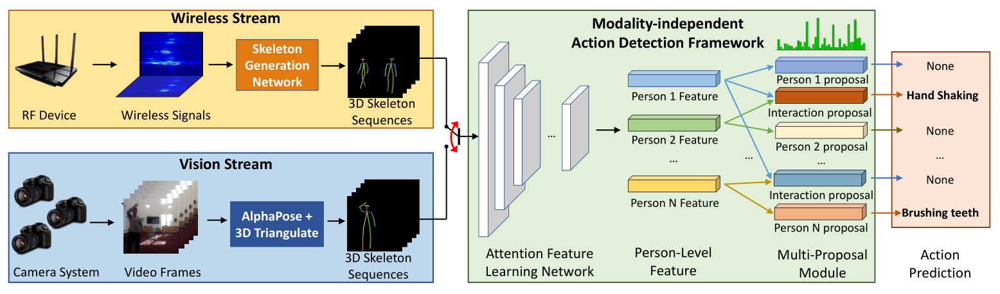
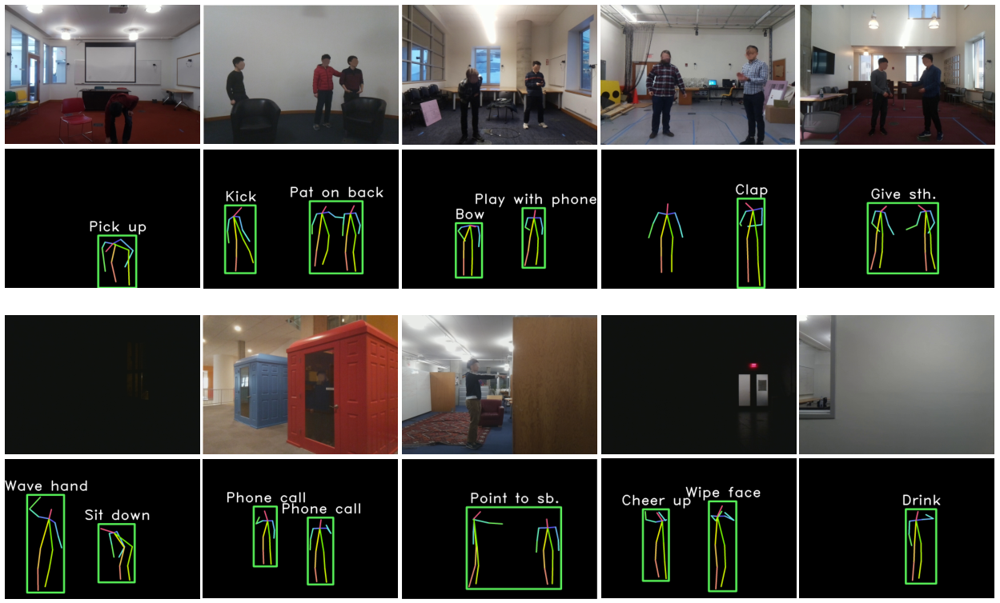
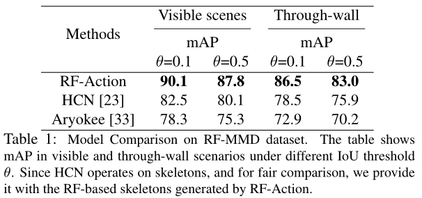
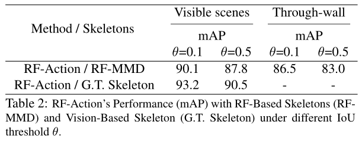

### 深度学习 作业 2

**Making the Invisible Visible: Action Recognition Through Walls and Occlusions 阅读报告** 

#### 本文研究问题

动作识别（Action Recognition）是要从时间序列中检测和分类人的动作。而基于视觉的动作识别方法与人眼具有相同的局限性，会受遮挡物和光照条件的影响。本文利用无线电信号来解决这一问题，提出了一个端到端的深度神经网络 RF-Action，利用无线电信号可以穿透墙壁和遮挡物并反射出人体的特性进行动作识别。

#### 本文主要贡献

- 提出了第一个使用无线电信号进行基于骨骼的动作识别模型 RF-Action；通过实验进一步证明这类模型仅使用射频信号就可以准确识别在墙壁后和极端恶劣光照条件下的动作和交互。
- 提出使用骨骼作为中间表示来跨模式传递与动作识别相关的知识，并证明这种这种知识传递可以提升性能。
- 引入一个新的时空注意力模块，用于改进基于骨骼的动作识别效果，而不用关心骨骼是由射频还是基于视觉的数据生成的。
- 提出了一个新的多提案模块，通过扩展基于骨骼的动作识别来检测多个人同时进行的工作和互动。

#### 本文工作

动作识别是计算机视觉领域中的研究热点，具有广泛的应用。基于视觉的动作识别方法取得了不错的识别效果，但对于存在遮挡物或光照条件较差的情况，基于视觉的方法无法发挥作用。而无线电信号不会受到这样的限制，射频信号可以穿透墙壁和障碍物，还会反射出人体。已经有研究人员利用这一特性进行动作识别工作，但穿透墙壁后的射频信号分辨率低、信号强度弱，导致动作检测识别的效果与基于视觉的动作识别有较大差距。本文提出 RF-Action 模型利用无线信号来遮挡物或恶劣光照条件下识别人的动作。

##### RF-Action

RF-Action 是一个端到端的神经网络模型，架构如下图。

RF-Action 以无线信号或视觉数据作为输入，生成 3D 骨骼作为中间表示，随着时间推移识别多个人的动作和交互。这种多模式的设计使 RF-Action 可以在现有的基于骨骼的动作识别数据集上训练。生成 3D 骨骼的方法采用已有的工作，不是本文的主要内容。

模式无关的动作识别框架使用 3D 骨骼进行动作检测，主要有两点创新。首先，生成的 3D 骨骼，尤其是从无线信号生成的骨骼不可避免地存在误差，因此将骨骼生成网络的预测置信度也作为输入，并引入时空注意力模块使模型专注于具有较高置信度的身体关节。

其次，以往的动作识别模型在任意时刻智能识别单个动作或交互，无法处理多个人同时做出不同动作的情况。通过引入多提案模块解决这个问题，对同时出现的 $N$ 个人，多提案模块对这 $N$ 个特征输出 $N+\binom{N}{2}$ 个提案，包括 $N$ 个可能的单人动作和每两个人之间的 $\binom{N}{2}$ 个可能的交互。然后采用交互优先于单人动作的策略进行预测。

##### 实验

因为没有提供射频信号和相应骨骼的可用数据集，所以首先要构造新的数据集，称为射频多模态数据集（RF-MMD）。使用无线电设备收集射频信号，具有 10 个视角的摄像头拍摄视频，并保证设备同步在 10 毫秒内。在 10 个不同环境与 30 名志愿者收集了 25 小时的数据。从现有的 PKU-MMD 数据集中选择了 35 个行动，包括单人行动和互动，每 10 分钟要求 3 名志愿者随机执行其中不同的操作。使用 20 个小时的数据进行训练，5 个小时进行测试，测试时仅使用射频信号。基于摄像头记录视觉数据生成 3D 骨骼并进行校正，以此作为 RF-Action 中生成中间 3D 骨骼的监督学习样本。最后还使用 PKU-MMD 的数据训练来展示 RF-Action 可以从基于视觉的样本中学习。

首先展示了一些[定性结果](#qualitative_result)，结果显示，即使不同的人同时做出不同的动作，RF-Action 仍可以正确识别动作和交互，并且可以应对遮挡物和恶劣的光照条件。然后将 RF-Action 与基于骨骼的动作识别（HCN）和以往基于射频信号的动作识别（Aryokee）的最新模型进行比较，结果如 [表1](#table_1)，RF-Action 在视觉可见和穿墙场景下的性能都优于已有模型，证明了模块的有效性。接下来比较不同模态的影响，在测试时提供测试机的射频信号或使用摄像头获得的真实骨骼，结果如 [表2](#table_2)，表明基于射频信号的动作识别可以实现接近校准过的摄像头系统的功能。

为了验证每个组成部分的有效性，分别对时空注意力模块、多提案模块、多模式联合训练和端到端模型等进行消融实验。结果表明，RF-Action 设计的各个部分都是有效的，都对动作识别任务的性能有一定作用。

我认为这篇文章研究的问题确实能够解决现有的基于视觉的动作识别面对一些局限性场景出现的问题，有很广泛的应用场景，不仅仅是文中提到的墙壁和遮挡物以及恶劣光照条件，也适用于对隐私要求比较高的场景，这种基于无线信号生成 3D 骨骼的中间表示不会有人脸识别或者录像泄露等问题。RF-Action 把两种模式的输入（无线信号和视觉数据）都转化为 3D 骨骼这种中间表示形式，方便利用现有的数据集进行训练，而且使用骨骼表示受环境和目标变化的影响小，相当于提高了模型的泛化能力。
