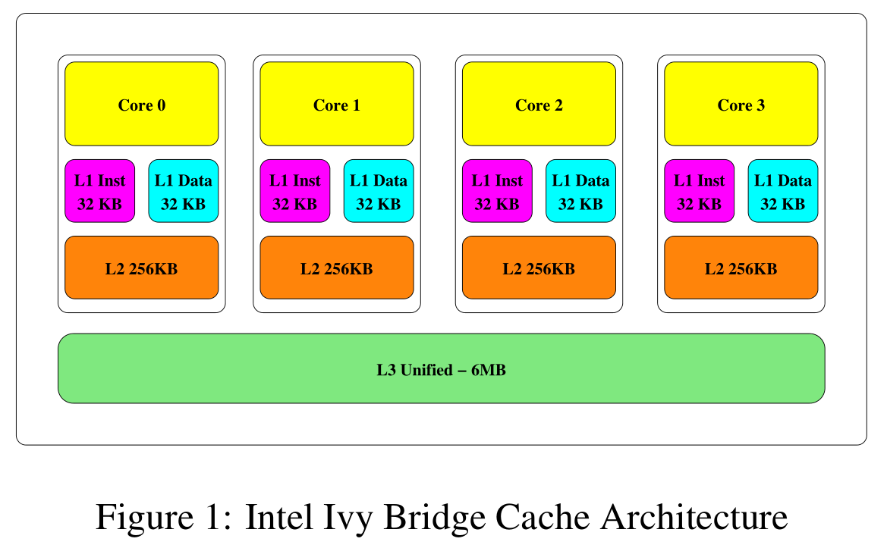
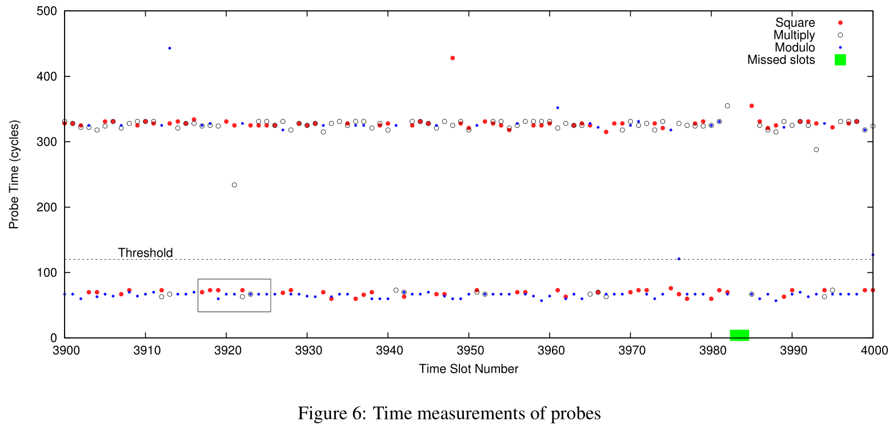
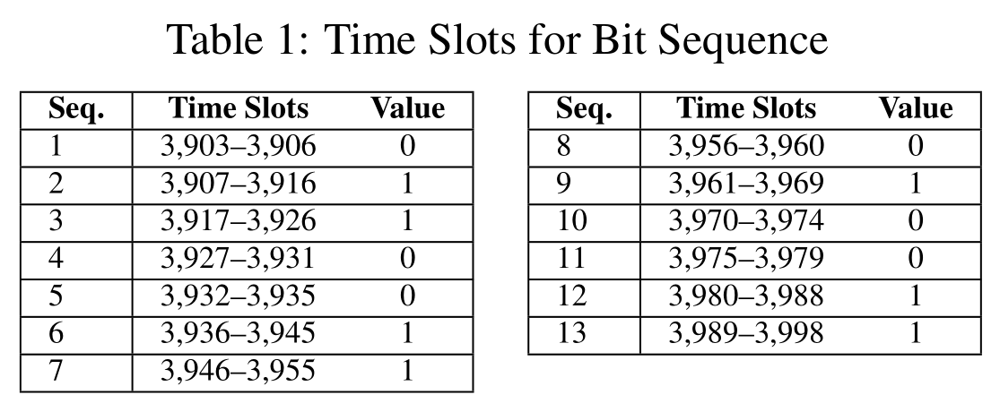
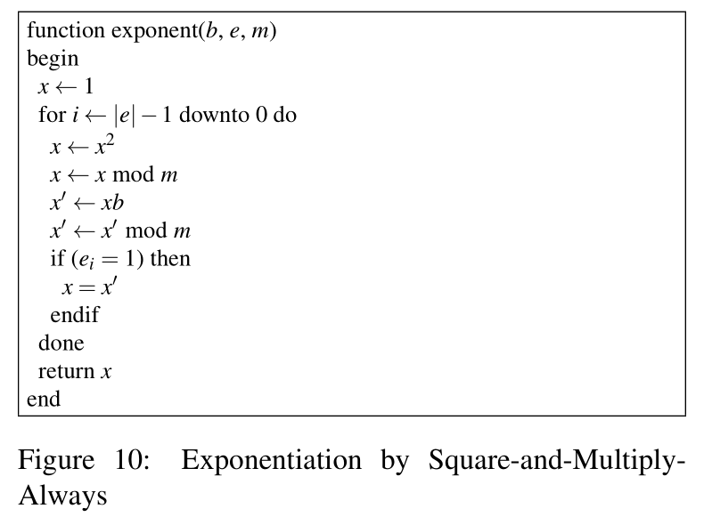

# FLUSH+RELOAD

[toc]

> 202028018670042 秦浩翔

### 摘要

进程间共享内存页是常用的内存占用优化技术。从而导致了进程的信息泄露。

FLUSH+RELOAD，一种缓存侧信道攻击技术，可以监控受害进程对共享页中缓存行的访问。

FLUSH+RELOAD 针对 LLC，不需要共享核心。

从运行 GnuPG 1.4.13 的受害者进程中提取加密私钥展现 FLUSH+RELOAD 的有效性。

在同一 OS 上的不同进程以及不同虚拟机之间测试攻击，能恢复 96.7% 的密钥位。

### 引言

OS 在进程之间共享相同的内存页。

这种共享可以有类似于共享库，或者基于主动搜索合并相同的内容。

为了保证进程隔离，要通过硬件机制对共享页强制执行只读或写时复制。但这只确保进程不能更改共享页的内容，无法阻止其他形式的进程间干扰。

通过共享页面干扰的一种形式就是对处理器缓存的共享使用。进程访问共享内存页时，访问的内容被填充到缓存。Gullasch 等人提出了利用这种缓存行为来提取对共享页的访问信息的侧信道攻击。使用 clflush 指令从缓存中清除要监视的内存位置，然后当受害者执行少量指令后再测试数据是否在缓存中。

clflush 指令从所有缓存中清除缓存行，也包括共享的 LLC。基于此设计了 FLUSH+RELOAD 攻击，扩展了前人的攻击，实现跨核心甚至跨虚拟机攻击。

两个特性使 FLUSH+RELOAD 比以往的侧信道攻击更强大。首先是攻击粒度，可以识别特定缓存行的访问。然后是针对 LLC，多个共享，以前针对 LLC 的分辨率都比较低，不能用于密码分析。

对 GnuPG 的 RSA 实现发起攻击，在跨进程和跨虚拟机场景下测试。

对单个签名或解密轮，在跨进程场景下平均提取 98.7% 的密钥位，跨虚拟机场景达到 96.7%，最差分别是 95% 和 90%。

下面就介绍预备知识、FLUSH+RELOAD 技术细节、攻击测试、缓解措施以及相关工作。

### 预备知识

#### 页共享

进程间共享内存主要有两个目的，首先是进程间通信，然后可以减少内存占用。

页面感知（content-aware）共享，相同的页面由加载的页面内容的磁盘位置标识。进程间共享可执行文件和共享库的代码段。

基于内容的页共享，也叫内存重复数据消除（memory deduplication），是一种更主动的页共享机制。系统扫描活动的内存，识别并合并有相同内容的页。

操作系统需要保护在不相关进程间共享的内存页，防止恶意进程修改共享页。把共享页设置为写时复制，写入共享页时会陷入，OS 会获取 CPU 控制权，复制共享页内容，再映射到进程的地址空间。

然而写时复制并未完全实现隔离，写时复制引入的延迟会导致信息泄露。

#### Cache 结构

下图为 Intel i5-3470 处理器的 Cache 层次结构。



Cache 中的内存单位是缓存行，每个缓存行包含固定数量的字节。缓存由多个缓存集组成，每个缓存集存储固定数量的缓存行，这个数目称为缓存关联性。i5-3470 缓存行大小为 64B，L1 和 L2 为 8 路组相联，LLC 为 12 路组相联。

Intel LLC 的一个重要特性是包容性（inclusive），即 LLC 包含所有存储在低级缓存中的所有数据的副本。因此从 LLC 中刷新或逐出数据也从其他缓存中移除数据。攻击利用了这一缓存行为。

从不同层次的存储结构检索数据的时间不同，侧信道攻击就利用了这种时间上的差异。为了利用时间差，攻击者在受害者执行前将缓存设置为已知状态，有两种方法可以用来推断。第一种可以测量受害者执行的时间；第二种可以在受害者执行后测量访问数据的时间。

大多数缓存侧信道先前的工作都要求攻击者和受害者运行在同一物理核上。主要是因为很多攻击要求攻击之前要中止受害者，这就需要控制调度。另一个原因是攻击主要集中于 L1 缓存，它不在不同物理核之间共享。不攻击 LLC 主要是因为它的容量比较大，设置它的状态比 L1 更麻烦，而且操作系统的虚拟内存掩盖了内存地址到缓存集的映射。同时大多数的内存活动发生在一级缓存，从 LLC 能提取的活动很少。

#### RSA

支持加密和签名公钥加密系统。

CRT-RSA 是解密函数实现的一种优化，把 $d$ 拆分成两部分 $d_q, d_p$。

使用快速幂算法，跟踪快速幂算法可以恢复指数。

### FLUSH+RELOAD

FLUSH+RELOAD 是 PRIME+PROBE 的一个变种，依赖于进程间共享页。是 Gullasch 等人工作的变体，扩展了在多核和虚拟化环境中的适用性。

攻击分为三个阶段：

- 把要监视的缓存行从缓存中清除。
- 攻击者等待让受害者有时间访问内存。
- 攻击者重新加载内存，测量加载时间。

比较关键的是等待时间，如果等待时间较短则可能受害者访问与攻击者重新加载重叠，导致重载时间较长。另一方面，增加等待时间会降低攻击的粒度。

在不增加错误率的情况下提高攻击分辨率的方法一种方法是将频繁的内存访问作为目标，如循环体。攻击无法区分多个访问，但是丢失（未捕捉到）循环的可能性比较小。

一些处理器优化导致的推测性内存访问可能导致误报，这包括利用空间局部性和推测执行的数据预取，攻击者需要了解这些优化并制定过滤策略。

攻击代码如下：

```c
int probe(char *adrs) {
    volatile unsigned long time;
    asm __volatile__ (
        "mfence    \n"
        "lfence    \n"
        "rdtsc    \n"
        "lfence    \n"
        "movl %%eax, %%esi    \n"
        "movl (%1), %%eax    \n"
        "lfence    \n"
        "rdtsc    \n"
        "subl %%esi, %%eax    \n"
        "clflush 0(%1)    \n"
        : "=a" (time)
        : "c" (adrs)
        :
        "%esi", "%edx");
    return time < threshold;
}
```

代码测量读取内存地址数据的时间，然后从缓存中清除缓存行。使用 `rdtsc` 读取计时器。

攻击的关键是从缓存中清除指定的内存地址所在缓存行，通过 `clflush` 实现。确保下次受害者访问该内存时会被加载到 LLC。

这里用 `mfence` 和 `lfence` 串行化指令流，但是文章提到说这样并不能保证串行化。

Intel 推荐使用使用 `cpuid` 来串行化指令，然而在虚拟环境下 hypervisor 会模拟 `cpuid` 指令，会耗费很长时间，严重影响攻击粒度。

这里使用的阈值取决于系统架构和环境。直接用上面的代码去掉 `clflush` 来测试时间阈值。

要使用 FLUSH+RELOAD 技术，攻击者和受害者要共享缓存层次结构和内存页。在虚拟化环境中，攻击者需要访问与受害者客户机位于同一物理主机上的客户机，这就需要用到现有的同驻技术。

如果使用内容感知的共享，攻击者要读取受害者的可执行文件或共享库。对于消除重复数据的共享，攻击者需要访问受害者文件的副本，de-duplication 会把副本和受害者文件合并。

### 攻击 GnuPG

下面就介绍如何使用 FLUSH+RELOAD 技术提取 RSA 的 GnuPG 实现中的私钥组件。

两个硬件平台，每个硬件平台测试跨进程和跨虚拟机两个场景。

- HP Elite 8300, i5-3470, 8G DDR3-1600, CentOS 6.5, ESXi 5.1
- Dell PowerEdge T420, E5-2430*2, 32G DDR3-1333, CentOS 6.5, KVM
  - 这个机器有两个 CPU，所以要通过设置 CPU 关联性保证攻击者和受害者在同一 CPU 上。

跨进程场景下，攻击者将受害者的可执行文件映射到攻击者地址空间以实现共享内存。

跨虚拟机场景下，攻击者映射受害者可执行文件的副本，利用 hypervisor 的页重复消除机制实现共享。

共享页之后，共享的虚拟地址对于的页表项也就映射到同一物理页。而 LLC 是物理地址标记的，所以不需要考虑虚拟地址到物理地址的转换，同时也不受 ASLR 等技术的影响。

要追踪受害者的执行情况，就将针对受害者代码段。

攻击者将时间分为 2500 个周期的固定间隙。每个间隙中，探测每个平方、乘法和模运算的一个内存行。为了增加探测捕获的机会，选择在计算期间频繁执行的内存行。为了减少推测执行的影响，使用避免在每个函数开头附近内存行。探测内存行之后，攻击者刷新缓存行，等待时隙结束。

使用 gpg 程序的默认构建，包括 -O2 级别优化且保留调试符号。用调试符号构建源代码到内存地址的映射。

使用 2048 位密钥签名的 GnuPG 的 100 个时隙的测量时间如图6 所示。每个时隙中，攻击者刷新然后测量平方、乘法和模函数的内存行访问时间，整个签名过程一共 15690 个时隙约 18ms，用于求幂的 CRT 组件有 1022 和 1023 位长。



图7 是图6 的一段放大图，在这一过程中 gpg 程序进程了平方-模-乘-模的运算序列，也就代表这几个时隙内受害者在处理密钥中的一个 1 位。图7 还展示了推测执行的效果，当预测当前位可能是 0 时就把平方计算所需的内存载入缓存，因此被攻击者捕获。


将探测位置移动到函数末尾的缓存行，可以消除一些推测执行的影响。	

通过识别操作序列，攻击者可以恢复指数位。平方-模-乘-模 序列代表 1，而后面没有乘的 平方-模 代表 0。这样就可以从图6 的展现的序列中恢复这一段的指数位。



系统的活动可能导致攻击者错过一些时隙，攻击者通过记录周期计数器中的跳跃来识别错过的时间段。图6 展示攻击者错过了 3983 和 3984 时隙，但这种小的丢失不会影响指数位的恢复。

每个配置上做了 1000 次签名捕获的测试，攻击者只调用一次，而受害者在另一个 shell 窗口执行。只确保攻击者在签名时执行，但执行不同步。

对于每个签名，攻击者输出一个文本行代表每个时隙的探测结果。使用 shell 脚本解析输出，将结果与实际情况比较。最后对捕获中位错误的统计和分布如表2 和图8。

shell 脚本高估了错误数量，比如对于错过的时隙，脚本没法正确识别恢复指数位。手动检查后的错误数减少了 25% 到 50%。

在 HP 机器上得到更好的效果，主要是 Xeon 处理器有更高级的优化。同时跨进程场景比跨虚拟机场景要好，因为虚拟化层的作用。

即使通过手动检查可以获得更好的结果，但对于单纯的暴力破解，错误的数量还是太大。可以使用一些策略来减少搜索空间和恢复密钥。其中一种策略是依赖于 CRT-RSA 指数运算的性质，前面提到，攻击者只需恢复一个 CRT 组件即可破坏加密，所以攻击者可以攻击错误较少的 CRT 组件来缩小搜索空间。表3 和图 9 显示了每个签名中效果较好的 CRT 组件的为错误的统计和分布。可见，搜索空间大大减少。

已经有一些算法可以从指数位的部分信息恢复 RSA 的指数，这些算法需要 27% 到 70% 的指数位。虽然现在已经可以恢复超过 90% 的指数位，但并不总能恢复这些比特的位置。比如如果有错过了 10 个时隙，这个序列可能覆盖一个 1 或两个 0。这就需要进一步研究

另一种恢复密钥的方法是结合来自多个签名的数据。由于每次捕获中的错误位置是独立的，因此任意两个捕获在相同位置位上都出错的可能性很小。在 Dell Cross-VM 场景下手动合并了攻击者的几组输出。通过观察两个签名，可以恢复私钥。

攻击还是存在限制的，攻击者与受害者必须在同一物理处理器上执行，测试中可以设置处理器关联，但是真实场景中这取决于调度器。同时真实环境中的多进程会产生噪声，影响捕获质量。如果并行地运行多个 GnuPG 实例，攻击者无法区分每个实例的内存访问，也就无法回复任何数据。

在 Dell 机器上，探测三个内存位置大约需要 2200 个周期，即要求时隙必须大于这一值。而对于更短的密钥长度，这样的时隙可能难以提供足够的分辨率。（？密钥短泄露的少？）

### 缓解技术

FLUSH+RELOAD 攻击需要四个因素的结合：由敏感数据决定的内存访问模式、攻击者与受害者共享内存、准确的高分辨率时间测量以及 `clflush` 指令的使用。

X86 架构对 `clflush` 指令缺乏权限检查，所以最直接的解决方案就是限制 `clflush` 指令的能力。它的主要用途是加强内存一致性，另一个潜在的用处是控制缓存的使用以提高性能，比如刷新不需要的行。

建议将 `clflush` 的使用限制为进程可写且系统允许刷新的内存也。这种访问控制可以通过向页属性表添加限制刷新的内存类型来实现。

ARM 也有类似的指令，但是只能在特权模式下使用，也就不会有 FLUSH+RELOAD。

AMD 之前似乎是 exclusive 的缓存，所以不起作用。

硬件的对策并不能马上生效，还是需要软件对策。

防止攻击者与受害者共享，避免共享敏感代码。禁用 deduplication，可以防止跨虚拟化的攻击。

另一个方法是软件多样化（software diversification），置换对象在进程地址空间中的位置。大多用于防止内存损坏攻击，其中一些技术可用于防止共享，从而缓解攻击。具体而言，虚拟化环境中，代码和数据的静态重排可用于在每个虚拟机中创建程序的唯一副本，在虚拟机之外不可用，也就不会进行页面 deduplication。运行时程序多样化可以防止共享代码段，即使攻击者可以访问二进制文件。

和其他侧信道攻击一样，FLUSH+RELOAD 要求高分辨率时钟，所以可以降低分辨率或引入噪声，但攻击者还可以通过其他方法达到高分辨率时钟，比如来自网络的数据或者在一个单独的核心上允许一个计时的进程。

还应该保护加密软件免受攻击，GnuPG 通过优化快速幂算法环节攻击。



这种引入无效指令的方法需要考虑编译器的优化，对于这个例子，编译器不知道能否优化。

但其实这种实现仍然有一小部分取决于位的值，理论上的缓存侧信道攻击还可能会利用此代码。然而由于推测执行，处理器可能不考虑位直接访问。而且这段代码很短，小于缓存行，很可能与前面或后面代码位于同一缓存行。

但此修复程序不能防止其他形式的侧信道攻击，特别是分支预测分析。而且数据的访问模式取决于指数位的值，易受 PRIME+PROBE 攻击。可以使用常数时间求幂要防止攻击，访问的指令序列和存储位置是固定的，不依赖于指数位的值。RSA 幂运算的 OpenSSL 实现的访问模式不依赖于指数位，即使不是常数时间，也不易受攻击。

对其他软件，不能要求常数时间。

