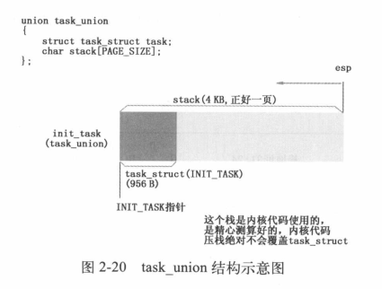

# 设备环境初始化及激活进程 0

从现在开始执行 main 函数！

系统达到怠速状态前所做的一切准备工作的核心目的就是让用户程序能够以进程的方式正常运行。本章讲解的内容就是为了实现这个目标，对设备环境进行初始化，并将激活第一个进程——进程 0。

Linux 0.11 是一个支持多进程的现代操作系统。这就意味着，各个用户进程在运行过程中，彼此不能相互干扰，这样才能保证进程在主机中正常地运算。然后，进程需要系统人为地给它设计一套边界来对其进行保护。这套边界就是系统为进程提供的进程管理信息数据结构，包括：task_struct、task[64] 和 GDT 等。

- task_struct 是每个进程所独有的结构，标识了进程的各项属性值，包括剩余时间片、进程执行状态、局部数据描述符表 LDT 和任务状态描述符表 TSS 等。
- task[64] 和 GDT 是为管理多进程提供的数据结构。task[64] 中存储所有进程的 task_struct 指针。如果操作系统需要对多个进程加以比较并选择，就可以遍历 task[64] 结构来实现。
- GDT 存储着一套对所有进程的索引结构。通过索引项，操作系统可以间接地与每个进程中的 LDT 和 TSS 建立关系。

本章还将讲解操作系统是如何对内存、CPU、串行口、显示器、键盘、硬盘、软盘等硬件进行设置，并将这些硬件所对应的中断服务程序与 IDT 相挂接，为进程 0 及其直接、间接创建的后续进程与外设沟通构建环境。

## 设置根设备、硬盘

首先初始化根设备和硬盘，用 bootsect 中写入机器系统数据 `0x901FC` 的根设备为软盘的信息，设置软盘为根设备，并用起始自 `0x90080` 的 32 字节的机器系统数据的硬盘参数信息设置内核中硬盘信息 drive\_info。

```c
#define DRIVE_INFO (*(struct drive_info *)0x90080)	// 硬盘参数表
#define ORIG_ROOT_DEV (*(unsigned short *)0x901FC)	// 根设备号
struct drive_info { char dummy[32]; } drive_info;  // 用于存放硬盘参数表信息
void main(void) {
    ROOT_DEV = ORIG_ROOT_DEV;		// ROOT_DEV 在 fs.h 中声明为 extern int
 	drive_info = DRIVE_INFO;
    ...
}
```

## 规划物理内存格局，设置缓冲区、虚拟盘、主内存

具体规划为：除内核代码和数据所占的内核空间之外，其余物理内存主要分三部分：

- 主内存区，进程代码运行的空间，也包括内核管理进程的数据结构；
- 缓冲区，主要作为主机与外设进行数据交互的中转站；
- 虚拟盘区，可选，可将外设上的数据先复制进虚拟盘区。

先根据内存大小对缓冲区和主内存区的位置和大小进行设置，代码如下：

```c
#define EXT_MEM_K (*(unsigned short *)0x90002)
...
static long memory_end = 0;                     // 机器具有的物理内存容量（字节数）
static long buffer_memory_end = 0;              // 高速缓冲区末端地址
static long main_memory_start = 0;              // 主内存（将用于分页）开始的位置
...
void main(void) {
    ...
	memory_end = (1<<20) + (EXT_MEM_K<<10);     // 内存大小=1Mb + 扩展内存(k)*1024 byte
	memory_end &= 0xfffff000;                   // 忽略不到4kb(1页)的内存数
	if (memory_end > 16*1024*1024)              // 内存超过16Mb，则按16Mb计
		memory_end = 16*1024*1024;
	if (memory_end > 12*1024*1024)              // 如果内存>12Mb,则设置缓冲区末端=4Mb 
		buffer_memory_end = 4*1024*1024;
	else if (memory_end > 6*1024*1024)          // 否则若内存>6Mb,则设置缓冲区末端=2Mb
		buffer_memory_end = 2*1024*1024;
	else
		buffer_memory_end = 1*1024*1024;        // 否则设置缓冲区末端=1Mb
	main_memory_start = buffer_memory_end;
}
```

1MB 以上都是扩展内存，扩展内存数存在之前 setup 保存的机器系统数据 0x90002 处。对于不同物理内存容量，缓冲区末端设置了不同的值，缓冲区的起始位置会在后面介绍。

## 设置虚拟盘空间并虚拟化

如果在 Makefile 中定义了 RAMDISK，则初始化虚拟盘，主内存将减少。代码如下：

```c
#ifdef RAMDISK
	main_memory_start += rd_init(main_memory_start, RAMDISK*1024);
#endif
...
// 块设备结构
struct blk_dev_struct {	
	void (*request_fn)(void);			// 请求操作的函数指针
	struct request * current_request;	// 当前正在处理的请求信息结构
};
// 块设备数组
struct blk_dev_struct blk_dev[NR_BLK_DEV] = {
	{ NULL, NULL },		/* no_dev */
	{ NULL, NULL },		/* dev mem */	// 内存
	{ NULL, NULL },		/* dev fd */	// 软驱
	{ NULL, NULL },		/* dev hd */	// 硬盘
	{ NULL, NULL },		/* dev ttyx */
	{ NULL, NULL },		/* dev tty */
	{ NULL, NULL }		/* dev lp */	// 打印机设备
};
#define MAJOR_NR 1
#define DEVICE_REQUEST do_rd_request
// 返回内存虚拟盘所需的内存量
long rd_init(long mem_start, int length)
{
	int	i;
	char	*cp;
	// 设置虚拟盘设备的请求项处理函数指针指向 do_rd_request
	blk_dev[MAJOR_NR].request_fn = DEVICE_REQUEST; 
	rd_start = (char *) mem_start;
	rd_length = length;
	cp = rd_start;
	for (i=0; i < length; i++)						// 虚拟盘区清零
		*cp++ = '\0';
	return(length);
}
```

rd_init 为虚拟盘区分配了 RAMDISK KB的数据，并置零。

## 内存管理结构 mem_map 初始化

确定了主内存区的起始位置，开始设置主内存区的管理结构。代码如下：

```c
	mem_init(main_memory_start,memory_end); // 主内存区初始化。mm/memory.c
...
// mm/memory.c
#define LOW_MEM 0x100000    
#define PAGING_MEMORY (15*1024*1024)
#define PAGING_PAGES (PAGING_MEMORY>>12)    
#define MAP_NR(addr) (((addr)-LOW_MEM)>>12)    
// 物理内存映射字节图（1字节代表1页内存）。每个页面对应的字节用于标志页面当前引
// 用（占用）次数。它最大可以映射15MB的内存空间。在初始化函数mem_init()中，对于
// 不能用做主内存页面的位置均都预先被设置成USED（100）.
static unsigned char mem_map [ PAGING_PAGES ] = {0,};   
// 物理内存管理初始化    
void mem_init(long start_mem, long end_mem)
{
	int i;

    // 首先将1MB到16MB范围内所有内存页面对应的内存映射字节数组项置为已占用状态 USED = 100
	HIGH_MEMORY = end_mem;                  // 设置内存最高端(16MB)
	for (i=0 ; i<PAGING_PAGES ; i++)
		mem_map[i] = USED;
    
	i = MAP_NR(start_mem);      // 主内存区其实位置处页面号
	end_mem -= start_mem;
	end_mem >>= 12;             // 主内存区中的总页面数
	while (end_mem-->0)
		mem_map[i++]=0;         // 主内存区页面对应字节值清零
}
```

调用 mem_init，使用内存映射数组 mem_map[] 管理 1MB 以上的页面，每个页面对应的字节表示页面引用次数，不能做主内存的页面数组值会设置为 USED。内存最多 15MB，页面数 3840 个。最后主内存区页面对应的 mem_map 值都置零。


操作系统对内核和用户进程采用两套不同的分页管理方法。内核的线性地址和物理地址完全一样，而用户进程线性地址和物理地址相差很大。主内存区采用专门管理用户进程的分页管理方法。

## 异常处理类中断服务程序挂接

用户进程和系统内核都要经常使用中断或遇到异常情况需要处理，下面将通过 trap_init 函数将中断、异常处理的服务程序与 IDT 进行挂接，逐步重建中断服务体系。代码如下：

```c
	trap_init();                            // 陷阱门(硬件中断向量)初始化，kernel/traps.c
// asm/system.h
#define set_trap_gate(n,addr) \
	_set_gate(&idt[n],15,0,addr)

#define set_system_gate(n,addr) \
	_set_gate(&idt[n],15,3,addr)
// kernel/traps.c
// 异常(陷阱)中断程序初始化子程序。设置他们的中断调用门(中断向量)
void trap_init(void) {
	int i;

	set_trap_gate(0,&divide_error);		// 除零错误
	set_trap_gate(1,&debug);			// 单步调试
	set_trap_gate(2,&nmi);				// 不可屏蔽中断
	set_system_gate(3,&int3);	/* int3-5 can be called from all */
	set_system_gate(4,&overflow);		// 溢出
	set_system_gate(5,&bounds);			// 越界
	set_trap_gate(6,&invalid_op);		// 无效指令
	set_trap_gate(7,&device_not_available);			
	set_trap_gate(8,&double_fault);					
	set_trap_gate(9,&coprocessor_segment_overrun);
	set_trap_gate(10,&invalid_TSS);
	set_trap_gate(11,&segment_not_present);
	set_trap_gate(12,&stack_segment);
	set_trap_gate(13,&general_protection);
	set_trap_gate(14,&page_fault);
	set_trap_gate(15,&reserved);
	set_trap_gate(16,&coprocessor_error);
    // 下面把int17-47的陷阱门先均设置为reserved,以后各硬件初始化时会重新设置自己的陷阱门。
	for (i=17;i<48;i++)
		set_trap_gate(i,&reserved);
    // 设置协处理器中断0x2d(45)陷阱门描述符，并允许其产生中断请求。设置并行口中断描述符。
	set_trap_gate(45,&irq13);
	outb_p(inb_p(0x21)&0xfb,0x21);  // 允许8259A主芯片的IRQ2中断请求。
	outb(inb_p(0xA1)&0xdf,0xA1);    // 允许8259A从芯片的IRQ3中断请求。
	set_trap_gate(39,&parallel_interrupt); // 设置并行口1的中断0x27陷阱门的描述符。
}

```

set_trap_gate 与 set_system_gate 都使用了 IDT 中的 Trap Gate，主要区别在于前者设置的特权级为0，后者是3。因此断点陷阱中断 int3 、溢出中断 overflow 和边界出错中断 bounds 可以由任何程序产生。

\_set\_gate 宏通过拼接重组填充中断描述符，跟之前在 head 程序中填充 IDT 差不多。

```c
// 设置门描述符 
// 根据中断或异常处理程序偏移地址 addr、门描述符类型 type 和特权级信息 dpl
// 设置位于 gate_addr 处的门描述符
// %0 由 dpl, type 组成的标识字
// %1 描述符低 4 bytes 地址
// %2 描述符高 4 bytes 地址
// edx 偏移地址 addr
// eax 高字含有段选择符 0x8
// 最后要使 eax : 0008, low(addr); edx : high(addr), 1<<15 + dpl<<13 + type<<8
#define _set_gate(gate_addr,type,dpl,addr) \
__asm__ ("movw %%dx,%%ax\n\t" \
	"movw %0,%%dx\n\t" \
	"movl %%eax,%1\n\t" \
	"movl %%edx,%2" \
	: \
	: "i" ((short) (0x8000+(dpl<<13)+(type<<8))), \
	"o" (*((char *) (gate_addr))), \
	"o" (*(4+(char *) (gate_addr))), \
	"d" ((char *) (addr)),"a" (0x00080000))
```

32 位中断服务体系是为适应被动响应中断信号机制为建立的。硬件产生信号传达给 8259A，对信号进行初步处理并视 CPU 执行情况传递中断信号给 CPU；CPU 如果收到信号，就打断正在执行的程序并通过 IDT 找到具体的中断服务程序，执行完后返回刚才打断的程序点继续执行。

## 初始化块设备请求项结构

Linux 0.11 将外设分为块设备和字符设备。

- 块设备将存储空间分为若干同样大小的存储空间，每个块有块号，可以独立、随机读写。
- 字符设备以字符为单位进行 I/O 通信，如键盘、黑屏命令行显示器。

进程想与块设备沟通必须经过主机内存中的缓冲区。请求项管理结构 request[32] 就是操作系统管理缓冲区中的缓冲块与块设备逻辑块之间读写关系的数据结构。

```c
	blk_dev_init();                         // 块设备初始化,kernel/blk_drv/ll_rw_blk.c
// kernel/blk_drv/blk.h
struct request {
	int dev;		/* -1 if no request */	// 发请求的设备号
	int cmd;		/* READ or WRITE */	
	int errors;								// 操作时产生的错误次数
	unsigned long sector;					// 起始扇区（1块 = 2 扇区）
	unsigned long nr_sectors;				// 读/写扇区数
	char * buffer;							// 数据缓冲区
	struct task_struct * waiting;			// 任务等待操作执行完成的地方
	struct buffer_head * bh;				// 缓冲区头指针
	struct request * next;					// 指向下一个请求项
};
// kernel/blk_drv/ll_rw_blk.c
struct request request[NR_REQUEST];
...
// 初始化请求数组，将所有请求项置为空闲（dev = -1）,有32项（NR_REQUEST = 32）
void blk_dev_init(void) {
	int i;

	for (i=0 ; i<NR_REQUEST ; i++) {
		request[i].dev = -1;
		request[i].next = NULL;
	}
}

```

操作系统根据所有进程读写任务的轻重缓急，决定缓冲块与块设备之间的读写操作，并把需要操作的缓冲块记录在请求项上，得到读写块设备操作指令后，只根据请求项中的记录来决定当前需要处理哪个设备的哪个逻辑块。


## 与建立人机交互界面相关的外设的中断服务程序挂接

main 里有个 chr_dev_init 函数，但是是空的，初始化字符设备放到了 tty_init 中。字符设备的初始化主要是对串行口、显示器、键盘进行初始化设置，以及与此相关的中断服务程序与 IDT 挂接。代码如下：

```c
	tty_init();                             // tty初始化， kernel/chr_drv/tty_io.c
// TTY终端初始化函数
// 初始化串口终端和控制台终端
void tty_init(void) {
    // 初始化串行中断程序和串行接口1和2（serial.c）
	rs_init();
	con_init();     // 初始化控制台终端(console.c文件中)
}
```

### 对串行口进行设置

把两个串行口中断服务程序与 IDT 挂接，然后根据 tty_table 数据结构中的内容初始化串行口，包括设置线路控制寄存器的 DLAB 位、设置发送的波特率因子、设置 DTR 和 RTS 等等。代码如下：

```c
// 初始化串行中断程序和串行接口
// 中断描述符表IDT中的门描述符设置宏set_intr_gate()在include/asm/system.h中实现
void rs_init(void) {
    // 下面两句用于设置两个串行口的中断门描述符。rsl_interrupt是串口1的中断处理过程指正。
    // 串口1使用的中断是int 0x24，串口2的是int 0x23.
	set_intr_gate(0x24,rs1_interrupt);      // 设置串行口1的中断门向量(IRQ4信号)
	set_intr_gate(0x23,rs2_interrupt);      // 设置串行口2的中断门向量(IRQ3信号)
	init(tty_table[1].read_q.data);         // 初始化串行口1(.data是端口基地址)
	init(tty_table[2].read_q.data);         // 初始化串行口2
	outb(inb_p(0x21)&0xE7,0x21);            // 允许主8259A响应IRQ3、IRQ4中断请求
}
```

set_intr_gate 与之前的 set_trap_gate 类似，区别就是传入的中断描述符 type 字段是 14，前者是 15。

### 对显示器进行设置

根据机器系统数据提供的显卡是单色还是彩色来设置配套信息。Linux 0.11 大部分都是单色，显卡属性是单色 EGA。


### 对键盘进行设置

将键盘中断服务程序与 IDT 挂接，然后取消 8259A 对键盘中断的屏蔽，允许 IRQ1 发送中断信号，先禁止再允许键盘工作。这两步都是在 con_init 完成的，代码如下：

```c
#define ORIG_X			(*(unsigned char *)0x90000)
#define ORIG_Y			(*(unsigned char *)0x90001)
#define ORIG_VIDEO_PAGE		(*(unsigned short *)0x90004)
#define ORIG_VIDEO_MODE		((*(unsigned short *)0x90006) & 0xff)
#define ORIG_VIDEO_COLS 	(((*(unsigned short *)0x90006) & 0xff00) >> 8)
#define ORIG_VIDEO_LINES	(25)
#define ORIG_VIDEO_EGA_AX	(*(unsigned short *)0x90008)
#define ORIG_VIDEO_EGA_BX	(*(unsigned short *)0x9000a)
#define ORIG_VIDEO_EGA_CX	(*(unsigned short *)0x9000c)

#define VIDEO_TYPE_MDA		0x10	/* Monochrome Text Display	*/
#define VIDEO_TYPE_CGA		0x11	/* CGA Display 			*/
#define VIDEO_TYPE_EGAM		0x20	/* EGA/VGA in Monochrome Mode	*/
#define VIDEO_TYPE_EGAC		0x21	/* EGA/VGA in Color Mode	*/

#define NPAR 16
// 该函数首先根据 setup 程序取得的机器系统数据初始化设置几个本函数专用的静态
// 全局变量。然后根据显示卡模式(单色还是彩色显示)和显卡类型(EGA/VGA还是CGA)
// 分别设置显示内存起始位置以及显示索引寄存器和显示数值寄存器端口号。最后设置
// 键盘中断陷阱描述符并复位对键盘中断的屏蔽位，以允许键盘开始工作。
void con_init(void)
{
    // 寄存器变量a为了高效的访问和操作。
    // 若想指定存放的寄存器(如eax),则可以写成：
    // register unsigned char a asm("ax");。
	register unsigned char a;
	char *display_desc = "????";
	char *display_ptr;

    // 首先根据 setup 程序取得系统硬件参数初始化几个本函数专用的静态全局变量。
	video_num_columns = ORIG_VIDEO_COLS;    // 显示器显示字符列数
	video_size_row = video_num_columns * 2; // 每行字符需要使用的字节数
	video_num_lines = ORIG_VIDEO_LINES;     // 显示器显示字符行数
	video_page = ORIG_VIDEO_PAGE;           // 当前显示页面
	video_erase_char = 0x0720;              // 擦除字符(0x20是字符，0x07属性)
	
    // 根据显示模式是单色还是彩色分别设置所使用的显示内存起始位置以及显示寄存器
    // 索引端口号和显示寄存器数据端口号。如果原始显示模式等于7，则表示是单色显示器。
	if (ORIG_VIDEO_MODE == 7)			/* Is this a monochrome display? */
	{
		video_mem_start = 0xb0000;      // 设置单显映象内存起始地址
		video_port_reg = 0x3b4;         // 设置单显索引寄存器端口
		video_port_val = 0x3b5;         // 设置单显数据寄存器端口
        
		if ((ORIG_VIDEO_EGA_BX & 0xff) != 0x10)
		{
			video_type = VIDEO_TYPE_EGAM;       // 设置显示类型(EGA单色)
			video_mem_end = 0xb8000;            // 设置显示内存末端地址
			display_desc = "EGAm";              // 设置显示描述字符串
		}
        ...
	}
    ...

	/* Let the user known what kind of display driver we are using */

    // 然后我们在屏幕的右上角显示描述字符串。采用的方法是直接将字符串写到显示内存
    // 相应位置处。首先将显示指针display_ptr 指到屏幕第1行右端差4个字符处(每个字符
    // 需2个字节，因此减8)，然后循环复制字符串的字符，并且每复制1个字符都空开1个属性字节。
	display_ptr = ((char *)video_mem_start) + video_size_row - 8;
	while (*display_desc)
	{
		*display_ptr++ = *display_desc++;
		display_ptr++;                      // 空开属性字节
	}
	
	/* Initialize the variables used for scrolling (mostly EGA/VGA)	*/
	
	origin	= video_mem_start;              // 滚屏起始显示内存地址
	scr_end	= video_mem_start + video_num_lines * video_size_row;   // 结束地址
	top	= 0;                                // 最顶行号
	bottom	= video_num_lines;              // 最底行号

    // 最后初始化当前光标所在位置和光标对应的内存位置pos，并设置键盘中断0x21陷阱门
    // 描述符，&keyboard_interrupt是键盘中断处理过程地址。取消8259A中对键盘中断的
    // 屏蔽，允许响应键盘发出的IRQ1请求信号。最后复位键盘控制器以允许键盘开始正常工作。
	gotoxy(ORIG_X,ORIG_Y);
	set_trap_gate(0x21,&keyboard_interrupt);
	outb_p(inb_p(0x21)&0xfd,0x21);          // 取消对键盘中断的屏蔽，允许IRQ1。
	a=inb_p(0x61);                          // 读取键盘端口0x61(8255A端口PB)
	outb_p(a|0x80,0x61);                    // 设置禁止键盘工作（位7置位）
	outb(a,0x61);                           // 再允许键盘工作，用以复位键盘
}
```

## 开机启动时间设置

开机启动时间是大部分与时间相关的计算的基础。调用 time_init 采集 CMOS 时间数据。代码如下：

```c
	time_init();                            // 设置开机启动时间 startup_time
...
// 将BCD码转换成二进制数值。BCD码利用半个字节（4 bit）表示一个10进制数，因此
// 一个字节表示2个10进制数。（val）&15取BCD表示10进制个位数，而(val)>>4 取BCD表示
// 的10进制十位数，再乘以10.因此最后两者相加就是一个字节BCD码的实际二进制数值。
#define BCD_TO_BIN(val) ((val)=((val)&15) + ((val)>>4)*10)
// 该函数取CMOS实时时钟信息作为开机时间，并保存到全局变量startup_time（秒）中。
// kernel_mktime()用于计算从1970年1月1号0时起到开机当日经过的秒数，作为开机时间。
static void time_init(void) {
	struct tm time;

    // CMOS的访问速度很慢，为了减少时间误差，在读取了下面循环中的所有数值后，如果此时
    // CMOS中秒值发生了变化，那么就重新读取所有值。这样内核就能把与CMOS时间误差控制在1秒之内。
	do {
		time.tm_sec = CMOS_READ(0);
		time.tm_min = CMOS_READ(2);
		time.tm_hour = CMOS_READ(4);
		time.tm_mday = CMOS_READ(7);
		time.tm_mon = CMOS_READ(8);
		time.tm_year = CMOS_READ(9);
	} while (time.tm_sec != CMOS_READ(0));
	BCD_TO_BIN(time.tm_sec);
	BCD_TO_BIN(time.tm_min);
	BCD_TO_BIN(time.tm_hour);
	BCD_TO_BIN(time.tm_mday);
	BCD_TO_BIN(time.tm_mon);
	BCD_TO_BIN(time.tm_year);
	time.tm_mon--;                              // tm_mon中月份的范围是0-11
	startup_time = kernel_mktime(&time);        // 计算开机时间。kernel/mktime.c文件
}
```

通过循环把 CMOS 时间误差控制在 1 秒以内，这里面使用 CMOS_READ 读 CMOS 时钟信息：

```c
// include/asm/io.h
// 以下两个不同处在于加了两条跳转语句延迟
// 带延迟的硬件端口字节输出
#define outb_p(value,port) \
__asm__ ("outb %%al,%%dx\n" \
		"\tjmp 1f\n" \
		"1:\tjmp 1f\n" \
		"1:"::"a" (value),"d" (port))

// 带延迟的硬件端口输入函数
#define inb_p(port) ({ \
unsigned char _v; \
__asm__ volatile ("inb %%dx,%%al\n" \
	"\tjmp 1f\n" \
	"1:\tjmp 1f\n" \
	"1:":"=a" (_v):"d" (port)); \
_v; \
})

// 这段宏读取CMOS实时时钟信息
// 0x70是写地址端口号，0x80|addr是读取的CMOS内存地址
// 0x71 是读取数据端口号
#define CMOS_READ(addr) ({ \
outb_p(0x80|addr,0x70); \
inb_p(0x71); \
})
```

## 初始化进程 0

进程 0 是 Linux 操作系统中运行的第一个进程，也是 Linux 父子进程创建机制的第一个父进程。主要包含三方面的内容：

- 系统先初始化进程 0，其对应的 task_struct 的母本已经在代码中设计好。还要将进程 0 的 task_struct 中的 LDT、TSS 与 GDT 相挂接，并对 GDT、task[64] 以及与进程调度相关的寄存器进行初始化设置。
- 系统对时钟中断进行设置，以便在进程 0 运行后，为后续的进程轮转奠定基础。
- 进程 0 要具备处理系统调用的能力，每个进程在运算时都可能需要与内核进行交互，交互端口就是系统调用。系统通过 set_system_gate 将 system_call 与 IDT 相挂接。system_call 就是系统调用的总入口。

这三点都是在 sched_init 中实现的，下面分段分析代码。

### 初始化进程 0

首先看一下相关的结构体，主要是 tss_struct 和 task_struct，TSS 任务状态段就是操作系统在进行进程切换时保存进程现场信息的段，其内容就是一系列寄存器。以下是 task_struct 的定义：

```c
// include/linux/sched.h
struct task_struct {
/* these are hardcoded - don't touch */
	long state;	/* -1 unrunnable, 0 runnable, >0 stopped */		// 运行状态
	long counter;												// 运行时间片
	long priority;					// 运行优先级，开始运行时 counter = priority，越大运行时间越长
	long signal;							// 信号，位图，每一位代表一种信号，信号值 = 位偏移值 + 1
	struct sigaction sigaction[32];			// 信号执行属性结构，对应信号将要执行的操作和标志信息
	long blocked;	/* bitmap of masked signals */				// 进程信号屏蔽码，对应信号位图
/* various fields */
	int exit_code;							// 任务执行停止的退出码，父进程有用
	unsigned long start_code,end_code,end_data,brk,start_stack;	
    										// 代码段地址、代码长度、代码+数据长度、总长度、堆栈段地址
	long pid,father,pgrp,session,leader;	// 进程号、父进程号、进程组号、会话号、会话首领
	unsigned short uid,euid,suid;			// 用户 id、有效用户 id、保存的用户 id
	unsigned short gid,egid,sgid;			// 组 id、有效组 id、保存的组 id
	long alarm;								// 报警定时值
	long utime,stime,cutime,cstime,start_time;					
    // 用户态运行时间、内核态运行时间、子进程用户态运行时间、子进程内核态运行时间、进程开始运行时刻
	unsigned short used_math;				// 标志是否使用了协处理器
/* file system info */
	int tty;		/* -1 if no tty, so it must be signed */	
    				// 进程使用 tty 的子设备号，-1 表示没有使用。
	unsigned short umask;										// 文件创建属性掩码
	struct m_inode * pwd;										// 当前工作目录 i 节点结构
	struct m_inode * root;										// 根目录 i 节点结构
	struct m_inode * executable;								// 执行文件 i 节点结构
	unsigned long close_on_exec;								// 执行时关闭文件句柄位图标志
	struct file * filp[NR_OPEN];								// 进程使用的文件表结构
/* ldt for this task 0 - zero 1 - cs 2 - ds&ss */
	struct desc_struct ldt[3];	// 本任务的局部表描述符，0-空，1-代码段 cs，2-数据和堆栈段 ds&ss
/* tss for this task */
	struct tss_struct tss;										// 本进程的任务状态段信息结构
};
```

根据这个结构设计了进程 0 的 task_struct 母本 INIT_TASK，并填到 task[64] 的第 0 项：	

```c
// include/linux/sched.h
#define INIT_TASK \
/* state etc */	{ 0,15,15, \
/* signals */	0,{{},},0, \
/* ec,brk... */	0,0,0,0,0,0, \
/* pid etc.. */	0,-1,0,0,0, \
/* uid etc */	0,0,0,0,0,0, \
/* alarm */	0,0,0,0,0,0, \
/* math */	0, \
/* fs info */	-1,0022,NULL,NULL,NULL,0, \
/* filp */	{NULL,}, \
	{ \
		{0,0}, \
/* ldt */	{0x9f,0xc0fa00}, \
		{0x9f,0xc0f200}, \
	}, \
/*tss*/	{0,PAGE_SIZE+(long)&init_task,0x10,0,0,0,0,(long)&pg_dir,\
	 0,0,0,0,0,0,0,0, \
	 0,0,0x17,0x17,0x17,0x17,0x17,0x17, \
	 _LDT(0),0x80000000, \
		{} \
	}, \
}

extern struct task_struct *task[NR_TASKS];
// kernel/sched.c
// 每个任务(进程)在内核态运行时都有自己的内核态堆栈。这里定义了任务的内核态堆栈结构。
// 定义任务联合(任务结构成员和stack字符数组成员)。因为一个任务的数据结构与其内核态堆栈
// 在同一内存页中，所以从堆栈段寄存器ss可以获得其数据段选择符。
union task_union {
	struct task_struct task;
	char stack[PAGE_SIZE];
};

static union task_union init_task = {INIT_TASK,};   // 定义初始任务的数据

struct task_struct * task[NR_TASKS] = {&(init_task.task), }; // 定义任务指针数组
```

这里比较有趣的是定义了 task_union，内核栈和 task_struct 共用一个内存页，这就需要保证内核代码压栈不会覆盖到 task_struct 的空间。



下面就要通过两个宏来构造进程 0 的 TSS 描述符和 LDT 描述符，并将其填入 GDT 表的第 4、5 项。在 head 程序中已经填充了 GDT 表的 0~3 项。代码如下：

```c
// include/asm/system.h
// 按照段描述符的格式拼接数据
// base[31:24] G D/B 0 AVL limit[19:16]
// P DPL/2 S type/4 base[23:16]
// base[15:0]
// limit[15:0]
#define _set_tssldt_desc(n,addr,type) \
__asm__ ("movw $104,%1\n\t" \
	"movw %%ax,%2\n\t" \
	"rorl $16,%%eax\n\t" \
	"movb %%al,%3\n\t" \
	"movb $" type ",%4\n\t" \
	"movb $0x00,%5\n\t" \
	"movb %%ah,%6\n\t" \
	"rorl $16,%%eax" \
	::"a" (addr), "m" (*(n)), "m" (*(n+2)), "m" (*(n+4)), \
	 "m" (*(n+5)), "m" (*(n+6)), "m" (*(n+7)) \
	)

#define set_tss_desc(n,addr) _set_tssldt_desc(((char *) (n)),((int)(addr)),"0x89")
#define set_ldt_desc(n,addr) _set_tssldt_desc(((char *) (n)),((int)(addr)),"0x82")
// include/linux/sched.h
#define _TSS(n) ((((unsigned long) n)<<4)+(FIRST_TSS_ENTRY<<3))
#define _LDT(n) ((((unsigned long) n)<<4)+(FIRST_LDT_ENTRY<<3))
#define ltr(n) __asm__("ltr %%ax"::"a" (_TSS(n)))
#define lldt(n) __asm__("lldt %%ax"::"a" (_LDT(n)))
// 内核调度程序的初始化子程序
void sched_init(void)
{
	int i;
	struct desc_struct * p;                 // 描述符表结构指针
	...
    // 在全局描述符表中设置初始任务(任务0)的任务状态段描述符和局部数据表描述符。
    // FIRST_TSS_ENTRY和FIRST_LDT_ENTRY的值分别是4和5，定义在include/linux/sched.h
	set_tss_desc(gdt+FIRST_TSS_ENTRY,&(init_task.task.tss));
	set_ldt_desc(gdt+FIRST_LDT_ENTRY,&(init_task.task.ldt));
    // 清任务数组和描述符表项(注意 i=1 开始，所以初始任务的描述符还在)。描述符项结构
    // 定义在文件include/linux/head.h中。
    // 这里应该是溢出了？
	p = gdt+2+FIRST_TSS_ENTRY;
	for(i=1;i<NR_TASKS;i++) {
		task[i] = NULL;
		p->a=p->b=0;
		p++;
		p->a=p->b=0;
		p++;
	}
/* Clear NT, so that we won't have troubles with that later on */
    // NT标志用于控制程序的递归调用(Nested Task)。当NT置位时，那么当前中断任务执行
    // iret指令时就会引起任务切换。NT指出TSS中的back_link字段是否有效。
	__asm__("pushfl ; andl $0xffffbfff,(%esp) ; popfl");        // 复位NT标志
	ltr(0);
	lldt(0);
    ...
}
```

将进程 0 的 task_struct 中的 TSS 和 LDT 挂接到 GDT 后，将 task[64] 和 GDT 的后续内容置零。最后将 TR 寄存器指向 TSS0、LDTR 指向 LDT0。

### 设置时钟中断

下面设置时钟中断，时钟中断是进程调度的基础，代码如下：

```c
// PC机8253定时芯片的输入时钟频率约为1.193180MHz. Linux内核希望定时器发出中断的频率是
// 100Hz，也即没10ms发出一次时钟中断。因此这里的LATCH是设置8253芯片的初值。
#define HZ 100
#define LATCH (1193180/HZ)	
	// 下面代码用于初始化8253定时器。通道0，选择工作方式3，二进制计数方式。
	// 通道0的输出引脚接在中断控制主芯片的IRQ0上，它每10毫秒发出一个IRQ0请求。
	// LATCH是初始定时计数值。
	outb_p(0x36,0x43);		/* binary, mode 3, LSB/MSB, ch 0 */
	outb_p(LATCH & 0xff , 0x40);	/* LSB */	// 定时值低字节
	outb(LATCH >> 8 , 0x40);		/* MSB */	// 高字节
	// 设置时钟中断处理程序句柄(设置时钟中断门)。修改中断控制器屏蔽码，允许时钟中断。
    // 然后设置系统调用中断门。这两个设置中断描述符表IDT中描述符在宏定义在文件
    // include/asm/system.h中。
	set_intr_gate(0x20,&timer_interrupt);
	outb(inb_p(0x21)&~0x01,0x21);
	set_system_gate(0x80,&system_call);
```

先初始化 8253 定时器，设置系统每 10ms 发生一次时钟中断。然后将 time_interrupt 挂接到 IDT，并允许 8259A 的 IRQ0 请求。（但是 CPU 现在还是关中断，并不会响应

#### 设置系统调用总入口

最后将系统调用处理函数 system_call 挂载到 int 0x80。

## 初始化缓冲管理结构

缓冲区是内存与外设进行数据交互的媒介。内存与硬盘最大的区别在于，硬盘的作用仅仅是对数据信息进行断点保存，而不参与运算，而内存除了需要对数据进行保存以外，更重要的是要与 CPU、总线配合进行数据运算。