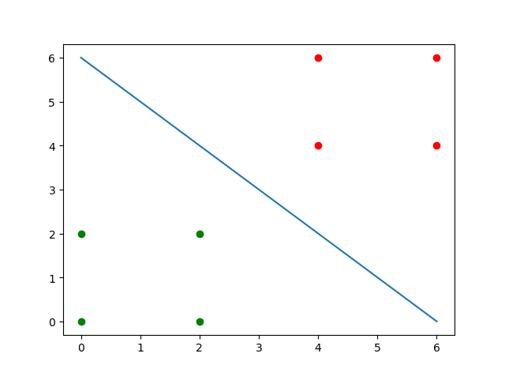
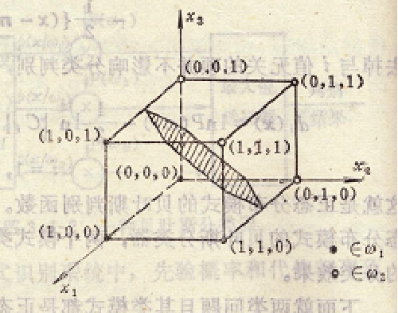

# PRML Chapter 2 homework

> 202028018670042 秦浩翔

#### 设以下模式类别具有正态概率密度函数：

$$
\begin{array}{ll}
\omega_{1}: & \left\{(0\ 0)^{\mathrm{T}},(2\ 0)^{\mathrm{T}},(2\ 2)^{\mathrm{T}},(0\ 2)^{\mathrm{T}}\right\} \\
\omega_{2}: & \left\{(4\ 4)^{\mathrm{T}},(6\ 4)^{\mathrm{T}},(6\ 6)^{\mathrm{T}},(4\ 6)^{\mathrm{T}}\right\}
\end{array}
$$

##### (1) 设 $P(\omega_1)= P(\omega_2)=\frac{1}{2}$，求这两类模式之间的贝叶斯判别界面的方程式。

计算均值向量和协方差矩阵：
$$
m_i = E_i\{x\} \\
C_i = E_i\{(x-m_i)(x-m_i)^T\} \\ 
\quad\\
m_1 = (1, 1)^T \\
m_2 = (5, 5)^T \\
C_1 = C_2 = 
\begin{pmatrix} 
1 & 0 \\
0 & 1
\end{pmatrix} \\
$$
$C_1 = C_2, P(\omega_1) = P(\omega_2) = 1/2$ 则：
$$
\begin{aligned}
d_1(x) - d_2(x) &= (m_1 - m_2)^TC^{-1}x - \frac{1}{2}m_1^TC^{-1}m_1 + \frac{1}{2}m_2^TC^{-1}m_2 \\
& = -4x_1 - 4x_2 + 24 \\
& = -x_1 - x_2 + 6 \\
& = 0 \\

\end{aligned}
$$

即判别界面的方程式为：
$$
x_1 + x_2 - 6 = 0
$$

##### (2) 绘出判别界面。



#### 编写两类正态分布模式的贝叶斯分类程序。

使用例题



```python
import numpy as np
import math
import matplotlib.pyplot as plt

w1 = np.array([
    [0, 1, 1, 1],
    [0, 0, 0, 1],
    [0, 1, 0, 0],
], dtype=np.float)

w2 = np.array([
    [0, 0, 0, 1],
    [0, 1, 1, 1],
    [1, 1, 0, 1],
], dtype=np.float)

p1 = p2 = 1/2

w1 = np.matrix(w1)
w2 = np.matrix(w2)

m1 = np.mean(w1, axis=1)
m2 = np.mean(w2, axis=1)

c1 = np.matrix(np.cov(w1, bias=True))
c2 = np.matrix(np.cov(w2, bias=True))

print('C1 == C2' if (c1 == c2).all() else 'C1 != C2')

X = ['x1', 'x2', 'x3']

result = 'd1 - d2 = '
C = (np.log(p1) - np.log(p2) - 1/2 * m1.T * c1.I * m1 + 1/2 * m2.T * c1.I * m2)[0, 0]
coes = ((m1 - m2).T * c1.I)[0].tolist()[0]
for idx, coe in enumerate(coes):
    result += ('+ ' if idx != 0 and coe > 0 else '- ') + str(np.abs(coe)) + X[idx] + ' '
result += ('+ ' if C > 0 else ' ') + str(C) + ' = 0'
print(result)
```

计算协方差发现相等，直接计算判别界面方程

```
In [49]: %run bayes.py
C1 == C2
d1 - d2 =  8.0x1 - 8.0x2 - 8.0x3 + 4.0 = 0
```