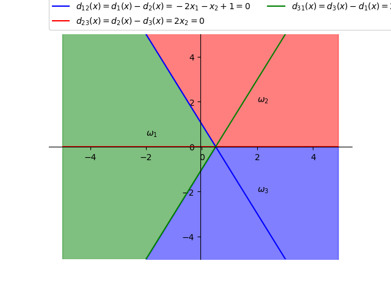

# PRML Chapter 3 homework

> 202028018670042 秦浩翔

#### (1) 在一个10类的模式识别问题中，有3类单独满足多类情况1，其余的类别满足多类情况2。问该模式识别问题所需判别函数的最少数目是多少？

3 类满足多类情况 1，剩下的 7 类看作 1 类，在多类情况 1 下需要 4 个判别函数。

7 类在多类情况 2 下需要 $7\cdot(7-1)/2 = 21$ 个判别函数。

即共需 25 个判别函数。

#### (2) 一个三类问题，其判别函数如下：

$$
d_1(x)=-x_1, d_2(x)=x_1+x_2-1, d_3(x)=x_1-x_2-1
$$

##### 1. 设这些函数是在多类情况1条件下确定的，绘出其判别界面和每一个模式类别的区域。


##### 2. 设为多类情况2，并使：$d_{12}(x)= d_1(x), d_{13}(x)= d_2(x), d_{23}(x)= d_3(x)$。绘出其判别界面和多类情况2的区域。


##### 3. 设 $d_1(x)$, $d_2(x)$ 和 $d_3(x)$ 是在多类情况3的条件下确定的，绘出其判别界面和每类的区域。

$$
d_{12}(x) = d_1(x) - d_2(x) = -2x_1 - x_2 + 1 \\
d_{23}(x) = d_2(x) - d_3(x) = 2x_2 \\
d_{31}(x) = d_3(x) - d_1(x) = 2x_1 - x_2 - 1
$$



#### (3) 两类模式，每类包括5个3维不同的模式，且良好分布。如果它们是线性可分的，问权向量至少需要几个系数分量？假如要建立二次的多项式判别函数，又至少需要几个系数分量？（设模式的良好分布不因模式变化而改变。）

对于 $n$ 维向量 $\mathbf{x}$，若用 $r$ 次多项式，$d(\mathbf{x})$ 的权系数总项为：
$$
N_w = C_{n+r}^r = \frac{(n+r)!}{r!n!}
$$


线性可分，则至少需要 4 个系数分量。

建立二次的多项式判别函数，则至少需要 $N_w = C_5^2 = 10$ 个系数分量。

#### (4) 用感知器算法求下列模式分类的解向量 $\mathbf{w}$

$$
\begin{array}{l}
\omega_{1}:\left\{(0\ 0\ 0)^{\mathrm{T}},(1\ 0\ 0)^{\mathrm{T}},(1\ 0\ 1)^{\mathrm{T}},(1\ 1\ 0)^{\mathrm{T}}\right\} \\
\omega_{2}:\left\{(0\ 0\ 1)^{\mathrm{T}},(0\ 1\ 1)^{\mathrm{T}},(0\ 1\ 0)^{\mathrm{T}},(1\ 1\ 1)^{\mathrm{T}}\right\}
\end{array}
$$

感知器算法通过迭代产生线性可分的判别函数，过程太麻烦，直接上代码：

```python
import numpy as np
import math

w1 = np.array([
    [0, 1, 1, 1],
    [0, 0, 0, 1],
    [0, 0, 1, 0],
], dtype=np.float)

w2 = np.array([
    [0, 0, 0, 1],
    [0, 1, 1, 1],
    [1, 1, 0, 1],
], dtype=np.float)

# 初始化 预处理
C = 1
m, n = w1.shape
w = np.zeros(m + 1)
add_row = np.ones(w1.shape[1])
w1 = np.row_stack((w1, add_row))
w2 = np.row_stack((w2, add_row))
w2 = -1 * w2

w1 = np.matrix(w1)
w2 = np.matrix(w2)
w = np.matrix(w)

cnt = 0
while True:
    changed = False
    # w1  if w·x
    for i in range(0, n):
        cur_col = w1[:, i]
        if (w * cur_col)[0, 0] <= 0:
            changed = True
            w += (C * cur_col).T
            print(w)
    
    for i in range(0, n):
        cur_col = w2[:, i]
        if (w * cur_col)[0, 0] <= 0:
            changed = True
            w += (C * cur_col).T
            print(w)
    cnt += 1
    if not changed:
        break

print(cnt, w)
```

```
In [45]: %run perception.py
Initial:  [0. 0. 0. 0.]
         [[0. 0. 0. 1.]]
         [[ 0.  0. -1.  0.]]
         [[ 0. -1. -1. -1.]]
         [[ 0. -1. -1.  0.]]
         [[ 1. -1. -1.  1.]]
         [[ 1. -1. -2.  0.]]
         [[ 1. -1. -2.  1.]]
         [[ 2. -1. -1.  2.]]
         [[ 2. -1. -2.  1.]]
         [[ 2. -2. -2.  0.]]
         [[ 2. -2. -2.  1.]]
5 times  [[ 2. -2. -2.  1.]]
```

经过 5 次迭代，得到最终的权向量为 $\mathbf{w} = (2\ -2\ -2\ 1)$ 即判别函数为 
$$
d(\mathbf{x}) = 2x_1 - 2x_2 - 2x_3 + 1
$$

#### (5) 用多类感知器算法求下列模式的判别函数

$$
\begin{array}{l}
\omega_{1}:(-1\ -1)^{\mathrm{T}} \\
\omega_{2}:(0\ 0)^{\mathrm{T}} \\
\omega_{3}:(1\ 1)^{\mathrm{T}}
\end{array}
$$

还是感知器算法，把上面的代码改成多类的即可：

```python
import numpy as np
import math

w1 = np.array([
    [-1],
    [-1],
], dtype=float)

w2 = np.array([
    [0],
    [0],
], dtype=float)

w3 = np.array([
    [1],
    [1],
], dtype=float)

# 初始化 预处理
C = 1
m, n = w1.shape
w = np.zeros((m + 1, 3))
print("Initial:\n", w)

add_row = np.ones(n)
w1 = np.row_stack((w1, add_row))
w2 = np.row_stack((w2, add_row))
w3 = np.row_stack((w3, add_row))
# w2 = -1 * w2

w1 = np.matrix(w1)
w2 = np.matrix(w2)
w3 = np.matrix(w3)
w = np.matrix(w)

def interate(idx, wn):
    changed = False
    d = w[idx] * wn
    for i in range(0, w.shape[0]):
        cur_w = w[i]
        if d <= cur_w * wn and i != idx:
            changed = True
            w[i] -= C * wn.T
    if changed:
        w[idx] += C * wn.T
    return changed

cnt = 0
while True:
    changed = False
    changed |= interate(0, w1) 
    changed |= interate(1, w2) 
    changed |= interate(2, w3)

    cnt += 1
    if not changed:
        break

print(cnt, "times\n ", w)
```

需要注意的是每次要先算出所有判别函数的值然后再比较和修正。

```
In [54]: %run perception_multiclass.py
Initial:
 [[0. 0. 0.]
 [0. 0. 0.]
 [0. 0. 0.]]
3 times
  [[-1. -1. -1.]
 [ 0.  0.  0.]
 [ 2.  2. -2.]]
```

最后得到的判别函数为：
$$
d_1(x) = -x_1 - x_2 - 1 \\
d_2(x) = 0 \\
d_3(x) = 2x_1 + 2x_2 - 2
$$

#### (6) 采用梯度法和如下的准则函数，式中实数 $b > 0$，试导出两类模式的分类算法。

$$
\rm J(w, x, b)=\frac{1}{8\|x\|^{2}}\left[\left(w^{T} x-b\right)-\left|w^{T} x-b\right|\right]^{2}
$$

梯度法改变了感知器算法中的修正方式，错误分类时有：
$$
\rm {w(k+1)} = {w(k)} - C\left\{\frac{\partial{J(w, x)}}{\partial{w}}\right\}_{{w = w(k)}} = {w(k) - C\cdot\nabla J}
$$
计算 $\mathrm{J}$ 对 $\mathbf{w}$ 的偏微分：
$$
\rm \frac{\partial J}{\partial w}=\frac{1}{4\|x\|^{2}}\left[\left(w^{T} x-b\right)-\left|w^{T} x-b\right|\right]\cdot\left[x-x\cdot \operatorname{sign}\left(w^{T} x-b\right)\right] \\
\rm \operatorname{sign}(w^Tx - b) = \left\{
\begin{aligned}
\rm +1,\ w^T-b > 0\\
\rm -1,\ w^T-b \leq 0
\end{aligned}
\right\}
$$
得到迭代式：
$$
\begin{aligned}
\rm w(k+1) &= \rm w(k) - \frac{C}{4\|x\|^{2}}\left[\left(w(k)^{T} x-b\right)-\left|w(k)^{T} x-b\right|\right]\cdot\left[x-x\cdot \operatorname{sign}\left(w(k)^{T} x-b\right)\right] \\
&= \rm w(k) + C\cdot \left\{
\begin{aligned}[r]
\rm 0\quad if\quad  w(k)^Tx -b > 0\\
\rm \frac{(b-w(k)^Tx)}{\|x\|^2}x\quad if \quad w(k)^Tx - b \leq 0
\end{aligned}
\right\}
\end{aligned}
$$

#### (7) 用二次埃尔米特多项式的势函数算法求解以下模式的分类问题

$$
\begin{array}{l}
\omega_{1}:\left\{(0\ 1)^{\mathrm{T}},(0\ -1)^{\mathrm{T}}\right\} \\
\omega_{2}:\left\{(1\ 0)^{\mathrm{T}},(-1\ 0)^{\mathrm{T}}\right\}
\end{array}
$$

用二次 Hermite 多项式，正交函数集用 $H_0(x), H_1(x), H_2(x)$ 组成：
$$
\rm H_0(x) = 1,\ H_1(x) = 2x,\ H_2(x) = 4x^2 - 2 \\
\varphi_{1}(x)=\varphi_{1}\left(x_{1}, x_{2}\right)=H_{0}\left(x_{1}\right) H_{0}\left(x_{2}\right)=1 \\
\varphi_{2}(x)=\varphi_{2}\left(x_{1}, x_{2}\right)=H_{0}\left(x_{1}\right) H_{1}\left(x_{2}\right)=2 x_{2} \\
\varphi_{3}(x)=\varphi_{3}\left(x_{1}, x_{2}\right)=H_{0}\left(x_{1}\right) H_{2}\left(x_{2}\right)=4 x_{2}^{2}-2 \\
\varphi_{4}(x)=\varphi_{4}\left(x_{1}, x_{2}\right)=H_{1}\left(x_{1}\right) H_{0}\left(x_{2}\right)=2 x_{1} \\
\varphi_{5}(x)=\varphi_{5}\left(x_{1}, x_{2}\right)=H_{1}\left(x_{1}\right) H_{1}\left(x_{2}\right)=4 x_{1} x_{2} \\
\varphi_{6}(x)=\varphi_{6}\left(x_{1}, x_{2}\right)=H_{1}\left(x_{1}\right) H_{2}\left(x_{2}\right)=2 x_{1}\left(4 x_{2}^{2}-2\right) \\
\varphi_{7}(x)=\varphi_{7}\left(x_{1}, x_{2}\right)=H_{2}\left(x_{1}\right) H_{0}\left(x_{2}\right)=4 x_{1}^{2}-2 \\
\varphi_{8}(x)=\varphi_{8}\left(x_{1}, x_{2}\right)=H_{2}\left(x_{1}\right) H_{1}\left(x_{2}\right)=2 x_{2}\left(4 x_{1}^{2}-2\right) \\
\varphi_{9}(x)=\varphi_{9}\left(x_{1}, x_{2}\right)=H_{2}\left(x_{1}\right) H_{2}\left(x_{2}\right)=\left(4 x_{1}^{2}-2\right)\left(4 x_{2}^{2}-2\right)
$$
按第一类势函数定义，得到：
$$
\rm K(x, x_k) = \sum_{i=1}^{9}\varphi_i(x)\varphi_i(x_k),\ x=(x_1, x_2)^T, x_k = (x_{k_1}, x_{k_2})^T
$$
通过训练样本逐步计算累计位势：

1. 取 $x_1 = (0\ 1)^T \in \omega_1$ 
   $$
   \begin{aligned}
   \mathrm{K}_{1}(\mathrm{x})& =\mathrm{K}\left(\mathrm{x}, \mathrm{x}_{1}\right)
   \\& =-15+20 \mathrm{x}_{2}+40 \mathrm{x}_{2}^{2}+24 \mathrm{x}_{1}^{2}-32 \mathrm{x}_{1}^{2} \mathrm{x}_{2}-64 \mathrm{x}_{1}^{2} \mathrm{x}_{2}^{2}
   \end{aligned}
   $$
   
2. 取 $x_2 = (0\ -1)^T \in \omega_1$，$\mathrm{K}_{1}\left(\mathrm{x}_{2}\right)=5>0$，则 $\rm K_2(x) = K_1(x)$
   
3. 取 $x_3 = (1\ 0)^T \in \omega_2$，$\rm K_2(x_3) =9>0$，则：
   $$
   \begin{aligned}
   \mathrm{K}_{3}(\mathrm{x}) &=\mathrm{K}_{2}(\mathrm{x})-\mathrm{K}\left(\mathrm{x}, \mathrm{x}_{3}\right) \\
   & =-15+20 \mathrm{x}_{2}+40 \mathrm{x}_{2}^{2}+24 \mathrm{x}_{1}^{2}-32 \mathrm{x}_{1}^{2} \mathrm{x}_{2}-64 \mathrm{x}_{1}^{2} \mathrm{x}_{2}^{2}
   \\ &\quad -\left[-15+20 \mathrm{x}_{1}+24 \mathrm{x}_{2}^{2}+40 \mathrm{x}_{1}^{2}-32 \mathrm{x}_{1} \mathrm{x}_{2}^{2}-64 \mathrm{x}_{1}^{2} \mathrm{x}_{2}^{2}\right] \\
   & =20 \mathrm{x}_{2}-20 \mathrm{x}_{1}+16 \mathrm{x}_{2}^{2}-16 \mathrm{x}_{1}^{2}-32 \mathrm{x}_{1}^{2} \mathrm{x}_{2}+32 \mathrm{x}_{1} \mathrm{x}_{2}^{2}
   \end{aligned}
   $$

4. 取 $x_4 = (-1\ 0)^T \in \omega_2$，$K_3(x_4) = 4>0$，则：
   $$
   \begin{aligned}
   \mathrm{K}_{4}(\mathrm{x})&=\mathrm{K}_{3}(\mathrm{x})-\mathrm{K}\left(\mathrm{x}, \mathrm{x}_{4}\right) \\
   &=20 \mathrm{x}_{2}-20 \mathrm{x}_{1}+16 \mathrm{x}_{2}^{2}-16 \mathrm{x}_{1}^{2}-32 \mathrm{x}_{1}^{2} \mathrm{x}_{2}+32 \mathrm{x}_{1} \mathrm{x}_{2}^{2}
   \\ &\quad -\left[-15-20 \mathrm{x}_{1}+24 \mathrm{x}_{2}^{2}+40 \mathrm{x}_{1}^{2}+32 \mathrm{x}_{1} \mathrm{x}_{2}^{2}-64 \mathrm{x}_{1}^{2} \mathrm{x}_{2}^{2}\right] \\
   &=15+20 \mathrm{x}_{2}-8 \mathrm{x}_{2}^{2}-56 \mathrm{x}_{1}^{2}-32 \mathrm{x}_{1}^{2} \mathrm{x}_{2}+64 \mathrm{x}_{1}^{2} \mathrm{x}_{2}^{2}
   \end{aligned}
   $$
   第一轮迭代完成，然后第二轮

5. 取 $x_5 = (0\ 1)^T \in \omega_1$，$\rm K_4(x_5) = 27 > 0$，则 $K_5(x) = K_4(x)$

6. 取 $x_6 = (0\ -1)^T \in \omega_1$，$\rm K_5(x_6) = -13 < 0$，则：
   $$
   \begin{aligned}
   \mathrm{K}_{6}(\mathrm{x})&=\mathrm{K}_{5}(\mathrm{x})-\mathrm{K}\left(\mathrm{x}, \mathrm{x}_{6}\right) \\
   &=15+20 \mathrm{x}_{2}-8 \mathrm{x}_{2}^{2}-56 \mathrm{x}_{1}^{2}-32 \mathrm{x}_{1}^{2} \mathrm{x}_{2}+64 \mathrm{x}_{1}^{2} \mathrm{x}_{2}^{2}
   \\ &\quad +\left[-15-20 \mathrm{x}_{2}+40 \mathrm{x}_{2}^{2}+24 \mathrm{x}_{1}^{2}+32 \mathrm{x}_{1}^{2} \mathrm{x}_{2}-64 \mathrm{x}_{1}^{2} \mathrm{x}_{2}^{2}\right] \\
   &=32 \mathrm{x}_{2}^{2}-32 \mathrm{x}_{1}^{2}
   \end{aligned}
   $$

7. 取 $x_7 = (1\ 0)^T \in \omega_2$， $\rm K_6(x_7) = -32 < 0$，则 $\rm K_7(x) = K_6(x)$

8. 取 $x_8 = (-1\ 0)^T \in \omega_2$， $\rm K_7(x_8) = -32 < 0$，则 $\rm K_8(x) = K_7(x)$
9. 取 $x_9 = (0\ 1)^T \in \omega_1$， $\rm K_8(x_9) = 32 > 0$，则 $\rm K_{9}(x) = K_8(x)$
10. 取 $x_{10} = (0\ -1)^T \in \omega_1$， $\rm K_9(x_{10}) = 32 > 0$，则 $\rm K_{10}(x) = K_9(x)$

到此全部分类正确，即得到了判别函数：
$$
\rm d(x) = K_{10}(x) = 32x_2^2 - 32x_1^2
$$

#### (8) 用下列势函数求解以下模式的分类问题

$$
\rm K\left(x, x_{k}\right)=e^{-\alpha\left\|x-x_{k}\right\|^{2}}\\
\begin{array}{l}
\omega_{1}:\left\{(0\ 1)^{\mathrm{T}},(0\ -1)^{\mathrm{T}}\right\} \\
\omega_{2}:\left\{(1\ 0)^{\mathrm{T}},(-1\ 0)^{\mathrm{T}}\right\}
\end{array}
$$

取 $\alpha = 1$，在二维情况下势函数为：
$$
\rm K\left(x, x_{k}\right)=e^{-\left\|x-x_{k}\right\|^{2}}=e^{-\left[\left(x_{1}-x_{h}\right)^{2}+\left(x_{2}-x_{k_{2}}\right)^{2}\right]}
$$

1. 取 $x_1 = (0\ 1)^T \in \omega_1$，则 $\rm K_1(x) = K(x, x_1) = e^{-[x_1^2+(x_2-1)^2]}$

2. 取 $x_2 = (0\ -1)^T \in w_1$， $\rm K_1(x_2) = e^{-4} >0$，则 $\rm K_2(x) = K_1(x)$

3. 取 $x_3 = (1\ 0)^T \in \omega_2$，$\rm K_2(x_3) = e^{-2} > 0$，则：
   $$
   \begin{aligned}
   \rm K_3(x) &= \rm K_2(x) - K(x, x_3) 
   \\ &= \rm e^{-[x_1^2+(x_2-1)^2]} - e^{-[(x_1-1)^2+x_2^2]}
   \end{aligned}
   $$

4. 取 $x_4 = (-1\ 0)^T \in \omega_2$，$\rm K_3(x_4) = e^{-2} - e^{-4} >0$，则：
   $$
   \begin{aligned}
   \rm K_4(x) &= \rm K_3(x) - K(x, x_4)
   \\  &= \rm e^{-[x_1^2+(x_2-1)^2]}-e^{-[(x_1-1)^2+x_2^2]}-e^{-[(x_1+1)^2+x_2^2]}
   \end{aligned}
   $$

5. 取 $x_5 = (0\ 1)^T \in \omega_1$，$\rm K_4(x_5) = 1 - e^{-2} - e^{-2} > 0$，则 $\rm K_5(x) = K_4(x)$

6. 取 $x_6 = (0\ -1)^T \in \omega_1$，$\rm K_5(x_6) = e^{-4}-e^{-2}-e^{-2} < 0$，则：
   $$
   \begin{aligned}
   \rm K_6(x) &=\rm K_5(x) + K(x, x_6) 
   \\ &=\rm e^{-[x_1^2+(x_2-1)^2]}-e^{-[(x_1-1)^2+x_2^2]}-e^{-[(x_1+1)^2+x_2^2]}+e^{-[x_1^2+(x_2+1)^2]}
   \end{aligned}
   $$

7. 取 $x_7 = (1\ 0)^T \in \omega_2$，$\rm K_6(x_7) = e^{-2} - 1 - e^{-4} + e^{-2} < 0$，则 $\rm K_7(x) = K_6(x)$

8. 取 $x_8 = (-1\ 0)^T \in \omega_2$，$\rm K_7(x_8) = e^{-2} - e^{-4} - 1 + e^{-2} < 0$，则 $\rm K_8(x) = K_7(x)$

9. 取 $x_9 = (0\ 1)^T \in \omega_1$，$\rm K_8(x_9) =1 - e^{-2} - e^{-2} + e^4 > 0$，则 $\rm K_9(x) = K_8(x)$

10. 取 $x_{10} = (0\ -1)^T \in \omega_1$，$\rm K_9(x_{10}) = e^{-4} - e^{-2} - e^{-2} + 1 > 0$，则 $\rm K_{10}(x) = K_9(x)$

全部分类正确，即得到了判别函数：
$$
\rm d(x) = e^{-[x_1^2+(x_2-1)^2]}-e^{-[(x_1-1)^2+x_2^2]}-e^{-[(x_1+1)^2+x_2^2]}+e^{-[x_1^2+(x_2+1)^2]}
$$
