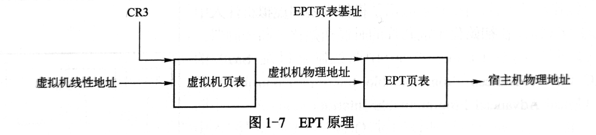

# QEMU 与 KVM 概述

> "All problems in computer science can be solved by another level of indirection" --David Wheeler

## QEMU 与 KVM 架构


上图为 QEMU 与 KVM 的完整架构，比较完整地展现了 QEMU 与 KVM 虚拟化的各个方面，包括 QEMU 的运行机制，KVM 的组成，QEMU 与 KVM 的关系，虚拟机 CPU、内存、外设等的虚拟化。

左上半部分是 VMX root 模式的应用层，下面是 VMX root 模式的内核层。所谓 VMX root，其实是相对于 VMX non-root 模式而言。都是 CPU 引入支持硬件虚拟化指令集 VT-x 之后出现的。现在可将 VMX root 理解成宿主机模式，VMX non-root 理解成虚拟机模式。右边上半部分表示的是虚拟机运行在 VMX non-root 模式下。

**CPU 的运行模式与 CPU 运行时的特权级是正交的。**

左边上半部分列出了 QEMU 的主要任务，QEMU 在初始化的时候会创建模拟的芯片组，创建 CPU 线程来表示虚拟机的 CPU 执行流，在 QEMU 的虚拟地址空间中分配空间作为虚拟机的物理地址，QEMU 还需要根据用户在命令行指定的设备为虚拟机创建对应的虚拟设备。在虚拟机运行期间，QEMU 会在主线程中监听多种事件，包括虚拟机对设备 I/O 的访问、用户对虚拟机管理界面、虚拟设备对应的宿主机上的一些 I/O 事件（如网络数据接收）等。QEMU 应用层接收到这些事件后会调用预先定义好的函数进行处理。

右上部分表示虚拟机的运行。虚拟机的一个 CPU 对应为 QEMU 进程中的一个线程，通过 QEMU 和 KVM 的相互协作，这些线程被宿主机操作系统正常调度，直接执行虚拟机中的代码。虚拟机的物理内存对应位 QEMU 进程中的虚拟内存，由 KVM 的页表完成 GPA 到 HPA 的转换。虚拟机的设备通过 QEMU 呈现给它，操作系统启动时进行设备枚举，加载对应的驱动。虚拟机操作系统通过设备的 I/O 端口或者 MMIO 进行交互，KVM 会截获这些请求，大多数会分发到用户空间的 QEMU 进程。

下半部分表示位于 Linux 内核中的 KVM 模块。一方面通过 /dev/kvm 设备导出了一系列接口供 QEMU 等用户态程序通过接口控制虚拟机，另一方面 KVM 需要截获虚拟机产生的 VM Exit 事件并进行处理。

- CPU 虚拟化，QEMU 创建 VCPU 线程，初始化 VCPU 寄存器值，然后调用 KVM 接口，运行虚拟机，在物理 CPU 上执行虚拟机的代码。虚拟机运行后，KVM 需要截获虚拟机中的敏感指令，当虚拟机执行敏感指令或满足一定条件时，CPU 会从 VMX non-root 模式退出到 KVM，如果 KVM 无法处理，则会将操作分派到 QEMU 中。处理完成后又可以将 CPU 置于 VMX non-root 模式，即 VM Entry。KVM 使用 VMCS 结构来保存虚拟机 VM Exit 和 VM Entry 的状态。

- 内存虚拟化，QEMU 初始化时调用 KVM 接口告知虚拟机所需的物理内存。通过 mmap 系统调用分配虚拟内存空间作为虚拟机的物理内存，QEMU 在不断更新内存布局的过程中会持续调用 KVM 的接口告知虚拟机内存分布。虚拟机运行时，要将 GVA 转换为 GPA，再转为 HVA，最后转换为 HPA。CPU 支持 EPT 之前，使用影子页表的软件方法实现 GVA 到 HPA 的转换。CPU 支持 EPT 之后，CPU 会自动完成 GVA 到 HPA 的转换。虚拟机第一次访问内存的时候就会陷入 KVM，逐渐建立起所谓的 EPT 页面。VCPU 之后访问 GVA 时，首先被转换为 GPA，查找 EPT 页表，得到 HPA。

  

- 设备虚拟化，QEMU 最多的代码就是设备模拟，其本质是要为虚拟机提供一个与物理设备接口完全一致的虚拟接口。虚拟机的操作系统与设备进行的数据交互或者由 QEMU 或 KVM 完成，或者由宿主机上对应的后端设备完成。QEMU 在初始化过程中会创建好模拟芯片组和必要的模拟设备，包括南北桥芯片、PCI 总线等总线系统，以及各种设备。QEMU 的命令行可以指定可选的设备以及设备配置项。最开始 QEMU 只有纯软件模拟，对设备寄存器的读写会陷入 KVM，进而到 QEMU 进行处理并模拟硬件行为。后来提出了 virtio 设备方案，virtio 是一类特殊的设备，没有对应的物理设备，需要虚拟机内部操作系统安装特殊的 virtio 驱动，相当于变成半虚拟化。最后又有了设备直通方案，将物理硬件直接挂到虚拟机上，直接交互，与设备直通经常一起使用的有设备的硬件虚拟化支持技术 SRIOV Single Root I/O Virtualization，它能将单个的物理硬件高效地虚拟出多个虚拟硬件。

- 中断虚拟化，中断系统是操作系统必不可少的部分。操作系统通过写设备的 I/O 端口或者 MMIO 地址与设备交互，设备通过发送中断来通知操作系统事件。QEMU 在初始化主板芯片时初始化中断控制器，支持单 CPU 的 8259 和 SMP 的 I/O APIC 和 LAPIC。传统上，如果虚拟外设通过 QEMU 向虚拟机注入中断，需要先陷入到 KVM，再由 KVM 注入中断。为了提高效率，KVM 也实现了中断控制器，用户可以有选择地让 QEMU 或 KVM 模拟中断控制器。QEMU/KVM 一方面要模拟终端设备，另一方面需要模拟中断的请求。

## KVM API 使用实例

KVM 导出了一系列接口供用户态创建、配置、启动虚拟机，典型的用户态软件就是 QEMU。作者在本节以一个简单的例子展示了 QEMU 和 KVM 的关系。

首先一个精简的内核代码，向端口 0xf1 写入 Hello 字符串，然后调用 hlt 指令。

```asm
start:
    mov $0x48,%al
    outb %al,$0xf1
    mov $0x65,%al
    outb %al,$0xf1
    mov $0x6c,%al
    outb %al,$0xf1
    mov $0x6c,%al
    outb %al,$0xf1
    mov $0x6f,%al
    outb %al,$0xf1
    mov $0x0a,%al
    outb %al,$0xf1


    hlt
```

然后是一个精简的 QEMU：

```c
#include<stdio.h>
#include<fcntl.h>
#include<sys/mman.h>
#include<linux/kvm.h>

int main() {
    struct kvm_sregs sregs;
    int ret;
    // 获取系统中 KVM 子系统的文件描述符 kvmfd
    int kvmfd = open("/dev/kvm", O_RDWR);
    // 获取 KVM 版本号，以便查看接口
    printf("%d\n", ioctl(kvmfd, KVM_GET_API_VERSION, NULL));
    // 创建一个虚拟机，返回一个虚拟机描述符 vmfd，可用于控制虚拟机的内存、VCPU 等
    int vmfd = ioctl(kvmfd, KVM_CREATE_VM, 0);
    // 虚拟机的物理内存对应 QEMU 的进程地址空间
    // 使用 mmap 系统调用分配 1 页内存
    unsigned char *ram = mmap(NULL, 0x1000, PROT_READ | PROT_WRITE, MAP_SHARED | MAP_ANONYMOUS, -1, 0);
    int kfd = open("test.bin", O_RDONLY);
    // 将内核代码加载到分配的内存
    read(kfd, ram, 4096);
    // 用分配的内存地址初始化对象
    struct kvm_userspace_memory_region mem = {
        .slot = 0,                              // 表示不同的内存空间
        .guest_phys_addr = 0,                   // 这段空间在虚拟机物理内存中的位置
        .memory_size = 0x1000,                  // 内存大小
        .userspace_addr = (unsigned long)ram,   // 物理空间对应宿主机的虚拟内存地址
    };
    // 为虚拟机指定了一个内存条
    ret = ioctl(vmfd, KVM_SET_USER_MEMORY_REGION, &mem);
    // 创建 VCPU
    int vcpufd = ioctl(vmfd, KVM_CREATE_VCPU, 0);
    // 每个 VCPU 都有一个 struct kvm_run 结构，用来在用户态 light-qemu 和内核态 KVM 共享数据
    int mmap_size = ioctl(kvmfd, KVM_GET_VCPU_MMAP_SIZE, NULL);
    // 映射到用户空间
    struct kvm_run *run = mmap(NULL, mmap_size, PROT_READ | PROT_WRITE, MAP_SHARED, vcpufd, 0);
    // 设置 VCPU 寄存器，段寄存器和控制寄存器放在 kvm_sregs，通用寄存器放在 kvm_regs
    ret = ioctl(vcpufd, KVM_GET_SREGS, &sregs);
    sregs.cs.base = 0;
    sregs.cs.selector = 0;
    ret = ioctl(vcpufd, KVM_SET_SREGS, &sregs);
    struct kvm_regs regs = {
        .rip = 0,
    };
    ret = ioctl(vcpufd, KVM_SET_REGS, &regs);
    // 一个简单的虚拟机和虚拟机 VCPU、内存都准备完毕，寄存器设置完成，可以运行了
    while(1) {
        // 对 vcpufd 调用 KVM_RUN，遇到敏感指令就会退出
        // 如果 KVM 不能处理就就会交给应用层软件处理
        // ioctl 返回，将一些信息保存在 kvm_run 中
        ret = ioctl(vcpufd, KVM_RUN, NULL);
        if(ret == -1) {
            printf("exit unknown\n");
            return -1;
        }
        switch (run->exit_reason)
        {
        case KVM_EXIT_HLT:
            puts("KVM_EXIT_HLT");
            return 0;
        case KVM_EXIT_IO:
            putchar(*(((char*)run) + run->io.data_offset));
            break;
        case KVM_EXIT_FAIL_ENTRY:
            puts("entry error");
            return -1;
        default:
            puts("other error");
            printf("exit_reason: %d\n", run->exit_reason);
            return -1;
        }
    }

}
```

编译执行：

```shell
$ as -32 test.S -o test.o
$ objcopy -O binary test.o test.bin

$ gcc qemu.c -o light-qemu
$ ./light-qemu
Hello
KVM_EXIT_HLT
```

KVM 通过一组 ioctl 向用户空间导出接口，这些接口能够用于虚拟机的创建、内存设置、VCPU 的创建和运行等。按照接口所使用的文件描述符 fd 不同，大致分为三类：

- 系统全局的 ioctl，这类 ioctl 的作用对象是 KVM 模块本身，比如一些全局的配置项，创建虚拟机的 ioctl 也在此列。
- 虚拟机相关的 ioctl，这类 ioctl 的作用对象是一台虚拟机，比如设置虚拟机的内存布局、创建 VCPU。
- 虚拟机 VCPU 相关的 ioctl，这类 ioctl 的作用对象是一个虚拟机的 VCPU，比如开始 VCPU 的运行。