# 从开机加电到执行 main 函数之前的过程

从开机到 main 函数的执行分三步完成，目的是实现从启动盘加载操作系统程序，完成执行 main 函数所需要的准备工作。

- 第一步，启动 BIOS，准备实模式下的中断向量表和中断服务程序；
- 第二步，从启动盘加载操作系统程序到内存，加载的工作就是利用第一步中准备的中断服务程序实现的；
- 第三步，为执行 32 位的 main 函数做过渡工作。

本章讲详细分析这三步在计算机中是如何完成的，以及每一步在内存中都做了些什么。

> 实模式 Real Mode，8086 等早期的 CPU 只有一种操作模式，类似于实模式；i386 CPU 开机状态是实模式。20 位地址空间

## 启动 BIOS，准备实模式下的中断向量表和中断服务程序

加电的一瞬间，计算机内存 RAM 中什么程序都没有。而 操作系统（即我们的 Linux 0.11） 在软盘中，但 CPU 被设计为只能运行内存中的程序。如果要运行软盘中的操作系统，必须将软盘中的操作系统程序加载到内存（RAM）中。

> RAM (Random Access Memory): 随机存取存储器，加电状态下可任意读写，断电后信息消失。

**BIOS 负责完成加载软盘中操作系统的任务。**

### BIOS 的启动原理

开机加电的一瞬间，内存中什么程序也没有，无法人为地执行 BIOS，就只能靠硬件方法完成。

从硬件角度来看，Intel 80x86 CPU 可以在实模式和保护模式运行，为了兼容，也为了解决最开始的启动问题，Intel 将所有 80x86 系列的 CPU，包括最新型号的 CPU 的硬件都设计为 **加电即进入 16 位实模式状态运行**。同时，CPU 硬件逻辑设计为加电瞬间将 CS 的值置为 `0xF000`、IP 的值置为 `0xFFF0`，这样 CS:IP 就只想了 `0xFFFF0` 这个地址位置，它指向了 BIOS 的地址范围。

这是一个纯硬件完成的动作，而 BIOS 程序的入口地址恰恰就是 `0xFFFF0`。

### BIOS 在内存中加载中断向量表和中断服务程序

BIOS 程序被固化在计算机主板上的一块很小的 ROM 芯片里。通常不同主板所用的 BIOS 也有所不同，就启动部分而言，各种类型的 BIOS 的基本原理大致相似。本书选用的 BIOS 只有 8KB，所占地址段为 `0xFE000~0xFFFFF`。BIOS 启动后，一项对启动操作系统至关重要的工作，就是 BIOS 在内存中建立中断向量表和中断服务程序。

> ROM (Read Only Memory): 只读存储器。断电之后仍能保存信息。

BIOS 程序在内存最开始的位置 `0x00000` 用 1KB 的内存空间构建了中断向量表，在紧挨着它的位置用 256B 构建了 BIOS 数据区，并在大约 57KB 以后的位置 `0x0E05B` 加载了 8KB 左右的与中断向量表对应的若干中断服务程序。中断向量表有 256 个中断向量，每个占 4B，即 CS 和 IP 的值。

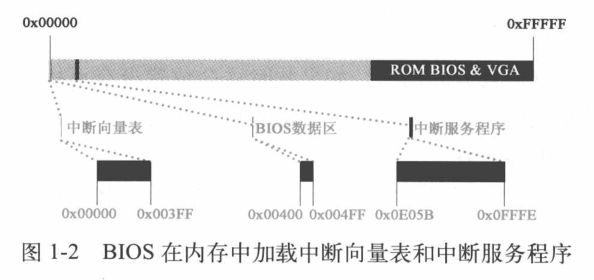

## 加载操作系统内核程序并为保护模式做准备

从现在开始，就要执行真正的 boot 操作了，即把软盘中的操作系统程序加载到内存。对于 Linux 0.11 而言，分三批逐次加载操作系统内核代码。

- 第一批由 BIOS 中断 `int 0x19` 把第一扇区 bootsect 的内容加载到内存；
- 第二批、第三批在 bootsect 的指挥下，分别把其后的 4 个扇区和随后的 240 个扇区的内容加载至内存。

### 加载第一部分内核代码——引导程序（bootsect）

经过执行一系列 BIOS 代码之后，计算机完成自检等操作。把软盘设置为启动设备后，计算机硬件体系结构的设计与 BIOS 联手操作，让 CPU 接收到一个 `int 0x19` 中断。CPU 接收到中断后，会立即在中断向量表中找到 `int 0x19` 中断向量。

接下来，中断向量把 CPU 指向 `0x0E6F2`，即为对应的中断服务程序的入口地址。这个中断服务程序的作用就是把软盘的第一扇区中的程序（512B）加载到内存中的指定位置。这个中断服务程序的功能是 BIOS 事先设计好的，代码是固定的，与 Linux 操作系统无关。

将软驱 0 盘面 0 磁道 1 扇区的内容复制至内存 `0x07C00` 处。这个扇区里得内容就是 Linux 0.11 的引导程序，也就是 bootsect，其作用就是陆续把软盘中的操作系统程序载入内存。也就是启动扇区，其中的程序就是 bootsect.s 中的汇编程序汇编而成的。由此，内存中第一次有了 Linux 自己的代码，下面的工作就是执行 bootsect 把软盘的第二批、第三批代码载入内存。

> 操作系统和 BIOS 之间的协调机制：
>
> - 操作系统，约定把最开始的执行程序定位在启动扇区
> - BIOS，约定接到启动操作系统的命令，只从启动扇区把代码加载到 0x07C00 位置

### 加载第二部分内核代码——setup

#### bootsect 对内存的规划

为了加载后续程序，bootsect 首先做的工作就是规划内存。为了更准确地理解操作系统的运行机制，我们必须清楚操作系统的设计者是如何规划内存的。

实模式最大寻址范围是 1MB。为了规划内存，bootsect 首先设计了如下代码：

```asm
SYSSIZE = 0x3000			; 系统模块长度，单位为节，16B 为一节
							; 0x3000 即 0x30000 Bytes = 192 KB
...
.globl begtext, begdata, begbss, endtext, enddata, endbss
.text
begtext:
.data
begdata:
.bss						; 未初始化数据段 Blocked Started by Symbol
begbss:
.text

SETUPLEN = 4				! nr of setup-sectors
BOOTSEG  = 0x07c0			! original address of boot-sector
INITSEG  = 0x9000			! we move boot here - out of the way
SETUPSEG = 0x9020			! setup starts here
SYSSEG   = 0x1000			! system loaded at 0x10000 (65536).
ENDSEG   = SYSSEG + SYSSIZE		! where to stop loading

! ROOT_DEV:	0x000 - same type of floppy as boot.
!		0x301 - first partition on first drive etc
ROOT_DEV = 0x306

entry _start
```

以上代码设置了后续操作设计的内存位置

- SETUPLEN，要加载的 setup 程序的扇区数
- SETUPSEG，setup 程序的加载位置
- BOOTSEG，BIOS 加载启动扇区的位置
- INITSEG，启动扇区将要移动到的新位置
- SYSSEG，内核被加载的位置
- ENSDEG，内核的末尾位置
- ROOT_DEV，根文件系统设备号

设置这些位置就是为了确保将要载入内存的代码和已经在内存的代码及数据各在其位，互不覆盖。

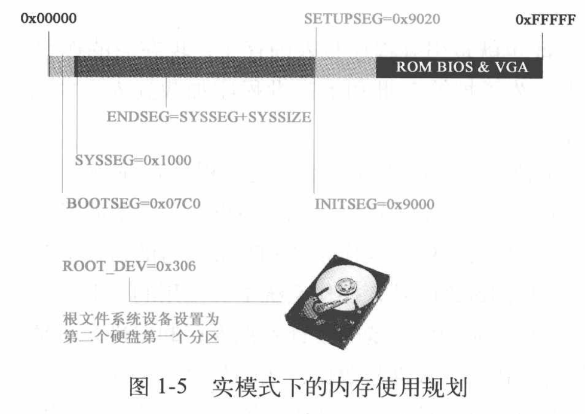

**操作系统的设计者是要全面地、整体地考虑内存的规划的。**

#### 复制 bootsect

接下来，bootsect 将自身（全部 512B 内容）从内存 `0x07c00` 复制到内存 `0x90000` 处，代码如下：

```asm
entry start
start:
	mov	ax,#BOOTSEG
	mov	ds,ax					; ds 段寄存器置为 0x7c0
	mov	ax,#INITSEG
	mov	es,ax					; es 段寄存器置为 0x9000
	mov	cx,#256					; 设置移动计数值 256 字
	sub	si,si					; 源地址 ds:si = 0x07c0:0x0000
	sub	di,di					; 目的地址 es:di = 0x9000:0x0000
	rep							; 重复执行并递减 cx，知道 cx = 0
	movw						; 从 [si] 处移动一个 word(2 Bytes) 到 [di] 处
								; 配合 rep 就是把 256 个 word 复制到 INITSEG 处
```

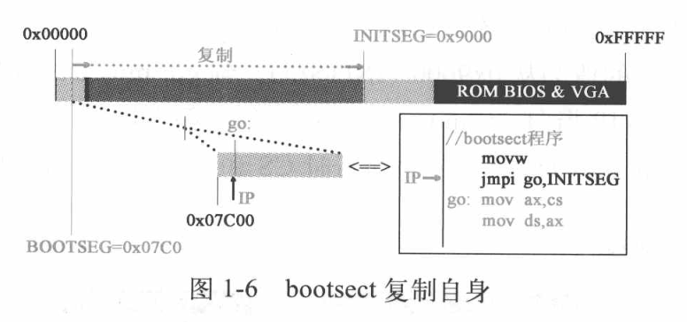

复制后执行以下代码：

```asm
	jmpi	go,INITSEG			; 段间跳转，跳转到 INITSEG:go 处开始执行
go:	mov	ax,cs					; 此处已经是在移动后的新位置 0x90000 处执行
	mov	ds,ax					; 设置段寄存器和栈寄存器
	mov	es,ax
! put stack at 0x9ff00.
	mov	ss,ax					;  cs = ds = es = ss = 0x9000 sp = 0xff00
	mov	sp,#0xFF00		! arbitrary value >>512 只要远大于 512 即可（即避开 setup 部分）
```

跳转后来到新的代码段，此时 CS 的值为 INITSEG 即 `0x9000`，IP 的值为 [go]，从复制后的新段开始执行。

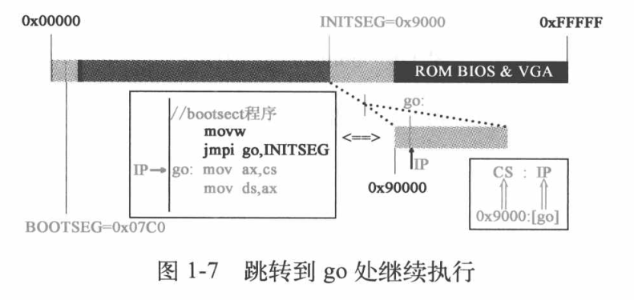

`jmpi go, INITSEG` 这条指令实现了 **到新位置后接着原来的执行序继续执行下去** 的目的。

调整 DS、ES、SS 和 SP 寄存器，为后面程序的栈操作打下基础。

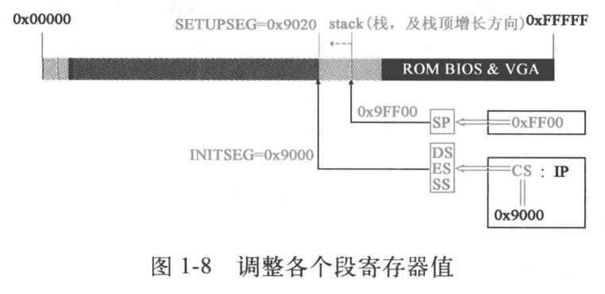

#### 将 setup 程序加载到内存中

加载 setup 程序，需要借助 BIOS 提供的 `int 0x13` 中断向量所指向的中断服务程序来完成。与之前 `int 0x19` 对应的启动加载服务程序不同的是，前者是 BIOS 执行的，而此程序是 bootsect 执行。且可以根据设计者的意图，把指定扇区的代码加载到内存的指定位置。依次需要传参，代码如下：

```asm
! load the setup-sectors directly after the bootblock.
! Note that 'es' is already set up.

load_setup:
	mov	dx,#0x0000		! drive 0, head 0		
						; dh = 磁头号 dl = 驱动器号 如果是硬盘则位 7 置位
	mov	cx,#0x0002		! sector 2, track 0 	
						; ch = 磁道号的低 8 位 cl = 0-5 位 开始扇区 6-7 位磁道号高 2 位
	mov	bx,#0x0200		! address = 512, in INITSEG	
						; es:bx 指向数据缓冲区 如果出错，ah 是出错吗
	mov	ax,#0x0200+SETUPLEN	! service 2, nr of sectors	
							; ah = 0x02 表示读扇区到内存 al = 要读的扇区数量
	int	0x13			! read it
	jnc	ok_load_setup		! ok - continue
							; CF 未置位即成功加载
	mov	dx,#0x0000
	mov	ax,#0x0000		! reset the diskette
	int	0x13
	j	load_setup
```

从软盘第二扇区开始的 4 个扇区加载到内存 ES:BX 即 `0x90200` 处，紧挨着 bootsect。等到 bootsect 执行完毕，setup 程序就会开始工作。

### 加载第三部分内核代码——system 模块

加载第三批代码，仍然使用 BIOS 提供的 `int 0x13` 中断。跟上一步没有本质差别，只是加载的扇区数多达 240，时间也更长。这里 Linus 设计了显示一行 Loading system ... 作为提醒。

加载过程由 bootsect 调用 read_it 子程序完成，长时间操作软盘，需要对设备进行更多的监控，对读盘结果不断进行检测。所以 read_it 的调用步骤较多，但基本操作还是由 `int 0x13` 中断服务程序完成。

整个操作系统的代码全部加载到内存后，还需要确定一下根设备号。

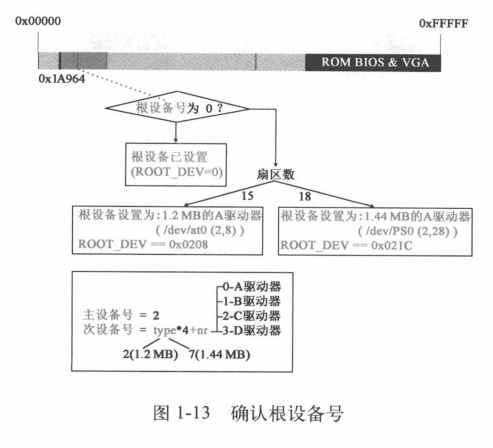

```asm
! we want to load the system (at 0x10000)

	mov	ax,#SYSSEG
	mov	es,ax		! segment of 0x010000
	call	read_it
...
read_it:
...					; 代码比较多就不贴了
.org 508
root_dev:
	.word ROOT_DEV
boot_flag:
	.word 0xAA55
```

Linux 0.11 使用 Minix 操作系统的文件系统管理方式，要求系统必须存在一个根文件系统，其他文件系统挂接其上。而 Linux 0.11 未提供在设备上建立文件系统的工具，故必须在一个正在运行的系统上利用工具做出一个文件系统并加载至本机。Linux 0.11 在 BIOS 中设置软盘作为启动盘，经过一系列检测，确认计算机中实际安装的软盘驱动器为根设备，并将信息写入机器系统数据。之后的 main 函数一开始就用机器系统数据中的这个值设置根设备，并为根文件系统加载奠定基础。根设备号存于第 508 字节开始的 2 字节处，末尾两字节则设为 `0xAA55`。

最后执行 `jmpi 0, SETUPSEG` 指令条转到 `0x90200` 处，开始执行 setup 程序。

setup 程序做的第一件事就是利用 BIOS 提供的中断服务程序从设备上提取内核运行所需的机器系统数据，其中包括光标位置、显示页面等数据，并分别从中断向量 `0x41` 和 `0x46` 向量值所致的内存地址处获取硬盘参数表1、2，把他们存放在 `0x9000:0x0080` 和 `0x9000:0x0090` 处。这意味着 bootsect 数据会被覆盖掉，这些机器系统数据被加载到内存的 `0x90000~0x901FC` 位置，在以后 main 函数执行时发挥重要作用。

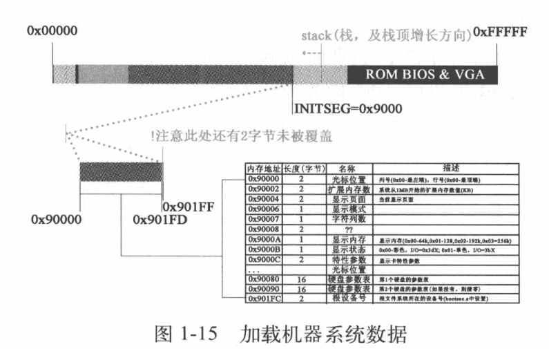

到此，操作系统内核程序的加载工作已经完成。接下来系统通过已经加载到内存中的代码，将实现 **从实模式到保护模式的转变** 。

## 开始向 32 位模式转变，为 main 函数的调用做准备

接下来，操作系统要使计算机在 32 位保护模式下工作，这期间要做大量的重建工作，并持续工作到操作系统的 main 函数的执行过程中。本节中，操作系统执行的操作包括打开 32 位的寻址空间、打开保护模式、建立保护模式下的中断响应机制等与保护模式配套的相关工作、建立内存的分页机制，最后做好调用 main 函数的准备。

### 关中断并将 system 移动到内存地址起始位置 `0x00000`

准备工作先要关闭中断，即将 CPU 的标志寄存器 EFLAGS 中的中断允许标志 IF 置 0。直到 main 函数中能够适应保护模式的中断服务体系被重建完毕才会打开中断，而那时相应中断的服务程序不再是由 BIOS 提供，而是系统自身提供的中断服务程序。

下面要进行一个 **影响深远** 的操作，将 system 模块移植到正确的位置，即从 `0x10000~0x90000` 移动到 `0x00000~0x80000` 处，代码如下：

```asm
	mov	ax,#0x0000
	cld			! 'direction'=0, movs moves forward	; 指定内存方向，即从头开始复制
do_move:
	mov	es,ax		! destination segment	; 目的地址 es:si = 0x0000:0x0000
	add	ax,#0x1000							; 一次移动 0x1000
	cmp	ax,#0x9000							; 直到移动完成 0x10000 ~ 0x90000 的
	jz	end_move
	mov	ds,ax		! source segment		; 源地址 ds:di = 0x1000:0x0000
	sub	di,di
	sub	si,si
	mov 	cx,#0x8000						; 移动 0x8000 个 word = 0x10000 字节
	rep
	movsw
	jmp	do_move
```

回顾之前的内容，`0x00000` 这个位置原来存放的是 BIOS 建立的中断向量表、BIOS 数据区和中断处理程序。这个复制动作直接覆盖了 BIOS 的中断机制，直到新的中断机制构建完成，操作系统不再具备响应并处理中断的能力。

> 这一复制操作既废除旧的中断机制，又回收了内存，更让内核代码占据了内存物理地址最开始、天然的有利位置。

### 设置中断描述符表和全局描述符表

setup 程序继续为保护模式做准备，通过自身提供的数据信息对中断描述符表寄存器 IDTR 和全局描述符表寄存器 GDTR 进行初始化设置。

> GDT (Global Descriptor Table) 全局描述符表，在系统中唯一的存访段寄存器内容（段描述符）的数据，配合程序进行保护模式下的段寻址。其中存访每一个任务的局部描述符表 LDT 地址和任务状态段 TSS 地址，完成进程中各段的寻址、现场保护与现场恢复。
>
> GDTR GDT 基址寄存器，操作系统完成对 GDT 的初始化后，用 LGDT 命令将基址加载到 GDTR。
>
> IDT 中断描述符表，保存保护模式下所有中断服务程序的入口地址，类似于实模式下的中断向量表。IDTR 保存了 IDT 的起始地址。

设置中断描述符表和全局描述符表，代码如下：

```asm
end_move:
	mov	ax,#SETUPSEG	! right, forgot this at first. didn't work :-)
	mov	ds,ax
	lidt	idt_48		! load idt with 0,0
	lgdt	gdt_48		! load gdt with whatever appropriate
...
gdt:											; GDTR 指向这
	.word	0,0,0,0		! dummy
	; 内核代码段
	.word	0x07FF		! 8Mb - limit=2047 (2048*4096=8Mb)
	.word	0x0000		! base address=0
	.word	0x9A00		! code read/exec
	.word	0x00C0		! granularity=4096, 386
	; 内核数据段
	.word	0x07FF		! 8Mb - limit=2047 (2048*4096=8Mb)
	.word	0x0000		! base address=0
	.word	0x9200		! data read/write
	.word	0x00C0		! granularity=4096, 386

idt_48:
	.word	0			! idt limit=0
	.word	0,0			! idt base=0L

gdt_48:
	.word	0x800		! gdt limit=2048, 256 GDT entries
	.word	512+gdt,0x9	! gdt base = 0X9xxxx	; 即指向 setup 地址加上 gdt 在本段的偏移地址
```

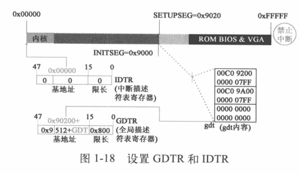

实模式中断使用向量表，固定在 `0x00000`，而保护模式使用中断描述符表，位置不固定，通过 IDTR 访问。

此处的 IDT 还是只空表，在之后开启中断之前设置即可。

### 打开 A20，实现 32 位寻址

下面是标志性的动作——**打开 A20！** 这意味着 CPU 可以进行 32 位寻址，最大寻址空间为 4GB。（虽然只支持 16MB 的物理内存）代码如下：

```asm
! that was painless, now we enable A20
	; 通过设置键盘控制器的端口值打开 A20
	call	empty_8042
	mov	al,#0xD1		! command write
	out	#0x64,al
	call	empty_8042
	mov	al,#0xDF		! A20 on
	out	#0x60,al
	call	empty_8042
...
empty_8042:
	.word	0x00eb,0x00eb
	in	al,#0x64	! 8042 status port
	test	al,#2		! is input buffer full?
	jnz	empty_8042	! yes - loop
	ret
```

在 16 位寻址模式下超过 `0xFFFFF` 的地址会回滚，开启 A20 相当于关闭了回滚机制，后续可以利用此特点验证 A20 是否打开。

### 为保护模式下执行 head.s 做准备

要建立保护模式下的中断机制，setup 将对可编程中断控制器 8259A 进行重新编程。代码如下：

```asm
	mov	al,#0x11		! initialization sequence
	out	#0x20,al		! send it to 8259A-1
	.word	0x00eb,0x00eb		! jmp $+2, jmp $+2 ; $ 表示当前指令地址
	out	#0xA0,al		! and to 8259A-2
	.word	0x00eb,0x00eb
	mov	al,#0x20		! start of hardware int's (0x20) ; 硬件中断被设置成从 0x20 开始
	out	#0x21,al
	.word	0x00eb,0x00eb
	mov	al,#0x28		! start of hardware int's 2 (0x28)
	out	#0xA1,al
	.word	0x00eb,0x00eb
	mov	al,#0x04		! 8259-1 is master
	out	#0x21,al
	.word	0x00eb,0x00eb
	mov	al,#0x02		! 8259-2 is slave
	out	#0xA1,al
	.word	0x00eb,0x00eb
	mov	al,#0x01		! 8086 mode for both
	out	#0x21,al
	.word	0x00eb,0x00eb
	out	#0xA1,al
	.word	0x00eb,0x00eb
	mov	al,#0xFF		! mask off all interrupts for now
	out	#0x21,al
	.word	0x00eb,0x00eb
	out	#0xA1,al
```

大概就是操作两个 8259A 芯片。CPU 在保护模式下 `int 0x00~0x1F` 是内部中断（不可屏蔽）和异常中断。通过重新编程将原来的 IRQ 终端号重新分布到 `int 0x20~0x2F`。

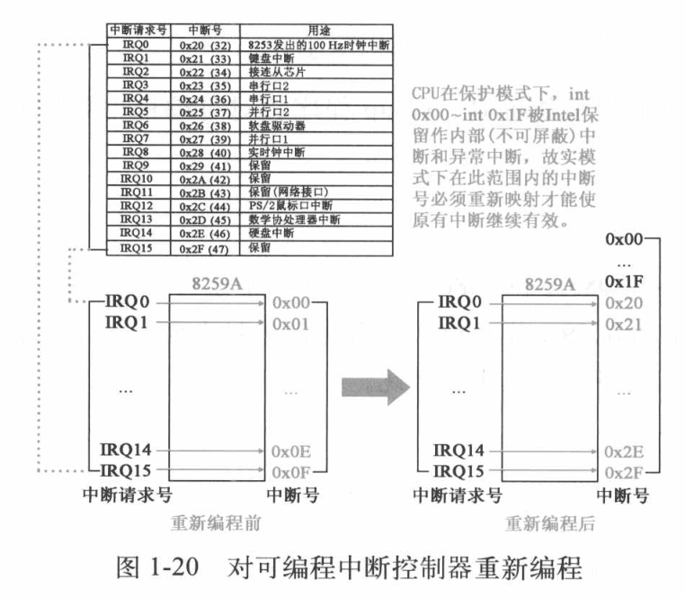

之后将 CPU 工作方式设为保护模式，将 CR0 寄存器 0 位置 1。

```asm
	mov	ax,#0x0001	! protected mode (PE) bit			; 保护模式置位
	lmsw	ax		! This is it!						; 加载继器状态字 mov cr0, ax
	jmpi	0,8		! jmp offset 0 of segment 8 (cs)	; 跳转至 cs(1000) 段偏移 0
```

保护模式的重要特征就是要根据 GDT 决定后续执行哪里的程序。这个 8 代表保护模式下的段选择符，用于选择描述符表和描述符表项以及所要求的特权级。要理解成 `1000b`，低 2 位表示内核特权级；3 位 0 表示 GDT，1 则是 LDT；而 1 则是在 GDT 的索引。通过段选择符找到 GDT 中的段描述符结构如下图：


到此，setup 程序执行完毕，它为系统在保护模式运行做了一系列的准备工作，后续的准备工作将由 head 程序来完成。

### head.s 开始执行

head 程序和内核程序链接成 system 模块，所以之前将 system 模块移动到 `0x00000` 位置，也就是 head 程序在 `0x00000`，占用 25KB+184B 空间。

head 程序除了做一些调用 main 的准备工作之外，还用程序自身的代码在程序自身的内存空间创建了内核分页机制，即在 `0x00000` 的位置创建了页目录表、页表、缓冲器、GDT、IDT，将 head 程序已经执行过的代码所占内存空间覆盖。代码如下：

```asm
.text
.globl _idt,_gdt,_pg_dir,_tmp_floppy_area
_pg_dir:
startup_32:
	movl $0x10,%eax
	mov %ax,%ds
	mov %ax,%es
	mov %ax,%fs
	mov %ax,%gs
```

\_pg\_dir 标识内核分页机制完成后的内核起始位置，也就是物理内存起始位置 `0x00000`。head 程序在此处建立页目录表，为分页机制做准备。实模式下，CS 本身就是代码段基址，而在保护模式下，CS 本身不是代码段基址，而是代码段选择符。

将 DS、ES、FS、GS 等其他寄存器从实模式转变为保护模式，值为 `0x10`，对应的是 GDT 的第 2 项，也就是说这四个寄存器使用同一个全局描述符。

SS 要变成栈选择符，栈顶指针也要换成 32 位的 ESP：

```asm
; 将内存(32/48 位)低字传送给16/32位寄存器，把高16位传给相应的段寄存器 lds/les/lfs/lgs/lss mem, reg
lss _stack_start,%esp
```

在 kernel/sched.c 中定义了：

```c
long user_stack[PAGE_SIZE>>2]
stack_start = { &user_stack[PAGE_SIZE>>2], 0x10}
```

可计算出起始位置为 `0x1E25C`，即最后将 SS 设置为与前面 4 个段选择符相同，栈指针也变为了 ESP。

从实模式转变到保护模式，段基址的使用方法和实模式差别非常大，要使用 GDT 产生基址。

接下来 head 程序对 IDT 进行设置，代码如下：

```asm
setup_idt:
	lea ignore_int,%edx
	movl $0x00080000,%eax
	movw %dx,%ax		/* selector = 0x0008 = cs */
	movw $0x8E00,%dx	/* interrupt gate - dpl=0, present */

	lea _idt,%edi
	mov $256,%ecx
rp_sidt:					; 参考中断描述符格式
	movl %eax,(%edi) 		; eax : 0008, low(ignore_int)
	movl %edx,4(%edi)		; eax : high(ignore_int), 8E00
	addl $8,%edi
	dec %ecx
	jne rp_sidt
	lidt idt_descr
	ret
...
/* This is the default interrupt "handler" :-) */
int_msg:
	.asciz "Unknown interrupt\n\r"
.align 2
ignore_int:
...
idt_descr:
	.word 256*8-1		# idt contains 256 entries
	.long _idt
...
_idt:	.fill 256,8,0		# idt is uninitialized
```

IDT 有 256 项，以上代码将其中的断服务程序都设置成了 ignore_int，以后真正用到的时候可以再装。idt_descr 是要写入 IDTR 的限长和基地址 \_idt，相当于前面的 idt\_48。

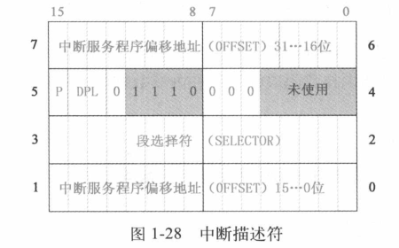

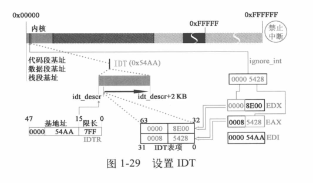

构造 IDT 先搭建了中断机制的框架，实际的中断服务程序挂接则在 main 函数中完成，未使用的中断描述符都指向了一个会输出错误提示的程序。

现在，head 程序要废除已有的 GDT，并在内核中的新位置重新创建 GDT。代码如下：

```asm
setup_gdt:
	lgdt gdt_descr
	ret
...
gdt_descr:
	.word 256*8-1		# so does gdt (not that that's any
	.long _gdt		# magic number, but it works for me :^)

	.align 3
_idt:	.fill 256,8,0		# idt is uninitialized

_gdt:	.quad 0x0000000000000000	/* NULL descriptor */
	.quad 0x00c09a0000000fff	/* 16Mb */
	.quad 0x00c0920000000fff	/* 16Mb */
	.quad 0x0000000000000000	/* TEMPORARY - don't use */
	.fill 252,8,0			/* space for LDT's and TSS's etc */
```

新的 GDT 只修改了原表中的段限长。

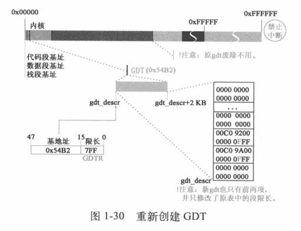

原来的 GDT 是在 setup 程序的数据里，而 setup 模块会被覆盖，所以找个安全的位置就在 head 程序中。也无法做到在执行 setup 时直接就把 GDT 复制到 head 的位置，因为 system 模块的移动也会覆盖数据。

段限长更改后需要重新设置 DS、ES、FS、GS 及 SS，与之前的代码相似。

设置完还要检验 A20 地址线是否确实打开，检测的代码如下：

```asm
; 检验 A20 地址线是否打开 往 0x000000 写值，跟 0x100000 比较，如果相等就一直比较下去，即死机
	xorl %eax,%eax
1:	incl %eax		# check that A20 really IS enabled
	movl %eax,0x000000	# loop forever if it isn't
	cmpl %eax,0x100000
```

确定 A20 打开后，如果 head 程序检测到数学协处理器存在，则将其设置为保护模式工作状态。（现在看应该没啥用

head 程序将为调用 main 函数做最后的准备，代码如下：

```asm
after_page_tables:
	pushl $0		# These are the parameters to main :-)
	pushl $0
	pushl $0
	pushl $L6		# return address for main, if it decides to.
	pushl $_main
	jmp setup_paging
L6:
	jmp L6			# main should never return here, but
				# just in case, we know what happens.
```

依次将 envp、argv、argc 压栈，然后将 L6 标号作为 main 的返回地址入栈，将 main 地址作为当前返回地址入栈，这样 head 执行完通过 ret 指令就直接执行 main 函数。压栈完成后，跳转到 setup_paging，开始创建分页机制。

先将页目录表和 4 个页表（16 M 物理内存）放在起始位置，从内存起始位置开始的 5 页空间内容全部清零。将页目录表和 4 个页表放在物理内存的起始位置，意义重大，是操作系统能够掌握全局、掌控进程在内存中安全运行的基石之一。之后设置页目录表的前 4 项指向后面的 4 个页表。

设置完页目录表后，Linux 0.11 在保护模式下支持的最大寻址地址为 `0xFFFFFF` 16MB，此处将第 4 个页表的最后一个页表项即 pg3+4092 指向寻址范围的最后一个页面，即 `0xFFF000`开始的 4KB 大小的空间。然后开始从高地址向低地址填写 4 个页表，依次指向内存从高地址向低地址方向的各个页面。最后填满整个页表。

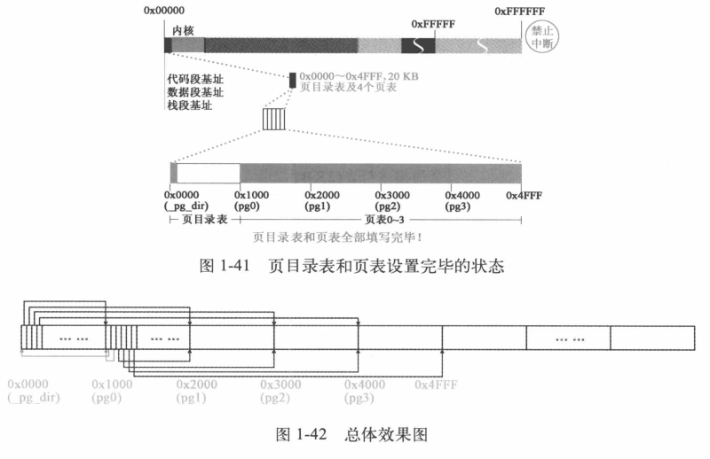

对应的代码如下：

```asm
.align 2
setup_paging:
	movl $1024*5,%ecx		/* 5 pages - pg_dir+4 page tables */
	xorl %eax,%eax
	xorl %edi,%edi			/* pg_dir is at 0x000 */
	cld						; 前 5 页置 0
	rep stosl				; stosl 将 eax 的值保存到 es:edi 处，edi += 4
	movl $pg0+7,_pg_dir		/* set present bit/user r/w */
	movl $pg1+7,_pg_dir+4		/*  --------- " " --------- */
	movl $pg2+7,_pg_dir+8		/*  --------- " " --------- */
	movl $pg3+7,_pg_dir+12		/*  --------- " " --------- */
	movl $pg3+4092,%edi
	movl $0xfff007,%eax		/*  16Mb - 4096 + 7 (r/w user,p) */
	std				; 最后一个页表项指向 16 M 的最末 4KB
1:	stosl			/* fill pages backwards - more efficient :-) */
	subl $0x1000,%eax		; 从后往前一直重复
	jge 1b
```

以上工作完成后，内存布局如下，可以看出只有 184B 的剩余代码。

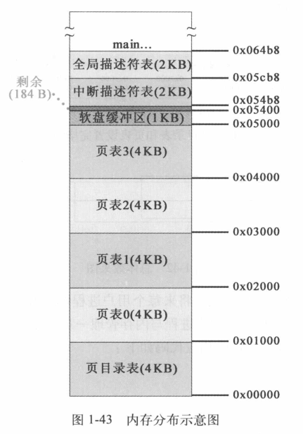


最后就是将页目录表地址写入 CR3，再将 CR0 最高位置 1 开启分页。代码如下：

```asm
	xorl %eax,%eax		/* pg_dir is at 0x0000 */
	movl %eax,%cr3		/* cr3 - page directory start */
	movl %cr0,%eax
	orl $0x80000000,%eax
	movl %eax,%cr0		/* set paging (PG) bit */
	ret			/* this also flushes prefetch-queue */
```

回过头看，system 模块被移动到 `0x00000`，在内存的起始位置建立内核分页机制，最后还把页目录表放在起始位置，这都为操作系统内核控制用户程序奠定了基础。最后的最后，head 程序执行 ret 指令，跳入 main 函数执行。这里使用了较为巧妙的仿 call 调用 main 函数的方法，同时使得 main 函数的返回地址为 L6，万一 main 出错返回还会继续执行。

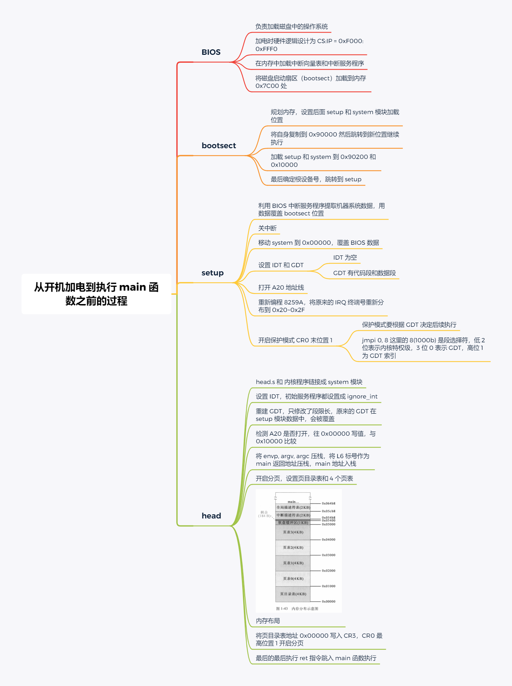


到此，Linux 0.11 内核启动的一个重要阶段已经完成，接下来就要进入 main 函数对应的代码了。需要提示的是，**此时仍处在关闭中断的状态**！