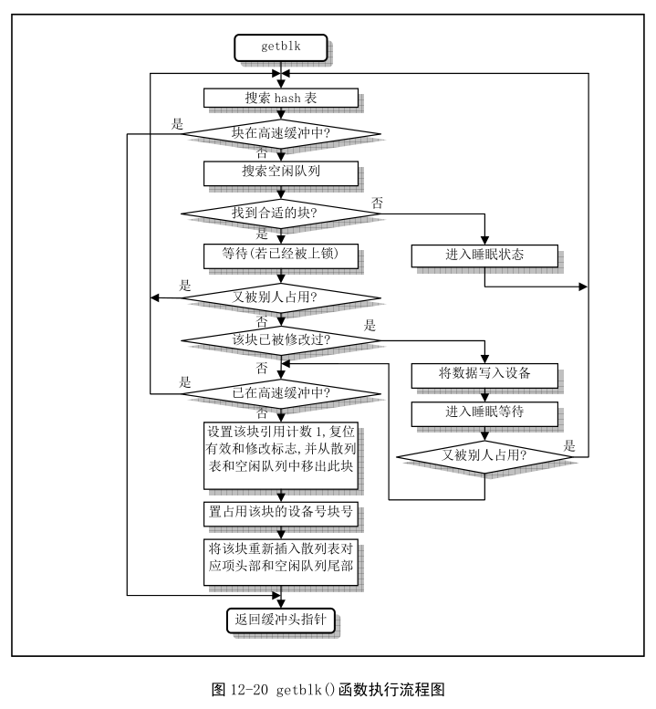

[toc]

# 进程 1 的创建及执行

现在，我们已经有了一个名副其实的、3 特权级的进程——进程 0。下面将详细讲解进程 0 的第一项工作——创建进程 1。

## 进程 1 的创建

进程 0 现在在 3 特权级状态，即进程状态。进程 0 的第一项工作就是作为父进程调用 fork 函数创建第一个子进程——进程 1。以后所有的进程都是基于父子进程创建机制由父进程创建出来的。

### 进程 0 创建进程 1

创建进程即由父进程调用 fork 函数实现。代码如下：

```c
// int fork() 系统调用，创建子进程
static inline _syscall0(int,fork)
...
	if (!fork()) {		/* we count on this going ok */
		init();                             // 在新建的子进程(任务1)中执行。
	}
...
```

\_syscalln 是 n 个参数的系统调用宏，代码如下：

```c
// include/uinstd.h
#define __NR_fork	2
#define _syscall0(type,name) \
type name(void) \
{ \
long __res; \
__asm__ volatile ("int $0x80" \
	: "=a" (__res) \
	: "0" (__NR_##name)); \
if (__res >= 0) \
	return (type) __res; \
errno = -__res; \
return -1; \
}
```

宏展开后即为对应系统调用的代码，此处为 fork，展开如下：

```c
int fork(void) 
{
	long __res;
	__asm__ volatile ("int $0x80"		// 系统调用入口
		: "=a" (__res)					// 返回值赋给 eax
		: "0" (__NR_fork));				// 传入 fork 系统调用号 2, "0" 表示同上寄存器
	if(__res >= 0)						// int 0x80 返回后执行，进程 1 的第一条指令
		return (int) __res;
	errno = -__res;
	return -1;
}
```

之前调用的 sched_init 函数使用 set\_system\_gate 宏设置了系统调用的终端服务程序 system\_call，部分代码如下：

```asm
_system_call:
	cmpl $nr_system_calls-1,%eax    # 调用号如果超出范围的话就在eax中置-1并退出
	ja bad_sys_call
	push %ds                        # 保存原段寄存器值
	push %es
	push %fs
# 一个系统调用最多可带有3个参数，也可以不带参数。下面入栈的ebx、ecx和edx中放着系统
# 调用相应C语言函数的调用函数。这几个寄存器入栈的顺序是由GNU GCC规定的，
# ebx 中可存放第1个参数，ecx中存放第2个参数，edx中存放第3个参数。
# 系统调用语句可参见头文件include/unistd.h中的系统调用宏。
	pushl %edx
	pushl %ecx		# push %ebx,%ecx,%edx as parameters
	pushl %ebx		# to the system call
	movl $0x10,%edx		# set up ds,es to kernel space
	mov %dx,%ds
	mov %dx,%es
# fs指向局部数据段(局部描述符表中数据段描述符)，即指向执行本次系统调用的用户程序的数据段。
# 注意,在Linux 0.11 中内核给任务分配的代码和数据内存段是重叠的，他们的段基址和段限长相同。
	movl $0x17,%edx		# fs points to local data space
	mov %dx,%fs
# 下面这句操作数的含义是：调用地址=[_sys_call_table + %eax * 4]
# sys_call_table[]是一个指针数组，定义在include/linux/sys.h中，该指针数组中设置了所有72
# 个系统调用C处理函数地址。
	call _sys_call_table(,%eax,4)        # 间接调用指定功能C函数
	pushl %eax                          # 把系统调用返回值入栈
```

sys\_call 作为系统调用的总入口，先保存现场、设置段寄存器的值，然后根据 eax 的值调用对应的处理函数。此处调用的就是 sys\_fork，代码如下：

```asm
.align 2
_sys_fork:
	call _find_empty_process
	testl %eax,%eax             # 在eax中返回进程号pid。若返回负数则退出。
	js 1f
	push %gs
	pushl %esi
	pushl %edi
	pushl %ebp
	pushl %eax
	call _copy_process
	addl $20,%esp               # 丢弃这里所有压栈内容。
1:	ret
```

下面就分析 sys\_fork 具体做了什么。

### 在 task[64] 中为进程 1 申请一个空闲位置并获取进程号

一上来就调用了 find\_empty\_process，代码如下：

```c
// kernel/fork.c
// 为新进程取得不重复的进程号last_pid.函数返回在任务数组中的任务号(数组项)。
int find_empty_process(void) {
	int i;

    // 首先获取新的进程号。如果last_pid溢出，则重新从1开始。
    // 然后在task[64]中搜索刚设置的pid号是否已经被任何任务使用。
    // 如果是则重新获得一个pid号。接着在任务数组中为新任务寻找一个空闲项，并回项号。
    // last_pid是一个全局变量，不用返回。如果此时任务数组中64个项已经被全部占用，则返回出错码。
	repeat:
		if ((++last_pid)<0) last_pid=1;
		for(i=0 ; i<NR_TASKS ; i++)
			if (task[i] && task[i]->pid == last_pid) goto repeat;
	for(i=1 ; i<NR_TASKS ; i++)         // 任务0项被排除在外
		if (!task[i])
			return i;
	return -EAGAIN;
}

```

函数做的事就是分配一个空闲的 pid 和 task[64] 项，返回 task 数组索引，如果没有则返回错误码。第一次调用的结果就是返回 1，即进程 1 的信息将存储在 task[64] 的第二项。返回后继续压栈，为调用 copy\_process 做准备。

### 调用 copy\_process

进程 0 作为可以创建子进程的父进程，在内核中有进程 0 的 task\_struct 和页表项等专属管理信息。进程 0 做了以下重要工作：

1. 为进程 1 创建 task\_struct，将进程 0 的 task\_struct 内容复制给进程 1；
2. 为进程 1 的 task\_struct、tss 做个性化设置；
3. 为进程 1 创建第一个页表，将进程 0 的页表项内容赋给这个页表；
4. 进程 1 共享进程 0 的文件；
5. 设置进程 1 的 GDT 项；
6. 最后将进程 1 设置为就绪态，使其可以参与进程间的轮转。

现在调用 copy\_process，函数参数有很多，是从触发中断开始就积累的栈状态，代码如下：

```c
// 复制进程
int copy_process(int nr,long ebp,long edi,long esi,long gs,long none,	
                 // call instruction and after find_empty_process
		long ebx,long ecx,long edx,										// system_call
		long fs,long es,long ds,										// system_call
		long eip,long cs,long eflags,long esp,long ss) {				// hardware
	struct task_struct *p;
	int i;
	struct file *f;

	p = (struct task_struct *) get_free_page();
	if (!p)
		return -EAGAIN;
	task[nr] = p;
	...
}
```

先调用 get\_free\_page 分配内存，代码如下：

```c
// 在主内存区中取空闲物理页面。如果已经没有可用物理内存页面，则返回0.
unsigned long get_free_page(void) {
register unsigned long __res asm("ax");

__asm__("std ; repne ; scasb\n\t"   // std 置方向位, 从高到低扫描; 
        							// repne 重复执行直到 ecx==0 或 ZF==0; scasb 比较 al 和 [edi]
	"jne 1f\n\t"                    // 如果 mem_map 没有空闲，则退出。
	"movb $1,1(%%edi)\n\t"          // 1 => [1+edi], mem_map 找到的第一个空闲设为 1
        							// +1 是因为 scasb 会 dec edi
	"sall $12,%%ecx\n\t"            // 相对 LOW_MEM 的页面地址
	"addl %2,%%ecx\n\t"             // 加上 LOW_MEM, 实际物理地址
	"movl %%ecx,%%edx\n\t"
	"movl $1024,%%ecx\n\t"          // 寄存器ecx置计数值1024
	"leal 4092(%%edx),%%edi\n\t"    // 页面末端地址 => edi
	"rep ; stosl\n\t"               // eax => [edi], 清空页面
	"movl %%edx,%%eax\n"            // 页面起始地址 => eax
	"1:"
	:"=a" (__res)
	:"0" (0),"i" (LOW_MEM),"c" (PAGING_PAGES),
	"D" (mem_map+PAGING_PAGES-1)
	:"di","cx","dx");				// 程序中改变过的寄存器
return __res;           // 返回空闲物理页面地址(若无空闲页面则返回0).
}
```

get\_free\_page 分配一个空闲页后挂接到 task[nr] 上，这个页的低地址段就是进程 1 的 task\_struct，而高地址段，回顾进程 0 使用的 task\_union，即为内核栈顶。

申请空间后就将进程 0 的 task\_struct 复制过来，并做出个性化设置，代码如下：

```c
	// 注意此处的数据类型, 仅复制了 task_struct 而未复制 stack
   *p = *current;	/* NOTE! this doesn't copy the supervisor stack */
    // 随后对复制来的进程结构内容进行一些修改，作为新进程的任务结构。先将
    // 进程的状态置为不可中断等待状态，以防止内核调度其执行。然后设置新进程
    // 的进程号pid和父进程号father，并初始化进程运行时间片值等于其priority值
    // 接着复位新进程的信号位图、报警定时值、会话(session)领导标志leader、进程
    // 及其子进程在内核和用户态运行时间统计值，还设置进程开始运行的系统时间start_time.
	p->state = TASK_UNINTERRUPTIBLE;	// 不可中断等待状态
	p->pid = last_pid;              // find_empty_process 分配的 pid
	p->father = current->pid;       // 设置父进程
	p->counter = p->priority;       // 运行时间片值
	p->signal = 0;                  // 信号位图置0
	p->alarm = 0;                   // 报警定时值(滴答数)
	p->leader = 0;		/* process leadership doesn't inherit */
	p->utime = p->stime = 0;        // 用户态时间和和心态运行时间
	p->cutime = p->cstime = 0;      // 子进程用户态和和心态运行时间
	p->start_time = jiffies;        // 进程开始运行时间(当前时间滴答数) 
...
// kernel/sched.c
struct task_struct *current = &(init_task.task);    // 当前任务指针(初始化指向任务0)
```

下面会设置 tss 中各项的值，用到的都是之前压栈的寄存器值，代码如下：

```c
	p->tss.back_link = 0;
	p->tss.esp0 = PAGE_SIZE + (long) p;     // 任务内核态栈指针。
	p->tss.ss0 = 0x10;                      // 内核态栈的段选择符, 即10000b, 对应GDT[2]
	p->tss.eip = eip;                       // 指令代码指针
	p->tss.eflags = eflags;                 // 标志寄存器
	p->tss.eax = 0;                         // 这是当fork()返回时新进程会返回0的原因所在
	p->tss.ecx = ecx;
	p->tss.edx = edx;
	p->tss.ebx = ebx;
	p->tss.esp = esp;
	p->tss.ebp = ebp;
	p->tss.esi = esi;
	p->tss.edi = edi;
	p->tss.es = es & 0xffff;                // 段寄存器仅16位有效
	p->tss.cs = cs & 0xffff;
	p->tss.ss = ss & 0xffff;
	p->tss.ds = ds & 0xffff;
	p->tss.fs = fs & 0xffff;
	p->tss.gs = gs & 0xffff;
	p->tss.ldt = _LDT(nr);                  // 任务局部表描述符的选择符(LDT描述符在GDT中)
	p->tss.trace_bitmap = 0x80000000;       // 高16位有效 
...
```

### 设置进程 1 的分页管理

要设置分页就要先设置分段，调用 copy\_mem，代码如下：

```c
	if (copy_mem(nr,p)) {
		task[nr] = NULL;
		free_page((long) p);
		return -EAGAIN;
	}
...
// 复制内存页表
// 由于Linux系统采用了写时复制(copy on write)技术，因此这里仅为新进程设置自己的页目录表项和页表项，
// 而没有实际为新进程分配物理内存页面。此时新进程与其父进程共享所有内存页面。
int copy_mem(int nr,struct task_struct * p) {
	unsigned long old_data_base,new_data_base,data_limit;
	unsigned long old_code_base,new_code_base,code_limit;

	// 提取当前进程段基址、段限长信息
	code_limit=get_limit(0x0f);		// 1111b, 即 LDT[1]
	data_limit=get_limit(0x17);		// 10111b, 即 LDT[2] 
	old_code_base = get_base(current->ldt[1]);
	old_data_base = get_base(current->ldt[2]);
	if (old_data_base != old_code_base)	
		panic("We don't support separate I&D");
	if (data_limit < code_limit)
		panic("Bad data_limit");
    new_data_base = new_code_base = nr * 0x4000000;
	p->start_code = new_code_base;
	set_base(p->ldt[1],new_code_base);
	set_base(p->ldt[2],new_data_base);
	if (copy_page_tables(old_data_base,new_data_base,data_limit)) {
		printk("free_page_tables: from copy_mem\n");
		free_page_tables(new_data_base,data_limit);
		return -ENOMEM;
	}
	return 0;
}
```

使用宏获取和设置段基址和限长，其实还是按照描述符格式操作。Linux 0.11 的代码段和数据段重合，因此提取后需要先检查是否相等。设置新进程的段基址为 nr<<26，最后调用 copy\_page\_tables 复制页表。

**要明确的是，Linux 0.11 中的所有进程共享一个页目录表。** 一共 4G 空间，每个进程 64 MB，这样最大进程数恰好就是 64，这也是为什么 task 数组大小为 64。

代码如下：

```c
// 复制页目录表项和页表项
int copy_page_tables(unsigned long from,unsigned long to,long size)
{
	unsigned long * from_page_table;
	unsigned long * to_page_table;
	unsigned long this_page;
	unsigned long * from_dir, * to_dir;
	unsigned long nr;

	if ((from&0x3fffff) || (to&0x3fffff))
		panic("copy_page_tables called with wrong alignment");
	// 页目录表项在页目录表中的偏移地址，一项对应 4MB，所以偏移地址还要 4B 对齐 相当于 (addr>>22)<<2
	from_dir = (unsigned long *) ((from>>20) & 0xffc); /* _pg_dir = 0 */
	to_dir = (unsigned long *) ((to>>20) & 0xffc);
	size = ((unsigned) (size+0x3fffff)) >> 22;		// 复制的页表数 = 页目录项数，向上取整
    // 下面开始对每个页目录项依次申请1页内存来保存对应的页表，并且开始页表项复制操作。
    // 如果目的目录指定的页表已经存在(P=1)，则出错死机。
    // 如果源目录项无效，即指定的页表不存在(P=1),则继续循环处理下一个页目录项。
	for( ; size-->0 ; from_dir++,to_dir++) {
		if (1 & *to_dir)			// 页表项最低位为存在位
			panic("copy_page_tables: already exist");
		if (!(1 & *from_dir))
			continue;

		from_page_table = (unsigned long *) (0xfffff000 & *from_dir);
		if (!(to_page_table = (unsigned long *) get_free_page()))
			return -1;	/* Out of memory, see freeing */
        // | 7表示对应页表映射的内存页面是用户级的，并且可读写、存在(Usr,R/W,Present).
		// 然后针对当前处理的页目录项对应的页表，设置需要复制的页面项数。
		*to_dir = ((unsigned long) to_page_table) | 7;
		nr = (from==0)?0xA0:1024;
        // 此时对于当前页表，开始循环复制指定的nr个内存页面表项。
        // 复位表项中R/W标志(位1置0)，即让页表对应的内存页面只读。
		for ( ; nr-- > 0 ; from_page_table++,to_page_table++) {
			this_page = *from_page_table;
			if (!(1 & this_page))
				continue;
			this_page &= ~2;
			*to_page_table = this_page;
           
			if (this_page > LOW_MEM) {
                // 主内存区中的源页表项所指内存页也为只读。
				*from_page_table = this_page;
				this_page -= LOW_MEM;
				this_page >>= 12;
				mem_map[this_page]++;
			}
		}
	}
	invalidate();
	return 0;
}
// 写入cr3以刷新 TLB
#define invalidate() \
__asm__("movl %%eax,%%cr3"::"a" (0))
```

copy\_page_tables 复制指定线性地址和长度内存对应的页目录项和页表项，而被复制的页目录和页表对应的原物理内存页面被两套页表映射而共享使用。首先要求 from 和 to 4M 对齐，因为一个页表管理的内存范围就是 4M。只有满足这个要求才能从保证从一个页表的第一项开始复制。然后根据源地址和目的地址计算起始目录指针，根据长度计算要复制的目录表项数，即页表数。

之后申请空间来存放对应的页表，将申请的页面地址填入页目录项，同时设置 u、r/w、p 标志位。如果内核空间则只复制前 160 个页表项，对应 640KB 物理内存，否则需要复制整个页表的 1024 项，对应 4MB 内存。复制页表项要注意的是设置页面只读，这样才能用写时复制机制。如果页表所指的物理内存在 1MB 以上，那么需要设置内存页面映射数组 mem_map，计算页面号，增加引用计数。要注意的是主内存区中的共享物理页面的源页表项也要设置为只读。最后写 cr3 以刷新 TLB。

至此，进程 1 还没有对应的程序，页表与进程 0 完全一致，等它有了自己的程序之后会重新组织自己的内存管理结构。

### 进程 1 共享进程 0 的文件

回到 copy\_process 函数，下面设置 task\_struct 文件相关的成员，都是从父进程继承，代码如下：

```c
	for (i=0; i<NR_OPEN;i++)
		if ((f=p->filp[i]))
			f->f_count++;
	if (current->pwd)
		current->pwd->i_count++;
	if (current->root)
		current->root->i_count++;
	if (current->executable)
		current->executable->i_count++;
```

父进程打开的文件，以及当前工作目录 inode、根目录 inode、执行文件 inode 的引用计数都 +1。

### 设置进程 1 在 GDT 中的表项

将进程 1 的 TSS 和 LDT 挂接在 GDT 中，代码如下：

```c
	// 程序然后把新进程设置成就绪态。另外在任务切换时，任务寄存器tr由CPU自动加载。
	set_tss_desc(gdt+(nr<<1)+FIRST_TSS_ENTRY,&(p->tss));
	set_ldt_desc(gdt+(nr<<1)+FIRST_LDT_ENTRY,&(p->ldt));
	p->state = TASK_RUNNING;	/* do this last, just in case */
	return last_pid;
```

### 进程 1 处于就绪态

最后，将进程 1 设置为就绪态，使其可以参加进程调度，返回进程号 1。至此，进程 1 的创建工作完成，进程 1 已具备了进程 0 的全部能力，可以在主机中正常允许。

控制流返回到 sys\_fork 中，在调整栈指针后返回到 system\_call 继续执行，代码如下：

```asm
	call _sys_call_table(,%eax,4)        # 间接调用指定功能C函数
	pushl %eax                          # 把系统调用返回值入栈

	movl _current,%eax                   # 取当前任务(进程)数据结构地址→eax
	cmpl $0,state(%eax)		# state
	jne reschedule
	cmpl $0,counter(%eax)		# counter
	je reschedule
# 以下这段代码执行从系统调用C函数返回后，对信号进行识别处理。其他中断服务程序退出时也
# 将跳转到这里进行处理后才退出中断过程，例如后面的处理器出错中断int 16.
ret_from_sys_call:
# 首先判别当前任务是否是初始任务task0,如果是则不比对其进行信号量方面的处理，直接返回。
	movl _current,%eax		# task[0] cannot have signals
	cmpl _task,%eax
	je 3f                   # 向前(forward)跳转到标号3处退出中断处理
	...
3:	popl %eax                       # eax中含有上面入栈系统调用的返回值
	popl %ebx
	popl %ecx
	popl %edx
	pop %fs
	pop %es
	pop %ds
	iret
```

将返回值即 pid 入栈，然后判断当前进程状态，如果不是就绪态或时间片用尽则进程调度。然后执行 ret\_from\_sys\_call 程序，对于进程 0 则直接跳转到标号 3 返回，其他情况还需要进程信号量处理。最后就是恢复寄存器值，eax 值即为进程 1 的 pid，iret 中断返回，由硬件恢复另外几个寄存器。此时的 CS:EIP 即指向 fork 函数中的 if 语句一行，返回值为 1，则返回到 main 函数，fork 在父进程中返回非 0，所以不会执行 init 函数，而是进入 pause 循环。

返回路径：`ret_from_sys_call => fork => main => pause `

## 内核第一次做进程调度

Linux 0.11 的进程调度机制中，通常有以下两种情况可以产生进程切换：

- 允许进程允许的时间结束，时间片用尽；
- 进程的运行停止，进程等待外设提供数据，或等待其他程序的运行结果，或进程已执行完毕。

进程 0 比较特殊，切换到进程 1 既有第二种，又有怠速状态的意思。进程 0 执行 pause 循环，pause 也是系统调用，也通过 system\_call 调用，代码如下：

```c
// kernel/sched.c
int sys_pause(void) {
	current->state = TASK_INTERRUPTIBLE;
	schedule();
	return 0;
}
```

将进程 0 设置为可中断等待状态，调用 schedule 函数进行函数切换，代码如下：

```c
void schedule(void) {
	int i,next,c;
	struct task_struct ** p;

	// 检查 alarm，唤醒任何已得到信号的可中断任务。 
	...
    // 中断主程序
	while (1) {
		c = -1;
		next = 0;
		i = NR_TASKS;
		p = &task[NR_TASKS];

        // 就绪态且counter最大
		while (--i) {
			if (!*--p)
				continue;
			if ((*p)->state == TASK_RUNNING && (*p)->counter > c)
				c = (*p)->counter, next = i;
		}

		if (c) break;
		for(p = &LAST_TASK ; p > &FIRST_TASK ; --p)
			if (*p)
				(*p)->counter = ((*p)->counter >> 1) +
						(*p)->priority;
	}
	switch_to(next);     // 切换到Next任务并运行。
}
```

两次遍历 task[64]，第一次遍历，只要指针不空，针对 task\_struct 的 alarm 和 signal 进行处理，之后会讨论，此处不深究。第二次遍历所有进程，比较进程的状态和时间片，找出就绪态且 counter 最大的进程，调度执行，如果所有 counter 都为 0，则根据任务优先级更新每个任务的 counter 值。此时就只有进程 0 和进程 1，且 0 是可中断等待状态，不是就绪态，只有 1 是就绪态，所以就切换到进程 1，执行 switch\_to，代码如下：

```c
// 切换当前进程到进程 n
#define switch_to(n) {\
struct {long a,b;} __tmp; \
__asm__("cmpl %%ecx,current\n\t" \
	"je 1f\n\t" \								// 先检测当前进程不是 n
	"movw %%dx,%1\n\t" \						// TSS 段选择符存入 tmp.b
	"xchgl %%ecx,current\n\t" \					// 交换 current = task[n], ecx = 切换出的任务
	"ljmp *%0\n\t" \							// 跳转到 tmp, a 是偏移, b 是段选择符
        										// 直接跳转到 TSS 段指定的进程执行
	"cmpl %%ecx,last_task_used_math\n\t" \
	"jne 1f\n\t" \
	"clts\n" \
	"1:" \
	::"m" (*&__tmp.a),"m" (*&__tmp.b), \
	"d" (_TSS(n)),"c" ((long) task[n])); \
}
```

switch\_to 切换到进程 1 执行，构造 tmp 结构体存 TSS 段描述符，然后通过 ljmp 长跳转到 TSS 段。CPU 各个寄存器值保存在 TSS0 中，将 TSS1 以及 LDT1 段描述符恢复给 CPU 的各个寄存器，实现从 0 特权级的内核代码切换到 3 特权级的进程 1 代码指向。

需要注意的是，pause 的调用是通过系统调用中断从 3 特权级的进程 0 代码翻转到 0 特权级的内核代码指向的，从 system\_call 到 sys\_pause，在其中调用 schedule 再调用 switch\_to，在 switch\_to 的 ljmp 跳转到进程 1 的代码执行。现在 switch\_to 中 ljmp 后面的代码还未执行，system\_call 的后半段也还没执行，系统调用中断还没返回。

## 轮转到进程 1 执行

回顾进程 0 创建进程 1 的过程，前面 copy\_process 中设置的 tss.eip 就是系统调用 fork 时硬件自动压栈的 EIP，即 int 0x80 下一行代码的位置，即 if 语句。进程 1 就从这里开始执行。此处的返回值就是进程 1 的 tss.eax，被设置为 0。返回到 main 函数中的 if(!fork()) 一行，就会执行 init 函数。

返回路径：`fork => main => init`

init 函数功能主要是四部分，安装根文件系统；显示系统信息；运行系统初始资源配置文件 rc 中的命令；执行用户登录 shell 程序。

init 函数先调用 setup，它也是一个系统调用，本章后续的内容都是它实现的。要注意的是进程 0 的 pause 函数还没返回，这里 setup 又产生了一个中断。

### 进程 1 为安装硬盘文件系统做准备

```c
    // setup()是一个系统调用。用于读取硬盘参数包括分区表信息并加载虚拟盘(若存在的话)
    // 和安装根文件系统设备。该函数用25行上的宏定义，对应函数是sys_setup()，在块设备
    // 子目录kernel/blk_drv/hd.c中。
	setup((void *) &drive_info);        // drive_info结构是2个硬盘参数表
```

调用 setup，参数是硬盘参数表，它是由 setup 程序加载到内存中，在 main 函数开头从内存读取它赋给 drive\_info。setup 函数会根据硬盘设备信息安装根文件系统，如果之前初始化了虚拟盘则会将根文件系统加载到虚拟盘区。

setup 系统调用最终就是调用 sys\_setup 函数，代码很多，难度较大，但目的很单一，就是为安装文件系统做准备。大概经历三个步骤：

1. 根据机器系统数据设置硬盘参数；
2. 读取硬盘引导块；
3. 从引导块中获取信息。

#### 进程 1 设置硬盘的 hd\_info

根据机器系统数据中的 drive\_info，如硬盘柱面数、磁头数、扇区数，设置内核的 hd\_info。代码如下：

```c
#define MAX_HD		2
// 硬盘参数，磁头数、每磁道扇区数、柱面数、写前预补偿柱面号、磁头着陆柱面号、控制字节
struct hd_i_struct {
	int head,sect,cyl,wpcom,lzone,ctl;
	};
struct hd_i_struct hd_info[] = { {0,0,0,0,0,0},{0,0,0,0,0,0} };
static int NR_HD = 0;
static struct hd_struct {
	long start_sect;
	long nr_sects;
} hd[5*MAX_HD]={{0,0},};

/* This may be used only once, enforced by 'static int callable' */
// 只在初始化时调用一次，用静态变量 callable 作为可调用标志
// 系统设置函数
// 参数 BIOS 是 main 函数里初始化的 drive_info 硬盘参数表结构指针，是由 setup.s 程序获取放到内存 0x90080 处
// 本函数主要是读取 CMOS 和硬盘参数表信息，设置硬盘分区结构 hd，并尝试加载 RAM 虚拟盘和根文件系统
int sys_setup(void * BIOS) {
	static int callable = 1;
	int i,drive;
	unsigned char cmos_disks;
	struct partition *p;
	struct buffer_head * bh;
	// 设置调用标志，控制只调用一次
	if (!callable)
		return -1;
	callable = 0;
	// 如果在 include/linux/config.h 中定义了 HD_TYPE，则 hd_info 已经设置好
	// 否则需要读取 setup.s 程序放在内存中 0x90080 处的硬盘参数表
#ifndef HD_TYPE
	for (drive=0 ; drive<2 ; drive++) {
		hd_info[drive].cyl = *(unsigned short *) BIOS;
		hd_info[drive].head = *(unsigned char *) (2+BIOS);
		hd_info[drive].wpcom = *(unsigned short *) (5+BIOS);
		hd_info[drive].ctl = *(unsigned char *) (8+BIOS);
		hd_info[drive].lzone = *(unsigned short *) (12+BIOS);
		hd_info[drive].sect = *(unsigned char *) (14+BIOS);
		BIOS += 16;			// 每个表长 16 字节
	}
	// 判断硬盘数
	if (hd_info[1].cyl)
		NR_HD=2;
	else
		NR_HD=1;
#endif
	// 硬盘信息 hd_info 设置好，现在设置硬盘分区结构 hd[]
	// 数组的 [0] [5] 分别表示两个硬盘的整体参数，[1:4] [6:9] 则表示两个硬盘 4 个分区的参数
	for (i=0 ; i<NR_HD ; i++) {
		hd[i*5].start_sect = 0;
		hd[i*5].nr_sects = hd_info[i].head*
				hd_info[i].sect*hd_info[i].cyl;
	}
	... // CMOS 相关，省略
	// 到此真正确定了系统中的硬盘个数 NR_HD
	// 用 bread 读硬盘第一个扇区，读成功则将数据会被存放在缓冲块 bh，还要判断扇区末尾两个字节是否是 0xAA55
	// 然后验证扇区中 0x1BE 偏移开始处的分区表是否有效，有效则存入 hd[] 中，最后释放缓冲区
	for (drive=0 ; drive<NR_HD ; drive++) {
		if (!(bh = bread(0x300 + drive*5,0))) { 
			printk("Unable to read partition table of drive %d\n\r",
				drive);
			panic("");
		}
    ...
}
```

读硬盘参数表设置 hd\_info，然后要设置磁盘分区结构 hd[]，这个数组的 0、5 是两块硬盘的整体参数，而其他几项则是代表两块硬盘各最多 4 个分区的参数。

#### 读取硬盘中的引导块到缓冲区

硬盘的分区表信息存在引导块即 0 号块，一个块 1024 Bytes，真正有用的是 0 号扇区，调用 bread 函数将引导块读入缓冲区 bh 处，代码如下：

```c
// 从设备上读取数据块。
struct buffer_head * bread(int dev,int block) {
	struct buffer_head * bh;

	if (!(bh=getblk(dev,block)))
		panic("bread: getblk returned NULL\n");
	if (bh->b_uptodate)
		return bh;
    ...
}
```

bread 函数根据设备号和数据块号读取数据，首先在缓冲区申请一个缓冲块，调用 getblk 函数，代码如下：

```c
// 取高速缓冲中指定的缓冲块
// 检查指定（设备号和块号）的缓冲区是否已经在高速缓冲中。如果指定块已经在
// 高速缓冲中，则返回对应缓冲区头指针退出；如果不在，就需要在高速缓冲中设置一个
// 对应设备号和块好的新项。返回相应的缓冲区头指针。
struct buffer_head * getblk(int dev,int block)
{
	struct buffer_head * tmp, * bh;

repeat:
    // 搜索hash表，如果指定块已经在高速缓冲中，则返回对应缓冲区头指针，退出。
	if ((bh = get_hash_table(dev,block)))
		return bh;
	...
}
```

getblk 函数检查由设备号和块号指定的数据是否在缓冲区中，如果在就不用再到设备上读取，使用哈希表查找提高速度，调用 get\_hash\_table 函数，代码如下：

```c
// 利用hash表在高速缓冲区中寻找指定的缓冲块。若找到则对该缓冲块上锁返回块头指针。
struct buffer_head * get_hash_table(int dev, int block) {
	struct buffer_head * bh;

	for (;;) {
        // 在高速缓冲中寻找给定设备和指定块的缓冲区块，如果没有找到则返回NULL。
		if (!(bh=find_buffer(dev,block)))
			return NULL;
        // 对该缓冲块增加引用计数，并等待该缓冲块解锁。由于经过了睡眠状态，
        // 因此有必要在验证该缓冲块的正确性，并返回缓冲块头指针。
		bh->b_count++;
		wait_on_buffer(bh);
		if (bh->b_dev == dev && bh->b_blocknr == block)
			return bh;
        // 如果在睡眠时该缓冲块所属的设备号或块设备号发生了改变，则撤消对它的
        // 引用计数，重新寻找。
		bh->b_count--;
	}
}
```

调用 find\_buffer 找指定块，代码如下：

```c
#define _hashfn(dev,block) (((unsigned)(dev^block))%NR_HASH)
#define hash(dev,block) hash_table[_hashfn(dev,block)]
static struct buffer_head * find_buffer(int dev, int block) {		
	struct buffer_head * tmp;

    // 搜索hash表，寻找指定设备号和块号的缓冲块。
	for (tmp = hash(dev,block) ; tmp != NULL ; tmp = tmp->b_next)
		if (tmp->b_dev==dev && tmp->b_blocknr==block)
			return tmp;
	return NULL;
}
```

设备号和块号通过哈希函数映射为索引插入到 hash\_table 对应项的链表，查找就计算索引然后查那个位置的链表，第一次查找肯定是 NULL，就返回到 getblk 函数，在空闲链表中申请一个新的空闲缓冲块，代码如下：

```c
struct buffer_head * getblk(int dev,int block)
{
	struct buffer_head * tmp, * bh;

repeat:
    // 搜索hash表，如果指定块已经在高速缓冲中，则返回对应缓冲区头指针，退出。
	if ((bh = get_hash_table(dev,block)))
		return bh;
    // 扫描空闲数据块链表，寻找空闲缓冲区。
    // 首先让tmp指向空闲链表的第一个空闲缓冲区头
	tmp = free_list;
	do {
		if (tmp->b_count)
			continue;
        
		if (!bh || BADNESS(tmp)<BADNESS(bh)) {
			bh = tmp;
			if (!BADNESS(tmp))
				break;
		}
/* and repeat until we find something good */
	} while ((tmp = tmp->b_next_free) != free_list);
    // 没有引用计数为 0 的块就睡眠等待唤醒
	if (!bh) {
		sleep_on(&buffer_wait);
		goto repeat;
	}
    // 执行到这里，说明我们已经找到了一个比较合适的空闲缓冲块了。于是先等待该缓冲区
    // 解锁。如果在我们睡眠阶段该缓冲区又被其他任务使用的话，只好重复上述寻找过程。
	wait_on_buffer(bh);
	if (bh->b_count)
		goto repeat;
    // 如果该缓冲区已被修改，则将数据写盘，并再次等待缓冲区解锁。同样地，若该缓冲区
    // 又被其他任务使用的话，只好再重复上述寻找过程。
	while (bh->b_dirt) {
		sync_dev(bh->b_dev);
		wait_on_buffer(bh);
		if (bh->b_count)
			goto repeat;
	}

    // 在高速缓冲hash表中检查指定设备和块的缓冲块是否乘我们睡眠之际已经被加入
    // 进去。如果是的话，就再次重复上述寻找过程。
	if (find_buffer(dev,block))
		goto repeat;

    // 于是让我们占用此缓冲块。置引用计数为1，复位修改标志和有效(更新)标志。
	bh->b_count=1;
	bh->b_dirt=0;
	bh->b_uptodate=0;
    // 从hash队列和空闲队列块链表中移出该缓冲区头，让该缓冲区用于指定设备和其上的指定块。
    // 然后根据此新的设备号和块号重新插入空闲链表和hash队列新位置处。并最终返回缓冲头指针。
	remove_from_queues(bh);
	bh->b_dev=dev;
	bh->b_blocknr=block;
	insert_into_queues(bh);
	return bh;
}
```

free\_list 就是在初始化缓冲区时建立的 buffer\_head 链表，现在空闲链表里检索一个引用计数、脏位、锁定位都为 0 的缓冲块，如果未找到引用计数为 0 的块，则睡眠等待有空闲块可用，这里第一次调用肯定会找到合适的块，就先不看 sleep\_on 函数。如果选定的块被加锁，就要睡眠等待，如果睡眠的时候这个块又被其他进程使用，那么就有好回到 repeat 处重新来，如果缓冲区已被修改则需要写回硬盘，再等待缓冲区解锁，同样，如果又被其他任务使用还得重来。还有就是睡眠等待过程中如果要读的块已经被读入到缓冲区，那么又不用读了，还是重来。

一切都完成后，如果还是需要读入到缓冲区，那就将找到的空闲块引用计数 +1，然后将其对应的 buffer\_head 从从 free\_list 和 hash\_table 的链表中摘下来，然后插入 free\_list 的尾部以及新的 hash\_table 项的链表中。	



执行完 get\_blk，返回到 bread 函数，获取了缓冲块，检查块中数据是否有效（已更新），第一次调用肯定不能直接用，所以还是要从硬盘中读，调用底层块设备读写函数，产生指定数据块被读入，代码如下

```c
// 从设备上读取数据块
struct buffer_head * bread(int dev,int block) {
	struct buffer_head * bh;

	if (!(bh=getblk(dev,block)))
		panic("bread: getblk returned NULL\n");
	if (bh->b_uptodate)
		return bh;
    // 否则我们就调用底层块设备读写ll_rw_block函数，产生读设备块请求。
   	// 然后等待指定数据块被读入，并等待缓冲区解锁。
	ll_rw_block(READ,bh);
	wait_on_buffer(bh);
	if (bh->b_uptodate)
		return bh;
	brelse(bh);
	return NULL;
}
```

#### 将找到的缓冲块与请求项挂接

调用 ll\_rw\_block 函数，将缓冲块与请求项结构挂接，代码如下：

```c
#define MAJOR(a) (((unsigned)(a))>>8)
// 底层读写数据块函数 Low Level Read Write Block
void ll_rw_block(int rw, struct buffer_head * bh)
{
	unsigned int major;
	// 判断缓冲块对应的设备是否存在以及设备请求项函数是否挂接正常
	if ((major=MAJOR(bh->b_dev)) >= NR_BLK_DEV ||
	!(blk_dev[major].request_fn)) {
		printk("Trying to read nonexistent block-device\n\r");
		return;
	}
	make_request(major,rw,bh);
}
```

这里的设备就是硬盘，对应的请求函数就是 do\_hd\_request，在硬盘初始化中设置。然后调用 make\_request 函数将缓冲块与请求项建立关系。

后面就是加载虚拟盘、安装根文件系统的操作。

最后进程 1 通过 fork 创建进程 2，并使用 execve 将进程替换成 /bin/sh 程序，加载 rc。

最后切换到 shell 执行，实现系统怠速。

到此其实就了解了 Linux 的启动过程，但是感觉 0.11 太早期了，像页目录表还是 64 个进程共享，每个进程 64 MB，准备读一下《Linux 内核设计与实现》那本。