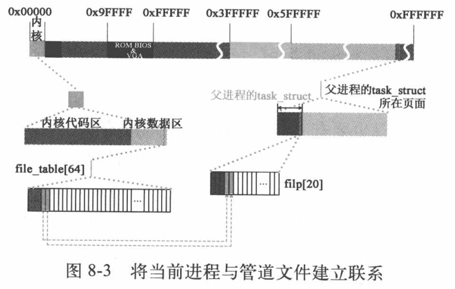

[toc]

# 进程间通信

> 讨论班准备内容 Linux 0.11 进程间通信

Linux 0.11 设计了两套机制来实现进程间通信的需求，一套是“管道机制”，另一套是“信号机制”。

## 管道机制

每个管道允许两个进程交互数据，一个输入一个输出。即实现了进程间通信，同时又不需要非法跨越进程间边界。操作系统在内存中为每个管道开辟一页内存，并赋予这一页内存文件属性。这一页内存由两个进程共享，但不会分配给任何进程，只有内核掌握。

Linux 0.11 中，管道操作分为两部分，一部分是创建管道，另一部分是管道的读写操作。通过实例 1 介绍管道操作，代码如下：

```c
#include <stdio.h>
#include <unistd.h>
int main() {
    int n, fd[2];
    pid_t pid;
    int i, j;
    char str1[] = ...;	// 1024 bytes
    char str2[512];
    // 创建管道
    if(pipe(fd) < 0) {
        printf("pipe error\n");
        return -1;
    }
    if((pid = fork()) < 0) {
        printf("fork error\n");
        return -1;
    }else if(pid > 0) {
        // 父进程向管道中写入数据
        close(fd[0]);
        for(i = 0; i < 10000; i++)
            write(fd[1], str1, strlen(str1));
    }else {
        // 子进程从管道中读取数据
        close(fd[1]);
        for(j = 0; j < 20000; j++)
            read(fd[0], str2, strlen[str2]);
    }
    return 0;
}
```

父进程把 str1 中的数据写入管道，子进程从管道中读出数据。

### 管道的创建过程

管道就是一页内存，但进程要以操作文件的方式对其进行操作，这就要求管道具备一些文件属性并减少页属性：

- 文件属性表现为，创建管道相当于创建一个文件，如进程 task\_struct 中 \*flip[20] 和 file\_table[64] 挂接、新建 i 节点、file\_table[64] 和文件 i 节点挂接等工作。最终进程只要知道自己在操作管道类型的文件即可。
- 减少页属性表现为，进程不能像访问自己用户空间的数据一样访问它，不能映射到进程的线性地址空间内。两个进程一个读一个写，不会产生写保护异常复制页面的情况。

创建进程都是让当前进程使用，而管道文件是为了两个进程使用而创建的。实例 1 中管道是由父进程创建的，父进程为子进程做准备，子进程一旦创建，天然就具备操作管道的能力。创建管道的系统调用由 sys\_pipe 函数实现，代码如下：

```c
// 创建管道系统调用。
// 在 fildes 所指的数组中创建一对文件句柄(描述符)。这对句柄指向一管道i节点。
// fildes[0]用于读管道数据，fildes[1]向管道写入数据。
int sys_pipe(unsigned long * fildes)
{
	struct m_inode * inode;
	struct file * f[2];
	int fd[2];
	int i,j;

    // 首先从系统文件表中取两个空闲项(引用计数字段为0的项)，并分别设置引用计数为1。
    // 若只有1个空闲项，则释放该项(引用计数复位).若没有找到两个空闲项，则返回-1.
	j=0;
	for(i=0;j<2 && i<NR_FILE;i++)
		if (!file_table[i].f_count)
			(f[j++]=i+file_table)->f_count++;
	if (j==1)
		f[0]->f_count=0;
	if (j<2)
		return -1;
   	// 在 *filp[20] 中申请两个空闲项，分别与上面申请的两个空闲项挂接。
    // filp 索引号就是对应的文件句柄。
	j=0;
	for(i=0;j<2 && i<NR_OPEN;i++)
		if (!current->filp[i]) {
			current->filp[ fd[j]=i ] = f[j];
			j++;
		}
	if (j==1)
		current->filp[fd[0]]=NULL;
	if (j<2) {
		f[0]->f_count=f[1]->f_count=0;
		return -1;
	}
```

先从系统文件表中申请两个空闲项，然后在当前进程的 flip 数组中申请两个空闲项，分别与两个文件项挂接。进程与管道文件建立联系。



进程要想具备操作管道文件的能力，还要建立管道文件 i 节点与 file\_table[64] 的关系，先调用 get\_pipe\_inode函数，在 inode\_table[32] 中申请一个 i 节点，代码如下：

```c
	...
	// 然后利用函数get_pipe_inode()申请一个管道使用的i节点，并为管道分配一页内存作为
    // 缓冲区。如果不成功，则相应释放两个文件句柄和文件结构项，并返回-1.
    if (!(inode=get_pipe_inode())) {
		current->filp[fd[0]] =
			current->filp[fd[1]] = NULL;
		f[0]->f_count = f[1]->f_count = 0;
		return -1;
	}
	...
// fs/inode.c
// 获取管道节点。
struct m_inode * get_pipe_inode(void)
{
	struct m_inode * inode;

    // 首先从内存i节点表中取得一个空闲i节点。如果找不到空闲i节点则返回NULL。然后为
    // 该i节点申请一页内存，并让节点的i_size字段指向该页面。如果已没有空闲内存，
    // 则释放该i节点，并返回NULL
	if (!(inode = get_empty_inode()))
		return NULL;
	if (!(inode->i_size=get_free_page())) {
		inode->i_count = 0;
		return NULL;
	}
    // 然后设置该i节点的引用计数为2，并复位管道头尾指针。i节点逻辑块号数组i_zone[]
    // 的i_zone[0]和i_zone[1]中分别用来存放管道头和管道尾指针。最后设置i节点是管
    // 道i节点标志并返回该i节点号。
	inode->i_count = 2;	/* sum of readers/writers */
	PIPE_HEAD(*inode) = PIPE_TAIL(*inode) = 0;
	inode->i_pipe = 1;
	return inode;
}
```

先申请一个空闲 i 节点，然后申请一个空闲内存页面，将该页面的地址载入 i 节点，inode->i_size 字段存的就是内存页面的起始地址。Linux 0.11 中默认操作这个管道文件的进程能且只能有两个，所以引用计数设计为 2。然后将管道的读写指针指向管道（就是这个内存页面）的起始位置。最后将该 i 节点标志位管道。


管道 i 节点创建完成后，就可以将它与 file\_table[64] 建立联系。初始化之前申请两个空闲项指向这个 i 节点，读写指针指向管道的起始位置，两个文件模式分别设置为读写。这样父进程和子进程也具备了操作管道文件的能力。


最后，将管道文件的两个句柄返给用户进程，即返给实例 1 代码中的 fd[2]。

```c
	...
    // 如果管道i节点申请成功，则对两个文件结构进行初始化操作，让他们都指向同一个管道
    // i节点，并把读写指针都置零。第1个文件结构的文件模式置为读，第2个文件结构的文件
    // 模式置为写。最后将文件句柄数组复制到对应的用户空间数组中，成功返回0，退出。
	f[0]->f_inode = f[1]->f_inode = inode;
	f[0]->f_pos = f[1]->f_pos = 0;
	f[0]->f_mode = 1;		/* read */
	f[1]->f_mode = 2;		/* write */
	put_fs_long(fd[0],0+fildes);		// 设置读管道文件句柄
	put_fs_long(fd[1],1+fildes);		// 设置写管道文件句柄
	return 0;
}
static inline void put_fs_long(unsigned long val,unsigned long * addr)
{
__asm__ ("movl %0,%%fs:%1"::"r" (val),"m" (*addr));
}
// kernel/system_call.s
# fs指向局部数据段(局部描述符表中数据段描述符)，即指向执行本次系统调用的用户程序的数据段。
	movl $0x17,%edx		# fs points to local data space
	mov %dx,%fs
	call _sys_call_table(,%eax,4)        # 间接调用指定功能C函数
	pushl %eax                          # 把系统调用返回值入栈
```

这里使用 put\_fs\_long 函数返回给用户进程，注意用了 fs 寄存器，在系统调用中将其指向用户程序的数据段。

### 管道的操作

Linux 0.11 管道操作要实现的效果是，读进程执行后，如果管道中有未读数据，就读取数据，没有未读数据就挂起；写程序执行时，如果管道内有剩余空间，就写入数据，没有剩余空间就挂起。管道只有一个页面，所以写或读到页面尾时，指针要能够回滚到页面首端继续操作。在不断回滚的情况下，读写进程还会不断地挂起和唤醒。下面通过实例 1，介绍管道操作的过程。通过 read/write 系统调用操作，对应调用 read\_pipe/write\_pipe 函数。

管道满或者空需要通过读写指针的相对位置判断，管道就类似一个循环队列，为了消除二义性此处设定写入最多 4095 bytes 数据，即当读写指针相差 1 字节时即管道满就把写进程挂起。当读写指针重合时即管道空。

下面通过实例 1 介绍管道操作的过程，每个阶段只分析用到的代码，这样最后会把几个函数都拆分地分析完。

实例 1 中父进程创建完管道后，开始创建子进程即读进程。创建完毕后，假设先执行读进程，read 系统调用会执行 sys\_read 函数，最终执行 read\_pipe 函数。此时管道没有任何数据，读进程会被挂起，然后切换到写进程执行，代码如下：

```c
// fs/read_write.c
// 读文件系统调用
// 参数fd是文件句柄，buf是缓冲区，count是预读字节数
int sys_read(unsigned int fd,char * buf,int count)
{
	...
	inode = file->f_inode;
	if (inode->i_pipe)
		return (file->f_mode&1)?read_pipe(inode,buf,count):-EIO;
	...
}
// fs/pipe.c
// 管道读操作函数
int read_pipe(struct m_inode * inode, char * buf, int count)
{
	int chars, size, read = 0;
	while (count>0) {
		while (!(size=PIPE_SIZE(*inode))) {
			wake_up(&inode->i_wait);
			if (inode->i_count != 2) /* are there any writers? */
				return read;
			sleep_on(&inode->i_wait);
		}
	...
}
```

管道中没有数据就挂起读进程，那么在之后的某一时刻，系统就会切换到写进程。读进程进入不可中断等待状态。写进程开始执行后，就会将实例 1 中的 str1 数组中的 1024 bytes 数据循环地写入管道中。write 系统调用会执行 sys\_write 函数，最终执行 write\_pipe中。写完后，管道中有数据可读出，唤醒读进程，代码如下：

```c
// fs/read_write.c
// 写文件系统调用
int sys_write(unsigned int fd,char * buf,int count)
{
	...
	inode=file->f_inode;
	if (inode->i_pipe)
		return (file->f_mode&2)?write_pipe(inode,buf,count):-EIO;
    ...
}
// fs/pipe.c
// 管道写操作函数。
int write_pipe(struct m_inode * inode, char * buf, int count)
{
	int chars, size, written = 0;
	while (count>0) {
        ...
        // 程序执行到这里表示管道缓冲区中有可写空间size.于是我们管道头指针到缓冲区
        // 末端空间字节数chars。写管道操作是从管道头指针处开始写的。如果chars大于还
        // 需要写入的字节数count，则令其等于count。如果chars大于当前管道中空闲空间
        // 长度size，则令其等于size，然后把需要写入字节数count减去此次可写入的字节数
        // chars，并把写入字节数累驾到witten中。
		chars = PAGE_SIZE-PIPE_HEAD(*inode);
		if (chars > count)
			chars = count;
		if (chars > size)
			chars = size;
		count -= chars;
		written += chars;
        // 再令size指向管道数据头指针处，并调整当前管道数据头部指针(前移chars字节)。
        // 若头指针超过管道末端则绕回。然后从用户缓冲区复制chars个字节到管道头指针
        // 开始处。对于管道i节点，其i_size字段中是管道缓冲块指针。      
		size = PIPE_HEAD(*inode);
		PIPE_HEAD(*inode) += chars;
		PIPE_HEAD(*inode) &= (PAGE_SIZE-1);
		while (chars-->0)
			((char *)inode->i_size)[size++]=get_fs_byte(buf++);
	}
    
	wake_up(&inode->i_wait);
	return written;
}
```

写完一次后，唤醒读进程，读写都在就绪态。实例 1 中读写都是循环的，时间片耗尽之前会不断向管道写入数据，直到写满（4095 bytes）。写满后，写进程就会被挂起，然后切换到读进程执行，代码如下：

```c
// 管道写操作函数。
// 参数inode是管道对应的i节点，buf是数据缓冲区指针，count是将写入管道的字节数。
int write_pipe(struct m_inode * inode, char * buf, int count)
{
	int chars, size, written = 0;

	while (count>0) {
		while (!(size=(PAGE_SIZE-1)-PIPE_SIZE(*inode))) {
			wake_up(&inode->i_wait);
			if (inode->i_count != 2) { /* no readers */
				current->signal |= (1<<(SIGPIPE-1));
				return written?written:-1;
			}
			sleep_on(&inode->i_wait);
		}
    ...
}
```

唤醒后的读进程会继续在 read\_pipe 函数中中执行，会把管道中 512 bytes 的数据读入实例 1 中的 str2 中，代码如下：

```c
// 管道读操作函数
int read_pipe(struct m_inode * inode, char * buf, int count)
{
	int chars, size, read = 0;
	while (count>0) {
        ...
        // 此时说明管道(缓冲区)中有数据。于是我们取管道尾指针到缓冲区末端的字
        // 节数chars。如果其大于还需要读取的字节数count，则令其等于count。如果
        // chars大于当前管道中含有数据的长度size，则令其等于size。然后把需读字
        // 节数count减去此次可读的字节数chars，并累加已读字节数read.
		chars = PAGE_SIZE-PIPE_TAIL(*inode);
		if (chars > count)
			chars = count;
		if (chars > size)
			chars = size;
		count -= chars;
		read += chars;
        // 再令size指向管道尾指针处，并调整当前管道尾指针(前移chars字节)。若尾
        // 指针超过管道末端则绕回。然后将管道中的数据复制到用户缓冲区中。对于
        // 管道i节点，其i_size字段中是管道缓冲块指针。
		size = PIPE_TAIL(*inode);
		PIPE_TAIL(*inode) += chars;
		PIPE_TAIL(*inode) &= (PAGE_SIZE-1);
		while (chars-->0)
			put_fs_byte(((char *)inode->i_size)[size++],buf++);
	}
    // 当此次读管道操作结束，则唤醒等待该管道的进程，并返回读取的字节数。
	wake_up(&inode->i_wait);
	return read;
}
```

读出数据意味着有了剩余空间，又会唤醒写进程，读进程在时间片耗尽之前会不断执行读操作，直到读写指针重合，管道空。

管道是单向传输的，且只能实现父子或兄弟进程间通信。要想在无关进程之间通信，需要使用命名管道 FIFO。

## 信号机制

信号机制是 Linux 0.11 为进程提供的一套“局部的类中断机制”，即在进程执行的过程中，如果系统发现某个进程接收到了信号，就暂时打断进程的执行，转而去执行该进程的信号处理程序，处理完毕后，再从进程“被打断”之处继续执行。

下面通过一个关于“信号的发送、接收以及处理”的实例 2，介绍系统以及进程处理信号的过程。两个用户进程，用来接收和处理信号的 processing 以及发送信号的 sendsig，代码如下：

```c
// processing
#include <stdio.h>
#include <signal.h>
void sig_usr(int signo) {
    if(signo == SIGUSR1)
        printf("received SIGUSR1\n");
    else
        printf("received %d\n", signo);
    signal(SIGUSR1, sig_usr);
}

int main(int argc, char **argv) {
    signal(SIGUSR1, sig_usr);	// 挂接 processing 进程的信号处理函数指针
    for(;;)
        pause();
    return 0;
}

// sendsig
#include <stdio.h>
int main(int argc, char **argv) {
    int pid, ret, signo;
    int i;
    if(argc != 3) {
        printf("Usage: sendsig <signo> <pid>\n");
        return -1;
    }
    signo = atoi(argv[1]);
    pid = atoi(argv[2]);
    ret = kill(pid, signo); // 发送信号
    for(i = 0; i < 1000000;)
        if(ret != 0)
            printf("send signal error\n");
    return 0;
}
```

系统需要具备以下三个功能，以支持信号机制：

- 系统要支持进程对信号的发送和接收

  每个进程 task\_struct 中都设置了用以接收信号的数据成员 signal 信号位图，每个进程接收到的信号就按位存储在这个数据结构中。系统支持两种信号发送方式：进程通过调用库函数给另一个进程发送信号，以及用户通过键盘输入信息产生键盘中断，由中断服务程序发送信号。两种方式都是通过设置信号位图上的信号位实现。

- 系统要能够及时检测到进程接收到的信号

  系统通过两种方式来检测进程是否接收到信号：一种是在系统调用返回之前检测当前进程是否接收到信号；另一种是时钟中断产生后，其中断服务程序执行结束之前，检测当前进程是否接收信号。

- 系统要支持进程对信号进程处理

  系统要能够保证，当用户进程不需要处理信号时，信号处理函数完全不参与用户进程的执行；当用户需要处理信号时，进程的程序将暂时停止执行，转而去执行信号处理函数，待信号处理函数执行完毕后，进程程序将从暂停的现场处继续执行。

实例 2 将从用户自定义的信号处理函数与进程进行绑定、系统对信号的预处理和信号处理完毕后进程现场的恢复三方面入手展现系统是如何实现以上功能的。编译运行实例 2：

```shell
$ ./processing &
[1] 110
$ ./sendsig 10 110
received SIGUSR1
```

### 信号的使用

下面介绍实例 2 两个进程的执行情况，processing 进程先开始执行，要为接收信号做准备。先将用户自定义的信号处理函数与进程绑定，使用 signal 系统调用实现绑定，对应调用 sys\_signal 函数，代码如下：

```c
// include/signal.h
struct sigaction {
	void (*sa_handler)(int);
	sigset_t sa_mask;
	int sa_flags;
	void (*sa_restorer)(void);
};
// kernel/signal.c
// signal()系统调用。类似于sigaction()。为指定的信号安装新的信号句柄(信号处理程序)。
// 信号句柄可以是用户指定的函数，也可以是SIG_DFL(默认句柄)或SIG_IGN(忽略)。
int sys_signal(int signum, long handler, long restorer)
{
	struct sigaction tmp;

    // 首先验证信号值在有效范围(1-32)内，并且不得是信号SIGKILL(和SIGSTOP)。因为这
    // 两个信号不能被进程捕获。
	if (signum<1 || signum>32 || signum==SIGKILL)
		return -1;
    // 然后根据提供的参数组建sigaction结构内容。sa_handler是指定的信号处理句柄(函数)。
    // sa_mask是执行信号处理句柄时的信号屏蔽码。sa_flags是执行时的一些标志组合。这里
    // 设定该信号处理句柄只使用1次后就恢复到默认值，并允许信号在自己的处理句柄中收到。
	tmp.sa_handler = (void (*)(int)) handler;
	tmp.sa_mask = 0;
	tmp.sa_flags = SA_ONESHOT | SA_NOMASK;
	tmp.sa_restorer = (void (*)(void)) restorer;        // 保存恢复处理函数指针
    // 接着取该信号原来的处理句柄，并设置该信号的sigaction结构，最后返回原信号句柄。
	handler = (long) current->sigaction[signum-1].sa_handler;
	current->sigaction[signum-1] = tmp;
	return handler;
}
```

首先要知道 sigaction 这个结构体，里面存的就是信号处理函数、信号屏蔽掩码、执行标志和现场恢复函数。signal 系统调用就是要为当前进程安装自定义信号句柄，restorer 参数由 Libc 提供，用于在信号处理程序执行后恢复系统调用的返回值和一些寄存器的值，就好像没有运行过信号处理程序，而是直接从系统调用中返回的。

实例 2 中的 processing 调用了 signal 函数后就将 SIGUSR1 信号对应的处理程序设置为 sig\_usr 函数，然后调用 pause 进入可中断的等待状态，等到该进程接收到信号后，它的状态将转换为就绪态。processing 暂时挂起，现在执行 sendsig。sendsig 通过调用 kill 系统调用给指定 pid 的进程发送信号，代码如下：

```c
// 向指定任务p发送信号sig, 权限priv。
// 参数：sig - 信号值；p - 指定任务的指针；priv - 强制发送信号的标志。即不需要考虑进程
static inline int send_sig(long sig,struct task_struct * p,int priv)
{
    // 若信号不正确或任务指针为空，则出错退出。
	if (!p || sig<1 || sig>32)
		return -EINVAL;
    
	if (priv || (current->euid==p->euid) || suser())
		p->signal |= (1<<(sig-1));
	else
		return -EPERM;
	return 0;
}
// 系统调用kill()可用于向任何进程或进程组发送任何信号，而并非只是杀死进程。:-)
// 参数pid是进程号；sig是需要发送的信号。
int sys_kill(int pid,int sig)
{
	...
	} else if (pid>0) while (--p > &FIRST_TASK) {
		if (*p && (*p)->pid == pid) 
			if ((err=send_sig(sig,*p,0)))
				retval = err;
	...
```

sys\_kill 调用 send\_sig 发送信号，也就是将指定进程的 signal 位图置位。sendsig 的时间片消耗完后会执行 schedule 进行进程切换，代码如下：

```c
void schedule(void)
{
	int i,next,c;
	struct task_struct ** p;
    // 从任务数组中最后一个任务开始循环检测alarm。在循环时跳过空指针项。
	for(p = &LAST_TASK ; p > &FIRST_TASK ; --p)
		if (*p) {
            ...
			if (((*p)->signal & ~(_BLOCKABLE & (*p)->blocked)) &&
			(*p)->state==TASK_INTERRUPTIBLE)
				(*p)->state=TASK_RUNNING;
		}
    ...
```

schedule 会遍历进程列表，当遍历到 processing 时检测到其接收到信号，且状态还是可中断等待状态，则将其设置为就绪态。然后 schedule 第二次遍历到 processing 时它已经是就绪态，就会切换到 processing 执行。

切换回 processing 后，从哪里开始执行呢？回忆之前分析创建进程 1 的过程，processing 挂起前的执行路线 pause => sys_pause => schedule => switch\_to，在 switch\_to 中，通过 ljmp 指令实现进程切换。那么切换回 processing 后，就要从 switch\_to 中 ljmp 的下一条指令开始执行，即准备从 sys\_pause 返回。系统调用返回时，一定会执行到 ret\_from\_sys\_call 处，最终调用 do\_signal 函数进行信号预处理，代码如下：

```assembly
# kernel/system_call.c
# 以下这段代码执行从系统调用C函数返回后，对信号进行识别处理。其他中断服务程序退出时也
# 将跳转到这里进行处理后才退出中断过程，例如后面的处理器出错中断int 16.
ret_from_sys_call:
	...
# 下面这段代码用于处理当前任务中的信号。首先取当前任务结构中的信号位图(32位，每位代表1种
# 信号)，然后用任务结构中的信号阻塞(屏蔽)码，阻塞不允许的信号位，取得数值最小的信号值，
# 再把原信号位图中该信号对应的位复位(置0)，最后将该信号值作为参数之一调用do_signal().
# do_signal()在kernel/signal.c中，其参数包括13个入栈信息。
	movl signal(%eax),%ebx          # 取信号位图→ebx,每1位代表1种信号，共32个信号
	movl blocked(%eax),%ecx         # 取阻塞(屏蔽)信号位图→ecx
	notl %ecx                       # 每位取反
	andl %ebx,%ecx                  # 获得许可信号位图
	bsfl %ecx,%ecx                  # 从低位(位0)开始扫描位图，看是否有1的位，若有，则ecx保留该位的偏移值
	je 3f                           # 如果没有信号则向前跳转退出
	btrl %ecx,%ebx                  # 复位该信号(ebx含有原signal位图)
	movl %ebx,signal(%eax)          # 重新保存signal位图信息→current->signal.
	incl %ecx                       # 将信号调整为从1开始的数(1-32)
	pushl %ecx                      # 信号值入栈作为调用do_signal的参数之一
	call _do_signal                  # 调用C函数信号处理程序(kernel/signal.c)
	popl %eax                       # 弹出入栈的信号值
```

每次只处理一个信号，先根据屏蔽位图获取许可信号位图，然后从低到高位扫描位图获取首个信号，将索引 +1 作为信号值压栈，然后调用 do\_signal 函数，函数由 13 个参数，都是从进入系统调用开始累积压栈的寄存器、系统调用的返回值和信号值。do\_signal 是信号预处理程序，其主要作用是将信号处理程序插入到用户程序栈，在系统调用返回后立即执行信号处理程序，然后继续执行用户的程序。为了实现这样的效果，首先需要将系统调用内核栈中保存的寄存器备份到当前进程的用户栈，然后更改内核栈中的寄存器值，使得系统调用返回到信号处理程序开始执行，等信号处理完毕后，再通过备份在用户空间的数据代码返回到中断位置继续执行。do\_signal 代码如下：

```c
// 系统调用的中断处理程序中真正的信号预处理程序。
// 该段代码的主要作用是将信号处理句柄插入到用户程序堆栈中，并在本系统调用结束
// 返回后立即执行信号句柄程序，然后继续执行用户的程序。这个函数处理比较粗略，
// 尚不能处理进程暂停SIGSTOP等信号。
void do_signal(long signr,long eax,			// signal & system_call return value
	long ebx, long ecx, long edx, long fs, long es, long ds,		// system_call
	long eip, long cs, long eflags,	unsigned long * esp, long ss)	// hardware
{
	unsigned long sa_handler;
	long old_eip=eip;
	struct sigaction * sa = current->sigaction + signr - 1;
	int longs;                          // 即current->sigaction[signr-1]
	unsigned long * tmp_esp;

	sa_handler = (unsigned long) sa->sa_handler;
	if (sa_handler==1)
		return;
	if (!sa_handler) {
		if (signr==SIGCHLD)
			return;
		else
			do_exit(1<<(signr-1));      // 不再返回到这里
	}
    
	if (sa->sa_flags & SA_ONESHOT)
		sa->sa_handler = NULL;
 
    // sigaction结构的sa_mask字段给出了在当前信号句柄(信号描述符)程序执行期间
    // 应该被屏蔽的信号集。同时，引起本信号句柄执行的信号也会被屏蔽。不过若
    // sa_flags中使用了SA_NOMASK标志，那么引起本信号句柄执行的信号将不会被屏蔽掉。
    // 如果允许信号自己的处理句柄程序收到信号自己，则也需要将进程的信号阻塞码压入堆栈。
	*(&eip) = sa_handler;							// 修改 eip 指向信号处理函数
	longs = (sa->sa_flags & SA_NOMASK)?7:8;	
    // 将原调用程序的用户堆栈指针向下扩展7(8)个字长(用来存放调用信号句柄的参数等)，
    // 并检查内存使用情况(例如如果内存超界则分配新页等)
	*(&esp) -= longs;		// 这里 esp 的类型是 unsigned long* 所以 不需要 longs*4
	verify_area(esp,longs*4);
    // 在用户堆栈中从下道上存放sa_restorer、信号signr、屏蔽码blocked(如果SA_NOMASK
    // 置位)、eax,ecx,edx,eflags和用户程序原代码指针。
	tmp_esp=esp;
	put_fs_long((long) sa->sa_restorer,tmp_esp++);
	put_fs_long(signr,tmp_esp++);
	if (!(sa->sa_flags & SA_NOMASK))
		put_fs_long(current->blocked,tmp_esp++);
	put_fs_long(eax,tmp_esp++);
	put_fs_long(ecx,tmp_esp++);
	put_fs_long(edx,tmp_esp++);
	put_fs_long(eflags,tmp_esp++);
	put_fs_long(old_eip,tmp_esp++);
	current->blocked |= sa->sa_mask;        // 进程阻塞码(屏蔽码)添上sa_mask中的码位。
}
```

经过信号预处理后的内核栈和用户栈状态如下图，从系统调用返回执行 iret 指令，恢复的 eip 指向信号处理程序，即 processing 的 sig\_usr 函数，函数执行结束执行 ret 指令后会跳转到 sa\_restorer 函数。


前面提到，restore 函数是 Libc 提供的函数，用于在信号处理工作结束后恢复用户进程数据，最终跳转到用户程序的中断位置即 old\_eip继续执行。restorer 函数的代码如下：

```assembly
.global ____sig_restore
.global ____masksig_restore
____sig_restore:
    addl $4,%esp   	# 丢弃信号值
    popl %eax       # 恢复系统调用返回值
    popl %ecx
    popl %edx
    popfl           # 恢复用户程序的标志寄存器
    ret
____masksig_restore:
    addl $4,%esp   	# 丢弃信号值
    call ____ssetmask
    addl $4,%esp  	# 丢弃屏蔽掩码
    popl %eax       #恢复系统调用返回值
    popl %ecx
    popl %edx
    popfl           #恢复用户程序的标志寄存器
    ret
```

do\_signal 执行完后，系统调用剩余的代码会将内核栈上的寄存器出栈，执行了 iret 后，内核栈上的 cs:eip、eflags、ss:esp 出栈，恢复到用户态执行。此时 eip 为信号处理程序地址，因此会执行信号处理函数。处理完成后会通过 ret 指令跳转到 restorer 程序恢复寄存器值和系统调用返回值、清理用户栈，最后通过 restorer 的 ret 指令回到用户程序的 eip 从中断之后执行原来的程序。

### 信号对进程执行状态的影响

前面看 schedule 的代码已经知道，可中断等待状态的进程收到信号之后状态会改成就绪态。下面介绍进程的不可中断等待状态。假设系统中由三个进程 A, B, C，它们都处于就绪态，B 是 A 的子进程，进程 A 正在运行。代码如下：

```c
// A & B
main() {
    char buffer[1000];
    int pid, f;
    int fd = open("/mnt/usr/hello.txt", O_RDWR, 0644);
    read(fd, buffer, sizeof(buffer));
    if(!(pid = fork())) {
        exit();
    }
    if(pid > 0)
        while(pid != wait(&i));
    close(fd);
    return;
}
// C
main() {
    int i, j;
    for(i = 0; i < 1000000; i++)
        for(j = 0; j < 1000000; j++)
}
```

首先，A 需要读硬盘，调用 read，最终映射到 sys\_read 函数执行。读盘命令发出后，进程 A 被设置为不可中断等待，在数据被读入之前，进程无法被唤醒。

## 其他进程间通信机制

> [深刻理解 Linux 进程间七大通信（IPC）](https://mp.weixin.qq.com/s/WgZaS5w5IXa3IBGRsPKtbQ)
>
> [进程间通信 知乎](https://zhuanlan.zhihu.com/p/165224175)
>
> [Linux进程间通信的几种方式总结--linux内核剖析（七）](https://www.cnblogs.com/yangykaifa/p/7295863.html)
>
> 深入理解 Linux 内核