# 系统虚拟化

> 2020.11.05 系统虚拟化研讨班
>
> 《系统虚拟化：原理与实现》
>
> 秦浩翔 2020.11.08

## 前言

- 硬件层面虚拟化：Xen、VMWare
- 操作系统层面：容器，如 Docker
- 库函数层面：WINE
- 编程语言层：JVM、CLR(Common Language Runtime)

X86 简述 略

## 系统虚拟化概述

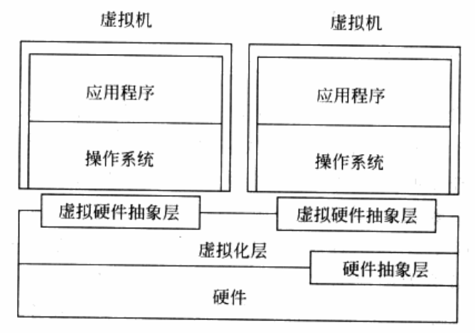

虚拟化层即 VMM。

#### 三个典型特征

- 同质：虚拟机的运行环境和物理机的环境在本质上需要相同，允许有一些差异。
- 高效：虚拟机中运行的软件需要有接近在物理机直接运行的性能。
- 资源受控：VMM 需要对系统资源有完全控制能力和管理权限，包括资源的分配、监控和回收。

#### 可虚拟化架构

给定一个系统，其对应的体系结构是否课虚拟化，就要看能否在该系统上虚拟化处具备上述三种特征的虚拟机。

- 特权指令
- 敏感指令，操作特权资源的指令，包括修改虚拟机的运行模式或者下面物理机的状态；读写敏感的寄存器或是内存；访问存储保护系统、内存系统或是地址重定位系统以及所有的 I/O 指令。

所有的特权指令都是敏感指令，而并不是所有的敏感指令都是特权指令。

而敏感指令必须在 VMM 的监控下进行，或者由 VMM 完成。如果一个结构上所有敏感指令都是特权指令，则它是可虚拟化的结构；反之，如果它无法支持在所有的敏感指令上触发异常，则不是一个可虚拟化的结构，称其存在 **“虚拟化漏洞”**。

### 处理器虚拟化

#### 指令模拟

处理器虚拟化的关键在于正确模拟虚拟机指令的行为。

虚拟寄存器、上下文和虚拟处理器。

虚拟机访问关键资源时，VMM 模拟行为，将访问定位到虚拟的寄存器上，通常在内存中。

虚拟处理器的上下文包括所有的系统寄存器。

虚拟机执行敏感指令后陷入，VMM 模拟而不是直接作用在真实硬件。

##### VMM 的陷入方式，利用处理器的保护机制，利用中断和异常完成：

- 处理器保护机制，特权指令，权限检查。
- 虚拟机主动出发异常，主动陷入。
- 异步中断，处理器内部和外设的中断。跳转到 VMM 注册的中断服务例程。

#### 中断和异常的模拟及注入

VMM 对异常的虚拟化需要完全遵照物理处理器对于各种异常条件的定义，再根据虚拟处理器当时的内容，来判断是否需要模拟出一个虚拟的异常，并注入到虚拟环境中。

VMM 通常会在硬件异常处理程序和指令模拟代码中进行异常虚拟化的检查。

中断/异常的虚拟化由中断/异常源的定义、中断/异常源与 VMM 处理器虚拟化模块之间的交互机制以及最终模拟注入的过程所组成。

### 内存虚拟化

没有虚拟化的情况下，操作系统在对内存的使用与管理上已经达成了以下两点认识：

1. 内存都是从物理地址 0 开始的；
2. 内存都是连续的，或者说至少在一些大的粒度上连续。

内存虚拟化的核心，在于引入了一层新的地址空间——客户机物理地址空间。

1. 给定一个虚拟机，维护客户机物理地址到宿主机物理地址之间的映射关系；

   GPA = f1(GVA), HPA = f2(GPA) 即经过两层地址转换 HPA = f1(f2(GVA))

2. 截获虚拟机对客户机物理地址的访问，并根据所记录的映射关系，将其转换成宿主机物理地址；

   最简单是每次访问都触发异常，后续还有更好的方法。

内存虚拟化还实现了整个系统的安全隔离，包括虚拟机之间，虚拟机与 VMM 之间：

1. VMM 通过处理器硬件功能或段限制保证 VMM 自身的安全性；
2. VMM 通过特殊的权限验证机制使得客户机只能访问分配给它的内存页；
3. VMM 通过硬件技术，防止虚拟机利用设备通过 DMA 的方式越权访问物理内存。

### I/O 虚拟化

VMM 通过 I/O 虚拟化的方式复用有线的外设资源。VMM 截获客户操作系统对设备的访问请求，然后通过软件的方式来模拟真实设备的效果。

- 设备发现，VMM 提供一种方式让客户机操作系统发现虚拟设备。
- 截获访问，客户机操作系统中的驱动程序按照接口定义访问虚拟设备，截获设备访问，关键在于处理器虚拟化。
- 设备模拟
- 设备共享

### VMM 功能和组成

虚拟环境管理，提供基本功能；物理资源管理，根据实现结构的差异，存在差异。

#### 虚拟环境的管理

1. 虚拟资源：截获客户机操作系统对处理器、内存和外设等资源的访问，构建一个虚拟环境；
2. 虚拟环境调度：可以同时构建多个虚拟环境，允许多个客户机操作系统并发执行，调度的基本单位是 VCPU，当 VCPU 被调度到时，VMM 调度程序将 VCPU 上下文装载到物理 CPU 上，对应的客户机指令开始真正被执行；
3. 虚拟机之间通信：为虚拟机提供相互之间通信机制，向虚拟机提供相应的 API。可以是事件通知、共享内存；
4. 虚拟化环境的管理接口：VMM 提供一组完备的管理接口，来支持虚拟环境的创建、删除、暂停、查询和迁移等功能。

#### 物理资源的管理

1. 处理器管理：系统启动检测并获取所有的处理器；处理器初始化，设置运行模式、页表、中断处理函数等；处理器纳入调度序列；
2. 内存管理：系统启动时 VMM 检测并获取所有内存；对获得的内存进行初始化，包括分页并设置页表；提供内存分配的接口；给虚拟机分配内存，维护 GPA 到 HPA 的映射；
3. 中断管理：VMM 负责初始化并设置中断相关的资源，如处理器中断向量表；
4. 系统时间管理：VMM 拥有和时间相关的硬件资源，向各虚拟机提供虚拟化的时间；
5. 设备管理：在 Hypervisor 模型下，所有外设都属于 VMM，因此 VMM 需要包含所有设备的驱动程序。

#### 其他模块

- 软件定时器
- 多处理器同步原语 spinlock、rcu
- 调试手段
- 性能采集与分析工具
- 安全机制，隔离
- 电源管理

### VMM 的分类

#### 按照虚拟平台分类

- 完全虚拟化，完全虚拟化的虚拟平台和现实平台是一样的，客户机无须做任何修改就可以运行。
  - 软件辅助的完全虚拟化
    - 优先级翻译，VMM 运行在 Ring 0，客户机操作系统内核运行在 Ring 1，客户机操作系统应用程序运行在 Ring 3。客户机操作系统内核执行特权指令时会触发异常，VMM 截获特权指令并进行虚拟化。
    - 二进制代码翻译，扫描并修改客户机的二进制代码，将难以虚拟化的指令转化为支持虚拟化的指令。Cache Block
  - 硬件辅助的完全虚拟化，Intel VT-x，引入了一个新的执行模式用于运行虚拟机。当虚拟机运行在这个特殊模式时，任何操作都会被处理器截获并报告给 VMM。VMM 在接收到处理器的报告后，通过对目标指令的解码，找到对应的虚拟化模块进行模拟，并把最终的效果反映在特殊模式下的环境中。
- 类虚拟化，通过在源代码级别修改指令以回避虚拟化漏洞的方式来使 VMM 能够对物理资源实现虚拟化。修改操作系统内核的代码（即 API 级），使得操作系统内核完全避免难以虚拟化的指令。修改操作系统处理器相关代码，让操作系统主动让出特权级别，运行在次一级特权上。

#### 按 VMM 实现结构分类

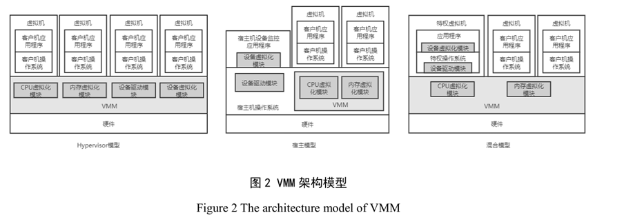

- Hypervisor 模型
  - VMM 同时具备物理资源管理和虚拟化功能，效率会高一些。
  - 安全性依赖于 VMM 的安全。
- 宿主模型
  - 物理资源由宿主机操作系统管理。
  - VMM 实现虚拟化，通过调用宿主机操作系统的资源来获得资源。
  - 充分利用驱动。
  - 效率问题、安全还依赖于宿主机操作系统内核。
- 混合模型
  - VMM 依然位于最底层，拥有所有的物理资源。VMM 会让出大部分 I/O 设备的控制权，交由一个运行在特权虚拟机中的特权操作系统来控制。I/O 虚拟化由 VMM 和特权操作系统共同完成。
  - 上下文切换开销。

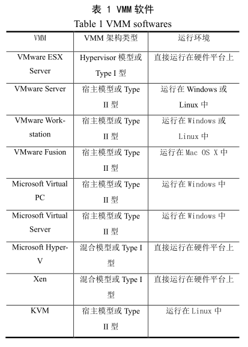

## 基于软件的全虚拟化

### CPU 虚拟化

基于软件的 CPU 完全虚拟化，其本质就是软件模拟。VMM 可以将虚拟机的整个执行过程置于控制之中，不会漏过需要模拟的敏感指令。

#### 解释执行

最简单最直接的模拟就是解释执行，取一条指令，模拟出这条指令执行的效果，再继续取下一条指令，周而复始。每条指令都“陷入”了，避免了虚拟化漏洞。

性能太差，如果是模拟与物理机相同体系结构的虚拟机，那么很多非敏感指令不需要模拟而可以直接在物理 CPU 上运行。

#### 扫描与修补

扫描与修补技术让大多数指令直接在物理 CPU 上运行，而把操作系统代码中的敏感指令替换为跳转指令或会陷入 VMM 中的指令。流程如下：

1. VMM 会在虚拟机开始执行每段代码之前对其进行扫描，解析每一条指令，查找到特权指令和敏感指令；
2. 补丁代码会在 VMM 中动态生成，通常每一个需要修补的指令会对应一块补丁代码；
3. 敏感指令被替换成一个外跳转，从虚拟机跳转到 VMM 的空间里，在 VMM 中执行动态生成的补丁代码；
4. 补丁代码执行完后，控制流再跳转回虚拟机中的下一条代码继续执行。

补丁代码块存在 VMM 内存的代码缓存中，满了会逐出一些，使用 PC 到补丁代码块的对应关系记录哪些 PC 对应的指令已经生成过补丁代码。

缺点：

1. 模拟执行的时间或长或短；
2. 补丁引入额外跳转，降低代码的局部性；
3. 直接在虚拟机内存中进行代码修补，需要维护一份与补丁对应的原始代码备份，以便在需要的时候恢复原状。

#### 二进制代码翻译

二进制代码翻译（BT技术）在 VMM 中开辟一块缓存，将代码翻译好放在其中。这样，客户操作系统代码并不会直接被物理 CPU 执行，所有要被执行的代码都会在代码缓存中。

BT 技术的动态翻译以动态基本块为基本单位。模拟器动态地、按需地读入二进制代码进行翻译，将翻译好的目标代码存放在模拟器开辟的内存空间中，这块空间称为代码缓存。由于代码缓存是在模拟器的内存分配的，容量有限，满的时候会释放，需要好的管理策略。原指令与翻译后的代码用某种映射关系联系起来，常用的是哈希表。

##### 翻译

模拟器将读入的二进制代码翻译输出为 x86 指令的一个安全的自己，即其中不包括特权指令和敏感指令，能够运行在用户态。体系结构相同的情况下，模拟器翻译分两种，简单翻译比较直接，但指令数量会大大膨胀；等值翻译相对更为高级，但动态分析比前者困难。

REGS 结构是模拟器中为每个 VCPU 维护的数据结构，存有 VCPU 所有寄存器的值。在同硬件体系结构的模拟中，理论上大多数指令是可以等值翻译的，以下几种例外：

1. PC 相对寻址的指令，与 PC 相关，而原代码和目标代码的指令相对关系不同不能直接使用。模拟器的翻译模块需要在目标代码中插入补偿代码确保寻址正确。
2. 直接控制转换，原代码中的控制转换，如函数调用和跳转指令，其目标地址需要替换成存于代码缓存的目标代码地址。直接调用和直接跳转是可以直接替换的，性能损失可忽略。
3. 简介控制转换，间接调用、返回和间接跳转的目标地址是动态运行时得到的。由于目标地址不固定，翻译时无法绑定跳转目标，动态计算出来后查哈希表获取。
4. 特权指令，简单的能够模拟的特权指令，如 CLI，翻译的代码只需要设置标志位。而稍复杂的指令，需要用跳转从模拟环境跳到模拟器中深度模拟，开销较大。

##### 基于 BT 技术的 CPU 虚拟化

BT 技术在 VMM 中开辟一块代码缓存，将代码翻译好放在其中。原始的客户机操作系统代码并不会直接被物理 CPU 执行，它们以基本块的形式组织，模拟器先将积极那个执行的基本块翻译成目标代码块，再转入目标代码块执行，再翻译接下来要运行的原始基本块。

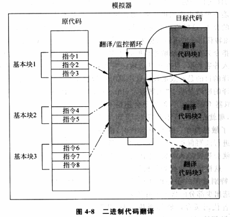

##### BT 技术的难点

以下几种情况处理过程会比较困难：

1. 自修改代码，一旦发生自修改操作，模拟器需要将代码缓存中对应已翻译的代码清除，重新翻译。
2. 自参考代码，指的是程序会从自己的代码段读取内容，模拟器需要让程序读取原代码段的内容。
3. 精确异常，指在翻译代码执行中发生了中断或异常，这时需要将运行状态对应到原代码执行到异常点时的状态，然后交给客户机操作系统去处理。可能的解决方法是异常时回滚到基本块开头，用解释执行的方式逐条执行原代码。
4. 实时代码，对于实时性要求比较高的代码，运行在模拟环境会损失时间精确性。

##### BT 技术的优化

减少模拟器环境和虚拟机环境的切换，使得运行尽可能不要跳出虚拟机环境，即让执行从一个基本块直接条转到下一个基本块，而不需要模拟器的介入。

一些敏感指令只有在设计敏感数据时才需要模拟执行，如果不确定一条指令是否会进行敏感操作，那就假定不会，在设计敏感操作时会触发陷入异常。

### 内存虚拟化

内存虚拟化的目的有两个：

1. 给虚拟机提供一个从零地址开始的连续物理内存空间；
2. 在各虚拟机之间有效隔离、调度以及共享内存资源。

引入了客户机物理地址空间，形成了 GVA 到 GPA 再到 HPA 的映射关系。前一个由客户机操作系统完成，后一个转换由 VMM 负责。VMM 为每个虚拟机动态地维护一个从 GPA 到 HPA 映射的表。有了这张表，VMM 截获任何试图修改客户机页表或刷新 TLB 的指令，根据这张表，将修改从 GVA 到GPA 映射的操作变成修改 GVA 到相应 HPA 的操作。

VMM 还可以通过该表确保运行于同一宿主机上的不同客户机访问的是不同的物理内存，即同一 GPA 映射到不同的 HPA。有时，VMM 使用页共享技术让不同的客户机共享包含相同数据的宿主机物理页，删除多于备份，即同一 GPA 映射到同一 HPA。

#### 影子页表

MMU 无法直接装载客户机的页表进行地址转换，因为页表里记录的都是 GPA。

影子页表 Shadow Page Table 是一个有效的解决方法，影子页表与客户机操作系统页表一一对应，其作的是 GVA 直接到 HPA 的地址转换。

为了使影子页表机制能够工作，VMM 需要对 MMU 进行虚拟化，而真正被 VMM 载入物理 MMU 的页表是影子页表。使用影子页表，只需要进行一次地址转换，且客户机 TLB 和 CPU cache 上的缓存都是来自影子页表的 GVA 到 HPA 的映射。

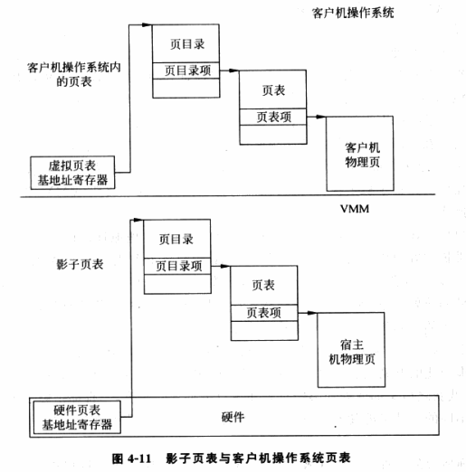

客户机总在不时地修改客户机页表，为保证一致性，VMM 必须对影子页表做相应的维护。为此，VMM 必须截获修改 GVA 到 GPA 映射的内存访问操作，修改在影子页表中同一客户机 GVA 到HPA 的映射，使之仍符合 GPA 到 HPA 的映射关系。

刷新 TLB 大致是写 CR3 和 INVLPG，都是特权指令，可以截获作相应处理。

影子页表性能开销是关键，如何截获内存访问以及截获之后如何处理影子页表和客户机页表的修改。页表页也是内存的一部分，其本身也必然作为普通数据页在页表中有一份映射，又由于客户机的页表是由其自身维护的，它本身具有对页表页的读写权限。在对应的影子页表中，如果页表页的映射也是可写的，那么 VMM 将无法追踪客户机更新页表的操作。因此在影子页表中，页表页的访问权限是只读的，任何写页表页的操作都会触发缺页异常，由 VMM 接获处理。处理过程中，VMM 除了代客户机更新页表项之外，还会将更新的 GPA 翻译成 HPA，更新影子页表。

需要注意的是，客户机操作系统可能会在 VMM 无感知的情况下，将页表回收，如进程退出时，使用的页表也被回收。而这种操作通常不是由特权或敏感指令完成的，VMM 无从截获，只能凭经验推测。这时，VMM 应该取消对页表页的写保护，以免造成不必要的开销。

时间上看，影子页表减少了开销，但仍与非虚拟化环境有差距。空间上看，影子页表的引入带来较大的空间开销，设计中对其占用的物理空间也会优化处理。 

##### 影子页表的结构

影子页表的页表项都是 HPA。

在建立影子页表时，VMM 根据客户机 CR3 寄存器的值 GFN 找到与之对应的宿主机上的物理页帧号 MFN，即相当于 GPA 对应 HPA。VMM 要从宿主机的物理内存分配一个物理页，其页帧号为影子宿主机物理页帧号 SMFN，将这个值载入物理 CR3 寄存器，指向对应客户机进程的影子页表。客户机操作系统调度到这个进程时，VMM 不需要重新分配新的宿主机物理页，只需找到之前分配的 SMFN 即可。为此，需要在 GFN、MFN 和 SMFN 之间建立一定的关系，由于 GFN 和 MFN 一一对应，那就只需要建立 MFN 到 SMFN 的关系。最常见的就是哈希表，以 MFN 的值和 SMFN 对应的影子页表类型（第几级页表）为键值索引 SMFN，即 SMFN = hash(MFN, type)。

二级页表，每张影子页表有 1024 个页表项，对应客户机页表相应位置的页表项。客户机页表项如果存在，则 VMM 会为相应的影子页表的页表项填入 HPA。如果所在页表不是最后一级页表，那么就根据客户机页表项得到 GFN，转换成 MFN，再根据哈希索引 SMFN，填入该影子页表项，如果没有就新分配一个宿主机物理页，建立映射。

影子页表的建立和修改过程交织在一起，贯穿于客户机操作系统修改客户机页表和刷新 TLB 的操作中。

##### 影子页表的建立

开始，VMM 中的影子页表是空的，不包含任何 GVA 到 HPA 的映射。随后以按需调整的方式修改影子页表。空的影子页表载入 CR3 中有物理 MMU 利用进行地址转换，此时任何内存的访问都会引起缺页异常。如果此时客户机页表中已经存在了 GVA 到 GPA 的映射，那么这种缺页异常就是由于影子页表还未初始化建立对应的 GVA 到 HPA 的映射造成的。这种情况下，VMM 捕获异常，在影子页表中建立 GVA 到 HPA 的映射，完成影子页表初始化，而且这中异常不会告知客户机操作系统。如果 VMM 在客户机不知情的情况下将分配给客户机的宿主机物理页换出到磁盘上，也会出现类似情况，那么这种缺页异常也会由 VMM 处理。

如果缺页异常时，客户操作系统尚未分配为 GVA 分配 GPA，那么VMM 要先将异常传递给客户机，有客户机操作系统分配 GPA，这个过程要修改页表，会被 VMM 截获，从而更新影子页表。

##### 影子页表的缺页处理机制

缺页异常发生时，首先由 VMM 截获。先比较权限位，检查是否是由客户机本身造成的，如果是就返回给客户机处理。如果如上述的是 VMM 造成的，这种异常成为影子缺页异常，会根据客户机页表同步影子页表。同步影子页表的过程中还要根据客户页表项的访问位和修改位着纸影子页表的访问位和修改位，保证语义相同。

1. 缺页异常时客户机页表项存在位为 0，即客户物理页不存在，就将相应的影子页表项设为空值，而不是仅将影子页表项的存在位置 0。
2. 客户机存在位为 1，访问位和修改位为 1，则影子页表项也要置 1。
3. 客户机访问位为 0，表示客户机尚未访问相应的客户机物理页。这时，VMM 需要截获将来客户机页表项访问位被置 1 的操作，从而将相应的影子页表项的访问位置 1。为此，VMM 将相应的影子页表项的存在位置 0，则下次访问时会发生缺页异常，再将影子页表访问位置 1。之将访问位置 0 是不够的。
4. 对于客户机修改位，如果是 0，表示不曾写入。这时，VMM 需要截获对此页之后的写操作，即将影子页表项设为只读。

影子页表和客户机页表不是时刻同步的，是按需同步的。影子页表充当了客户机页表巨大的 TLB。客户机试图修改客户机页表，会执行敏感指令写 CR3 或 INVLPG 以刷新 TLB，VMM 截获这一操作，对影子页表进行相应修改。

#### 内存虚拟化的优化

##### 自伸缩内存调节技术

VMM 通过诱导客户机操作系统回收或分配客户机所拥有的宿主机物理内存的技术。

VMM 需要回收内存时，通知植入在客户机操作系统的气球模块，气球模块会分配客户机物理内存，VMM 把这些内存回收。气球通过膨胀实现了 VMM 圈地的功能。客户机对气球分配的这些内存的访问都会引起缺页异常，会被 VMM 截获。

##### 页共享技术

开销主要来源于扫描物理内存以找出相同数据的不同物理页，可以使用哈希表高效描述物理页的共享情况。计算数据哈希值作为键值，如果键值已存在，就意味着有很大概率包含相同数据可以共享。写时复制，任何对共享页的写操作都会引起缺页异常，被 VMM 截获，在客户机不知情的情况下复制一份。

### I/O 虚拟化

介绍以 PCI 设备为主。

#### 设备模型

使用 I/O 模拟的方法来虚拟化 I/O 设备。VMM 进行设别模拟，并处理所有设备请求和相应的逻辑模块，就是设备模型。只需要正确模拟目标设备的软件接口就可以保证客户机操作系统观察到的虚拟设备与目标设备一致。

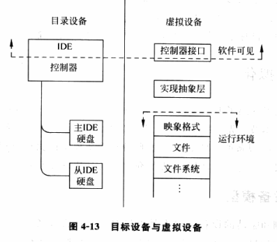

设备模型所模拟的目标与宿主机的硬件不存在直接的管理和对应关系，而是建立在一定的运行环境之上，如操作系统提供的系统调用。VMM 截获客户机的 I/O 操作，将这些操作传递给设别模型进行处理；设备模型运行在一个特定的运行环境下，可以是操作系统、VMM 本身或另一个客户机。

#### 设备模型的软件接口

对于一个典型的 PCI 设备，它可能包含以下种类的接口。

1. PCI 配置空间，包含了设备的基本信息，最重要的是设备标识符，使操作系统可以发现并识别设备类型；基地址寄存器，它使操作系统可以映射并寻址属于该设备的寄存器。PCI 配置空间通过平台相关的寄存器访问，可以是端口 I/O，也可以是 MMIO，一般由两个寄存器组成，一个用于指定设备和偏移，另一个用于读取或写入数据。
2. 端口 I/O，操作系统通过特定指令访问 I/O 空间，如 in、out、ins、outs。
3. MMIO，某些特定的物理内存区域不会映射到真正的 RAM，而可能是设备的 MMIO，其中包含设备的寄存器。操作系统通过页表将相应的物理内存区域以特定的内存类型映射到虚拟地址空间内，并通过类似访问内存的方式访问设备寄存器。
4. DMA，通过自己的寄存器使操作系统可以控制 DMA 传输。
5. 中断，设备需要通知操作系统处理某些中断时，会通过其中断控制器发起中断。

虚拟机中，客户机通过这些接口与虚拟设备进行数据交换时，VMM 会截获这些访问，并将其重定向到设备模型，实现设备模拟。

#### 接口拦截和模拟

##### 端口 I/O

客户机通过 in、out、ins、outs 敏感指令实现端口 I/O，VMM 可以通过修补、动态翻译或者直接陷入的方式拦截并执行对应的处理函数。

##### MMIO

需要较大寄存器空间的设备一般会使用 MMIO，即内存映射的 I/O。与端口 I/O 类似，也是基于拦截分发处理的过程。

1. MMIO 使用不限于特定指令，因此不能用修补或翻译。在初始化客户机映射的 MMIO 所属的物理地址范围时，VMM 不会建立相应的影子页表项。因此客户机的 MMIO 访问都会造成缺页异常，VMM 截获这些异常后就可以交给设备模型。
2. 对 MMIO 的处理需要检查内存边界、内存对齐等。
3. 如何区分 MMIO 和系统内存造成的缺页异常，去要引入更快的方法。

##### DMA

DMA 拦截相对简单，由于 DMA 的发起是通过设备的寄存器来控制的，设备模型在端口 I/O 或 MMIIO 处理函数中就可以拦截所有的 DMA 操作。

##### PCI 配置空间

设备模型一般使用统一的配置空间处理函数来处理设备的 I/O 资源分配和映射。

#### 功能实现

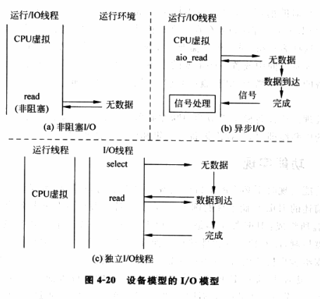

## 硬件辅助虚拟化

硬件辅助虚拟化，就是在 CPU、芯片组及 I/O 设备等硬件中加入专门针对虚拟化的支持，使得系统软件可以更加容易、高效地实现虚拟化功能。以下是 Intel VT 实现的 VMM 的典型结构。

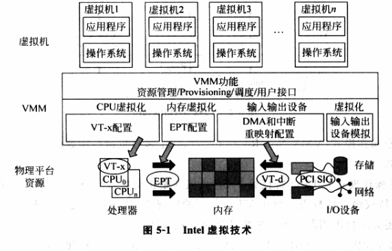

下面针对这个架构图展开。

### CPU 虚拟化的硬件支持

Intel VT-x 扩展了传统的 IA-32 处理器架构，为虚拟化提供硬件支持。

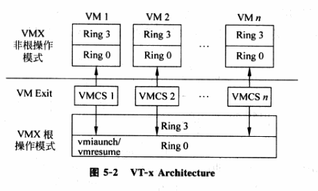

VT-x 引入了两种操作模型，统称为 VMX 操作模式。

- 根操作模式 VMX Root Operation，VMM 运行所处的模式
- 非根操作模式 VMX Non-Root Operation，客户机运行所处的模式

这两种操作模式与与 IA32 特权级 0-3 是正交的，即每种操作模式下都有相应的特权级 0-3。

之前的指令虚拟化是通过“陷入再模拟”的方式实现的，而 IA32 架构有 19 条敏感指令无法处理，导致了虚拟化漏洞。引入新的操作模式可以很好地解决问题。非根模式下所有敏感指令的行为都被重定义，使得它们能不经虚拟化就直接执行或通过“陷入再模拟”的方式来处理；在根模式下，所有指令不变。

VT-x 中，非根模式下敏感指令引起的“陷入”被称为 VM-Exit。VM-Exit 发生时，CPU 自动从非根模式切换为根模式。相应地，VT-x 定义了 VM-Entry，该操作由 VMM 发起，通常是调度某个客户及运行，此时 CPU 从根模式切换到非根模式。

VT-x 引入了 Virtual-Machine Control Structure, VMCS 结构。VMCS 保存 VCPU 需要的状态，CPU 在发生 VM-Exit 和 VM-Entry 时会自动查询和更新 VMCS。VMM 可以通过配置 VMCS 影响 CPU 的行为。

VT-x 还引入了 VMLAUNCH/VMRESUME 用于发起 VM-Entry，VMREAD/VMWRITE 用于配置 VMCS。

#### VMCS

VMCS 保存在内存中，包含了 VCPU 的相关寄存器的内容和 VCPU 相关的控制信息，每个 VMCS 对应一个 VCPU。VMCS 使用时需要与物理 CPU 绑定，在任意时刻 VMCS 与物理 CPU 时一一对应关系，不同时刻可以绑定到不同的物理 CPU，称为 VMCS 的迁移。通过 VMPTRLD 绑定，VMCLEAR 解绑。

VMCS 主要的信息存放在数据域，每个字段定义了索引，通过索引访问。主要包含以下几大类信息：

- 客户机状态域，保存客户机运行时，即非根模式的 CPU 状态。VM-Entry 时 CPU 加载保存的状态，VM-Exit 时讲状态保存回状态域。

  包含了必须由 CPU 进行切换的寄存器，如段寄存器、CR3、IDTR、GDTR。不包括通用寄存器和浮点寄存器，它们的保存和恢复由 VMM 决定。还包含了一些 MSR 的内容，以及一些用于精确模拟 VCPU 的非寄存器内容，如中断状态域。

- 宿主机状态域，保存 VMM 运行时，即根模式的 CPU 状态。VM-Exit 发生时从该域恢复 CPU 状态，而在 VM-Entry 时不用保存，因为几乎不需要改变，如 VM-Exit 的入口 RIP 在 VMM 整个运行期间都是不变的。需要改变时，VMM 可以直接对该域进行修改。

  只有包含寄存器值。当 VM-Exit 发生时，宿主机状态域的 CS:RIP 指定了 VM-Exit 的入口地址，SS, RSP 指定了 VMM 的栈地址。

- VM-Entry 控制域，控制 VM-Entry 的过程

- VM-Execution 控制域，控制处理器在非根模式的行为。

- VM-Exit 控制域，控制 VM-Exit 的过程。

- VM-Exit 信息域，控制 VM-Exit 原因和其他信息，只读。

#### VMX 操作模式

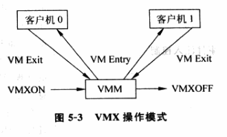

1. VMM 执行 VMXON 指令进入到 VMX 操作模式，CPU 处于 VMX 根操作模式，VMM 软件开始执行。
2. VMM 执行 VMLAUNCH 或 VMRESUME 指令产生 VM-Entry，客户机软件开始执行，此时 CPU 进入非根模式。
3. 当客户机执行特权指令，或者客户机运行时发生了中断或异常，VM-Exit 被触发而陷入到 VMM，CPU 切换到根模式。VMM 根据 VM-Exit 的原因做相应处理，然后转到上一步继续运行客户机。
4. 如果 VMM 决定退出，则执行 VMOFF 关闭 VMX 操作模式。

#### VM-Entry

VM-Entry 是指 CPU 由根模式切换到非根模式，从软件角度看，是指 CPU 从 VMM 切换到客户及执行。这个操作一般由 VMM 主动发起。发起之前，VMM 会设置好 VMCS 相关域的内容，例如客户机状态域、宿主机状态域等，然后执行 VM-Entry。

VMLAUNCH 用于执行过 VMCLEAR 的 VMCS 第一次 VM-Entry。VMRESUME 用于执行过 VMLAUNCH 的 VMCS 的后续 VM-Entry。VM-Entry 的具体行为由 VM-Entry 控制域规定。

VM-Entry 的过程：

1. 执行基本的检查来确保 VM-Entry 能开始。
2. 对 VMCS 中的宿主机状态域的有效性进行检查，以确保下一次 VM-Exit 发生时可以正确地从客户机环境切换到 VMM 环境。
3. 根据 VMCS 中 VM-Entry MSR-load 区域装载 MSR 寄存器。
4. 根据 VMCS 中 VM-Entry 事件注入控制的配置，可能需要注入一个时间到客户机中。

检查通过后，处理器会把执行环境从 VMM 切换到客户机环境。

#### VM-Exit

VM-Exit 是指 CPU 从非根模式切换到根模式，从客户机切换到 VMM 的操作。引发 VM-Exit 的原因很多，例如在非根模式执行了敏感指令、发生了中断等。处理 VM-Exit 事件是 VMM 模拟指令、虚拟特权资源的一大任务。

##### 非根模式下的敏感指令

当成功执行 VM-Entry 之后，CPU 就进入了非根模式。敏感指令如果允许在 VMX 非根模式，其行为可能会发生变化，具体有三种可能。

1. 行为不变化，但不引起 VM-Exit，例如 SYSENTER。
2. 行为变化，产生 VM-Exit，即典型需要截获并模拟的敏感指令。
3. 行为变化，产生 VM-Exit 可控，可以通过 VM-Execution 域控制。出于优化的目的，VMM 可以让某些敏感指令不产生 VM-Exit，以减小模式切换带来的上下文开销。

##### VM-Execution 控制域

控制 CPU 在非根模式运行时的行为，VMM 可以通过配置该控制域达到性能优化等目的。

1. 控制某条敏感指令是否产生 VM-Exit，即是否由 VMM 模拟该指令。
2. 在某些敏感指令不产生 VM-Exit 时，控制该指令的行为。
3. 异常和中断是否产生 VM-Exit。

##### VM-Exit 信息域

提供 VM-Exit 相关信息：

1. 基本信息，如 VM-Exit 的基本原因，VM-Entry 失败或发生在根模式；VM-Exit 的进一步原因；
2. 事件触发导致的 VM-Exit 信息，事件是指外部中断、异常和 NMI；
3. 事件注入导致的 VM-Exit 信息；
4. 执行指令导致的 VM-Exit 信息。

##### VM-Exit 具体过程

1. CPU 首次将此次 VM-Exit 的原因信息记录到 VMCS 相应的信息域。
2. CPU 状态被保存到 VMCS 客户机状态域。
3. 根据 VMCS 中宿主机状态域和 VM-Exit 控制域中的设置，将宿主机状态加载到 CPU 对应寄存器。
4. CPU 从非根模式切换到根模式，从宿主机状态域中 CS:RIP 指定的 VM-Exit 入口函数开始执行。

VMM 处理完 VM-Exit 后，会通过 VMLAUNCH/VMRESUME 指令发起 VM-Entry 进而重新运行客户机。

### CPU 虚拟化的实现

使用 Intel VT-x 的 VMM 在处理器虚拟化的实现上更加简单和高效。

硬件虚拟化使用 VCPU 描述符来描述虚拟 CPU，VCPU 结构体通常由几部分构成：

1. VCPU 标识信息，如 VCPU 的 ID 号，属于哪个客户机等。
2. 虚拟寄存器信息，虚拟机的寄存器资源，在 Intel VT-x 中，包括在 VMCS 中。
3. VCPU 状态信息，类似于进程的状态信息，标识该 VCPU 当前所处的状态，供调度器使用。
4. 额外寄存器/部件信息，主要指未包含在 VMCS 中的一些寄存器或 CPU 部件。
5. 其他信息，用于 VMM 进行优化或存储额外信息的字段，如存放该 VCPU 私有数据的指针等。

VCPU 划分为两部分，以 VMCS 为主的硬件使用和更新的部分，除 VMCS 之外，由 VMM 使用和更新的部分。VMM 创建客户机时，首先要为客户机创建 VCPU，整个客户机的运行实际上可以看作是 VMM 调度不同的 VCPU 运行。

#### VCPU 的创建

创建 VCPU 实际上是创建 VCPU 描述符，本质上就是为结构体分配内存。

VCPU 初始化，将描述符各个部分置成可用的状态：

1. 分配 VCPU 的标识，首先要标识该 VCPU 属于哪个客户机，再为 VCPU 分配一个在客户机范围内唯一的标识。
2. 初始化虚拟寄存器组，初始化 VMCS 相关域，根据物理 CPU 上电后各寄存器的值设定。
3. 初始化 VCPU 状态信息，设置 VCPU 在被调度前需要配置的必要标志。
4. 初始化额外部件，将未被 VMCS 包含的虚拟寄存器初始化为物理 CPU 上电后的值。
5. 初始化其他信息，根据 VMM 的实现初始化 VCPU 的私有数据。

VMCS 分配 4KB，根据 VT-x 的定义进行初始化，提供和物理 CPU 类似的状态。

#### VCPU 的运行

创建并初始化后，通过调度程序调度运行。

##### 上下文切换

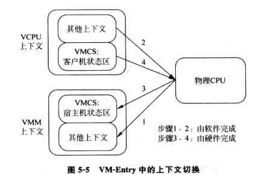

VT-x 支持的 CPU 上下文切换的过程：

1. VMM 保存自己的上下文，主要是 VMCS 宿主机状态域以外的部分。
2. VMM 将保存在 VCPU 中的由软件切换的上下文加载到物理 CPU。
3. VMM 执行 VMRESUME/VMLAUNCH 指令，触发 VM-Entry，CPU 自动将 VMCS 部分加载到物理 CPU，切换到非根模式。

VMM 使用惰性保存/恢复的方法优化，尽量将寄存器的保存/恢复延迟到最后一刻，即其他 VCPU 或 VMM 需要用该寄存器的时候再保存/恢复，具体考察资源的使用情况来实现惰性保存/恢复。

1. VMM 需要使用的寄存器，每次切换都要保存/恢复。
2. VMM 没有使用的寄存器，如果无法知道 VCPU 是否修改了寄存器，那么切换到 VMM 不需要对这个寄存器进行保存/恢复，而切换到 VCPU 需要保存/恢复。
3. VMM 没有使用的寄存器，如果知道客户机是否修改了寄存器，还可以进一步优化。

##### VCPU 的硬件优化

相对于软件虚拟化，使用 VT-x 的 VMM 可以采用多种方式优化，尽可能少地在客户机和 VMM 之间切换，从而减少上下文切换的开销。

1. 无条件优化，有些敏感指令不如要陷入到 VMM 中执行。
2. 条件优化，通过 VMCS 的 VM-Execution 控制域，可以配置某些敏感指令是否产生 VM-Exit 而陷入到 VMM 中。

#### VCPU 的退出

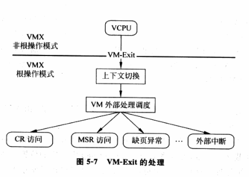

1. 发生 VM-Exit，CPU 自动进行一部分的上下文切换。
2. 当 CPU 切换到根模式开始执行 VM-Exit 的处理函数时，进行另一部分上下文切换工作。

根据 VM-Exit 信息域获得发生 VM-Exit 的原因，并分发到对应的处理模块处理。大体有三类：

1. 访问特权资源，对 CR 和 MSR 寄存器的访问都属于这一类。VMM 引入虚拟特权资源和影子特权资源。以虚拟寄存器为例，VCPU 读特权寄存器时，VMM 将虚拟寄存器的值返回。当 VCPU 写特权寄存器时，VMM 首先将值写入虚拟寄存器，然后根据虚拟寄存器的值以及虚拟化策略来更新影子寄存器，最后将影子寄存器的值应用到 VCPU上，将值写入 VMCS 客户机状态域的对应字段并且 VM-Entry 返回。虚拟化策略因寄存器而异。
2. 客户机执行的指令引发了异常，如缺页错误。客户机指令导致的异常，很多是不需要虚拟化的，如除零、溢出等，这些可以通过 Exception bitmap 设置。对于需要虚拟化的异常，以缺页错误为例，分析产生错误的原因，做出相应处理（VMM 导致的缺页或客户机正常的缺页）。
3. 发生中断。对于物理中断，需要读取 VMCS 中的 VM-Exit 字段获取中断向量号，然后调用 VMM 中对应的中断处理函数。对于客户机虚拟设备发生的虚拟中断，通过 VMM 接口使客户机 VM-Exit，则 VMM 会通过某种方式将中断注入到客户机。

#### VCPU 的再运行

VMM 处理完 VCPU 的退出，会负责将 VCPU 投入再运行。

1. 如果 VCPU 继续在相同的物理 CPU 上运行，可以用 VMRESUME 实现 VM-Entry，效率更高。
2. 如果由于某种原因，VCPU 被调度迁移到另一个物理 CPU 上，则：
   1. 将 VCPU 对应的 VMCS 迁移到另一个物理 CPU；
   2. 迁移完成后，在重新绑定的 CPU 上执行 VMLAUNCH 发起 VM-Entry。

#### 进阶

##### CPU 模式的虚拟化

VMM 需要具有模拟各种 CPU 运行模式的能力。

VMM 要求物理 CPU 在非根模式下的分页机制必须开启，不考虑客户机运行的模式。客户机看到的 CPU 模式实际是 VCPU 中设置的模式，即 VCPU 中 CR0 寄存器值反映的模式，它与物理 CPU 的真正模式可能不同。因此可能涉及到标志 CPU 模式的控制寄存器的虚拟化以及 CPU 运行环境的虚拟化。

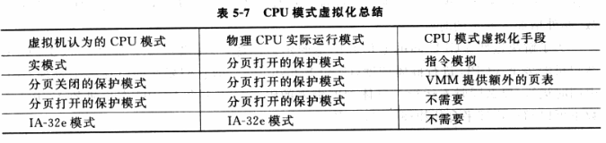

##### 多处理器虚拟机

多 VCPU 的客户机：

1. 多 VCPU 发现，通过虚拟 BIOS。
2. 多 VCPU 初始化，VMM 选择一个 VCPU 作为主 VCPU BSP 执行 BIOS，其他 VCPU 置于 Wait-for-SIPI 状态，等待唤醒。
3. 多 VCPU 同步，自旋锁，群体调度，即要么同时在多个物理 CPU 上同时运行，要么同时不运行。

### 中断虚拟化

#### 中断采集

中断采集是指如何将虚拟机的设备中断请求送入虚拟中断控制器。

1. 来自于软件模拟的虚拟设备，通过虚拟中断控制器提供的接口发出中断请求。
2. 来自于直接分配给客户机的物理设备的中断，首先由 VMM 中断处理函数接受物理中断，再注入给客户机。

#### 中断注入

中断注入负责将虚拟中断控制器采集到的中断请求按照其优先级，逐一注入客户机虚拟处理器。

只能在 VM-Entry 时将中断注入客户机，为了保证中断计时注入，需要强迫 VCPU 发生 VM-Exit，常见的方法是向 VCPU 所在的物理 CPU 发送 IPI 中断。如果 VCPU 无法中断，如正处于关中断的状态，VT-x 为此情况提供了解决机制，即使用中断窗口机制，通过设置 VMCS 的一个特定字段，告诉物理 CPU 当前运行的 VCPU 有一个中断需要注入，一旦 VCPU 可以接受中断，物理 CPU 会主动出发 VM-Exit。

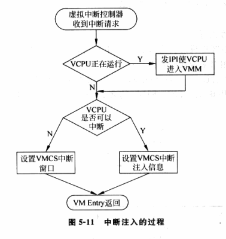

### 内存虚拟化

内存虚拟化的主要任务是实现地址空间的虚拟化，通过两次地址转换来支持地址空间的虚拟化，即 GVA --> GPA --> HPA。前者由客户机页表决定，后者由 VMM 决定。

VMM 使用影子页表的方式可以将两次转换合并为一次转换，但实现复杂，要考虑各种页表同步情况；内存开销大，每个客户机进程对应的页表都维护一个影子页表。

VT-x 引入了 Extended Page Table, EPT 技术，直接在硬件上支持了两次地址转换。为了提高 TLB 的使用效率，VT-x 还引入了 Virtual Processor ID, VPID 功能。

#### EPT

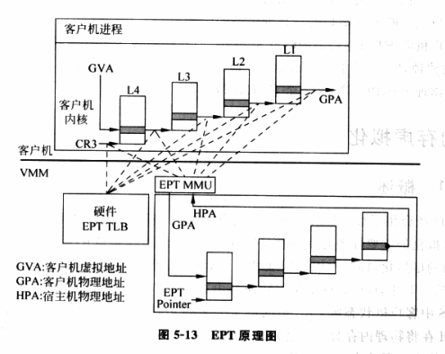

在原有 CR3 页表地址映射的基础上，EPT 引入了 EPT 页表来实现另一次映射。GVA-->GPA-->HPA 的两次转换都有 CPU 硬件自动完成。

假设客户机和 EPT 都是 4 级页表，CPU 完成一次地址转换的基本过程如下：

1. CPU 会查找客户机 CR3 指向的 L4 页表。由于客户机 CR3 给出的是 GPA，CPU 需要通过 EPT 页表完成 GPA-->HPA。首先会查看硬件 EPT TLB，如果没有则进一步查找 EPT 页表。
2. 获取 L4 页表地址后，CPU 根据 GVA 获取 L3 页表的 GPA，如果 L4 页表项显示缺页，则 CPU 产生 Page Fault，由客户机操作系统内核处理，不会产生 VM-Exit。获取 L3 页表 GPA 后，CPU 通过查询 EPT 找到 HPA。
3. 同样 CPU 依次查找 L2、L1 页表，最后获得 GVA 对应的 GPA，然后通过查找 EPT 获得 HPA。CPU 需要查询 5 次 EPT 页表，每次都需要 4 次访存，最坏需要 20 次。EPT 硬件通过增大 EPT TLB 来减少内存访问。

##### EPT 的硬件支持

VT-x 在 VMCS 的 VM-Execution 控制域提供了 Enable EPT 字段。EPT 页表的基地址是由 VMCS 该控制域的 EPT pointer 指定的，包含的是 EPT 的 HPA。

EPT 页表转换过程和 CR3 页表转换类似，还支持大小为 2MB 或 1GB 的超级页。

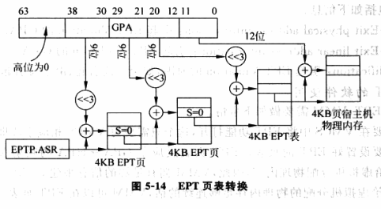

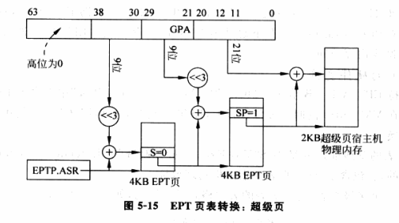

VT-x 提供了 INVEPT 指令来刷新 EPT 的 TLB。

遍历 EPT 页表进行 GPA-->HPA 转换时，也会发生异常，CPU 会产生 VM-Exit，原因为 EPT Violation。

VMM 需要在 VMCS 中开启 EPT，设置 EPT 页表。如果 VMM 分配给虚拟机的物理内存足够连续，可以在 EPT 页表中使用超级页以提升 TLB 性能。

EPT 中客户机内部的 Page Fault 不用发生 VM-Exit，且只需要维护异常 EPT 页表。

#### VPID

TLB 是页表项的缓存，需要和对应的页表一起工作。当页表切换时，TLB 的原有内容失效，CPU 使用 INVLPG 使其失效。每次 VM-Exit 和 VM-Entry 时，CPU 会强制 TLB 内容失效。

VPID 是硬件级对 TLB 的优化，通过在硬件上为每个 TLB 项增加一个标志，来标识不同的 VCPU 空间，从而区分开 VMM 以及不同虚拟机的不同 VCPU 的TLB。即硬件具备了区分不同 TLB 项属于不同 VCPU 地址空间的能力。这样，就避免在每次切换时使全部 TLB 失效，提高效率。

VMCS 的 Enable VPID 域和 VPID 域。

### I/O 虚拟化的硬件支持

Intel  VT-d 实现通用性和高性能。

> IO 虚拟化太没意思，先不看了。去看 qemu 源码了