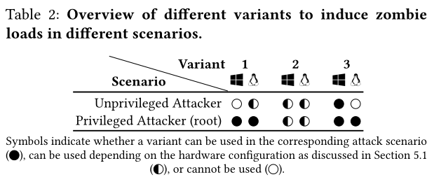
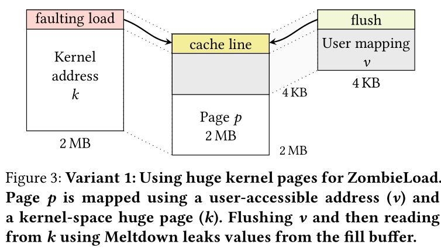
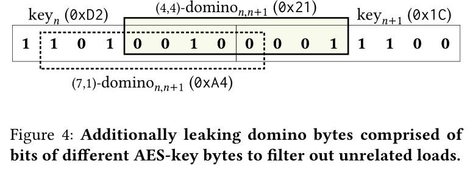
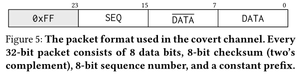
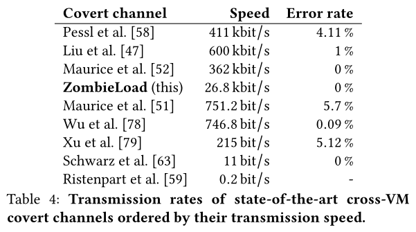
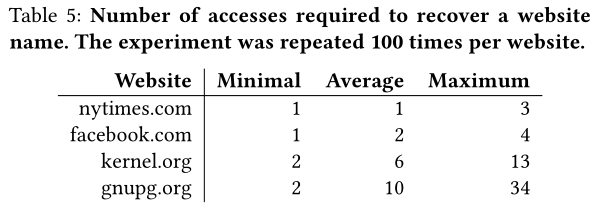
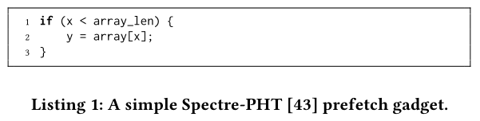

[toc]

# ZombieLoad

Cross-Privilege-Boundary Data Samplinge

> 先翻译 然后再改

### 摘要

在2018年初，Meltdown首次展示了如何通过利用瞬时指令的副作用从用户空间读取任意内核内存。 尽管通过在用户和内核空间之间建立更强的隔离边界可以缓解这种攻击，但Meltdown启发了一种全新的由故障驱动的瞬态执行攻击。特别是，在过去的一年中，Meltdown类型的攻击已扩展到不仅从L1缓存中泄漏数据，而且还从包括FPU寄存器文件和存储缓冲区在内的各种其他微体系结构中泄漏数据。

在本文中，我们介绍了ZombieLoad攻击，该攻击在处理器的填充缓冲区逻辑中发现了一种新颖的Meltdown类型的效果。我们的分析表明，错误的加载指令（即必须重新发布的加载）可能会暂时取消引用先前由当前或同级逻辑CPU带入填充缓冲区的未授权目标。 与对填充缓冲区的并发攻击相反，即使在耐Meltdown和MDS的处理器上，我们还是第一个报告跨逻辑内核的最近加载和存储的过时值的数据泄漏。 因此，尽管英特尔提出了索赔[36]，但我们证明新CPU中的硬件修复还不够。 我们展示了ZombieLoad在CPU特权环，OS进程，虚拟机和SGX安全区的众多实际攻击场景中的有效性。 我们讨论了短期和长期缓解措施，得出的结论是，由于英特尔的软件修复不完整，禁用超线程是防止当前处理器上至少最强大的跨超线程攻击情形的唯一可能的解决方法。

### 引言

在2018年，Meltdown [46]是第一个完全突破了用户与内核空间之间安全边界并因此允许泄漏任意数据的微体系结构攻击。 尽管Meltdown是通过在用户空间与内核空间之间建立更强的隔离来修复的，但其基本原理却是一整类的瞬态执行攻击[7]。 在过去的一年中，研究人员证明，Meltdown类型的攻击不仅会将内核数据泄漏到用户空间，而且还会跨用户进程，虚拟机和SGX安全区泄漏数据[70，77]。 此外，泄漏不仅限于L1高速缓存，还可能源自其他微体系结构，例如寄存器文件[69]，以及并行工作中所示的填充缓冲区[74]，加载端口[74]和存储区[74]。 存储缓冲区[54]。

代替按顺序执行指令流，大多数现代处理器可以在保持体系结构等效性的同时对指令进行重新排序。 当CPU检测到前一条指令引发异常时，这些指令可能已经被执行。 因此，在故障指令（即，瞬态指令）之后的此类指令被回滚。 虽然回滚可确保没有任何架构影响，但副作用可能仍保持在微架构状态。 大多数Meltdown类型的攻击都围绕无序执行进行了过度积极的优化。

多年来，微体系结构状态被认为对应用程序是不可见的，因此安全性考虑通常仅限于体系结构状态。 具体来说，微体系结构元素通常不会在不同的应用程序或特权级别之间进行区分[7、12、38、46、58、62、65]。

在本文中，我们表明，首先，仍然存在未开发的微体系结构缓冲区，其次，可以利用体系结构和微体系结构故障。 借助我们的“微体系结构错误”的概念，即导致内存请求在内部重新发出而又在架构上不可见的错误，我们证明了Meltdown类型的攻击也可以在不引发诸如页面错误之类的架构异常的情况下触发 。基于此，我们演示了ZombieLoad，这是一种针对填充缓冲区逻辑的新颖，功能强大的Meltdown类型攻击。

ZombieLoad漏洞利用程序加载必须在内部重新发出的指令，可以首先从当前或同级超线程临时计算属于先前内存操作的陈旧值。 攻击者可以使用已建立的瞬态执行攻击技术来恢复此类“僵尸负载”操作的值。 重要的是，与所有先前已知的瞬态执行攻击相反[7]，ZombieLoad揭示了最近的数据值，而没有遵守任何基于地址的显式选择器。因此，我们将ZombieLoad视为新型微体系结构数据采样（MDS）攻击的实例。 与RIDL [74]或Fallout [54]等并发数据采样攻击不同，我们的工作包括第一个也是唯一一个即使在最新的Intel Cascade Lake CPU上也可能泄漏数据的攻击变体，据报道，这些CPU可以抵抗所有已知的Meltdown，Foreshadow和 MDS变体。 我们将微体系结构数据采样作为与受害人执行内的数据地址相关联的传统基于内存的辅助通道与可以直接恢复属于显式地址的数据值的现有Meltdown型瞬态执行攻击之间的缺失链接。 在本文中，我们将传统的边信道攻击的原语与时域中的偶然数据采样相结合，以构造出功能强大的攻击，并在地址域中进行了有针对性的泄漏。 这不仅开辟了新的攻击途径，而且重新启用了以前假定的缓解措施。

我们在许多实际攻击场景中展示了ZombieLoad的现实含义，这些实际攻击场景跨进程，权限边界甚至跨逻辑CPU内核泄漏。 此外，我们证明，即使在具有Foreshadow功能的CPU上，我们也可以泄漏从同级逻辑内核加载的Intel SGX安全区机密。 我们证明ZombieLoad攻击者可能会从Intel的体系结构区域中提取密封密钥，最终破坏了SGX的机密性和远程证明保证。  ZombieLoad不仅限于本机代码执行，还可以跨虚拟化边界工作。 因此，虚拟机不仅可以攻击虚拟机管理程序，还可以攻击在同级逻辑内核上运行的不同虚拟机。 我们得出的结论是，除了在上下文切换期间刷新多个微体系结构状态之外，禁用超线程是防止这种极其强大的攻击的唯一可能的解决方法。

贡献。 这项工作的主要贡献是：

（1）我们介绍了ZombieLoad，这是一种强大的数据采样攻击，可泄漏在同一或同级超线程上访问的数据。

（2）我们将时域中的偶然数据采样与传统的边信道原语相结合，以构造类似于常规Meltdown攻击的目标信息流。

（3）我们在几种实际场景中演示了ZombieLoad：跨进程，跨VM，用户到内核以及SGX。  ZombieLoad甚至可以在耐熔化的硬件上运行。

（4）我们证明ZombieLoad甚至在耐Foreshadow的硬件上也破坏了Intel SGX的安全性保证。

（5）我们是第一个对瞬态域中泄漏的数据进行后处理以消除噪声的方法。

大纲。 第2节提供了背景。 第三部分概述了ZombieLoad，并介绍了基于内存的边信道攻击的新颖分类。 第4节介绍了攻击场景及其攻击者模型。 第5节介绍并评估了安装ZombieLoad所需的基本原语。 第6节演示了实际攻击场景中的ZombieLoad。 第7节讨论了可能的对策。 我们在第8节中总结。

负责任的披露。 我们报告了2018年3月28日来自并发超线程的不可缓存类型的内存泄漏给了英特尔。我们在2018年5月30日澄清说，我们将此泄漏的原因归因于LFB。 在我们的实验中，这对于Foreshadow的工作原理相同，从而破坏了基于L1刷新的缓解措施的完整性。 英特尔已确认此问题，并已在CVE-2019-11091（MDSUM）中进行了跟踪。 我们已于2019年4月12日以负责任的方式向英特尔披露了ZombieLoad Variant1。英特尔核实并确认了我们的攻击，并为此问题分配了CVE-2018-12130（MFBDS）。
   MDSUM和MFBDS均属于2019年5月14日结束的微体系结构数据采样（MDS）禁运的一部分。我们于2019年4月24日向英特尔公开了ZombieLoad Variant 2（这是唯一适用于Cascade Lake CPU的MDS攻击）。 英特尔将其称为事务异步中止（TAA）的问题分配给CVE-2019-11135，并且是正在进行的禁运的一部分，该禁运将于2019年11月12日结束。在2019年5月16日，我们向英特尔报告说，他们使用VERW进行的缓解 是不完整的，可以绕开，这已得到他们的验证和认可。

### 背景

在本节中，我们描述了本文所需的背景。

#### 瞬态执行攻击

当今的高性能处理器通常会执行无序执行设计，从而使CPU可以并行利用不同的执行单元。 指令流按顺序解码为更简单的微操作（µOP）[13]，只要所需的操作数可用，就可以立即执行。 专用的重排序缓冲区存储中间结果，并确保将指令结果按顺序提交给体系结构状态。 在指令执行过程中发生的任何错误都将在指令退出时进行处理，从而导致流水线刷新，从而压制来自重排序缓冲区的所有未完成的µOP。

此外，现代CPU采用了可扩展的执行优化功能，以避免在解决条件分支之前停止指令流水线。  CPU预测分支的结果并继续沿该方向执行。 我们指的是推测性执行或乱序执行的指令，但其结果在架构上从未作为瞬态指令提交[7，46，70]。

尽管暂时指令的结果和体系结构效果被丢弃，但是可测量的微体系结构副作用可能会保留并且不会恢复。 利用这些副作用观察敏感信息的攻击称为瞬态执行攻击[7、43、46]。 通常，这些攻击利用基于缓存的隐蔽通道将从微体系结构域瞬态观察到的秘密数据传输到架构状态。 与最近的详尽调查一致[7]，我们将利用错误预测[27、41、43、44、50]的攻击称为Spectre类型，而将利用CPU异常后的瞬时执行的攻击[7、41、46、69]  ，[70，77]归类为Meltdown类型。

#### 内存子系统

在本节中，我们概述了乱序CPU中的内存负载。

缓存。  CPU包含小型且快速的缓存，用于存储常用数据。 缓存通常按多个级别进行组织，每个级别可以是每个内核专用或在它们之间共享。 现代CPU通常使用n路集关联高速缓存，每组包含n个高速缓存行，每个高速缓存行通常为64 B宽。 通常，英特尔CPU具有专用的一级指令（L1I）和数据缓存（L1D）以及统一的二级缓存。 最后一级缓存（LLC）在所有内核之间共享。

虚拟内存。  CPU使用虚拟内存在进程之间提供内存隔离。 使用多级转换表将虚拟地址转换为物理内存位置。 转换表条目定义所引用的存储器区域的属性，例如访问控制或存储器类型。  CPU包含旁视转换缓冲区（TLB），该缓冲区由其他高速缓存组成，用于存储地址转换信息。

内存顺序缓冲区。 处理存储器操作的µOP由专用执行单元处理。 通常，英特尔CPU包含2个负责加载的单元和1个用于存储数据的单元。包含加载缓冲区和存储缓冲区的内存顺序缓冲区（MOB），控制内存操作的调度并跟踪其进度以解决内存依赖性。

数据加载。 对于每个分派的加载操作，将在加载缓冲区和重排序缓冲区中分配一个条目。 为了确定物理地址，线性地址的高36位由存储器管理单元转换。 同时，未翻译的低12位已用于索引L1D中设置的缓存[17]。如果地址转换在TLB中，则物理地址立即可用。 否则，页面未命中处理程序（PMH）将执行页面表遍历以检索地址转换以及相应的权限位。 如果请求的数据在L1D（高速缓存命中）中，则可以完成加载操作。

如果数据不在L1D中，则需要通过行填充缓冲区（LFB）从更高级别的高速缓存或主存储器中提供数据。  LFB充当其他缓存和主内存的接口，并跟踪未完成的负载。 内存访问不可缓存的内存区域，并且非临时移动都通过LFB。

在出现故障（例如，物理地址不可用）时，页表遍历不会立即中止[17]。 流水线实施中的一条指令必须经过每个阶段，并在出现故障时简单地重新发出[1]。 仅在退出有故障的µOP时，才处理故障，并冲洗管道[16，17]。

#### 处理器扩展

微码。 为了支持更复杂的指令，微代码允许使用多个硬件级别的指令来实现更高级别的指令。 这使处理器供应商可以支持复杂的行为，甚至可以通过微码更新来扩展或修改CPU行为[28]。 最好将新的体系结构功能实现为微码扩展，例如Intel SGX [39]。

当执行单元直接在硬件中执行快速路径时，更复杂的慢路径操作（例如错误或页表修改）通常是通过发出微代码辅助来执行的，该辅助将定序器指向预定义的微代码例程[11]。 为此，执行单元将事件代码与故障微操作的结果相关联。 当执行单元的微操作被提交时，事件代码使乱序调度程序将所有运行中的微操作压缩到重排序缓冲区中[11]。微码定序器使用事件代码在微码中读取与事件关联的微操作[5]。

英特尔TSX。  Intel TSX是x86指令集扩展，用于Intel Haswell CPU引入的硬件事务存储器[35]。 使用TSX，可以以事务方式执行特定的代码区域。 如果整个代码区域成功完成，则事务中的内存操作将作为对其他逻辑处理器的原子提交。 如果在事务处理期间发生问题，则事务中止将在事务处理之前将执行回滚到架构状态，并丢弃所有已执行的操作。事务中止可能是由不同的问题引起的：通常，发生冲突的内存操作时，另一个逻辑处理器将从事务内已修改的地址读取或写入事务内使用的地址。 此外，事务中的读取和写入数据量可能分别不超过LLC和L1缓存的大小[28]。 另外，某些指令或系统事件也可能导致事务中止[35]。

英特尔SGX。 借助Skylake微体系结构，英特尔推出了Software Guard Extension（SGX），这是一种用于隔离受信任代码的指令集扩展[28]。  SGX在所谓的安全区内执行受信任的代码，这些安全区被映射到常规主机应用程序进程的虚拟地址空间中，但通过硬件本身与系统的其余部分隔离。  SGX的威胁模型假定操作系统和所有其他正在运行的应用程序可能会受到威胁，因此不能被信任。 以非安全区模式访问SGX安全区内存的任何尝试均会导致虚拟值0xff [29]。 此外，为了防止物理攻击者探测内存总线，SGX硬件透明地加密了使用的内存区域[11]。

专用的eenter指令将控制流重定向到安全区入口点，而eexit则转移回不受信任的主机应用程序。 此外，在发生中断或故障的情况下，SGX在引导至不受信任的操作系统之前，会将CPU寄存器安全地保存在安全区的保存状态区域（SSA）中。 接下来，eresume指令可用于从SSA帧恢复处理器状态，并继续先前中断的区域。

具有SGX功能的处理器通过egetkey指令提供了加密密钥派生功能，该功能基于CPU级别的主密钥以及对调用区域的初始代码和数据的安全度量。 使用此密钥，安全区可以安全地密封秘密以存储不受信任的持久性存储，并与位于同一处理器上的其他安全区建立安全的通信通道。此外，为实现远程证明，英特尔提供了一个可信的报价飞地，该飞地可解封英特尔私钥并在本地飞地身份报告上生成非对称签名。

在过去的几年中，研究人员展示了各种攻击手段，例如通过违反内存安全性[45]，竞争条件[76]或旁通道[55、65、72、73]，从SGX飞地泄漏敏感数据。 最近，SGX还受到瞬态执行攻击的攻击[9，70]，该攻击需要微代码更新并增加了处理器的安全版本号（SVN）。 所有SGX密钥派生和证明都包括SVN，以反映当前的微码版本，从而反映出安全级别。

### 攻击概述

在本节中，我们提供ZombieLoad的概述。 我们描述了使用ZombieLoad可以观察到的情况以及如何适应现有的边信道攻击的情况。 通过这种方式，我们表明ZombieLoad是侧信道攻击的一种新颖类别，我们将其称为数据采样攻击，从而打开了一个新的研究领域。

#### 概述

ZombieLoad是一种瞬态执行攻击[7]，它会观察内存负载的值并将其存储在当前CPU内核上。
ZombieLoad利用填充缓冲区供CPU内核的所有逻辑CPU使用，并且不区分进程或特权。

当CPU在执行期间遇到内存加载时，它将在加载缓冲区中保留一个条目。 如果加载不是L1命中，则需要填充缓冲区条目。 当请求的数据已加载后，内存子系统将释放相应的加载和填充缓冲区条目，并且加载指令可能会退出。 同样，如果存储未命中L1或从L1撤出，它们也将临时存储在填充缓冲区条目中。

但是，我们观察到，在某些复杂的微体系结构条件（例如，故障）下，负载需要微码辅助，它可能首先读取过时的值，然后最终重新发出。 与任何Meltdown类型的攻击一样，这会打开一个瞬态执行窗口，此值可用于后续计算。 因此，攻击者可以将泄漏的值编码为微体系结构元素，例如缓存。

但是，与以前的Meltdown类型攻击相反，无法根据攻击者指定的地址来选择要泄漏的值。  ZombieLoad只会泄漏物理CPU内核当前加载或存储的任何值。 虽然这听起来似乎是一个巨大的局限性，但我们证明这为基于数据采样的瞬态执行攻击开辟了一个新领域。 此外，与以前的Meltdown类型攻击相反，ZombieLoad考虑所有特权边界，并且不限于特定的边界。  Meltdown [46]只能从攻击者的地址空间中泄漏数据，Foreshadow [70]仅专注于SGX飞地，ForeshadowNG [77]之后研究了跨进程和跨VM泄漏，而Fallout [54]仅可以泄漏内核数据。 相同的逻辑核心。 我们展示了ZombieLoad与现有的旁通道技术相结合，是一种功能更强大的攻击。

#### 微体系结构根本原因

对于Meltdown，Foreshadow，Fallout和RIDL，泄漏的来源是显而易见的。 此外，对于这些攻击，对于微体系结构出了什么问题，即泄漏的根本原因是什么，有合理的解释[46、54、70、77]。 但是，对于ZombieLoad，这还不是很清楚。

尽管我们确定了一些必要的构件来观察泄漏（请参阅第5节），但我们只能提供一个假设，即构件之间的相互作用导致观察到的泄漏的原因。由于我们只能观察到Intel CPU上的数据泄漏，因此我们假设这确实是一个实现问题（例如Meltdown），而不是设计问题（与Spectre一样）。 对于我们的假设，我们将观察结果与填充缓冲区的少量官方文档[28，34]和英特尔的MDS分析[33]结合在一起。 最终，我们既不能证明也不能反驳我们的假设，而将我们的假设的证实或证伪留给未来的工作。

过时的假设假说。 每个负载都与负载缓冲区中的一个条目相关联，并且可能与填充缓冲区中的一个条目相关联[34]。

当负载遇到诸如故障之类的复杂情况时，它需要微码辅助[28]。 此微代码辅助功能触发机器清除，从而冲洗管道。 在流水线刷新中，已经在执行中的指令仍会完成执行[26]。

由于这必须尽可能快以免产生额外的延迟，因此，我们希望填充缓冲区条目能够乐观地匹配，只要部分物理地址匹配即可。 因此，加载会继续使用错误的填充缓冲区条目，该条目对先前的加载或存储有效。 这导致了硬件中的“售后使用”漏洞[22]。 英特尔将填充缓冲区记录为在超线程之间具有竞争性的共享[28]，从而使两个逻辑内核都可以访问整个填充缓冲区（请参阅附录A）。 因此，过时的填充缓冲区条目也可以来自同级逻辑核心的先前加载或存储。 结果，加载指令从先前的加载或存储中加载有效数据。

泄漏源。 我们设计了2个实验来减少泄漏数据的可能来源。

在我们的第一个实验中，我们将页面标记为“不可缓存”，并将其从缓存中清除。 结果，页面中的每个内存负载都会避开所有缓存级别，并直接进入填充缓冲区[28]。 然后，我们将机密信息写入不可缓存的页面，以确保缓存中没有数据的副本。 从页面加载数据时，我们看到的泄漏量为每秒字节数，例如5.91 B / s（σx = 0.18，n = 100，其中n是实验次数，σx是标准误差 在i7-8650U上）。我们可以将此泄漏归因于填充缓冲区。 这在并发工作中也得到了利用[74]。  MEM_LOAD_RETIRED.FB_HIT性能计数器进一步支持了我们的假设，该计数器显示了数千行填充缓冲区命中次数（117 330 FB_HIT / s（σ¯x= 511.57，n = 100））。

英特尔声称泄漏完全来自填充缓冲区[33]。Van Schaik等人也是如此。[74]总结了他们的RIDL攻击。 但是，我们的第二个实验表明，行填充缓冲区可能不是ZombieLoad泄漏的唯一来源。 我们依靠Intel TSX来确保内存访问不会到达linefill缓冲区，如下所示。 在事务内部，我们首先将秘密值写入先前使用其他值初始化的存储位置。 事务内部的写操作确保该地址在事务的写操作集中，并因此在L1中[34，61]。从缓存中的写集中逐出数据会导致事务异常中止[34]。 因此，从写集对数据的任何后续存储器访问均确保从L1为该数据提供服务，因此，不会向行填充缓冲区发送任何请求[28]。 在该实验中，我们看到了更高的泄漏率，大约为每秒千字节。 更重要的是，我们只看到写入TSX事务内部的值，而不看到启动事务之前位于内存位置的值。 通过观察性能计数器可以进一步支持我们的假设，即行填充缓冲区不是泄漏的唯一来源。  MEM_LOAD_RETIRED.FB_HIT和MEM_LOAD_RETIRED.L1_MISS性能计数器不会显着增加。 相反，MEM_LOAD_RETIRED.L1_HIT性能计数器显示数千个L1命中。

在访问数据以泄漏到受害内核上时，我们监视了攻击者内核上的MEM_LOAD_RETIRED.FB_HIT性能计数器10 s。 如果地址被缓存，我们在正确的恢复和行填充缓冲区命中之间测量到rp = 0.02（n = 100）的Pearson相关性，表明没有关联。 但是，在连续刷新受害者核心上的数据并确保后续访问必须通过LFB时，我们测量到rp = 0.86（n = 100）的强相关性。 该结果表明，行填充缓冲区不是泄漏的唯一来源。 但是，另一种解释可能是性能计数器在这种极端情况下不可靠。  Van Schaik等。  [74]报告说，RIDL攻击只能泄漏未从缓存提供服务的数据，即必须通过填充缓冲区的数据。 因此，我们得出的结论是，RIDL确实从填充缓冲区泄漏，而ZombieLoad泄漏可能不会完全归因于填充缓冲区。 未来的工作必须调查观察到的数据泄漏中是否还包含其他微体系结构元素（例如负载缓冲区）。

比较RIDL。 在并发工作中，Van Schaik等人。[74]提出了RIDL攻击，它也从填充缓冲区以及从加载端口泄漏数据。 表1显示了一个表格，该表格总结了RIDL和ZombieLoad之间的主要区别。两次攻击之间最关键的区别是ZombieLoad仍可在不受RIDL或Fallout影响的最新一代Intel CPU（级联B1的Cascade Lake）上运行。  RIDL只能泄漏当前不在L1缓存中的负载。ZombieLoad可以泄漏所有负载，而与当前是否在L1缓存中无关。  ZombieLoad对微体系结构的根本原因进行了透彻的分析，这导致了具有独特功能的更多变体，例如耐MDS的CPU泄漏。

> RIDL论文[74]仅描述了一种从填充缓冲区泄漏的变体，但也提到了从装载端口泄漏的一种变体，而无需进一步描述或评估。

#### 分类

在本节中，我们介绍一种对基于内存的边通道攻击和瞬态执行攻击进行分类的方法。 对于所有这些攻击，我们假设目标程序在程序的当前指令指针处以特定的数据值在某个地址执行内存操作。 图1将这三个属性说明为三角形的拐角，并提供了使攻击者根据另一个或两个其他属性来推断其中一个属性的技术。

> 存储器操作的3个属性：程序的指令指针，目标地址和数据值。 到目前为止，有一些技术可以从目标地址推断出指令指针，并从该地址推断出数据值。 使用ZombieLoad，我们展示了攻击的第一个实例，该实例从指令指针中推断出数据值。

传统的基于内存的旁通道攻击使攻击者可以观察内存访问的位置。 位置观测的粒度取决于所用侧信道的空间精度。 最常见的基于内存的边信道攻击[18、20、21、23、38、57、58、73、80、81]的粒度在一条高速缓存行[20、21、23、81]之间，即通常为64  B，一页[18、38、73、80]，即通常为4 kB。 这些辅助信道在时域和空间域之间建立连接。 时域可以是墙面时间，也可以通常是与指令指针相关的程序的执行时间。 这些经典的辅助通道提供了将存储器访问地址连接到一组可能的指令指针的方法，然后可以重建程序流。 因此，抗旁通道的应用程序必须避免依赖于秘密的内存访问，才能不将秘密泄漏给旁通道攻击者。

自从2018年初以来，通过瞬时执行攻击[7]（例如Meltdown [46]和Spectre [43]），出现了第二种攻击类型，攻击者可以利用这种攻击来观察存储在内存地址中的值。 崩溃提供了对目标地址的最大控制。使用Meltdown时，将提供目标数据的完整虚拟地址，并且泄漏在该地址的相应数据值。 成功率取决于数据的位置，即数据是在高速缓存中还是在主存储器中。 但是，Meltdown的唯一约束是可以使用虚拟地址来寻址数据[46]。 其他Meltdown类型的攻击[54，70]也将地址连接到数据值。 但是，它们通常会施加其他约束，例如必须将数据缓存在L1中[70，77]，必须知道物理地址[77]，或者攻击者只能选择目标地址的一部分[54，74]。

图2说明了攻击者可以选择虚拟地址和物理地址的哪些部分来选择要泄漏的数据值。 对于Meltdown，虚拟地址足以在同一地址空间中定位数据[46]。  Foreshadow已经需要了解物理地址和虚拟地址的最低有效12位，才能将L1中的任何数据作为目标，而不仅限于自己的地址空间[70，77]。 当泄漏来自存储缓冲区的最后一次写操作时，攻击者已经在选择要泄漏的值上受到限制。 只能基于虚拟地址的最低有效12位来过滤存储，不可能有针对性的泄漏[54]。

> 崩溃类型的攻击提供了不同程度的目标控制（灰色阴影），从发生崩溃时的完整虚拟地址到几乎没有对ZombieLoad的控制。

ZombieLoad和RIDL [74]所利用的Zombie负载无法控制对攻击者的泄漏地址。 唯一可能的目标选择是已加载数据内部的字节索引，在加载整个高速缓存行的情况下，可以将其视为最多6位的地址。 因此，我们不将ZombieLoad和RIDL视为会根据地址泄漏数据值的攻击。相反，从目标控件的角度来看，ZombieLoad和RIDL更类似于传统的基于内存的边信道攻击。 使用ZombieLoad和RIDL，攻击者可以观察到内存访问的数据值。 因此，该副信道在时域和数据值之间建立连接。 同样，时域与目标地址的指令指针相关。ZombieLoad和RIDL是一类攻击的第一个实例，这些攻击将指令指针与内存访问的数据值连接在一起。 我们将这类攻击称为数据采样攻击。从本质上讲，这类新型的数据采样攻击能够打破具有抗边线功能的应用程序，例如恒定时间加密算法[25]。

遵循Canella等人的分类方案。  [7]，ZombieLoad是一种Meltdown型瞬时执行攻击，我们建议将Meltdown-MCA作为利用微码辅助（MCA，进一步说明）作为异常类型的规范名称。 我们可以进一步分类ZombieLoad的不同变体（请参阅第5.1节）。 我们建议针对ZombieLoad Variant 1使用Meltdown-US-LFB，因为它利用了超级用户页面上的页面错误来从填充缓冲区泄漏。 对于ZombieLoad Variant 2，我们建议使用MeltdownMCA-TAA（由事务性异步中止引起的微码辅助），对于ZombieLoad Variant 3，建议使用Meltdown-MCA-AD（由修改访问位或脏位引起的微码辅助）。  RIDL攻击利用了由空指针访问引起的不存在的页面错误[74]。 因此，我们为RIDL攻击提出了标准名称Meltdown-P-LFB。

### 攻击场景和攻击者模型

在经历了大多数旁道攻击之后，我们假设攻击者可以在目标计算机上执行未特权的本机代码。 除非另有说明，否则我们假定使用受信任的操作系统。 这种相对较弱的攻击者模型足以安装ZombieLoad。 但是，我们还表明，在某些情况下（例如SGX和虚拟机监控程序攻击）提供的增强的攻击者功能可能会放大泄漏，同时仍保留在各自的威胁模型之内。

在硬件级别，我们假设启用了同时多线程（SMT，也称为超线程）的无处不在的Intel CPU。 至关重要的是，我们不依赖于现有的漏洞，例如Meltdown [46]，Foreshadow [70、77]或Fallout [54]。 因此，即使是最新的具有硅级Meltdown缓解功能的Intel第9代处理器也仍然在我们的威胁模型之内。

用户空间泄漏。 在跨进程用户空间方案中，无特权的攻击者泄漏了另一个并发运行的用户空间应用程序加载或存储的值。 我们认为这种跨流程的方案对最终用户来说是最危险的。 在用户空间应用程序（例如浏览器）中可能会发现许多秘密。

攻击者与受害者位于同一物理但逻辑CPU内核不同的位置，这是超线程的常见情况。

内核泄漏。  ZombieLoad还会泄漏用户和内核空间之间的特权边界。 在内核空间中执行的加载和存储的值被泄漏给没有特权的攻击者，攻击者可以在同一个或同级逻辑内核上执行。

无特权的攻击者执行在相同逻辑核心上运行的内核的系统调用。 重要的是，我们发现内核负载泄漏甚至可以幸免于从内核切换回用户空间。 因此，这种情况下不需要超线程。

英特尔SGX泄漏。  ZombieLoad可以观察在SGX安全区内执行的负载和存储，即使该负载和存储的目标是加密内存区域（即安全区页面缓存）。 攻击者在同级逻辑核心上的SGX安全区外部执行，而受害者逻辑上的受害安全区位于同一物理核心上。与内核泄漏相反，退出隔离区后，我们没有在同一逻辑内核上观察到泄漏。

英特尔[32]建议，如果“远程验证程序认为来自同级逻辑处理器的潜在攻击风险是不可接受的，则它可能会拒绝来自启用超线程的系统的证明”。因此，可以肯定地在最近的Intel Cascade Lake CPU上安全地启用超线程，其中包括针对Foreshadow的硬件缓解措施[32]，但是即使具有最新补丁微码的旧SGX机器也可以在启用超线程的情况下运行。在SGX威胁模型中，攻击者可以例如修改页表条目[73]，或一次精确地执行受害者飞地最多一个指令[71]。

虚拟机泄漏。  ZombieLoad可能会泄漏跨虚拟机边界的加载和存储的值。 在虚拟机内部运行的攻击者可能会从同一物理但不同逻辑内核上共存的其他虚拟机泄漏值。由于攻击者在不受信任的虚拟机中运行，因此攻击者不仅可以执行非特权代码。 因此，攻击者可以例如修改访客页面表条目。

Hypervisor泄漏。 虚拟机内部的攻击者可以使用ZombieLoad泄漏由管理程序执行的负载和存储的值。由于攻击者在不受信任的虚拟机中运行，因此攻击者不仅可以执行非特权代码。

### 构建模块

在本节中，我们描述了攻击的基石。

#### 僵尸负载

安装ZombieLoad的主要原语是触发微码辅助的负载，从而导致包含错误数据的瞬态负载。 我们称这种负载为僵尸负载。 僵尸荷载是在结构上或在微体系结构上断裂的荷载，因此无法完成，需要在稍后的位置重新发布。 我们确定了多种不同的情况（请参阅附录B）来创建成功进行攻击所需的此类僵尸负载。 大多数变体的共同点是它们滥用clflush指令来可靠地创建从错误的目标位置泄漏所需的条件（请参阅第3.2节）。 在本节中，我们描述了3种不同的变体，可以根据对手的能力来泄漏数据（请参阅5.2节）。 尽管存在更多的变体（有关更多已知变体，请参见附录B和Van Schaik等人[74]），这3个变体速度很快，并且每个都有独特的功能。 表2概述了哪些变体适用于哪些方案，具体取决于操作系统和基础硬件配置。

形式1：内核映射。 第一个变体是ZombieLoad设置，它不依赖于任何特定的CPU功能。 我们需要一个内核虚拟地址k，即在页表项中未设置用户可访问位的地址。 在实践中，内核通常映射有大页面（即2 MB页面）。 因此，k表示2 MB的物理页面p。 请注意，尽管我们在实验中使用了如此大的页面，但由于设置也适用于4 kB页面，因此并非严格要求。 我们还要求用户通过不同的虚拟地址v对物理页面的内容具有读取访问权限。

图3说明了这样的设置。 在此设置中，通过用户可访问的虚拟地址v访问页面p提供了一种架构上有效的访问页面内容的方式。 通过内核地址k访问同一页面会导致类似于Meltdown [46]的僵尸负载，需要微码辅助。 注意，虽然还有其他方法来构造不可访问的地址k，例如，通过清除当前位[70]，我们只能利用源自内核映射的僵尸负载。

为了精确地创建图3中所示的场景，我们在用户空间中分配了一个虚拟地址v的页面p。请注意，p是一个常规的4 kB页面，可通过虚拟地址v访问。我们通过/检索其物理地址 proc / pagemap，或使用边栏[20、37、60]。 使用直接物理映射的物理地址和基地址，我们获得了不可访问的内核地址k，它映射到分配的页面p。 如果操作系统不使用更强的内核隔离[19]，例如KPTI [48]，则内核中的直接物理映射将映射到用户空间中，并使用标记为用户不可访问的大页面。 特权攻击者（例如，用于管理程序或SGX安全区攻击的攻击者）可以轻松创建此类页面（如果不存在）。

这种方法的缺点是，它不能在耐熔损的机器上工作。 在这里，我们必须使用变体2。

> 方案1：为ZombieLoad使用庞大的内核页面。页面p使用用户可访问的地址（v）和内核空间大页面（k）进行映射。 冲洗v，然后使用Meltdown从k读取，将泄漏填充缓冲区中的值。

变体2：Intel TSX。 通过引入僵尸负载的第二个变体，我们消除了对内核映射的需求。 我们只要求用户可以通过虚拟地址v访问的物理页面p。 在用户空间中分配的任何页面都可以满足此要求。

在TSX事务中，我们像在Spectre或Meltdown中一样在缓存隐蔽通道中对v的值进行编码。 这样可以确保v在事务的读取集中[34]。 请注意，我们对用户可访问的地址v进行了合法加载，该加载本身不会导致TSX事务失败。 但是，通过在读取集中引发冲突（请参阅第2.3节），TSX事务将“故障”并且不会提交。 没有体系结构故障，只有暂时性故障会导致僵尸负载。

这种方法的主要优点是，它也可以在带有Meltdown硬件修复程序的机器上运行，我们已经在i9-9900K和Xeon Gold 5218上对此进行了验证。但是，与变体1相比，我们需要Intel TSX指令集扩展， 自2013年以来仅在选定的CPU中可用。

变体3：微码辅助的页表漫游。 类似于变体1的变体将触发微码辅助的页表漫游。 如果页表遍历需要更新页表项中的访问权限或脏位，则它会退回到微码辅助[11]。

在此设置中，我们需要一个物理页面p，该页面具有2个用户可访问的虚拟地址v和v2。 这可以通过使用共享内存段或内存映射文件轻松实现，该文件在应用程序中被映射了两次。 虚拟地址v可用于在架构上访问p的内容。 对于v2，我们必须清除页表条目中的访问位。 在Linux上，这对于没有特权的攻击者是不可能的，因此只能在我们假设为特权攻击者的攻击中使用（请参阅第4节）。 但是，我们通过实验验证了Windows 10（1803内部版本17134.706）会定期清除访问的位。 我们假定页面替换算法对此负责。因此，如果CPU不支持Intel TSX，则此变体可对非特权攻击者进行Windows攻击。

通过虚拟地址v2访问页面时，必须设置页面表条目的访问位。 但是，这可以通过页面缺失处理程序[11]来完成。 取而代之的是，从微体系结构的角度来看，加载失败，并且触发了一个微代码辅助，该辅助代码重复了页表遍历并设置了访问位[11]。

如果对v2的访问是暂时完成的，即在错误推测的分支之后或发生异常之后，则无法在体系结构上设置访问的位。 因此，泄漏不仅可以被利用一次，而且可以为每个访问利用。

#### 数据泄漏

要使用第5.1节中描述的任何设置泄漏数据，我们将不断通过虚拟地址v刷新p的第一条缓存行。我们通过在用户可访问的虚拟地址v上执行无特权的clflush指令来实现这一点。对于变体1，我们利用 崩溃以从内核地址k读取，该地址映射到之前刷新的高速缓存行。 与Meltdown-US [46]一样，有多种防止体系结构异常的方法。 我们验证了带有Variant 1的ZombieLoad可以与异常预防（即推测执行），处理（即自定义信号处理程序）和抑制（即Intel TSX）一起使用。

对于变体2，刷新的高速缓存行无效会在事务的读取集中触发冲突，并中止该事务。由于在事务冲突上没有体系结构异常，因此无需处理异常。

对于变体3，我们暂时（即在错误预测的分支后面）从地址v2读取。 与变体2相似，没有架构异常。 因此，无需处理异常。

违反直觉的是，所有变量泄漏的结果值都不来自第p页。 相反，我们可以访问当前在当前或同级逻辑CPU内核上加载或存储的数据。 因此，似乎我们在重用填充缓冲区条目，并泄漏条目引用的数据。 对于变体1和变体3，这使我们能够访问填充缓冲区条目引用的高速缓存行中的所有字节。 但是，对于变体2，我们只能恢复受害者的加载或存储操作的字节数，与变体1相比，我们不能恢复整个缓存行。

#### 数据采样

独立于ZombieLoad的设置，我们无法直接控制要泄漏的数据地址。 虚拟地址k和v以及p的物理地址都是任意的，并且与泄漏的数据不相关。 无论如何，我们只是获得一个无法指定的填充缓冲区条目所引用的值。

但是，填充缓冲区条目中至少存在控制权，即我们可以将64 B填充缓冲区条目中的特定字节作为目标。虚拟地址v的最低有效6位是指填充缓冲区条目中的字节。 因此，我们可以将单个字节定位到填充缓冲区条目中的特定位置。 乍一看，这听起来并不强大，但它允许以字节为单位泄露敏感信息，例如AES密钥，如第6.1节所示。

如第4节所述，泄漏不限于自己的过程。 使用ZombieLoad，我们可以观察在同一个以及同级逻辑CPU内核上运行的所有进程的值。此外，我们还观察到跨特权边界（即内核，管理程序和英特尔SGX安全区）的泄漏。 因此，ZombieLoad允许对当前物理CPU内核上任何应用程序加载或存储的所有数据进行采样。

#### 性能评估

在本节中，我们评估ZombieLoad和概念验证实现的性能1。

环境。 我们在表3中列出的不同环境中评估了第5.1节中描述的ZombieLoad的不同变体。经过测试的CPU范围从Sandy Bridge（2012年发布）到Cascade Lake（2019年发布）。 尽管我们能够在威士忌湖，Coffee Lake-R和Cascade Lake-SP之外的其他微体系结构上安装Variant 1和Variant 3，但我们在所有可使用Intel TSX的系统上成功使用了Variant 2。 因此，变体2还可以在具有缓解Meltdown和Foreshadow的硬件需求的微体系结构上工作。

表现。 为了评估每个变体的性能，我们在i7-8650U上进行了以下实验。 在读取一个逻辑核心上的特定值时，我们在同级逻辑核心上执行了ZombieLoad的每个变体10秒钟，记录了成功和不成功的恢复次数。 对于使用TSX抑制异常的变量1，我们获得了5.30 kB / s的平均传输速率（σ¯x= 0.076，n = 1000）和真实正向率为85.74％（σ¯x= 0.0046，n = 1000）  ）。 对于变体2，我们实现了39.66 kB / s的平均传输速率（σx = 0.048，n = 1000）和99.99％的真实阳性率（σx = 6.45-9，n = 1000）。 变型3与信号处理相结合，我们获得了0.08 kB / s的平均传输速率（σx = 0.002，n = 1000）和真实正率为52.7％（σx = 0.0062，n = 1000）。 变体3与TSX结合使用时，平均传输速率为7.73 kB / s（σx = 0.21，n = 1000），真正的阳性率为76.28％（σx = 0.0055，n = 1000）。

> POC: https://github.com/IAIK/ZombieLoad

### 案例研究攻击

在本节中，我们介绍在实际场景中使用ZombieLoad的5种攻击。

#### AES-NI密钥泄漏

为了演示数据采样是强大的辅助通道，我们提取了AES-128密钥。 受害者应用程序使用AES-NI，它可以抵抗定时和基于缓存的边信道攻击[25]。

但是，即使使用硬件辅助的AES-NI，密钥也必须从内存加载到128位XMM寄存器中。 在调用AESKEYGENASSIST之前通常是这种情况，AESKEYGENASSIST用于派生AES轮回密钥。 循环密钥推导完全在硬件中使用XMM寄存器完成。 因此，派生AES-128中使用的11个回合密钥不需要任何存储器负载。 因此，当密钥从圆型派生开始之前从内存中加载时，我们可以挂载ZombieLoad来泄漏密钥的值。 对于OpenSSL（v3.0.0），它在函数aesni_set_encrypt_key中，该函数由EVP_EncryptInit_ex调用。 注意，除了泄漏密钥，我们还可以泄漏加密过程中加载的圆形密钥。 但是，要攻击回合密钥，攻击者需要泄漏（并区分）更多不同的值，从而使攻击更加复杂。

使用ZombieLoad泄漏密钥时，我们首先必须检测与该密钥对应的负载。 而且，由于我们一次只能泄漏一个字节，因此我们还必须正确地将泄漏的字节组合到完整的AES-128密钥中。

边通道同步。 对于攻击，我们假设一个共享库实施AES加密，例如OpenSSL。即使OpenSSL（v3.0.0）具有抗侧通道的AESNI实现，我们也可以依靠基于经典内存的侧通道来监视控制流。 使用Flush + Reload，我们可以检测到何时执行了特定的代码部分[14，23]。 这不会泄漏任何秘密，但是它是ZombieLoad的同步原语。

我们一直在监视代码的高速缓存行，该行正好在从内存中加载密钥之前执行。 在OpenSSL（v3.0.0）中，这是aesni_set_encrypt_key的第二个缓存行，即函数启动后的64B。 与Schwarz等类似。  [61]，我们利用缓存行的缓存状态作为实际攻击的触发。 仅当我们在受监视的缓存行上检测到缓存命中时，我们才开始使用ZombieLoad泄漏值。 因此，我们已经过滤掉了与AES密钥无关的大多数字节。 请注意，同步不一定是完美的，因为独立的系统噪声会在多次测量中相互抵消。 而且，密钥始终是16 B对齐的，并且我们总是泄漏整条缓存行。 因此，AES密钥不能按字节移位–我们泄漏的前16 B总是来自密钥或无关的噪声。

请注意，如果加载之前没有缓存行可以用作触发器，我们仍然可以使用附近的缓存行（即加载之后的缓存行）作为过滤器。 在并行线程中，我们收集附近缓存行中缓存命中的时间戳。 如果我们还保存使用ZombieLoad泄漏的值的时间戳，则在离线后处理步骤中，我们可以过滤掉在不同指令指针位置泄漏的值。

为了进一步减少无关的负载，还可以使用性能降低技术（例如刷新代码[2，14]）来降低受害者的速度。 对于OpenSSL，我们在加载密钥后立即对代码使用了性能下降。

多米诺骨牌攻击。 不可避免地，即使使用基于缓存的触发器同步ZombieLoad时，我们也会泄漏与键无关的值。 由于AES密钥中的字节彼此独立，因此我们只能假设每个字节位置最经常泄漏的字节是正确的密钥字节。 因此，如果某个密钥字节受到来自无关负载的噪声的影响，我们可以假定该噪声是正确的密钥字节，这会导致错误的密钥。

因此，我们提出了Domino攻击，这是一种创新的瞬态错误检测技术，用于减少泄漏多字节负载时的噪声。 除了泄漏每个单独的关键字节之外，我们还传输特制的多米诺骨牌字节，该字节由两个相邻关键字节的位组合而成。 请注意，创建这样的多米诺字节是可能的，因为瞬态域可以访问完整的AES密钥，并且可以将其用于任意计算（如第6.3节所述的瞬态错误检测所示）。 图4说明了Domino攻击的想法。 在这种情况下，我们泄漏（4,4）个多米诺骨牌字节，分别由两个相邻密钥字节的4位组成。 通过将一个关键字节的较低半字节与下一个关键字节的较高半字节相结合，我们传输了一个多米诺骨牌，该多米诺骨牌对两个关键字节的部分信息进行了编码。

> 另外，泄漏由不同AES密钥字节的位组成的多米诺骨牌字节，以过滤掉不相关的负载。

在后处理步骤中，如果我们不仅经常泄漏两个相邻字节，而且还泄漏相应的多米诺骨牌，那么我们认为两个相邻字节是正确的。 而且，我们不会孤立地看两个密钥字节，而是将整个密钥看成是由多米诺字节链接在一起的密钥字节链。 如果所有密钥字节和相应的多米诺骨牌字节经常出现在泄漏值中，我们可以假定整个密钥都正确泄漏了。 请注意，位的选择可以适应泄漏密钥之前可测量的噪声，例如，可以泄漏仅移位一位的多（7,1）个多米诺骨牌字节。

结果。 我们在跨用户空间攻击中评估了这种攻击（请参见    第4节）使用变式1。我们始终会进行攻击，直到找到正确的密钥为止，即直到概率最高的密钥是正确的密钥为止。 在实际攻击中，攻击次数甚至可以减少，因为通常可以轻松地验证关键候选者是否正确。 因此，攻击者可以简单地以超过某个阈值的概率测试所有候选密钥，而不必等到最高的概率对应正确的密钥。

平均而言，我们使用基于缓存的触发器和Domino攻击在不到10秒的时间内恢复了受害者的整个AES-128密钥。 在此期间，受害者大约加载了10 000次密钥。

##### SGX 密封密钥提取

在本节中，我们显示特权SGX攻击者可以极大地提高ZombieLoad的时间分辨率，并从时域中的偶然数据采样过渡到针对性的任意飞地秘密重建（请参见图1）。 我们首先说明如何使用最新的安全区执行控制和瞬态后处理技术在安全区调用期间的任何时候可靠地泄漏寄存器值。 然后，我们通过恢复完整的128位SGX密封密钥（通过英特尔的受信任条款使用）并引用安全区来解密长期的EPID专用证明密钥，来证明这种攻击的影响。

飞地寄存器泄漏。 我们考虑与受害者物理磁盘位于同一物理CPU上的Intel SGX根攻击者。作为系统攻击者，我们可以利用以前的研究结果，利用页面错误[73，80]或中断[55，72]来调节受害者隔离区的执行，从而提高ZombieLoad的时间分辨率。 我们使用SGX-Step [71]框架将受害者指令一次精确地单步捕获一条指令，从而使攻击者可以到达将敏感信息存储在CPU寄存器中的代码部分。 在这一点上，我们可以通过将系统计时器中断设置为非常短的时间间隔，或者在恢复受害区域之前撤销代码页的执行权限，来切换到无限零步[70]。 该技术为ZombieLoad攻击者提供了一种原语，可以从被中断的安全区的SSA帧中反复强制重新加载CPU寄存器（请参阅第2.3节）。 我们的实验表明，即使安全区指令的执行从未完成，但每次直接操作数加上SSA寄存器文件的内容都会从内存中每次加载。 重要的是，由于安全区未取得进展，因此我们可以执行无限的ZombieLoad攻击尝试，以从这些隐式SSA内存访问中重建CPU寄存器值。

通过使用用户空间中断处理程序[72]选择基于计时器的零步进来避免重复调用操作系统，我们进一步减少了受害CPU上无关的非隔离负载的噪声。 此外，我们发现在单独的地址空间中执行ZombieLoad攻击代码可避免通过在飞地进入/退出时隐式TLB无效而不必要地降低间谍的速度[29]。

请注意，SSA帧跨越多条缓存行。 使用ZombieLoad，我们没有显式的基于地址的控制来泄漏哪条缓存行。 因此，泄漏的数据可能来自不同的已保存寄存器，这些寄存器在高速缓存行中的偏移量相同。为了滤除此类嘈杂的观察结果，我们使用了第6.1节中介绍的Domino瞬态错误检测技术。 具体来说，我们实现了一个“滑动窗口”，该窗口为每个候选密钥字节传输7个不同的多米诺骨牌字节，并填充来自下一个相邻密钥字节候选对象的递增位。 现在可以有效地滤除任何与重叠不匹配的嘈杂观测值。

攻击sgx_get_key。 英特尔SGX设计包括通过egetkey指令提供的安全密钥派生功能（参见    第2.3节）。 安全区根据调用安全区的代码布局或开发人员身份，执行此指令以从硬件中查询128位加密密钥。 这是英特尔值得信赖的预构建报价区域使用的基本原语，用于从持久性存储安全地解开长期的私人证明密钥[11，70]。

正式的Intel SGX SDK [29]提供了一个便捷的sgx_get_key包装器过程，该过程首先使用必要的参数执行egetkey，然后将检索到的密钥复制到提供的缓冲区中。 我们对专有的intel_fast_memcpy函数进行了反向工程，发现在这种情况下，密钥是通过xmm0 SSE寄存器中的两个128位移动来复制的。 在memcpy的最后一条指令中，我们恢复为零步进。 在这一点上，攻击者引起的零级飞地恢复将重复加载a.o，即包含来自内存层次结构的128位密钥的xmm0寄存器。

结果。 我们评估了Kaby Lake i7-7700 CPU上的攻击，该CPU具有最新的Foreshadow修补的微代码修订版0x8e和ZombieLoad Variant 1。

在第一个实验中，我们实现了一个基准区域，该区域使用sgx_get_key生成具有不同随机密钥ID的新报告密钥。 我们使用不同的随机密钥对sgx_get_key进行了100次密钥恢复实验。 我们的结果表明，在整个30位实验中，有30％的时间是完整的128位密钥，而这些密钥候选的平均剩余密钥空间熵为8.8位。 通过将完整密钥在128位候选中的这30种情况的熵平均来计算该熵。 在这些情况下，精确的完整密钥已被恢复的次数为3％，最坏情况下的熵约为14位。 在全键不在候选关键字中的其他70％的情况下，在31％的情况下，在已恢复的候选关键字中有部分密钥字节。 平均正确密钥字节为16个字节中的10个。 在这种情况下，其中某些密钥字节是候选字节的一部分，大多数失败的密钥字节驻留在密钥的前几个字节中。原因是Domino攻击对中间被更多密钥字节包围的密钥字节的影响更大。 在剩下的39％的情况下，正确的密钥不在候选密钥中，使用多米诺骨牌技术和滑动窗口的攻击没有发现任何候选者，这意味着攻击者可以在这种情况下简单地重复攻击。

在第二个实验中，我们对英特尔值得信赖的报价飞地进行了攻击。 引用区域执行对sgx_get_key的调用以导出用于对EPID设置blob进行解密的密封密钥。 我们对带有调试密钥签名的报价区域执行了攻击，因此我们可以将其用作基本事实，以轻松地验证我们是否已恢复正确的密封密钥。 我们在设置中多次执行了攻击，并在多次执行攻击并相互检查候选对象之后设法恢复了正确的128位密封密钥。 恢复的密封密钥与正确的密钥相匹配，并且确实可以为我们的调试签名的引用区域成功地解密EPID blob。 尽管我们尚未在Intel签署的官方报价飞地图像上重现这种攻击，但我们相信，该实验评估展示了打破Intel SGX的远程证明保证的所有必需原语，正如Foreshadow之前所证明的[70]。

#### 跨 VM 隐蔽通道

为了评估ZombieLoad的性能，我们实现了一个隐蔽通道，该通道可用于第4节中描述的所有攻击情形。但是，在本节中，我们重点介绍跨VM隐蔽通道。 虽然隐蔽通道对于Intel SGX，内核和虚拟机管理程序是可能的，但它们在某种程度上是人为的。而且，用户空间应用程序可以使用各种隐蔽通道进行隐秘的进程间通信[15、52]。

但是，对于VM，在两个VM之间可以使用的已知隐蔽通道并不多。 到目前为止，所有跨VM隐蔽通道要么依靠Prime + Probe [47、51、52、59、79]，DRAMA [58、63]或总线锁定[78]。 我们证明了ZombieLoad可以用作在同一物理内核上调度的VM之间的快速可靠的隐蔽通道。

发件人。 为了获得最快的结果，发送方将要从L1高速缓存发送的值重复加载到寄存器中。 通过不仅从一个内存地址加载值，而且从多个内存地址加载值，发送方确保使用了可能的多个填充缓冲区条目。 另外，这也阻碍了对Intel CPU的优化，该优化将来自同一缓存行的多个负载组合为单个负载[1]。

在支持AVX2的CPU上，发送器每个负载最多可以编码256位（例如，使用VMOVAPS负载）。

接收者。 接收方安装ZombieLoad泄漏由发送方加载的值。 但是，由于接收器仅在瞬态域中泄漏负载，因此泄漏值必须转移到架构域中。 我们将泄漏的值编码到缓存中，并使用Flush + Reload恢复它们。 在对缓存中的值进行编码时，我们至少需要每位2条缓存行，即128 B，以防止相邻的缓存行预取器干扰编码。 实际上，我们需要为每个可能的值分配一个物理页，以防止预取器干扰。 为了减少瓶颈，我们将瞬态中的单个字节传输到体系结构域，该域已经需要256次Flush + Reload运行。

结果，我们的概念验证将每个泄漏的负载的数据传输限制为单个字节。 但是，我们可以使用负载中的其余位来确保通道没有错误。

瞬态错误检测。 发送方和接收方之间的数据传输没有任何噪音。 但是，接收器不仅从发送器恢复值，而且还从当前和同级逻辑内核中恢复其他负载。 因此，为了消除这种噪声，我们对数据进行了编码，如图5所示。这使接收器可以过滤掉并非源于发送器的数据。

> 秘密通道中使用的数据包格式。 每个32位数据包均由8个数据位，8位校验和（两个补码），8位序列号和一个常量前缀组成。

尽管我们无法将整个数据包传输到体系结构域中，但是我们可以在瞬态域中对数据包进行计算。 因此，我们在瞬态域中运行错误检测，并且仅将有效数据包传输到体系结构域。

在瞬态域中运行错误检测的挑战在于指令的数量受到限制，并且并非所有指令都可以使用。 为了获得可靠的结果，我们不能使用推测控制或数据流的指令。 因此，错误检测代码必须尽可能短且无分支。

我们的数据包结构可实现极其有效的错误检测。 我们在第一个字节中编码数据，在第二个字节中将数据的二进制补码编码为校验和。 为了检测错误，我们将第一个字节（即数据）的值与第二个字节（即数据的二进制补码）进行异或。 如果两个值都正确接收，则XOR会确保数据包的位8到15为零。 因此，对于正确的数据包，该数据包的最低有效16位表示一个介于0到255之间的值，对于一个错误的数据包，这些位表示一个大于255的值。  oracle数组的索引，即由256页组成的数组。 因此，任何不是正确字节的值都超出范围，因此对数组的缓存状态没有影响。 正确的字节也是oracle数组中的有效索引，并确保相应页面的第一条缓存行被缓存。 最后，通过应用基于缓存的边信道攻击，例如Flush + Reload，我们可以从oracle阵列的缓存状态中恢复字节[43，46]。

瞬态域中的错误检测具有以下优势：我们不需要架构域中的计算时间。 不用等待异常什么也不做就可以在体系结构上看到，我们已经使用这段时间来执行所需的计算。 另一个优点是，当我们仍处于瞬态域时，我们可以处理无噪声的数据。因此，我们不需要复杂的纠错[52]。

此外，我们还将序列号编码到数据包中。序列号允许对接收到的数据包进行排序，并且还可以使用与数据值相同的方法进行恢复。

结果。 我们在实验室环境和公共云中评估隐蔽渠道。 在实验室环境中，我们在i7-8650U上的QEMU KVM中使用了2个VM。 对于云方案2，我们在Xeon E5-2670 CPU上使用了2个位于同一位置的虚拟机，它们运行CentOS 7.6.1810，Linux内核版本为3.10.0-957。

无论是在云端还是在我们的实验室机器上，我们都实现了无错误的传输。 在我们的实验室机器上，我们观察到变体1的传输速率高达26.8 kbit / s。由于TSX在云方案中不可用，因此我们实现了1.99 kbit / s的传输速率（σx = 2.5％，n =  1000），带有变体1和信号处理功能。

表4显示了与最新的跨VM隐蔽通道的传输速率的比较。

#### 浏览行为监控

ZombieLoad也非常适合检测已加载数据中的特定字节序列。 我们演示了一种利用ZombieLoad对Web浏览器会话进行指纹识别的攻击。 对于此攻击，我们假设一个特权特权攻击者在一个逻辑核心上运行，而Web浏览器在同级逻辑核心上运行。 在这种情况下，攻击者和受害者是否在本机上运行还是它们是否在（不同的）虚拟机中无关紧要。

我们提供两种不同的攻击，一种是可以对网站内容进行指纹识别的关键字检测攻击，另一种是监视受害者的浏览行为的URL恢复攻击。

关键字检测。 关键字检测允许攻击者获取有关受害者正在消费的内容类型的信息。 对于此攻击，我们不断使用ZombieLoad采样数据，并将泄漏的值与攻击者定义的关键字列表进行匹配。

我们利用这样的事实，即我们可以访问完整的高速缓存行，并且可以在瞬态域中进行任意计算（请参阅第6.3节）。 结果，我们仅外部化了一个小整数，该整数指示哪个关键字已通过缓存侧通道匹配。

一个限制是关键字列表的长度，因为在临时域中，在临时执行中止之前只能进行有限数量的内存访问。 最可靠的解决方案是将关键字列表完全存储在CPU寄存器中。 因此，关键字列表的长度受到可用寄存器的限制。 而且，该长度还受到为了将泄漏值与关键字列表进行比较而临时执行的代码量所限制。

URL恢复。 在第二次攻击中，我们从浏览器会话中恢复了访问的网站，而没有事先选择有趣的关键字。 我们采用一种更为间接的方法，该方法依赖于现代网站对同一域执行许多单独的HTTP请求，例如，加载其他资源（例如脚本和图片）。

在瞬态域中，我们再次使用ZombieLoad采样数据。虽然仍在瞬态域中，但是我们检测到子字符串“ www”。 内部泄漏的数据。 发现匹配项时，我们会泄漏“ www”后面的字符。 使用缓存侧通道访问体系结构域。 这已经产生了一组域名的首字符，我们称其为候选字符集。

在下一次迭代中，对于候选集中的每个域，我们采用最后四个泄漏的字符（例如“ ww.X”）。 我们在过渡域中使用此字符串来过滤泄漏的值，类似于“ www”。 第一次迭代中的子字符串。 如果找到匹配项，我们将泄漏下一个字符，直到字符串以顶级域结尾。

请注意，此攻击不仅限于URL。 此变体可能会泄漏所有遵循可预测模式的数据，例如会话cookie或信用卡号。

结果。 我们评估了两种攻击，它们在与攻击者相同的物理内核上运行未经修改的Firefox浏览器66.0.2版。对于这两种攻击，我们都使用了ZombieLoad Variant2。我们的关键字检查攻击的概念验证实现可以检查四个长达8个字节的关键字。 由于输入URL时浏览器的预计算过多，因此有时在URL自动补全过程中已经匹配了一个关键字。 对于动态性很高的网站（例如nytimes.com），关键字在首次访问该网站时就可靠匹配。 访问大多数静态网站（例如gnup g.org）在此设置中匹配关键字的可能性为60％。 继续使用浏览器后，我们在首次访问网站后观察到误报。 我们假设包含关键字的内存位置被重新使用，因此可能在以后再次泄漏。

对于URL恢复攻击，我们通过访问流行的网站并在定义的时间间隔内刷新它们来模拟用户行为。 我们计算了必要的刷新次数，直到我们恢复了包括顶级域在内的整个URL。 对于每个网站，该实验重复了100次。

所需的实际刷新次数取决于所访问网站的性质。 如果它是一个高度动态的页面，例如facebook.com或nytimes.com，则少量重新加载就足以恢复整个名称。 对于静态页面（例如gnup g.org或kernel.org），必要的重载增加了大约10倍。有关所需重载的详细概述，请参见表5。

#### 目标数据泄漏

本质上，ZombieLoad是一维侧通道，即，泄漏仅受时间控制。 因此，不能像例如Meltdown [46]那样使用特定的地址来控制泄漏。 尽管此数据采样仍然足以应付几种实际攻击，但仍然是一般攻击的限制因素。

在本节中，我们展示如何将ZombieLoad与p refetch小工具[7]结合使用以实现有针对性的数据泄漏。

投机数据泄漏。 清单1展示了这样的一个小工具，它是用于访问数组元素的常见模式[7]。 首先，代码检查索引是否位于数组的范围内。 只有在这种情况下，该元素才被访问，即被加载。虽然很明显，可以为用户控制的索引加载相应的数组元素，但这种小工具功能更强大。

在容易受到Spectre攻击的CPU上，攻击者可能会（例如）通过为数组索引提供多个有效值来训练分支预测器。 然后，通过提供越界索引，分支将被错误推测，并以推测方式访问越界值。或者，攻击者可以在有效索引和出站索引之间随机交替，以实现较高百分比的错误预测，而无需任何先前的分支预测器错误训练。

ZombieLoad不仅会泄漏体系结构访问的数据，而且还会泄漏推测性访问的数据。 因此，ZombieLoad甚至可以看到在架构上不可见的负载值。 这些负载尤其包括推测性内存负载和预取。因此，任何未硬化的Spectre小工具，例如使用围栏[3、4、7、30]或遮罩[7、8]，都可以用来泄漏数据。

此外，ZombieLoad不需要包含间接数组访问权限的经典Spectre小工具[43]。 一个简单的越界访问（参见清单1）就足够了。 尽管已证明此类小工具可以破坏KASLR [64]，但由于它们不会泄漏数据，因此被认为相对无害[7]。 因此，大多数用于查找小工具的方法都不会考虑此类小工具[24，75]。但是，在Linux内核中，如果发现了这些小工具，就会对其进行修补，主要是因为它们可以与Foreshadow一起使用以泄漏任意内核内存[10，68]。 到目前为止，在内核5.0中已修复了172个此类小工具[7]。 借助ZombieLoad，我们证明了此类小工具确实功能强大且需要修补。

与Meltdown相比，ZombieLoad的巨大优势在于它绕过了KPTI。 预取小工具可在内核空间中合法访问目标数据。 因此，与Meltdown相反，更强的内核隔离[19]对攻击没有任何影响。

对策的潜在不完整性。 主要有两种方法可以防止Spectre-PHT的利用：分支后的内存围栏[3、4、7、30]或使用位掩码将索引限制为有效范围[7、8]。 使用篱笆的变体是在Microsoft编译器中实现的[42，43]，而使用位掩码的变体是在GCC [49]和LLVM [8]中实现的，并且还用于Linux内核[49]。

两者都防止了Spectre-PHT的利用，因为错误推测无法加载任何数据，从而也可以有效抵御ZombieLoad。

但是，即使采取了这些对策，仍然存在泄漏，可以使用ZombieLoad加以利用。在体系结构上加载边界值时，ZombieLoad可能会泄漏多达64个字节的负载。 因此，对于ZombieLoad，如果最后一个入站值在高速缓存行的开头或数组的基数在高速缓存行的末尾，则存在多达63个字节的潜在泄漏，超出范围。

数据泄漏。 为了演示预取小工具解决目标数据泄漏的可行性，我们使用清单1中给出的人工预取小工具。为了进行评估，我们在Linux内核5.0.7的系统调用路径中使用了这种小工具。 我们在一个逻辑核心上执行ZombieLoad Variant 1，在另一个逻辑核心上执行系统调用，以在越界数组索引和越界数组索引之间进行切换，从而在小工具中频繁发生错误预测。

这种方法会产生来自不相关负载的具有较大噪声分量的泄漏值。 我们重复此设置，而不会尝试生成错误预测以生成噪声值的基线。我们为这两次运行生成频率分布，并从错误预测运行中减去噪声频率。 然后，我们选择最常出现的字节值。 利用我们以每10秒1个字节的速度恢复内核内存，精度为38％。 探测字节20 s可以将精度提高到46％。

与Meltdown [46]一样，常见的字节值（例如0x00和0xFF）经常出现，必须从泄漏的数据中删除才能使恢复工作。 因此，我们的方法对这些价值视而不见。

如果对目标数据有先验知识，则可以提高速度和准确性。 例如，一个7位ASCII字符串可能以每字节10 s的探测时间以72％的精度泄漏。

### 对抗措施

随着ZombieLoad泄漏跨逻辑内核的加载和存储的值，直接缓解措施将禁用超线程。 超线程将某些工作负载的性能提高了30％到40％[6，53]，因此禁用超线程可能会对性能产生重大影响。

协同调度。 根据工作量，更有效的缓解方法是使用协同调度[56]。 可以配置协同调度，以防止在超线程对上执行来自不同保护域的代码。 当前的拓扑感知协同调度算法[66]与防止内核代码与用户空间代码并发运行无关。 使用这种调度策略，可以防止用户进程之间的泄漏，但不能防止内核和用户空间之间的泄漏。 为了防止内核和用户空间之间的泄漏，内核还必须确保一个逻辑内核上的内核条目也将同级逻辑内核也强制进入内核[33]。 该讨论以类似的方式应用于虚拟机管理程序和虚拟机。

冲洗缓冲液。 由于ZombieLoad还可以在单个逻辑核心上跨保护边界工作，因此禁用超线程或协同调度并不完全有效。 刷新L1缓存（使用MSR_IA32_FLUSH_CMD）并发出与填充缓冲区条目一样多的虚拟负载是不够的。 英特尔提供了微代码更新[33]，它为很少使用的VERW指令增加了副作用。 操作系统必须在每个上下文切换上发出虚拟VERW指令。 如果安装了微代码更新，这将清除填充缓冲区和存储缓冲区。 否则，该指令没有副作用。 虽然微码更新（i7-8650U上的微码0xB4）与VERW指令的正确用法结合在一起可以减少泄漏，但并不能完全防止泄漏。 我们仍然可以观察到在同一逻辑内核上访问的内核值造成的泄漏。 但是，泄漏率从每秒几千字节下降到小于0.1 B / s。 我们的假设是，发出VERW指令后，我们可能会泄漏从L1驱逐到L2的数据。 由于VERW指令不会刷新脏的L1高速缓存行，因此如果攻击者部分驱逐L1，则很容易泄漏这些行。 退出L1高速缓存会迫使脏的L1高速缓存行通过填充缓冲区到达L2。 因此，为了完全缓解ZombieLoad，操作系统必须另外刷新L1缓存。 我们的性能测量表明，仅对L1进行冲洗平均需要1070个周期（i7-8650U，n = 1000，σx= 1.08）。 因此，我们希望刷新每个上下文开关上的L1会对性能产生重大影响。

如果微代码更新不适用于特定的CPU，则英特尔会提供代码序列来模拟该行为[33]。 但是，这些代码序列无法在所有CPU上完全正常工作。 例如，在i7-8650U上，我们仍然观察到我们认为是由行填充缓冲区的替换策略引起的泄漏。

选择性功能停用。 较弱的对策针对各个组成部分（请参阅第5节）。 如果不需要永久禁用版本4（请参阅附录B），则可以禁用Intel SGX。 操作系统内核可以确保始终将页表中的访问位和脏位设置为损害变体3。为防止变体2，Intel可能会提供微码更新以禁用TSX。 对于具有错误TSX实现的较旧的微体系结构，这种微代码更新已经存在[31]。 在Amazon EC2云上，我们观察到所有TSX事务始终失败，这表明此类微代码更新可能已在此处部署。 不幸的是，如果攻击者可以识别内核中任何可访问用户页面的别名映射，变体1总是可能的。 如果攻击者正在其中运行或可以创建虚拟机，则尤其如此。 因此，我们还建议在不需要运行虚拟机的系统上禁用VT-x。

删除预取小工具。 为了防止目标数据泄漏，需要中和预取小工具，例如在Linux内核中使用array_index_nosp ec。 此函数将数组索引限制为有效值，并防止预取任意虚拟内存。目前放置这些功能是一项手动任务，由于有关Intel CPU如何预取数据的文档不完整，这些缓解措施无法完成。 请注意，针对ZombieLoad的Spectre缓解措施可能不完整（请参阅第6.5节）。

防止预取小工具到达敏感数据的另一种方法是从预取小工具的地址空间取消映射数据。排他页面框架所有权[40]（XPFO）部分实现了Linux内核的物理内存映射。

指令过滤。 对于单个进程内的攻击（例如JavaScript沙箱），沙箱实现必须确保不满足安装ZombieLoad的要求。一个示例是防止clflush指令的生成和执行，到目前为止，clflush指令是攻击的关键部分。

秘密分享。 在软件方面，我们还可以依靠秘密共享技术来防御物理侧信道攻击[67]。 我们可以确保绝不会直接从内存中加载机密，而只会在使用前将其组合在寄存器中。 结果，观察负载的数据并没有揭示秘密。 为了成功进行攻击，攻击者必须泄漏所有机密信息。 如果将寄存器值写入并随后作为上下文切换的一部分从内存中加载，则此缓解措施当然是不完整的。

### 总结

借助ZombieLoad，我们展示了针对处理器填充缓冲区逻辑的新型Meltdown类型攻击。  ZombieLoad使攻击者可以泄漏当前由当前或同级逻辑CPU加载的值。 我们显示ZombieLoad允许跨用户空间进程，CPU保护环，虚拟机和SGX安全区泄漏。 此外，我们表明ZombieLoad甚至可以在耐MDS和Meltdown的处理器上运行，即甚至可以在最新的Cascade Lake微体系结构上运行。 通过监视浏览器的行为，提取AES密钥，建立跨VM的隐蔽通道或恢复SGX密封密钥，我们证明了巨大的攻击潜力。 最后，我们得出结论，必须禁用超线程才能充分缓解当前处理器上的ZombieLoad。