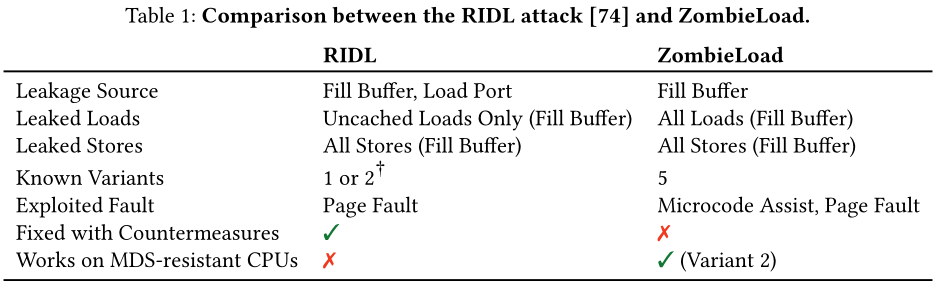
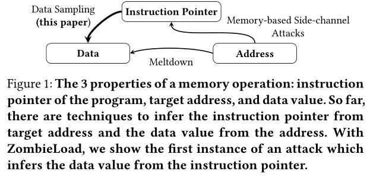
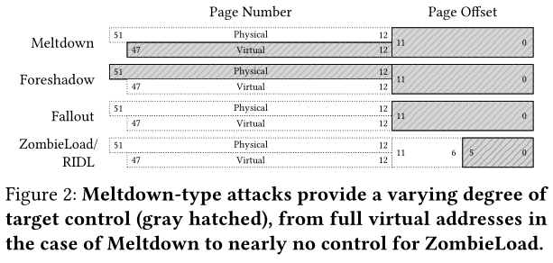
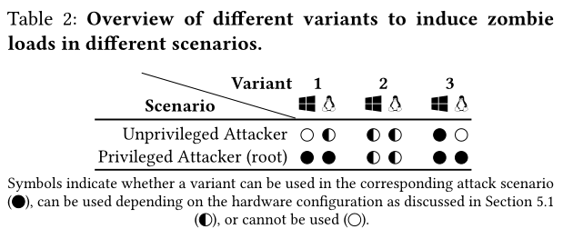
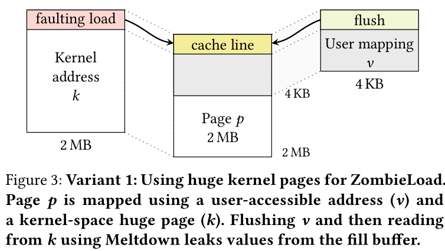
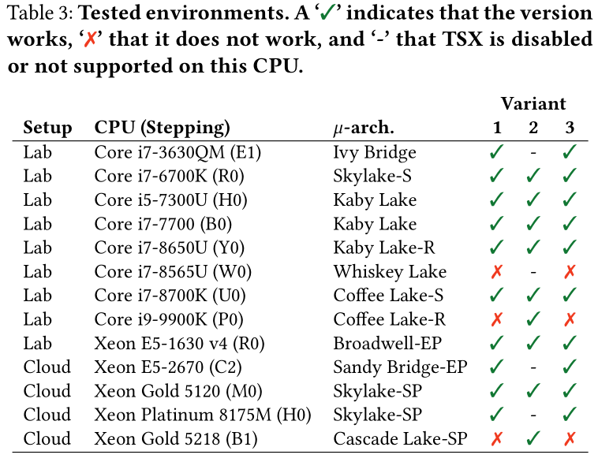
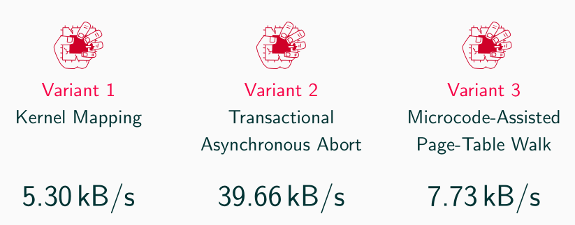
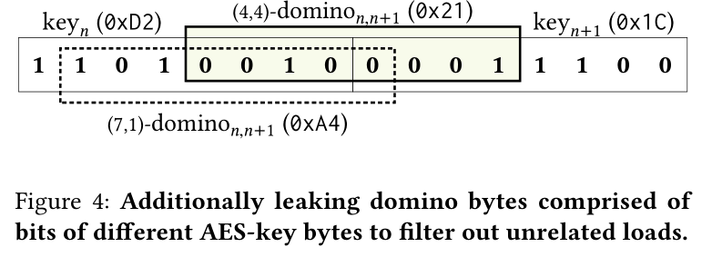
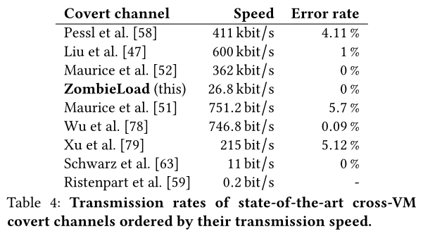

[toc]

# ZombieLoad 讲稿

### 摘要

Meltdown => 故障驱动的瞬态执行攻击

leak data from L1 Cache, FPU register, store buffer

ZombieLoad 处理器 fill-buffer 逻辑中的新型 Meltdown-type 攻击

错误的 load 指令会暂时 dereference 由当前或相邻逻辑 CPU 带入 fill-buffer 的非授权目标

在耐 Meltdown 和 MDS 的处理器上报告了跨逻辑内核的最近加载和存储的过时值的数据泄漏

CPU 硬件修复不够

ZombieLoad 在 CPU rings、OS 进程、虚拟机和 SGX enclaves 等实际场景有效

最后讨论短期和长期缓解措施，禁用超线程是唯一可能的解决方法

### 引言

Meltdown 首次完全突破了用户与内核空间之间安全边界，允许泄漏任意数据。虽然通过 KPTI 修复，但其基本原理是一整类的瞬态执行攻击。

Meltdown-type 攻击不仅会泄漏内核数据，还会跨进程、虚拟机和 SGX 安全区泄漏数据。泄漏源不仅限于 L1 Cache，还可能源于其他微体系层面的结构，如 FPU 寄存器、并发攻击展示的 fill buffer, load ports, store buffer。

乱序执行，指令重排，引发异常时，故障指令（即瞬态指令）之后的乱序执行的指令被回滚。

大多数 Meltdown 攻击都围绕乱序执行进行优化。

微体系结构的元素通常不会区分不同应用或特权级之间

#### 本文工作

仍然存在未开发的微体系结构缓冲区，体系结构和微体系结构层面的故障都可以利用。借助微体系结构层面错误，即导致内存请求在内部重新发出而在体系结构上不可见的错误。本文证明可以在不引发诸如 page fault 的体系结构异常的情况下实施 Meltdown-type 攻击。

提出 ZombieLoad 针对 fill-buffer 逻辑的新型 Meltdown-type 攻击。利用必须在内部重新发出的指令，可以瞬时地使用旧值计算，旧值属于当前或相邻超线程先前内存操作。使用现有的瞬态执行攻击技术，攻击者可以恢复此类 zombie load 的值。

与所有先前已知的瞬态执行攻击相反，ZombieLoad 泄漏数据而不遵循任何基于地址的现实选择器。因此将 ZombieLoad 视为新的微体系结构数据采样攻击实例。与 RIDL 和 Fallout 等并发数据采样攻击不同，本文工作是第一个在 Cascade Lake CPU 上泄漏数据的攻击变体。

将微体系结构数据采样作为与受害者执行数据地址相关的传统基于内存的侧信道和现有的可以直接恢复显示地址数据值的 Meltdown-type 瞬态执行攻击之间缺失的链接。

将传统的侧信道攻击原语和时域中的偶然数据采样相结合，构造出功能强大的攻击，并在地址域中进行有针对性的泄漏。

实际攻击场景 跨进程、特权边界、跨逻辑 CPU，在有 Foreshadow 对抗措施的 CPU 上仍可以泄漏 SGX 机密，实现 enclave 密钥，最终破坏 SGX 的机密性和远程证明保证。还可以跨虚拟化边界，攻击 hypervisor 或其他虚拟机。

除了在上下文切换期间刷新一些微体系结构状态之外，禁用超线程是防止这种攻击的唯一可能的解决方法。

#### 本文贡献

1. 提出 ZombieLoad，是一种强大的数据采样攻击，可泄漏同一或相邻超线程上访问的数据。
2. 将时域中的偶然数据采样与传统的边信道原语相结合，以构造类似于常规 Meltdown 攻击的目标信息流。
3. 在实际场景中演示 ZombieLoad：跨进程、跨VM、跨特权级以及 SGX。
4. 证明 ZombieLoad 在抗 Foreshadow 的硬件上也破坏了 SGX 的安全性保证。
5. 第一个对瞬态域中泄漏的数据进行后处理以消除噪声。

背景知识 => 概述 ZombieLoad => 攻击场景和攻击者模型 => 介绍并评估 ZombieLoad 所需的基本源于 => 演示实际攻击场景中的 ZombieLoad => 讨论对策 => 总结

### 背景知识

介绍需要的背景知识

#### 瞬态执行攻击

当今的高性能处理器会实施乱序执行设计，指令流按序解码为更简单的 μOPs，只要所需的操作数可用，就可以立即执行。专用的重排缓冲区存储中间结果，指令结果按序提交。指令执行中发生的错误会在 retirement 阶段处理，导致流水线刷新，清空重排缓冲区中未完成的 μOP 结果。

瞬态指令：推测执行或乱序执行的指令，其结果从未在体系结构层面提交。

瞬态指令的结果和体系结构效果被丢弃，而可观测的微体系结构副作用可能还会保留且不会恢复。通常利用基于缓存的隐蔽通道将从微体系结构域瞬态观测到的秘密数据传输到架构状态。

将利用错误预测的攻击称为 Spectre-type，利用 CPU 异常后的瞬态执行的攻击称为 Meltdown-type。

#### 内存子系统

乱序 CPU 中的内存加载

Cache 多路组相联，每组包括多个缓存行，每个缓存行通常 64B 宽。专用 L1d, L1i 缓存以及统一的 L2 缓存，LLC 在所有内核之间共享。

虚拟内存，内存隔离，多级页表转换为物理内存，TLB 加速地址转换。

内存排序缓冲区，处理存储操作的 μOPs 由专用执行单元处理。Intel CPU 通常包含 2 个 load 单元和 1 个 store 单元。MOB 包含 load 和 store buffer，控制分发内存操作并跟踪内存操作进度以解决内存依赖性。

**数据加载流程**

对于每个分派的 load 操作，会在 load 缓冲区和重排缓冲区中分配一个条目。线性地址（一般用 48 位地址）高 36 位用于地址转换，低 12 位用于索引 l1d 缓存组。如果 TLB 命中，物理地址立即可用。否则 page miss handler, PMH 将遍历页表检索地址转换及相关权限位。如果请求的数据在 l1d 中命中，则可以完成加载操作。 

如果数据不在 l1d，则需要通过 line-fill buffer 从更高级别缓存或主存中取数据。LFB 充当到其他缓存和主存的接口，跟踪未完成的负载。每次访问不可缓存内存都会经过 LFB。

出现错误时，页表遍历不会立刻停止。流水线中的指令会简单重新发出，仅故障的 μOP 的 retirement 阶段才处理故障，并刷新流水线。

#### 处理器扩展

**微码**

为了支持更复杂的指令，微码允许使用多个硬件级别指令来实现更高级别指令。这使处理器供应商可以支持复杂的行为，甚至可以通过微码更新来扩展或修改 CPU 行为。

执行单元直接在硬件上执行快速路径，而更复杂的慢路径操作，如错误或页表修改，通常是通过发出微码辅助来执行的。微码辅助将微码定序器指向预定义的微码例程。为此，执行单元将事件代码与故障 μOPs 的结果相关联。当执行单元的微操作被提交时，事件代码使乱序调度程序将所有运行中的微操作压缩到重排序缓冲区中。微码定序器使用事件代码读取与事件处理程序的微操作。

**TSX**

使用TSX，可以以事务方式执行特定的代码区域。如果整个代码区域成功完成，则事务中的内存操作将作为对其他逻辑处理器的原子提交。如果在事务处理期间发生问题，则事务中止将在事务处理之前将执行回滚到体系结构状态，并丢弃所有已执行的操作。

事务中止可能是由不同的问题引起的：通常，发生冲突的内存操作时，另一个逻辑处理器将从事务内已修改的地址读取或写入事务内使用的地址。此外，事务中的读取和写入数据量可能分别不超过LLC和L1缓存的大小。另外，某些指令或系统事件也可能导致事务中止。

**SGX**

用于隔离受信代码的指令集扩展。在所谓的安全区 enclave 内执行受信代码，这些安全区被映射到常规应用程序进程的虚拟虚拟地址空间中，但在硬件上与系统的其余部分隔离。SGX 的威胁模型假设操作系统和所有其他正在允许的应用程序都可能被攻破，因此不可信。以非安全区模式访问 SGX 安全区内存会返回虚拟值 0xff。为了防止攻击者探测内存总线，SGX 在硬件上透明地加密了使用的内存区域。

使用专用的 eenter 指令将控制流重定向到安全区入口，使用 eexit 转移会不可信的应用程序。发生中断或故障时，SGX 在定向到不可信的操作系统之前把 CPU 寄存器保存在安全区的保存状态区域 SSA 中。使用 eresume 指令从 SSA 回复处理器状态，再继续执行中断前的安全区代码。

支持 SGX 的处理器通过 egetkey 指令提供加密密钥生成功能，基于 CPU 级别的主密钥以及对调用安全区的初始代码和数据的安全度量。使用此密钥，安全区可以安全地密封秘密以存储再不可信的存储介质，并与同一处理器上的其他安全区建立安全的通信信道。此外，为了实现远程证明，Intel 提供了一个可信的 quoting enclave，它可以安全解密 Intel 私钥并在本地安全区身份报告上生成非对称前面。

针对 SGX 存在各种攻击手段，如通过违反内存安全性、竞争条件或侧信道的方式从 SGX 安全区泄漏敏感数据。SGX 还遭受瞬态执行攻击 Foreshadow。

### 攻击概述

对 ZombieLoad 的概述，描述使用 ZombieLoad 可以观测到的数据以及如何与侧信道攻击相结合。分析表明 ZombieLoad 是一种新的侧信道攻击类别，称之为数据采样攻击，开启新的研究领域。

#### 概述

**ZombieLoad 是一种瞬态执行攻击，它可以观测当前 CPU Core 上内存加载和存储的值。ZombieLoad 利用同一 CPU Core 上所有逻辑 CPU 使用的 fill buffer，并不区分进程或特权。**

CPU 执行期间遇到内存加载时，会在 load buffer 保留一个条目。如果 L1 miss，则还需要一个 fill buffer 条目。加载完成后，会释放相应的条目，加载指令或许会 retire。类似的，如果 store L1 miss 或从 L1 中替换出，它们也会临时存储在 fill buffer 条目中。

在某些复杂的微体系结构条件下（fault），load 需要微码辅助，它可能在最终 re-issue 之前先读取旧值。与其他 Meltdown-type 攻击相同，这将打开一个瞬态执行窗口，旧值可用于后续计算。因此攻击者可以将泄漏的值编码为微体系结构元素，如缓存。

但与以前的 Meltdown-type 攻击相反，无法根据攻击者指定的地址来选择要泄漏的值。ZombieLoad 只会泄漏物理 CPU Core 当前加载或存储的值，虽然这听起来是一个很大的局限性，但本文证明这为基于数据采样的瞬态执行攻击开辟了一个新的灵域。此外，与以前的 Meltdown-type 攻击相反，ZombieLoad 会考虑所有特权边界，而不局限于特定边界。

Meltdown 只能从攻击者的地址空间泄漏，Foreshadow 仅作用于 SGX enclaves，ForeshadowNG 研究了跨进程和跨 VM 泄漏，而 Fallout 仅可以泄漏内核数据在相同的逻辑核心。本文展示了 ZombieLoad 在与现有侧信道技术相结合后是功能更强大的攻击。

#### 微体系结构根本原因

对于 Meltdown、Foreshadow、Fallout 和 RIDL，泄漏的来源是比较明显的，泄漏的根本原因也有合理的解释。但对于 ZombieLoad，并不是很清楚。

尽管已经确定了一些必要的构建来观测泄漏（第 5 节），但只能提供一个假设，即构件之间的相互作用导致了观测到的数据泄漏。由于只能在 Intel CPU 上观测到泄漏，因此确定是一个实现问题，而不是设计问题。将观察结果与 fill buffer 的少量官方文档和 Intel 的 MDS 分析结合。最终不能证明或反驳假设。

**过期条目假说** 每个 load 都与 load buffer 中给的一个条目相关联，并且可能与 fill buffer 中的一个条目相关联。

当 load 遇到诸如故障之类的复杂情况时，需要微码辅助，微码辅助触发机器清除，刷新流水线。流水线刷新时，正在执行的指令会完成执行。

为了尽可能快，fill buffer 条目只要部分物理地址匹配即可，因此 load 会使用错误的 fill buffer 条目，该条目是先前的 load 或 store 遗留的。形成硬件上的 UAF。Intel 文档中说 fill buffer 在超线程之间具有竞争性的共享，从而使两个逻辑核都可以访问整个 fill buffer。因此，过时的 fill buffer 条目也可能来自相邻的逻辑核心先前的 load 或 store。结果就是，load 指令加载先前的 load 或 store 的有效数据。

**泄漏源**

设计了两个实验来减少泄漏数据的可能来源。

第一个实验，将页面标记为不可缓存，并从缓存中清除。这就使页面的每个 load 都会避开 cache，而直接进入 fill buffer。然后将机密信息写入这个页面，确保缓存中没有数据的副本。从页面加载数据时，看每秒泄漏的字节数。可以将此泄漏归因于 fill buffer，MEM_LOAD_RETIRED.FB_HIT 计数器进一步支持了假设，显示了每秒很多次的 fill buffer 命中次数。

Intel 声称泄漏完全来自于 fill buffer，RIDL 也是。但第二个实验表明，fill buffer 可能不是 ZombieLoad 唯一的泄漏来源。使用 TSX 保证内存访问不会到达 fill buffer。在事务内部，首先将 secret 写入使用其他值初始化的位置。事物内部的写操作确保该地址在事务的写操作集中，因此在 L1 中。把写数据集中的数据从缓存中逐出会导致事务异常中止。因此，从写集对数据的任何后续访问都确保数据在 L1 上，因此不会向 fill buffer 发送任何请求。而在此实验中，泄漏速率更高，达到 KB/s 的量级。更重要的是，泄漏的只是 TSX 事务内部的值，而看不到初始化值。通过观察性能计数器进一步支持假设，fill buffer 不是唯一的泄漏源。MEM_LOAD_RETIRED.FB_HIT 和 MEM_LOAD_RETIRED.L1_MISS 计数器都不会显著增加，MEM_LOAD_RETIRED.L1_HIT 显示了数千个 L1 命中。

在访问数据以从 CPU Core 上泄漏数据时，监视 CPU 的 MEM_LOAD_RETIRED.FB_HIT 计数器 10s。如果地址被缓存，计算正确恢复率和 fill buffer 命中数之间的相关系数，显示没有关联。但是在连续刷新 CPU Core 上数据以确保后续访问必须通过 fill buffer 时，测量到了 0.86 的强相关性。结果表明，fill buffer 不是泄漏的唯一来源，但另一种解释时性能计数器在极端情况下不可靠。RIDL 攻击只泄漏不可缓存的数据，就必须通过 fill buffer。因此结论是，RIDL 确实从 fill buffer 泄漏，而 ZombieLoad 可能不会完全归因于 fill buffer，未来的工作需要研究数据泄漏是否来自其他微体系结构元素，如 load buffer。

与 RIDL 比较。RIDL 也从 fill buffer 和 load ports 中泄漏数据，表 1 总结了主要区别。最关键的区别是，ZombieLoad 仍可在不受 RIDL 和 Fallout 影响的 新一代 CPU Cascade Lake 上运行。RIDL 之泄漏不在 L1 cache 中的 load。

> RIDL论文[74]仅描述了一种从填充缓冲区泄漏的变体，但也提到了从装载端口泄漏的一种变体，而无需进一步描述或评估。

#### 分类

**分类放到最后或者不讲了**

介绍对基于内存的侧信道攻击和瞬态执行攻击进行分类的方法。对于所有这些攻击，我们假设目标程序在程序的当前指令指针处以特定的数据值在某个地址执行内存操作。图 1 将三个属性作为三角形端点，攻击者可以根据一个或两个属性推断另一个属性。

> 存储器操作的3个属性：程序的指令指针，目标地址和数据值。 到目前为止，有一些技术可以从目标地址推断出指令指针，并从该地址推断出数据值。 使用ZombieLoad，我们展示了攻击的第一个实例，该实例从指令指针中推断出数据值。

传统的侧信道使攻击者可以观测内存访问的位置。观测的粒度取决于侧信道的空间精度，从 1 个缓存行到 1 页。这些侧信道建立了时域到空间域的链接。时域可以是显示时间，也可以是执行时间。这些侧信道提供了将存储器访问地址连接到一组可能的指令指针的方法，可以重建程序流。抗侧信道的程序要避免依赖于秘密的内存访问。

瞬态执行攻击使攻击者可以观测存储在内存地址的值。

> 崩溃类型的攻击提供了不同程度的目标控制（灰色阴影），从发生崩溃时的完整虚拟地址到几乎没有对ZombieLoad的控制。

### 攻击场景和攻击者模型

攻击者可以在目标计算机上执行未特权的本地代码。除非另有说明，否则我们假定使用受信任的操作系统。在某些情况下 SGX, Hypervisor，攻击者功能会增强，从而放大泄漏。

硬件级别，假设 Intel CPU 启用超线程，并已经部署了针对 Meltdown Foreshadow Fallout 等攻击的缓解措施。

**用户空间泄漏**

在跨进程用户空间场景中，非特权的攻击者泄露了另一个并发运行的用户空间程序 load 或 store 的值。浏览器

在超线程的常见情况下，攻击者与受害者位于同一物理核的不同逻辑核上。

**内核泄漏**

内核空间执行的 load 或 store 会被泄露给非特权攻击者，同一或相邻逻辑核上执行。

非特权的攻击者在同一逻辑核上执行系统调用陷入内核态。从内核切换回用户态仍然存在泄漏，并不需要超线程。

**Intel SGX 泄漏**

观测 SGX 安全区内执行的 load 和 store，即使其目标是加密内存区域。攻击者在相邻逻辑核心上的 SGX 安全区外执行，与受害安全区在同一物理核上。在退出隔离区后，并未在同一逻辑内核上观测到泄漏。

Intel 建议 SGX 拒绝来自启用超线程的系统证明。攻击者可以修改页表条目，或者精确执行 enclave 中的指令。

**虚拟机泄漏**

ZombieLoad 会泄漏跨虚拟机边界的 load 和 store 的值。虚拟机内部的攻击者可能会从同一物理但不同逻辑核上共驻的其他虚拟机泄露值。

**Hypervisor 泄漏**

虚拟机内部的攻击者可以使用 ZombieLoad 泄漏由 Hypervisor load 和 store 的值。

### 构建模块

介绍攻击的基础模块。

#### Zombie Loads

安装 ZombieLoad 的主要原语是触发微码辅助的 load 指令，从而导致包含错误数据的瞬态 load，将这种 load 称之为 zombie load。zombie loads 会在体系结构或微体系结构层面发生故障，因此无法完成，需要在之后 re-issue 这个 load。本文给出了多种情况来创建攻击所需的 zombie load。

大多数变体的共同点是滥用 clflush 指令来可靠地创建从错误位置泄漏所需的条件。本节描述了三种不同的变体，可以根据攻击者的能力来选择。这三个变体速度很快，且都有独特的功能。表 2 概述了这些变体适用的方案。

**变体1 内核映射**

第一个变体不依赖于特定的 CPU 功能。首先需要一个内核虚拟地址 k，即在页表项中用户可访问位置 0 的地址。内核通常使用 hugepage，但这里不做严格要求，k 指向一个物理页面 p。还要求用户可以通过一个不同的虚拟地址 v 访问这个页的内容。

图 3 说明了这样的设置。通过 v 访问页面 p 提供了架构有效的访问页面内容的方式。而通过内核地址 k 访问同一页面会导致类似 Meltdown 的 zombie load，就需要微码辅助。

> 方案1：为ZombieLoad使用庞大的内核页面。页面p使用用户可访问的地址（v）和内核空间大页面（k）进行映射。 刷新 v，然后使用Meltdown从k读取，将泄漏填充缓冲区中的值。

在用户空间分配了虚拟地址 v 的页面 p。通过 /proc/pagemap 检索其物理地址，使用物理地址和直接映射的基地址，获得不可访问的内核地址 k，它映射到分配的页面 p。如果操作系统未开启 KPTI，则内核直接映射到用户空间。对于已经部署了 Meltdown 缓解措施的机器就无法工作。

**变体2 Intel TSX**

第二个变体消除了对内核映射的需求，只要求用户可以通过虚拟地址 v 访问物理页面 p。

在 TSX 事务中，把 v 的值编码到缓存隐蔽信道中，确保 v 在事务的读取集中。对用户可访问的地址 v 进行合法的 load，这本身不会导致 TSX 事务失败。但通过引发读取集冲突，TSX 事务将会 fault 而不会提交。没有体系结构故障，而只有会导致 zombie load 的瞬态故障。

优点是它可以在部署了 Meltdown 缓解措施的机器上运行，但需要 TSX 事务扩展。

**变体3 微码辅助的页表遍历**

类似变体 1 的一个变体是触发微码辅助页面遍历，如果页面遍历需要更新页表项中的访问权限或脏位，则它会退回到微码辅助。

需要一个物理页面 p，对应两个用户可访问的虚拟地址 v 和 v2。虚拟地址 v 可用于访问 p，而 v2 需要清除其页表项中的访问位。在 Linux 上需要特权用户，而 win10 上却可以定期清除访问位。如果 CPU 不支持 TSX，则此变体允许非特权攻击者对 windows 攻击。

通过虚拟地址 v2 访问页面时，页表项的访问位会置位。这不能通过 page-miss handler 完成，而是触发微码辅助来设置访问位。

如果对于 v2 的访问是瞬态完成的，即在异常之后，那么在体系结构上就无法设置访问位。因此每次访问都可以用于泄漏。

#### 数据泄露

要使用上面描述的这些设置泄露数据，需要不断通过虚拟地址 v 来刷新 p 的第一个缓存行，通过执行 clflush 实现。对于变体 1，利用 Meltdown 从内核地址读取。

对于变体 2，刷新导致的缓存行无效会触发事务读取集冲去而中断事务。

对于变体 3，瞬态地使用 v2 读取，也没有架构异常。

违反直觉的是，所有变体的泄露结果值不都来自页 p。访问的数据是当前或相邻逻辑核 load 或 store 的数据。因此，看起来是在宠用 fill buffer 条目从而泄漏条目引用给的数据。对于变体 1 和变体 3，可以访问 fill buffer 条目引用的缓存行的所有字节，而对于变体 2，只能恢复受害者 load 或 store 操作的字节数。

#### 数据采样

无法直接控制要泄漏的数据地址，虚拟地址 k、v 以及 p 的物理地址都是任意的，与泄漏并不相关。只是获得了一个无法指定的 fill buffer 缓冲区条目所引用的值。

但是至少拥有填充缓冲区条目内的控制权，即可以以 64B 字节中的特定字节作为目标。虚拟地址 v 的最低 6 位就是条目索引。允许以字节为单位泄漏敏感信息，例如 AES 密钥。

ZombieLoad 允许对当前物理核上任何应用程序 load 或 store 的数据进行采样。

#### 性能评估

评估 ZombieLoad POC 实现的性能

在多个环境中测试不同变体。所有可使用 TSX 的都可以成功使用变体 2.

> POC: https://github.com/IAIK/ZombieLoad

在 i7-8650U 上通过实验测试性能

### 攻击案例研究

介绍实际场景下的 5 种 ZombieLoad

#### AES-NI 密钥泄漏

提取 AES-128 密钥，受害者使用 AES-NI 扩展指令集，它可以抵抗定时和基于缓存的侧信道攻击。

密钥必须从内存加载到 128 位 XMM 寄存器中，调用派生 AES 轮回密钥的 AESKEYGENASSIST 之前。轮密钥生成完全在硬件中使用 XMM 寄存器完成，不需要任何 load。因此派生开始之前从内存加载时，可以通过 ZombieLoad 来泄漏密钥的值。其实也可以泄漏加密过程中的轮密钥，但是太麻烦。

泄漏密钥时，首先要检测密钥对应的 load。而且一次只能泄漏一个字节，因此还需要将泄漏的字节组合成完整的 128 位密钥。

侧信道同步。假设用一个共享库加密，如 OpenSSL。虽然 OpenSSL 3.0 有抗侧信道的 AES-NI 实现，但还是可以依赖经典的侧信道来监视控制流。使用 flush+reload 检测何时执行到特定的代码部分。这是 ZombieLoad 的同步原语。

一直监视代码缓存行，该行正好在内存 load 密钥之前执行。利用缓存行的缓存状态作为实际攻击的触发。仅当我们在受监视的缓存行上检测到缓存命中时，才开始使用 ZombieLoad 泄漏值。因此，已经过滤掉了大部分与密钥无关的字节。密钥总是 16B 对齐的，所以总是泄漏完整的缓存行。

如果在 load 之前没有缓存行可用作触发器，还可以用附近的缓存行作为过滤器。在并行线程中，收集附近缓存行中缓存命中的时间戳。在后续处理中可以过滤掉不同位置的值。还可以使用性能降低技术来降低受害者的速度，如刷新代码。

**Domino 攻击**

即使有同步原语，仍会不可避免地泄漏与密钥无关的值。由于 AES 中的字节彼此独立，我们只能假设每个字节位置泄漏最频繁的字节是正确的密钥。如果密钥字节收到不相关 load 的噪声影响，就会导致错误的密钥。

提出了 Domino 攻击，是一种瞬态错误检测机制，用于减少泄漏多字节 load 时的噪声。除了泄漏单独的密钥字节外，还传输特质的多米诺骨牌字节，它由两个相邻的密钥字节的位组成。创建这样的多米诺字节是可能的，因为瞬态域可以访问完整的AES密钥，并且可以将其用于任意计算。

> 泄漏由不同AES密钥字节的位组成的多米诺骨牌字节，以过滤掉不相关的负载。

在后处理步骤中，如果经常泄漏两个相邻字节以及响应的多米诺字节，那么认为这两个相邻字节是正确的。而且不会孤立地看两个密钥字节，而是将整个密钥看成是由多米诺字节链接在一起的字节链。如果所有密钥字节和相应的多米诺骨牌字节经常出现在泄漏值中，我们可以假定整个密钥都正确泄漏了。

在跨用户空间攻击中使用变体 1 评估了这种攻击。一直攻击直到找到正确的密钥为止。

平均而言，不到 10s 即可恢复整个 AES-128 密钥，在此期间，受害者大约加载了 10000 次密钥。

#### SGX 密钥提取

#### 跨 VM 隐蔽信道

构建一个可用于所有攻击情形的隐蔽信道，本节介绍跨 VM 隐蔽信道。隐蔽信道对于 Intel SGX、内核和 Hypervisor 是可能的，但某种程度是人为的，而用户空间应用程序可以使用各种隐蔽信道进行隐秘的进程间通信。

而对于 VM 之间可用的隐蔽信道不多，要么依赖 prime+probe、drama 或者总线锁定。本文证明了 ZombieLoad 可以用于在同一物理核上调度的 VM 之间快速可靠的隐蔽信道。

**Sender**

为了最快结果，发送方将要发送的值从 L1 重复 load 到寄存器中。用多个内存地址 load，确保使用了多个 fill buffer 条目。这同时也阻碍对 Intel CPU 的优化，将来自同一缓存行的多个 load 组合为单个 load。

**Receiver**

接收端通过 ZombieLoad 泄漏由发送方加载的值。但是由于接收方仅在瞬态域泄漏 load，值必须转移到体系结构层面。将泄漏的值编码到缓存中，并使用 flush+reload 恢复。编码时至少需要 2 个缓存行，即 128B，防止相邻的缓存行预取器干扰。实际上为每个可能的值分配一个物理页，以防止预取器干扰。

结果，POC 将泄漏的 load 数据传输限制为单字节，仍可以使用 load 的其他位保证信道没有错误。

**瞬态错误检测**

发送方和接收方之间没有噪音，但是接收方还会从当前和相邻逻辑核上恢复其他 load，为了消除这种噪音，对数据进行编码。使用 8 个数据位，8 位校验和，8 位序列码和一个常量前缀组成。

无法将整个数据包传输到传输到体系结构域中，但是可以在瞬态域中对数据包进行计算。即进行瞬态错误检测，并仅将有效数据包传输到体系结构域。

瞬态域检测的挑战是指令数量受限，且不能使用推测指令，必须尽可能端且无分支。

第一个字节编码数据，第二个字节将数据的二进制补码作为校验和。为了检测错误，将两个字节异或，成功则数据包 8-15 位为 0，保证低 16 位小于 255。用低 16 位索引一个 256 长的数组，这样不正确的字节会超出范围，不影响数据的缓存状态。这样通过 flush+reload 就可以从数组中恢复数值。

优点在于不需要体系结构域中的计算时间。在等待异常体系结构可见的这段时间就已经执行了所需的计算，而且不再需要额外的纠错。

此外还将序列号编码到数据包中，允许对接收到的数据包排序，也可以使用同样的方法恢复。

最终在实验环境和公共云上评估隐蔽信道，都实现了无错误的传输。

表4显示了与最新的跨VM隐蔽通道的传输速率的比较。

#### 浏览行为监控

#### 目标数据泄漏

### 对抗措施

最直接的缓解措施就是禁用超线程，这无疑会对性能产生重大影响。

